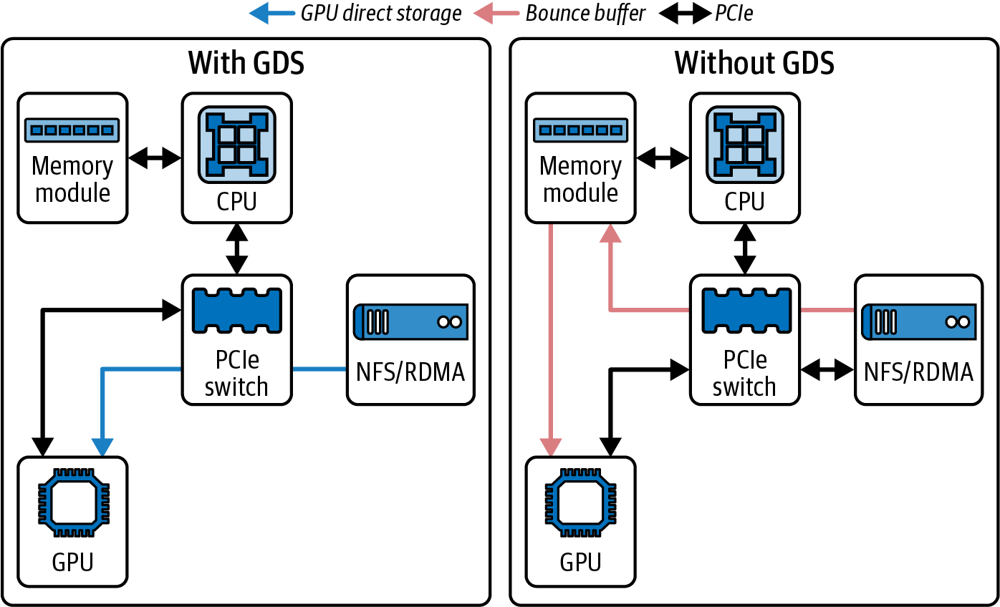
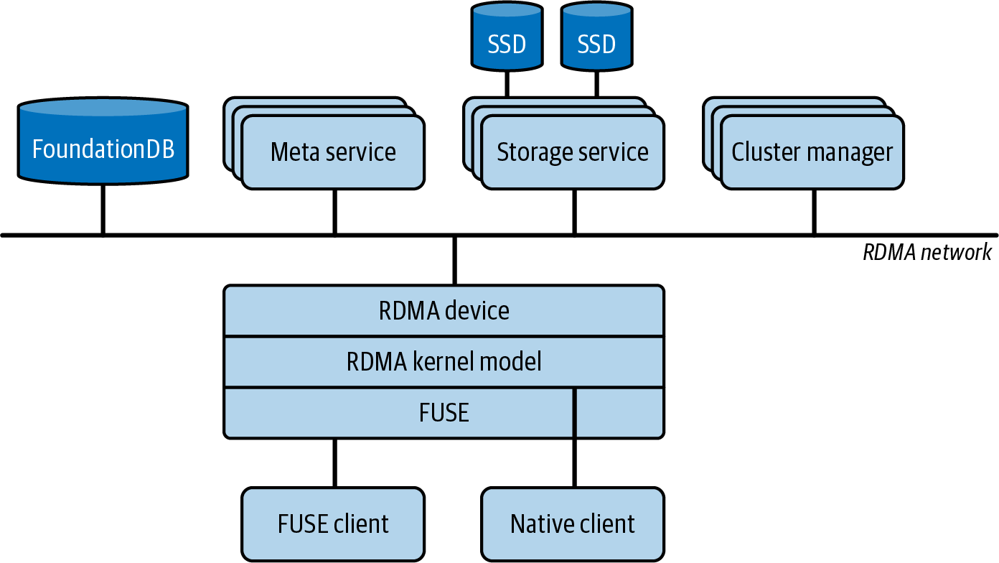

# AI Systems Performance Engineering

*Uploaded by Pedro Valera - AI Specialist*

---

## Chapter 5

# GPU-Based Storage I_O Optimizations

# Chapter 5. GPU-Based Storage I/O Optimizations

Feeding data to the GPUs is as important as the compute itself for AI workloads. Consider a scenario with a 100-trillion-parameter model training on thousands of GPUs. Such a model might process billions of training samples, including tokens, images, audio, video, etc.

This means that an enormous amount of data must be read from storage and fed to the GPUs as quickly as possible. If the storage pipeline is slow, the GPUs will starve and sit idle. This results in low utilization despite the sophisticated communication optimizations that we’ve discussed.

This chapter addresses storage and input pipeline optimizations. Specifically, it demonstrates how to read data efficiently from disk or remote storage, how to preprocess it, and how to overlap its I/O with GPU compute.

# Fast Storage and Data Locality

Large model training jobs usually need to read huge datasets. It’s common to have on the order of billions or even trillions of training samples for large language models. This is in the range of terabytes of text data for language models and petabytes of images for vision models.

At ultra scale, your storage system must consistently provide massive throughput to keep up with the thousands and millions of GPUs potentially running for months at a time. Colocating NVMe SSDs within racks—or using NVMe over Fabrics (NVMe-oF) with rack-local switch topologies—minimizes network hops and improves performance consistency.

If your data lives in network-attached storage like an NFS server or cloud object storage (e.g., Amazon S3), you need to ensure that the aggregate read bandwidth from all of your compute nodes is sufficient. Consider a scenario in which each GPU needs 200 MB/s of training data to stay busy based on the model and batch size. If you have 8 GPUs total, that’s about 1.6 GB/s aggregate bandwidth needed. Modern high-end GPUs like Blackwell and Rubin demand even more bandwidth to keep them saturated.

An NVIDIA Grace Blackwell GB200/GB300 NVL72 rack with 72 Blackwell GPUs connected in one NVLink domain. If each GPU needs 200 MB/s of training data to stay busy, this can require 14–20 GB/s of aggregate storage throughput to keep all 72 GPUs busy. For these types of ultrascale workloads, your storage solution needs to scale accordingly.

If your workload streams heavier media or multimodal samples, calibrate using your measured bytes-per-sample and samples-per-second. In such cases, aggregate demand can be much higher.

One solution is to use faster local storage such as NVMe SSDs in the same rack—or NVMe-oF network topology. Another solution is to use a parallel filesystem like Lustre or General Parallel File System (GPFS), etc., to cache the data on local SSDs. Assuming the storage system can keep up, it’s important to provision multiple data loading threads to keep the pipe saturated. Watch out for the Python GIL!

Whenever possible, place data as physically close to the compute nodes as possible. “Close” could mean on the same physical node, such as a local NVMe SSD drive, or at least in the same rack with a high-speed interconnect with something like NVMe over Fabric (NVME-oF) or an advanced storage accelerator.

For distributed, multinode model training, a common approach is to shard the dataset across nodes so that each node primarily reads a subset of data from its local disk. For example, if you have 100 TB of data and 10 nodes, you might presplit 10 TB to each node’s local storage. Then each node’s data loader reads only from its local 10 TB. This avoids saturating the network with redundant reads—especially if the dataset size does not easily fit in RAM.

Frameworks like []()PyTorch’s `DistributedSampler` will coordinate workers such that each process gets a unique slice of data per epoch. This aligns well with the goal of sharding the data over multiple cluster nodes.

# Sequential Versus Random Read Patterns

GPUs are extremely fast at crunching data, but they prefer that the data be read in large contiguous chunks for efficiency. Similarly, storage measures much higher throughput for large, sequential reads than for small, random reads. As such, when preparing your datasets or storage layout, try to arrange for sequential access as much as possible.

For instance, when training with images, avoid storing millions of individual image files since this will lead to lots of random seeks all over the disk. Consider, instead, storing them in a few large binary (e.g., Arrow, TFRecord, or Parquet) files, database files, WebDataset tar files, or equivalents. In these cases, each file contains many concatenated samples, which is ideal.

Combining small files into large shards is even more important with today’s faster GPUs, since excessive small random reads will more quickly become a bottleneck. And while most modern parallel filesystems and object stores can handle a degree of small random reads, it’s best to verify the performance explicitly.

Reading a chunk of data from the larger files will naturally get many samples in one pass. If using an object store like Amazon S3, it’s common to combine smaller objects into larger ones ahead of time for this exact reason.

Also, it’s important to tune[]()[]()[]() the read size since reading in 1 MB chunks will yield better throughput than 4 KB chunks due to the lower per-read overhead. Many data loader libraries allow adjusting buffer size and prefetch chunk size. For example, Python’s `open()` uses the OS’s read-ahead buffer to accelerate sequential scans, but random reads won’t benefit much from larger buffers or buffered I/O libraries.

Instead, you should batch your reads into larger contiguous chunks or use a high-level dataset API (e.g., `TFRecordDataset` or PyTorch’s `IterableDataset` and `DataLoader` with configurable prefetch sizes). And while many of these frameworks and libraries are internally optimized for large sequential reads, tuning their buffer and prefetch parameters is still important.

If your access pattern still must be random, issue multiple reads in parallel using either threads calling `pread()` or Linux’s asynchronous I/O interfaces like `io_uring`. With features like preregistered buffers and polling, `io_uring` allows submitting batches of I/O requests with minimal kernel overhead. It can further improve random read throughput by reducing per-syscall overhead. This helps hide latency and achieve high IOPS.

One should use a filesystem optimized[]()[]()[]()[]()[]()[]()[]() for large, concurrent I/O. XFS is common on Linux NVMe servers. You should mount it with `noatime` to eliminate costly access-time updates on each read. For networked storage services like Amazon EFS, make sure your EFS filesystem is in Max I/O [performance mode](https://oreil.ly/Xz-9d) for the highest aggregate throughput. If you need consistent bandwidth, you can switch from the default Bursting [throughput mode](https://oreil.ly/GxzAE) to Provisioned throughput. These settings ensure your I/O layer can keep up with massive, parallel AI workloads.[]()[]()[]()[]()[]()[]()[]()

# Tuning NVMe and Filesystem for Throughput

Modern Linux uses a[]()[]()[]()[]()[]()[]()[]()[]()[]()[]() multiqueue block I/O scheduler, `blk-mq`, that spreads I/O across the CPU cores. For fast NVMe SSDs, you might need to tune the queue depths and number of submission queues. Usually the defaults are fine, but if you know that your workload is heavily sequential, you might use the “none” I/O scheduler.

The legacy completely fair queueing (CFQ) scheduler[]()[]()[]()[]()[]()[]()[]()[]() is obsolete. Modern kernels use the `none` or `mq-deadline` multiqueue scheduler by default for NVMe. This setting can be checked using `/sys/block/<device>/queue/scheduler`. The “none” scheduler is standard for low latency workloads. On some storage devices, you might encounter the budget fair queueing (BFQ) scheduler.

For high-performance NVMe, it’s recommended to still use the `none` or `mq-deadline` multiqueue scheduler to maximize throughput. You can verify and set the scheduler using `/sys/block/nvme*/queue/scheduler`. It’s almost always configured properly out of the box, but it’s worth verifying with a quick check.

Another tuning aspect is read ahead.[]()[]() The kernel will automatically read ahead extra data when it detects sequential reads. You can see the read ahead setting in `/sys/block/<device>/queue/read_ahead_kb`. For example, by default it is likely set to 128 KB. If you are streaming large files, increase this to a few MB. This will improve your throughput by reducing syscall overhead and pipelining reads. This can be done using `blockdev --setra` on the device.

If using NVMe SSD disks, ensure that they are set up on the fastest interface available on your system. And make sure you have enough lanes (e.g., PCIe) so they’re not bottlenecked. Sometimes, multiple SSDs can be striped using RAID 0, for instance, to fully utilize these devices and maximize throughput—especially if a single disk cannot saturate your GPUs.

The Linux page cache will automatically cache recently read data into RAM from disk. For large datasets, you might exceed the available RAM and thrash the cache. But for moderately large datasets, warm caches can greatly speed up training.

If your data—or a large portion of it—can fit into RAM (including CPU + GPU unified memory on a Grace Blackwell Superchip, for example), you should consider preloading it completely into memory at startup. This effectively creates an ultrafast in-memory cache for the GPU. This can greatly reduce disk I/O during training. However, for massive petabyte-scale datasets, that’s usually not feasible. In these cases, streaming the data with optimized I/O is the way to go.

Be sure to use multiple workers[]()[]() in data loading (e.g., PyTorch’s `DataLoader(num_​work⁠ers=N)`). These separate CPU threads/processes will fetch and preprocess data in parallel to feed the many GPUs in your training job. Finding the right number of workers is empirical.

We will dive into PyTorch performance tuning in Chapters [13](https://learning.oreilly.com/library/view/ai-systems-performance/9798341627772/ch13.html#ch13_profiling_tuning_and_scaling_pytorch_1757308071445147) and [14](https://learning.oreilly.com/library/view/ai-systems-performance/9798341627772/ch14.html#ch14_pytorch_compiler_openai_triton_and_xla_backends_1757308073265113), but it’s worth noting here that you should enable `pin_memory=True` and use `non_blocking=True` to enable overlapping host-to-device copies. And by setting `persistent_workers=True`, you avoid worker respawn overhead across epochs. It’s also useful to tune `prefetch_factor` per workload. The default `prefetch_factor` is 2 for `num_workers` greater than 0.

Too few workers and the GPU will be idle. Too many workers and their threads will start contending for available CPU cores and I/O bandwidth. Monitor CPU usage and disk throughput. Ideally, you want near 100% utilization of disk throughput and some headroom on CPU.

For CPUs with a very high core count, such as the 72-core NVIDIA Grace CPU used in the GB200/GB300 Superchips, you can often utilize more data loader workers. Just be mindful of diminishing returns caused by excessive I/O contention.

# Using NVIDIA GDS

GDS is a feature that allows GPUs to read data directly from storage devices, or through the network storage stack, without creating extra copies in CPU memory. Normally, when a GPU wants to read data from an NVMe SSD, the data first goes from SSD to CPU memory. Then a CUDA call copies the data from CPU memory to GPU memory.

GDS complements GPUDirect RDMA since GDS accelerates storage-to-GPU DMA, while GPUDirect RDMA accelerates network-to-GPU DMA. Neither eliminates CPU orchestration. Both remove the host memory bounce buffer.

With GDS, the GPU can initiate a direct memory access (DMA) against the SSD or NIC to move the data into its own HBM memory. This bypasses the extra copy through the CPU’s path. GDS supports local NVMe devices and remote storage using NVMe-oF.

In practice, GDS creates a direct DMA path that bypasses host memory bounce buffers between storage and GPU memory. This broadens the applicability of GDS to cluster filesystems and even some object storage systems. (Note: the CPU still configures and orchestrates the I/O.)

Enabling GDS requires a modern NVIDIA GPU and a storage stack that supports direct memory access—as well as the correct NVIDIA drivers and CUDA toolkit. Typically, local NVMe SSDs or RAID volumes are used. GDS support depends on the filesystem and RDMA-capable stack. As of this writing, supported stacks include local NVMe and NVMe-oF on XFS/EXT4 with `O_DIRECT`, NFS over RDMA, and select parallel filesystems such as BeeGFS, WekaFS, VAST, IBM Storage Scale, and others that integrate with `nvidia-fs`.

The application needs to use the correct APIs. You can use CUDA’s `cuFile` library to read files through GDS. `cuFile` supports features like automatic buffer alignment and integration with common filesystems.

In practical terms, if you have GDS set up and your read path uses `cuFileRead`, the data can flow from disk to GPU memory directly. This reduces CPU utilization (allowing CPUs to do other preprocessing) and can improve throughput, especially when the CPU is a bottleneck. `cuFileRead` integrates directly with the Linux filesystem. You can also use `cuFile’s` asynchronous APIs, such as `cuFileReadAsync` and `cuFileWriteAsync` to integrate storage I/O on CUDA streams (discussed in [Chapter 11](https://learning.oreilly.com/library/view/ai-systems-performance/9798341627772/ch11.html#ch11_inter_kernel_pipelining_synchronization_and_cuda_1757308065280308)) for overlap and pipelining.

Use `O_DIRECT` when possible[]()[]()[]() to enable direct DMA and bypass the OS page cache. With modern GDS releases, `cuFile` can also operate on non-`O_DIRECT` file descriptors, but misalignment may incur extra copies or reduced performance.

Many storage vendors like WekaIO, DDN, VAST, Cloudian, etc., have released GDS-aware solutions or plugins so their systems can deliver data using RDMA directly into GPU memory. This ecosystem support means GDS can be used by enterprise network-attached storage (NAS) and parallel filesystems out of the box.

Reports from VAST Data show a 20% boost in read throughput using GDS on certain AI workloads. In their case, using GDS on a single A100 GPU achieved 20% higher read throughput for sequential reads, which pushed significantly closer to the 100 Gb/s link capacity per NIC when applicable. Figure 5-1 shows the architecture with and without GDS.



###### Figure 5-1. VAST Data’s network architecture with GDS versus without GDS

Here on the left, we see traditional staged DMA that copies through host memory. On the right is a direct GPU pull using GDS that bypasses host memory copies and reduces CPU utilization. A report by VAST measured a 20% read-throughput boost on an NVIDIA Ampere A100 GPU and a 30%+ increase on a Hopper H100 GPU due to its higher NIC bandwidth and greater CPU burden.

Validate on your workload and fabric, as uplifts vary by IO size, queue depth, NIC generation, filesystem implementation, etc.

However, GDS may need tuning, and not all workloads see a huge boost. If your CPU was easily handling the data transfers, GDS might not change throughput much. However, it will lower CPU usage, which frees up the CPU to perform data processing and other tasks. On the other hand, if the CPU is saturated with many `memcpy` operations, then GDS will help a lot.

One has to make sure that `O_DIRECT` semantics[]()[]() and alignment are applied correctly when using GDS. Host pinned memory is not used in the storage-to-GPU data path. `cuFile` registers GPU device buffers, and the `nvidia-fs` kernel driver orchestrates DMA directly between the storage device or RDMA NIC and GPU memory. It integrates directly with the POSIX file descriptors, so you can use `cuFile` with regular files—including network filesystems if they support RDMA.

Consider having a tiny training batch size of 1 MB and wanting to feed 1,000 batches each second to the GPUs. This is roughly 1,000 MB/s. Doing that copy with the CPU would easily consume a few cores. With GDS, the GPU would pull that 1,000 MB/s directly from disk and free up the CPU. At higher rates—or with thousands of GPUs—this becomes even more pronounced.

Since training workloads are overwhelmingly read-heavy, most GDS performance gains are evaluated when reading data from storage. However, it’s important to have fast checkpoint writes as well. For RDMA-accelerated writes, the filesystem must support RDMA writes for GDS.

WekaFS is a well-known storage provider for ultrascale AI training workloads. They offer a parallel filesystem that ships with GDS-aware plugins for both read and write workloads over RDMA.

# Checkpointing GPU State with cuda-checkpoint

You can checkpoint GPU state on Linux using NVIDIA’s `cuda-checkpoint` utility together with a CPU process checkpoint tool such as Checkpoint/Restore in Userspace (CRIU). `cuda-checkpoint` suspends CUDA inside a running process, waits for submitted work to complete, copies device memory to host allocations managed by the driver, and releases GPU resources. This way, a CPU-side checkpointer can snapshot the process.

The suspend path locks CUDA driver entry points, drains outstanding work, copies device memory to host, and releases GPU resources. When estimating suspend time, consider the amount of device memory in use—as well as the host-link bandwidth available during suspend.

Since the driver copies device memory into host allocations during the suspend phase, the effective suspend time is bounded by the memory image size and your platform interconnect. You should profile with Nsight Systems markers around the lock and checkpoint calls to verify actual time spent during the suspend phase.

When you want the process to resume, the driver reacquires the GPUs, maps device memory to their original addresses, restores CUDA objects such as streams and contexts, and then unlocks the driver and process to allow CUDA calls to proceed.

Specifically, the CUDA Driver API exposes `cuCheckpointProcessLock`, `cuCheckpointProcessCheckpoint`, `cuCheckpointProcessRestore`, and `cuCheckpointProces⁠s​Unlock`. Restore requires persistence mode enabled (or a call to `cuInit`) and it can remap to different physical GPUs of the same chip type.

It’s important to note that this path is orthogonal to framework-level model checkpoints (e.g., PyTorch checkpoints). CUDA checkpoints are useful for fault tolerance, preemption, and migration of long-running training and inference jobs.

Unlike data ingestion with GDS, the checkpoint path does not DMA directly from GPU memory to storage. Instead, the device memory image is first brought into host memory by the driver during suspend. CRIU then persists that process memory to the checkpoint image. Use this to complement, not replace, your framework’s state-dict or sharded checkpoint files.

# Measuring GDS with gdsio

NVIDIA provides a tool called `gdsio`, installed under `/usr/local/cuda/gds/tools` by default, to benchmark GDS throughput between disk and GPU. This is super <span class="keep-together">useful</span>.

When using GDS, it’s not uncommon to see improvements on the order of 10%–20% in throughput or more—especially in CPU-constrained scenarios. Let’s take a look at an example and compare a pure CPU-mediated read (“before”) versus a direct GDS read (“after”) using NVIDIA’s [gdsio tool](https://oreil.ly/rALpT). Here are the CLI command and <span class="keep-together">throughput/</span>latency results:

```shell
# Before (Storage → CPU Memory only)

# CPU path, host memory, async copies (-x 2)
$ /usr/local/cuda/gds/tools/gdsio \
-f /mnt/data/large_file \
-d 0 -w 4 -s 10G -i 1M -I 0 -x 2

Total Throughput: 8.0 GB/s
Average Latency: 1.25 ms
```

The first call shown here uses the CPU path with pinned host memory and async copies (-x 2) in read mode (-I 0) to gather a baseline. The second call below enables the GDS path (-x 0) in read mode (-I 0) for the same configuration. Make sure to use the transfer selector consistently when comparing paths. For `gdsio`, `-x 2` measures CPU-mediated transfers, and `-x 0` measures the GDS path:

```shell
# After (Storage → GPU Memory using GPUDirect Storage)
# - same config, GDS path (-x 0)
$ /usr/local/cuda/gds/tools/gdsio \
-f /mnt/data/large_file \
-d 0 -w 4 -s 10G -i 1M -I 0 -x 0

Total Throughput: 9.6 GB/s
Average Latency: 1.00 ms
```

We see that using GDS to create a direct data path from disk into GPU memory increases throughput by 20% with a corresponding decrease in average I/O latency, as shown in Table 5-1. It does this while freeing up CPU cycles previously spent moving data through host buffers. This simple benchmark shows how to verify GDS’s benefits in your system.

In this example, using GDS (Storage → GPU) increased read throughput from 8.0 GB/s to 9.6 GB/s and reduced latency from 1.25 ms to 1.00 ms. This translates to ~20% improvement in both throughput (higher) and latency (lower).

# DeepSeek’s Fire-Flyer File System

DeepSeek created a custom, open source filesystem called Fire-Flyer File System (3FS) from the ground up. It was born out of their observation that AI workloads perform massive numbers of random reads.

These random reads make conventional read data caching ineffective—and even counterproductive—for LLM training and inference workloads. By eliminating caching and employing direct file I/O, 3FS ensures that every request goes straight to the NVMe SSD device and avoids wasteful cache management. This approach is similar to modern HPC filesystems that prioritize direct storage access. As such, 3FS minimizes kernel page-cache involvement and host memory copies during reads.

3FS mirrors the trend of codesigning storage specifically for AI. This is similar to NVIDIA’s GDS, which is designed to work with high-performance parallel filesystems to achieve similar direct-GPU throughput.

3FS consists of four key components: cluster manager, metadata service, storage service, and client. These are interconnected over an RDMA-capable fabric like InfiniBand or RoCE to minimize CPU involvement and host-side copies. These components and connections are shown in Figure 5-2.



###### Figure 5-2. Components of DeepSeek’s Fire-Flyer File System (3FS) (source: https://oreil.ly/xD3id)

3FS is a Linux-based filesystem, which allows compatibility with existing applications while leveraging RDMA reads for direct GPU-accessible data transfers. Metadata is sharded and replicated across multiple nodes for scale-out performance. Data paths bypass the OS page cache entirely to maintain optimal throughput.

If a file system is implemented[]()[]() using FUSE in user space, it will not be able to deliver a GDS path because GDS requires kernel-level filesystem integration with `O_DIRECT` semantics. Only GDS-enabled kernel clients or specifically integrated parallel file systems can provide direct transfers into GPU memory.

To feed data directly into GPU pipelines, DeepSeek integrates RDMA-based transfers in 3FS. If you require a true GDS path, use a GDS-enabled kernel filesystem client such as NVMe, NVMe-oF, BeeGFS, WekaFS, IBM Storage Scale, or VAST. This allows asynchronous, zero-copy data movement directly into GPU device memory with minimal overheads.

3FS complements this chapter’s techniques for overlapping I/O with computation by enabling data prefetch and transfer to run concurrently with GPU kernels. 3FS effectively extends the cascading pipeline/wave concept (discussed in Chapter 4) to storage layers.

DeepSeek has publicly reported multi-terabyte-per-second aggregate read throughput for 3FS on large clusters, with results up to 7.3 TB/s in their environment. In another benchmark, a large 3FS cluster achieved aggregated read throughput on the order of 6.6 TB/s using a 68-node AI-HPC cluster with 10 × 16 TB NVMe SSDs and dual 100 Gb/s. It did this while concurrently serving background workloads at an additional 1.4 TB/s. This reported 3FS throughput, 6.6 TB/s, far exceeds Ceph’s ~1.1 TB/s on similar hardware.

3FS achieves this performance by coordinating I/O across nodes. This level of sustained bandwidth helps prevent the data-staging phase from becoming the bottleneck—and helps keep GPU utilization high across both training and inference workloads.

By creating their own filesystem optimized for random reads and integrating it with RDMA-first data paths, DeepSeek demonstrates how end-to-end, full-stack performance engineering—including storage design—is essential for utilizing the full performance potential of large-scale AI systems.

3FS shows how rethinking the storage layer can remove the last bits of I/O bottlenecks. Building your own filesystem is an advanced technique that requires a lot of upfront investment and ongoing maintenance. Instead, it’s more likely that you will start with an existing distributed filesystem or object store. Let’s discuss these next.

# Distributed, Parallel Filesystems and Object Stores

When training on multiple nodes, a common setup is to use a shared filesystem like an NFS server, or a parallel filesystem like Lustre, GPFS, Ceph, etc. With these systems, all nodes can access the same dataset. While convenient, these filesystems can become a bottleneck if not configured properly.

Though it’s simple to set up, a single NFS server can easily become a throughput bottleneck if many nodes are reading at once. If you must use NFS, ensure the server has multiple fast NICs. You should also consider using multiple NFS servers to split up the dataset so that each server handles a partition of data.

For multi-GPU clusters, you should consider NFS only for modest scales such as a few nodes. For larger training clusters, a single NFS server—even a high-end implementation—is likely to become a bottleneck. This is why parallel filesystems and cloud storage caches like Amazon FSx for Lustre are preferred for modern AI training clusters.

For cloud storage caches like Amazon FSx for Lustre, it’s important to verify the performance improvement and justify the additional cost of the cache. If you’re not seeing the performance that you expect, work directly with the cloud provider to validate your architecture and confirm your configuration settings.

NFS also has tuning parameters like rsize/wsize (read/write request sizes). It’s recommended to use the max value (e.g., 1 MB) to improve throughput. Make sure the underlying NFS storage is fast enough using NVMe SSD—and potentially in a RAID 0 configuration. And don’t forget to check the NFS client mount options. They should be tuned as well.

You can mount your NFS client with `rsize=1048576,wsize=1048576,noatime,async`, for instance, to use 1 MiB blocks and eliminate access‐time updates (`noatime`). You can also add `actimeo=60,lookupcache=pos` to cache file attributes and directory entries for 60 seconds. These simple tweaks can vastly reduce per‐request overhead and boost parallel read throughput on large, shared datasets.

Object storage like Amazon S3 []()[]()is not a typical filesystem, but it is very common in AI workloads. Accessing object storage during training can be slow if done naively. The solution often involves staging data on local NVMe SSD storage—or using a caching layer on top of object storage (e.g., Amazon FSx for Lustre on top of S3). Tools like `s5cmd` and `aws s3 cp` let you download data before training starts.

Make sure you use highly parallel, optimized data-transfer tools such as the AWS S3 C++ SDK and multithreaded utilities like `s5cmd` to get the best performance.

You can also use a streaming library that reads objects from Amazon S3 with range requests and performs caching. If directly reading from Amazon S3, use as large requests as possible—and use multithreaded range `Get` operations.

Parallel filesystems like Lustre and GPFS are designed for high concurrency and throughput. A Lustre setup, for instance, has multiple Object Storage Targets (OSTs) that serve data. By striping files across OSTs, you can multiply your throughput. If you have such a parallel filesystem, ensure your large data files are striped across many OSTs.

Striping files across implies that chunks of the file live on different servers. This allows parallel reads. For instance, you might stripe your Arrow, TFRecord, or Parquet files across 4 OSTs. If each OST gives 500 MB/s, you can achieve a theoretical peak read throughput of 2 GB/s.

# Tuning, Replicating, and Compressing Data

To tune these filesystems,[]()[]()[]() make sure to check the documentation. For instance, `lfs setstripe` is used on Lustre to set striping for a large dataset across 4 or 8 OSTs to aggregate OST bandwidth.

Monitor the filesystem’s I/O during training,[]() using tools like `lmt` for Lustre—or vendor-specific monitoring tools. You’ll be looking to see if individual nodes in the storage cluster are hot. If so, you need to identify why. The cause is most likely a sharding issue in which many more reads/writes are ending up on a smaller number of nodes.

To eliminate network reads entirely, you can, in some cases, choose to replicate the dataset onto each node in the compute cluster. This assumes you have enough storage on each node. This is an admittedly brute-force but relatively common and very effective solution to eliminate network reads entirely. You will see an immediate performance win—at the cost of extra storage.

Another option to improve performance is to store data compressed on the filesystem or object store—and decompress them on the fly. Examples include images (JPEGs) and compressed text (Arrow and Parquet). This can save I/O bandwidth at the cost of some extra CPU or GPU cycles. However, if I/O is the bottleneck and the CPUs and GPUs are idle, this is a reasonable trade-off.

Many data pipelines are already doing this, so you’ll just want to verify the compression ratio and make sure you’re using it at every step in the pipeline. The key is to find a balance such that the decompression step doesn’t become the bottleneck.

Libraries like nvJPEG can decode images on GPU. Modern GPUs add an on-die Decompression Engine supporting formats such as LZ4, Snappy, and Deflate to accelerate moving and unpacking data into GPU memory. If you store compressed batches on disk, Blackwell GPUs can decompress them in-pipeline using the Decompression Engine. This frees SMs to run higher-value tasks such as compute kernels. You should favor these compression formats for I/O bound workloads.

This is another way to offload arithmetic operations from the CPU to the GPU—and possibly overlap data decoding with gradient computations during training, for instance. And because of the high-bandwidth CPU-to-GPU NVLink-C2C interconnect (up to 900 GB/s bidirectional bandwidth), you can prevent CPU-assisted stages from becoming bottlenecks.

Utilizing these clever software and hardware GPU offload features can further shift workloads off the CPU and keep the input data pipeline balanced. The key is still to make sure that the decompression time does not replace I/O as the bottleneck, otherwise it likely isn’t worth the extra compression computations.

# Monitoring Storage I/O

As with any performance engineering task, measurement is key. Similar to monitoring network communication, it’s important to use all of your available tools to monitor your storage pipeline communication.

These tools include Linux `iostat`, `iotop`, `nvme-cli`, `perf`, and `eBPF`. In addition, you can use vendor-specific utilities and dashboards to monitor queues, latencies, read-ahead effects, and cache hit ratios. These will help to show local NVMe device usage and determine if you’re saturating network links when reading data from a NAS or object store.

Also consider tools like[]() Nsight Systems to trace I/O wait times and visualize overlap with GPU kernels. Use the Nsight Systems option `--trace=gds`. This will capture `cuFile` API activity and tracing on the timeline. You can also enable GDS `cuFile` static tracepoints using `/etc/cufile.json` to see `cuFile` events in Nsight Systems. Kernel-mode counters for NVMe peer-to-peer DMA paths are not exposed in Nsight Systems and may not be available for all GDS stacks.

Another tool is NVIDIA’s Data Center GPU Manager (DCGM), which reports useful GPU I/O statistics. Together, these GPU-specific tools complement host OS tools and give a more complete picture of GPU starvation due to I/O.

In PyTorch, calling `next(data_iterator)` measures[]()[]()[]() the total time your GPU sits idle waiting for the next batch. This time includes any background prefetching and the host → device copy—and not just the Python data‐loading logic.

If you want to isolate pure data‐loading cost, you can temporarily set `num_workers=0` so there’s no prefetch. Then you can time only the iterator pull. You can separately wrap your `.to("cuda")` or pinned-memory staging in its own timer (or use CUDA events) to capture the host → device copy overhead.

Because your bottleneck might be in the Python pipeline <em>or</em> in the `memcpy` into GPU memory, you can distinguish them by doing the following and comparing the timings with the overall “GPU idle” time:

Profile with `num_workers=0` to see how long the Python loop and transforms themselves take. This removes any background thread scheduling.

Measure only the device‐transfer time by inspecting the “Copy” lanes in Nsight Systems to quantify how long staging data into GPU buffers actually stalls the GPU. You can also wrap `torch.cuda.Event` around your `.to("cuda")` calls.

By comparing these two timings to your overall “GPU idle” time, you’ll know whether to speed up your Python pipeline (e.g., add workers, simplify transforms) or optimize the H2D transfer path (e.g., use pinned memory, increase interconnect bandwidth, or switch to GDS).

By monitoring your storage pipeline, you might find, for instance, that your GPUs are spending 30% of their time waiting for data. In this case, the GPU’s overall throughput is limited by I/O, so you’ll want to implement some of the strategies mentioned here to reduce the I/O stalls and increase compute throughput. After tuning, for instance, maybe your GPUs are waiting only 5% of the time for data. You’d also see overall training steps per second increase proportionally—6× in this case.

Storage and I/O optimization is often about eliminating small inefficiencies that add up; for instance, a 5 ms latency here and a 10 MB too-small buffer there. But at scale, fixing these inefficiencies makes a huge difference. The bottom line is similar to earlier sections: keep the pipeline full. In this case, not just the compute pipeline but the data pipeline as well. Every component from disk to GPU memory should be monitored, profiled, analyzed, and improved to ensure that data is streaming into those GPUs as continuously as possible.

# Tuning the Data Pipeline

In addition to raw storage I/O, the preprocessing and data loading pipeline on the CPU (or GPU) is a critical part of overall AI workload performance. A well-tuned data pipeline ensures that GPUs are never idle waiting for new data. Additionally, it’s important that the right amount of CPU work is being done in parallel to feed the GPU beast.

Modern deep learning frameworks provide high-level APIs to load and preprocess data. These can—and should—be tuned for performance. We will discuss general strategies and NVIDIA’s tools like DALI and NeMo for advanced data pipeline management.

## Efficient Data Loading and Preprocessing

The typical data loading process in training involves reading data from storage, decoding or deserializing the data like parsing JSON and decoding JPEGs, applying some transformations like tokenizing text and cropping images, and collating the data into batches. These steps can be CPU-intensive but can also be offloaded to the GPU if they are compute-heavy. To maintain high throughput, you can employ a number of techniques described here:

As mentioned, frameworks like PyTorch `DataLoader` let you specify `num_workers`. Each[]()[]() worker runs in parallel to fetch and preprocess data. Usually these are separate processes to avoid Python GIL issues. The main process asynchronously fetches batches from the worker processes using a queue.

If your data loading logic is in Python, be wary of heavy Python-level processing. If you see pure Python code being used to tokenize individual lines of text in a loop, this is a red flag. In these cases, change to vectorize the operations, if possible. Or use C++/C bindings for improved performance. Many libraries exist for these types of common tasks, including the Hugging Face Tokenizers library and TorchText. While they have Python bindings, they are written in fast Rust/C++ under the hood for speed. At this point, Python is just an easy-to-use interface on top of the C/C++ code.

The idea is to overlap data preparation with GPU processing. In a perfect scenario, while the GPU is processing batch N, the CPU has already loaded and preprocessed batch N+1 and made it available in pinned memory. When the GPU is done processing batch N, it just DMA copies batch N+1 and starts computing immediately. Meanwhile, the CPU moves on to process batch N+2. This pipelining is crucial for performance. Most frameworks do this by default when using multiple workers, but you should monitor to ensure that it’s happening. If not, you might see the GPU go idle at the start of every iteration while it waits for more data.

If possible, you want your loader to perform operations in batches instead of per sample. For example, you want to apply transformations to a whole batch of tensors at once using vectorized operations. You do this by collating the batch with a custom `collate_fn()`—or perhaps in the training loop itself on the GPU. This is much better than performing these operations on each row of input data separately. However, some transformations need to be performed per sample, so you sometimes need to understand the workload before you can batch and collate effectively.

Enabling `pin_memory=True` in PyTorch DataLoader makes the host → GPU (H2D) transfer faster and allows truly asynchronous `.to(..., non_blocking=True)` copies when the source is pinned. DMA from pinned memory avoids extra copies and page faults because the data is locked in RAM and ready for direct transfer. This is almost always beneficial when transferring data to the GPU. Make sure you set a high `ulimit -l` (or container `--ulimit memlock`) to avoid allocation failures for large pinned buffers.

Some frameworks let you specify a prefetch queue length. This is how many batches it should load ahead. By default, PyTorch’s DataLoader uses a conservative value such as `prefetch_factor=2`. In this case, PyTorch prefetches two batches per worker. Under the hood it keeps up to `num_workers * prefetch_​factor` batches queued. As such, before blocking, each worker loads two batches of data. If your workload has bursty I/O—or you see workers starving the GPU occasionally—you can increase `prefetch_factor` to 4 or 8, for example. Here is a PyTorch snippet that demonstrates the PyTorch `DataLoader` using both `pin_​mem⁠ory` and `prefetch_factor=4`:

```python
import torch
from torch.utils.data import Dataset, DataLoader

# Create a Dataset and DataLoader that prefetches 4 batches
# per worker into pinned CPU memory.
class Synthetic(Dataset):
def __init__(self, n, shape): self.n, self.shape = n, shape
def __len__(self): return self.n
def __getitem__(self, i):
# Cheap CPU-side work; replace with real parse/decode
return torch.ones(self.shape, dtype=torch.float32)

B, C, H, W = 32, 3, 224, 224
dataset = Synthetic(n=100_000, shape=(B, C, H, W))

loader = DataLoader(
dataset,
batch_size=B,
num_workers=8,
pin_memory=True,
persistent_workers=True,
prefetch_factor=4,
)

copy_stream = torch.cuda.Stream()
compute_stream = torch.cuda.current_stream()

for batch in loader:
with torch.cuda.stream(copy_stream):
batch_gpu = batch.to(device, non_blocking=True)
# ensure pending H2D completes before compute uses it
with torch.cuda.stream(compute_stream):
torch.cuda.current_stream().wait_stream(copy_stream)
outputs = model(batch_gpu)
```

In this example, each of the 8 worker processes preloads batches of size 4 into pinned memory. Because the host memory is pinned, the asynchronous `.to(device, non_blocking=True)` transfer can use DMA for high-speed data copying.

Consequently, while the GPU processes the current batch (batch N), the DataLoader is already preparing and transferring the next batch (batch N+1) in parallel. This overlap is critical. Without pinned memory, the system would need to pin the memory on the fly for each transfer, which would introduce unwanted latency. In essence, pinned memory ensures that data transfers from CPU to GPU happen more rapidly and concurrently with GPU computation, maximizing overall throughput.

Another option is to enable `persistent_workers=True` so workers[]()[]() stay alive and keep filling the queue across epochs. This is most effective when you loop over the same dataset many times—especially if these iterations (aka <em>epochs</em>) are very short. Persistent workers can also help when worker startup incurs significant overhead due to importing modules, opening files, etc. With persistent workers, you avoid the cost of spawning and tearing down processes at each epoch boundary. Your workers stay alive so they can immediately begin prefetching for the next epoch with minimal overhead.

A common pitfall is introducing a hidden bottleneck in your pipeline. This is relatively easy to do by adding debug logging or expensive CPU transforms. Delays may only show up under load. To catch these, first profile the DataLoader in isolation by timing how long it takes to produce 100 batches with all downstream GPU work disabled. Once you’ve measured that baseline, compare it to your target iteration time and to the total GPU-idle time measured during normal training.

If the DataLoader alone is too slow, optimize your Python pipeline by removing per-element logging, simplifying transforms, or adding more workers. If the gap between isolated loader speed and real-run loader speed is large, you’re likely bound by host → device transfers or kernel-launch overhead.

If you disable GPU kernels to isolate the DataLoader for profiling, you are also reducing CPU-side kernel-launch overhead. As such, your “pure” data-loading throughput will often appear lower than what you’ll see in a real training run. This is still a useful technique; just keep this in mind.

## Scaling Out Workers as You Scale Out Number of GPUs

As you add more GPUs, you should also expand your data pipeline, or you will starve the devices. In practice this means increasing your DataLoader’s worker count or I/O bandwidth so you can feed every GPU. This is required to raise the total batch size so that each iteration moves more samples across your larger number of devices.

Scaling out compute without scaling out the ingestion pipeline resources will shift the bottleneck even further toward the data loading pipeline. In a multinode, data-parallel configuration, each rank reads a distinct shard. Together, the aggregate data loading workload scales with cluster size.

Always measure CPU utilization, as the data input pipeline will become the bottleneck as GPU training accelerates.

To sustain the necessary throughput, you will need parallel, high-bandwidth, and distributed storage backends, as discussed earlier, to support ultrascale data sharding across the many nodes in your cluster. And recall from our discussion earlier on sharding the dataset per node. Specifically, as you add more nodes, make sure that each node’s local storage can handle its share of the dataset.

## Multimodal Data Processing with NVIDIA DALI

For complex or heavy data preprocessing, NVIDIA provides their Data Loading Library (DALI). DALI accelerates data processing by either moving it to the GPU or using optimized CPU code written in C++. It’s especially useful for image and video data where decoding and augmentation can benefit from GPU acceleration.

For example, DALI can decode JPEG images on the GPU and apply augmentations like random crop, resize, and normalization, all on the GPU. This is often faster than on a CPU—assuming the GPU has available cycles. This offloads processing from the CPU and reduces the number of CPU workers needed.

DALI pipelines are defined declaratively as a static graph of operators. You subclass `nvidia.dali.pipeline.Pipeline` and declare your data sources and CPU/GPU ops in `define_graph()`. DALI then handles the execution, prefetching, and threading internally using its own thread pools and queues.

If your workload is input-bound (e.g., model training), integrating DALI might significantly boost throughput. However, one must integrate it into the training loop itself, which adds some complexity and has a bit of a learning curve.

For many common workloads like classification, object detection, and segmentation, NVIDIA DALI provides prebuilt pipelines that decode images and videos on the GPU. This fully utilizes the GPU’s media‐acceleration hardware.

Consider a data pipeline that reads images and videos, performs augmentations, and trains an object detection model. You might observe CPU usage at 800%, which is eight cores running at 100% utilization. But the GPU is still stalling occasionally.

By using DALI, you might drop CPU utilization to 200%, or just two cores, to perform the file reads while the GPU does the actual image and video decoding. And the GPU can perform the reads concurrently with computations.

In practice, the real speedup depends entirely on where you place DALI in your flow. If you use DALI merely to decompress JPEGs and then immediately hand the raw pixels back to the CPU for augmentations and collation, you will incur extra host-device-host copies that can negate the performance gains of using DALI.

A better approach to DALI might be to identify GPU-friendly preprocessing operations and fuse them directly into your GPU-based preprocessing computation graph. Most preprocessing can be done using existing CUDA-based libraries like TorchVision and TensorRT—or using custom CUDA kernels. This way, you avoid excessively moving data back and forth between the CPU and GPU. This could produce higher end-to-end performance than using DALI in your pipeline, so it’s worth exploring.

As always, benchmark the end-to-end system under realistic conditions. Compare a CPU‐only pipeline, a DALI‐enabled pipeline, and a fully fused GPU‐graph implementation to determine which delivers the best balance of CPU savings and GPU utilization for your model and dataset.

## Creating High-Quality LLM Datasets with NVIDIA NeMo Curator

NVIDIA NeMo is a toolkit for developing and training language models. Within the NeMo toolkit is the NeMo suite of libraries and frameworks, including the open source NeMo Curator framework.

Curator helps prepare large multimodal datasets for LLM training. It’s helpful when dealing with terabytes of data from different sources. Curator supports data processing steps such as cleansing, tokenizing, and shuffling.

NeMo Curator can distribute the dataset preprocessing across multiple GPUs or nodes. This makes use of multiple accelerators to prepare data faster—an important consideration when assembling multiterabyte training datasets.

In addition, Curator can compress and pack data into a small number of large files—or transform the data into a binary format for easier consumption by machines. It can also create new, synthetic training datasets to augment human datasets, which are relatively limited and becoming more and more scarce.

With Curator doing the heavy preprocessing offline and ahead of the training process, the online training data pipeline becomes much simpler since it’s just reading the prepared data and maybe performing some lightweight, “last mile” shuffling, for instance.

NeMo Curator can also enforce data quality filters by deduplicating data and removing problematic content. This is important for both LLM training quality and for performance. Having a well-structured, preprocessed, and cleansed dataset upfront means the training pipeline has a consistent flow of well-structured and evenly sized data (e.g., padded to a fixed length), doesn’t have to tokenize text on the fly, and can avoid gnarly string processing.

If you have access to tools such as NeMo Curator, it’s wise to leverage them so that your training job is mostly GPU forward and backward passes—and not processing text and reading millions of randomly sized small files. For NeMo-based training, preprocessed datasets are typically stored as memory-mappable <em>.bin</em> data files with <em>.idx</em> index files. NeMo Curator’s `DocumentDataset` then reads and writes sharded JSONL or Parquet. Downstream conversion to <em>.bin/.idx</em> is handled when you build the indexed dataset.

You may want to consider storing N copies of the data shuffled in N number of different ways to avoid runtime shuffling cost over N epochs of training. The obvious trade-off is disk space and memory, but this it’s a trade-off worth considering.

In general, prepare your data before training. You should almost never be training with raw text. It might take some time to preprocess the data offline, but it pays off in the long run with faster training runs, quicker iterations, and more predictable scaling.

All the techniques described here are designed to never let the data loading pipeline cause your expensive GPU cluster to sit idle. The highest-performing GPU is useless if the data pipeline cannot supply inputs fast enough. Therefore, a holistic, full-stack optimization approach is required at all layers, including storage, network, CPU, and GPU.

NeMo’s data loading still runs on CPUs. To bypass CPU I/O, you need to integrate it with tools like GDS.

In many cases, optimizing the data pipeline yields more improvement than any algorithmic tweak. A poorly tuned input pipeline could waste 50% of your GPU time, whereas algorithmic optimizations might give only a few percent.

# Continuous Profiling and Tuning Workflow

Performance engineering is an iterative process. To ensure that your distributed training or inference application stays efficient as you scale or modify it, you should adopt a continuous profiling and tuning workflow. This means regularly collecting performance data, identifying bottlenecks, applying optimizations, and then measuring again.

Over time, hardware and software updates will change the optimal settings, so you need to continuously profile and tune. To stay ahead of this, performance-focused engineering teams often maintain performance dashboards to track metrics like samples/sec over time.

Consider setting up automated nightly runs that profile your training and inference workloads. This way, you can catch regressions or improvements and trace them to code changes.

Let’s look at a typical workflow and set of best practices that can be applied broadly for all profiling and debugging situations—not just specific to the topics described in this chapter:

Start with a single GPU or a minimal setup and measure performance such as training throughput measured in samples/sec or inference latency measured in milliseconds (hopefully!). Then scale up to multiple GPUs on a single node, then multiple nodes—each time analyzing how performance is scaling using a high-level metric like overall throughput. Ideally, N GPUs give Nx more throughput for a simple data-parallel workload. If you see much less than this, it’s a sign that your system is incurring too much overhead. The next step is to quantify the bottleneck. For instance, 8 GPUs giving only a 5× increase in throughput reveals a system that is only 62.5% efficient. This is not ideal.

To diagnose the exact cause of the bottleneck, we dive deeper and use a system-profiling tool like Nsight Systems (`nsys`) on the multi-GPU job as a whole to get an overview of where time is spent. The first step is to look at the GPU utilization timeline. Are the GPUs stalling frequently? If so, what are they waiting for? Also check CPU timelines. Is the main process lagging behind the other worker processes? Are there synchronization points where every thread is waiting? For example, if GPUs are idle during model training in a gradient all-reduce, you know communication is a bottleneck. If they are idle at the start of each iteration, perhaps data loading or a specific kernel is the bottleneck.

If you identify that a certain GPU operation (network or compute) is running slower than expected, you can dive deeper into the kernel using Nsight Compute (`ncu`) on that kernel to check its efficiency. For instance, in our earlier discussion, we looked at a NCCL kernel and saw only 60% SM utilization and high memory-stall counters when communication was traveling over PCIe instead of NVLink. After optimizing the communication to use NVLink, SM utilization rose to 90% SM busy—and measured fewer memory stalls. This kind of deep dive can confirm whether a kernel is network-bandwidth bound, memory-bandwidth bound, or compute bound. It will be one of these.

Once you spot a bottleneck, map it to a set of hypothetical causes and validate (or invalidate) them one by one. For example, if the bottleneck is network bound, maybe you’re not using RDMA or your message sizes are too small or you need better overlapping, etc. If the GPU is idle waiting for other GPUs, you might have a straggler situation in which one GPU is doing more work than others due to a data imbalance. If your workload is CPU bound, perhaps the data loader is not configured correctly or there is a CPU aggregation operation that is better suited for the GPU, etc. If the bottleneck is memory bound on the GPU, maybe some kernels are transferring too much data between registers and HBM memory, so you might try reducing the batch size or introducing kernel fusion, etc.

After running through your hypotheses and finding the actual cause, it’s now time to take action. For network and communication bottleneck fixes, ensure GPUDirect RDMA is enabled, increase `NCCL_NSOCKS_PERTHREAD` if you have multiple NICs and are still network-bandwidth limited, and consider compressing data using techniques like gradient compression, which we cover in a later chapter. If you are crossing NUMA nodes, try a hierarchical approach or configure the NCCL topology to use fewer GPUs per NUMA node, etc.

For intranode topology issues, if your GPUs are spread across PCIe switches, try binding your job to a single NUMA node’s GPUs if possible to avoid slow interconnects—or use more topology-aware algorithms. For CPU and data issues, check if the data loader is too slow. In this case, add more worker processes/threads or move some preprocessing to the GPU using DALI, for instance. Or do more offline preprocessing ahead of time. If one GPU is slower, maybe doing extra validation or logging, try reducing the work or moving it off the critical path using asynchronous operations.

If synchronizations are an issue, remove unnecessary `torch.cuda.synchronize()` calls or barriers in your code that might be inadvertently serializing execution (more on this in [Chapter 13](https://learning.oreilly.com/library/view/ai-systems-performance/9798341627772/ch13.html#ch13_profiling_tuning_and_scaling_pytorch_1757308071445147)). If the environment needs tuning, maybe set `NCCL_IGNORE_CPU_AFFINITY=1` if needed. Or pin CPU threads to a different topology configuration, etc. With relatively little effort, one can sometimes turn very poor resource utilization into maximum utilization with just a few small changes (easier said than done, of course, but it’s good to stay positive!):

As with any debugging effort, it’s important to change only one or two things at a time—and then measure. Otherwise, you won’t know which change helped. When you achieve good scaling on the current configuration, note the good metric values and aim toward maintaining those good values as you scale.

New versions of NCCL or CUDA often bring improvements that can boost performance. For instance, a newer NCCL might automatically do something hierarchically or use a communication/computation overlap mechanism. Or a PyTorch update can reduce DDP overhead or introduce a more efficient distributed optimizer. However, each update can bring instability by shifting the optimal settings. Run your profiling workflow again and make sure you are maintaining those good metric values from your last-known-good system configuration.

Let’s say you are suddenly given the latest hardware with more unified memory, more memory bandwidth, and faster interconnects. The first step is to understand the new improvements and use them to your advantage. You can now use larger batch sizes of input data and fit larger models into memory. Just be sure to ramp up slowly and monitor resource utilization. If you scale up too aggressively, you will saturate the new and improved resources—and have to restart the profiling and tuning workflow all over again!

If you regularly run large training and inference workloads, it’s always good to have consistent monitoring setup in production to continuously profile GPU utilization, network throughput, and memory throughput over time. That way, if a job or inference request is running slower than expected due to an environment issue, kernel update, or data pipeline regression, you catch it quickly. Kubernetes and other job schedulers integrate well with monitoring tools. Set up alerts if utilization drops below some threshold, for example.

Performance tuning often involves tacit knowledge among the team for things like which environment variables are overridden and which library versions are buggy, etc. Document these findings directly in the code or configuration file so that others, or a future you, are reminded of them every time you open up those files. For instance, note that “in this cluster configuration, we found that setting `NCCL_SOCKET_NTHREADS=2` improved multinode throughput by 10%.” Hopefully, this is a standard practice.

By continuously following this workflow, you essentially create a feedback loop: Run → Measure → Tune → Run → Measure → Tune →… This feedback loop ensures that, as you scale to more GPUs and move to better models, you continue to maintain your system’s performance and efficiency. It’s much easier to maintain good performance than to regain it after performance degrades over a period of time. It’s a constant battle to keep so many moving parts performing at the highest levels.

In summary, treat performance just like a feature that needs constant testing and validation. Just like you write tests for code correctness, you should instrument tests for performance. For instance, does doubling GPUs roughly double throughput? If it doesn’t, dive in with the profiler and start the profiling and tuning workflow. It’s recommended to combine Nsight Systems for a high-level system view, Nsight Compute for low-level GPU kernel profiles, and logging for NCCL and PyTorch. Together, these will give you a comprehensive toolkit to pinpoint issues when they arise.

By the end of this process, you will have a finely tuned AI system. And as you update either code or hardware, iterate again. Performance tuning is never done in a dynamic, fast-moving environment like AI. But it gets easier when you know what to look for. This is exactly why you’re reading this book!

# Diagnosing Communication- Versus Compute-Bound Workloads

To understand if computation or communication is the limiting factor in a model training workload, for example, you can change the ratio of computation to communication and see how this affects the achieved network throughput measured in GB/s on the NIC. Consider profiling the backward pass of a training job. It currently shows your gradient all-reduce is utilizing only 60 GB/s across a 100 GB/s NIC.

To figure out if the network is clogged or if the GPUs are too slow in this scenario, you can fix the amount of communication and increase/decrease the amount of compute by increasing/decreasing the batch size. This is perfect because increasing the batch size does not affect the amount of data transferred during the backward pass’s gradient all-reduce. This is because the number of gradients scales with the number of model parameters—and not the batch size.

With the amount of communication fixed, reduce the batch size by half and see how this affects the achieved network throughput. If it remains at 60 GB/s, then the GPUs could have done more work, but the network isn’t letting them do more work. As such, the network is the limiting factor.

However, if the achieved network utilization drops below 60 GB/s to, say, 40 GB/s, the GPUs are starving the network by not finishing computations fast enough to keep the NIC busy. In this case, the network is idle, waiting for more data from the GPUs. As such, compute is the limiting factor and not the network.

You can further validate this hypothesis by reversing the experiment and doubling the batch size. Again, the amount of all-reduce gradient communication stays the same. So if communication is the true limiter, you will see the NIC stay at 60 GB/s as the batch size and compute workload increase. But if compute was the limiter, the percentage of total iteration time spent in all‐reduce communication will shrink relative to the growing compute time.

Watching both the absolute GB/s on the NIC and the relative time spent in communication relative to computation for these two experiments will pinpoint exactly which subsystem to tune. More concretely, you can plot the GB/s versus communication percentage as you increase/decrease the batch size. This will show you exactly where the roofline is and determine if the workload is communication bound (network) or compute bound (GPU SMs).

Use Nsight Systems to get an end-to-end timeline. If you see GPUs idle, waiting on data in the form of long gaps between compute kernels corresponding to NCCL wait, then you’re most likely communication bound. If the GPUs are busy but not reaching expected FLOPS, you are likely memory bound or compute bound. Nsight Compute and the PyTorch profiler can help determine the kernel’s memory and compute efficiency.

# Key Takeaways

Peak performance in distributed AI comes from co-optimizing across the full stack from GPU kernels and network transfers to CPU threads and storage. A weakness in any one of these can bottleneck the whole system. Here are the key lessons to remember when tuning your storage layer:

Don’t neglect storage and data loading when scaling up GPUs. Ensure that your storage system offers enough bandwidth—and that you are fully utilizing this bandwidth. Increase data loader parallelism inline with the increasing number of GPUs. Otherwise, you will hit a point where adding GPUs gives no speedup because your input pipeline can’t keep up.

NCCL is designed for scalable collective (all-reduce, etc.) communication often used in model training. NIXL is targeted at high-throughput point-to-point and streaming transfers common in model inference. Use NIXL where token streaming dominates the workload. In contrast, prefer NCCL/NVSHMEM for bulk collective and symmetric-memory patterns. GPUDirect RDMA and GDS remove the host memory bounce buffer for network and storage I/O, respectively, while the CPU still schedules and controls transfers. Always use `DistributedData​Par⁠allel` over `DataParallel` for multi-GPU training. These purpose-built libraries and frameworks exist—and are heavily tuned—to squeeze performance out of hardware. Leverage them instead of reinventing the wheel.

It’s not always obvious where the bottleneck is. Use profilers like Nsight Systems, Nsight Compute, and PyTorch profiler to see where time is spent. GPUs are either compute bound, communication bound, or I/O bound. Following the profiling examples that we discussed earlier can help guide you to the source of the problem. For instance, you can verify that NCCL kernels are interwoven properly with compute and check GPU idle times in Nsight Systems.

# Conclusion

High-performance and distributed storage systems are a foundational component to tuning large, complex AI systems. By integrating advanced storage technologies like NVMe SSD and GDS, you can improve your data loading pipeline performance, reduce your training time, and increase the rate of experimentation and iteration.

Addressing challenges in storage and I/O through techniques like offline preprocessing data pipelines, efficient data caching, and asynchronous communication allows modern AI deployments to sustain high throughput even as model complexity and dataset sizes scale up.

For practitioners, the takeaway is that you don’t need to invent custom I/O solutions from scratch. NVIDIA and the open source community provide highly tuned, purpose-built libraries and tools so that you can focus on your model, data, and application logic rather than the low-level plumbing.

For performance engineers, the lesson is that fast data movement is as critical as raw compute power. The fastest GPU in the world provides little benefit if it’s constantly waiting for data from storage.

Technologies like GDS and advanced input pipelines are part of the full-stack approach to keep the data flowing smoothly and the GPUs fed with work. By leveraging these and continuously profiling and tuning, you can push a distributed AI system closer to its theoretical peak limits at scale.

In the next chapters, we will build upon this foundation and dive into CUDA and PyTorch optimization strategies as well as some advanced system-tuning topics. The principles learned here will continue to apply at every layer of the stack as we continue to overlap communication/computation, utilize the fastest links possible, and get closer to the theoretical maximum hardware performance. Ultimately, this will all lead to faster time-to-insight, better utilization of resources, and cost savings.

---