# AI Systems Performance Engineering

*Uploaded by Pedro Valera - AI Specialist*

---

## Chapter 6

# GPU Architecture, CUDA Programming, and Maximizing Occupancy

# Chapter 6. GPU Architecture, CUDA Programming, and Maximizing Occupancy

In this chapter, we’ll start by reviewing the single instruction, multiple-threads (SIMT) execution model and how warps, thread blocks, and grids map your GPU-based algorithms onto streaming multiprocessors (SMs).

We’ll review the SIMT execution model on modern NVIDIA GPUs, including how warps, thread blocks, and grids map to SMs. We’ll then dive into CUDA programming patterns, discuss the on-chip memory hierarchy (register file, shared/L1, L2, HBM3e), and demonstrate the GPUs asynchronous data transfer capabilities, including the Tensor Memory Accelerator (TMA) and the Tensor Memory (TMEM) that serves as the accumulator for Tensor Core operations.

We’ll also introduce roofline analysis to identify compute-bound versus memory-bound kernels. This will provide the fundamentals to push modern GPU systems toward their theoretical peak throughput ceilings.

# Understanding GPU Architecture

Unlike CPUs, which optimize for low-latency single-thread performance, GPUs are throughput‐optimized processors built to run thousands of threads in parallel. A simple CUDA programming flow between the CPU and GPU is shown in Figure 6-1.

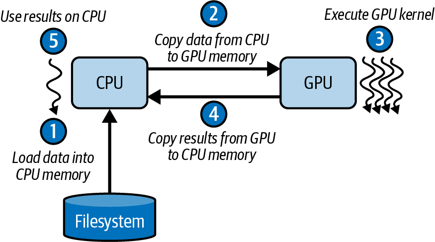

###### Figure 6-1. Simple CUDA programming flow

Initially, the host loads data into CPU memory. It then copies the data from the CPU to the GPU memory. After calling the GPU kernel with the data in GPU memory, the CPU copies the results back from GPU memory to CPU memory. Now the results live back on the CPU for further processing.

GPUs rely on massive parallelism to hide data-transfer latency such as the CPU-GPU data transfer described in Figure 6-1. Each GPU comprises many SMs, which are roughly analogous to CPU cores but streamlined for parallelism. Each SM can track up to 64 warps (32‐thread groups) on Blackwell.

Each GPU includes many SMs—similar to CPU cores but optimized for throughput. On modern GPUs, each SM tracks up to 64 warps (2,048 threads) concurrently. Blackwell GPUs feature 64K 32-bit registers per SM (256 KB total) and a combined 256 KB L1 cache/shared memory per SM. Up to 228 KB (227 KB usable) of that SRAM can be configured as user-managed shared memory per SM. Any single thread block can request up to 227 KB of dynamic shared memory (1 KB is of the 228 KB is reserved by CUDA). These help the SMs support the GPU’s high amount of thread-level parallelism.

Within a Blackwell SM, multiple warp schedulers issue instructions to the available pipelines; four independent warp schedulers allow up to four warps to issue instructions to the available pipelines on every cycle. Furthermore, each scheduler supports dual-issue capable of issuing two independent instructions (e.g., one arithmetic and one memory operation) per warp. Note that the dual-issue must come from the same warp—and not across warps.

In the best case, one warp from each scheduler can issue an instruction concurrently each cycle, allowing four warps to execute in parallel per cycle. This further boosts throughput when instruction mixing is utilized, as shown in Figure 6-2.

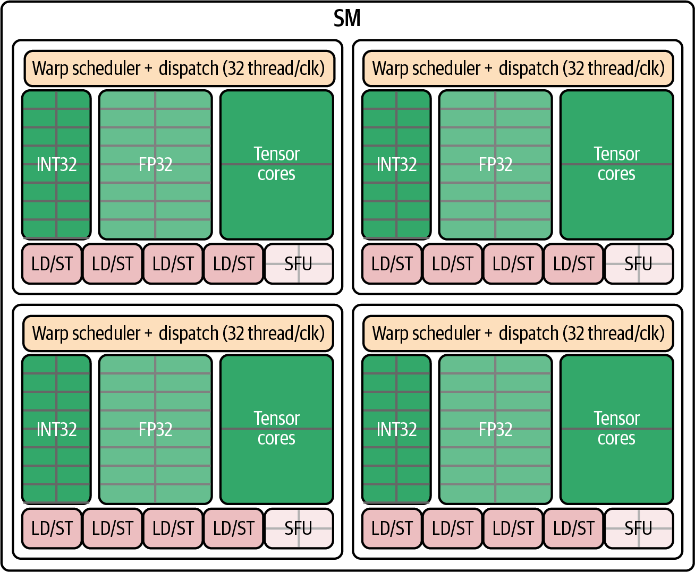

###### Figure 6-2. Blackwell SMs contain four independent warp schedulers, each capable of issuing one warp instruction per cycle with dual-issue of one math and one memory operation per scheduler

Here, each SM is subdivided into four independent scheduling partitions—each with its own warp scheduler and dispatch logic. You can think of the SM as four “mini-SMs” sharing on-chip resources. This lets the hardware pick ready warps and issue instructions from up to four different warps each clock cycle.

Within each of the four “mini-SM” partitions, the scheduler can issue two instructions per cycle from the same warp: one arithmetic instruction (e.g., INT32, FP32, or Tensor Core) and one memory instruction (a load or store). This is why the scheduler is called dual-issue. Table 6-1 summarizes these numbers.

Note: The numeric values in all metrics tables are illustrative to explain the concepts. For actual benchmark results on different GPU architectures, see the GitHub repository.

So in the best case you could dual-issue four math and four memory instructions across four warps every cycle. This would maximize both compute and memory throughput simultaneously. These numbers are a result of the SM’s four-way partitioning—as well as its ability to pick one warp per partition and issue two orthogonal instructions each cycle.

The Special Function Unit (SFU) sits alongside the INT32, FP32, and Tensor Core pipelines. They handle transcendental operations (e.g., sine, cosine, reciprocal, square root). However, they are not part of the dual-issue math and memory pair. SFUs use a dedicated SFU pipeline that runs independently of the main INT32/FP32 and load/store (LD/ST) pipelines.

Because SFUs occupy a separate pipeline and can execute in parallel when needed, the SM can continue issuing math and memory instructions without waiting for the slower functions to complete. This separation increases instruction‐level parallelism and overall throughput even further for mixed‐operation kernels. They keep complex math operations from stalling the core compute and memory pipelines.

Because there are four schedulers—and each can typically issue one warp instruction per cycle—up to four warps can make forward progress each cycle when there is sufficient independent work and issue-pairing. For instance, the memory operations can flow through the SM’s combined 16 load/store (LD/ST) pipelines (four LD/ST pipelines per scheduler). These will read or write data to L1/shared memory, L2 cache, or global memory (covered in an upcoming section).

Exact LD/ST pipeline counts and pairings are not guaranteed. Rely on profiling counters to determine whether your kernel is limited by memory issue or compute issue. And consult the NVIDIA documentation for specifics of your architecture. The Blackwell tuning guide is a good place to start.

In short, GPUs excel at data-parallel workloads, including large matrix multiplies, convolutions, and other operations where the same instruction applies to many elements. Developers write kernels directly in CUDA C++ or indirectly through high-level frameworks like PyTorch and domain-specific, Python-based GPU languages like OpenAI’s Triton.

Before diving into kernel development and memory-access optimizations, let’s review the CUDA thread hierarchy and key terminology that underpins all of these practices.

## Threads, Warps, Blocks, and Grids

CUDA structures parallel work into a three-level hierarchy—threads, thread blocks (aka cooperative thread arrays [CTAs]), and grids—to balance programmability with massive throughput. At the lowest level, each thread executes your kernel code. You group threads into thread blocks of up to 1,024 threads each on modern GPUs. Thread blocks form a grid when you launch the kernel, as seen in Figure 6-3.

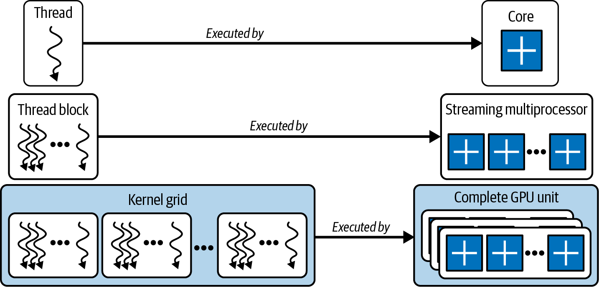

###### Figure 6-3. Threads, thread blocks (aka CTAs), and grids

By sizing your grid appropriately, you can scale to millions of threads without changing your kernel logic. CUDA’s runtime (and frameworks like PyTorch) handle scheduling and distribution across all SMs. Figure 6-4 shows another view of the thread hierarchy, including the CPU-based host, which invokes a CUDA kernel running on the GPU device.

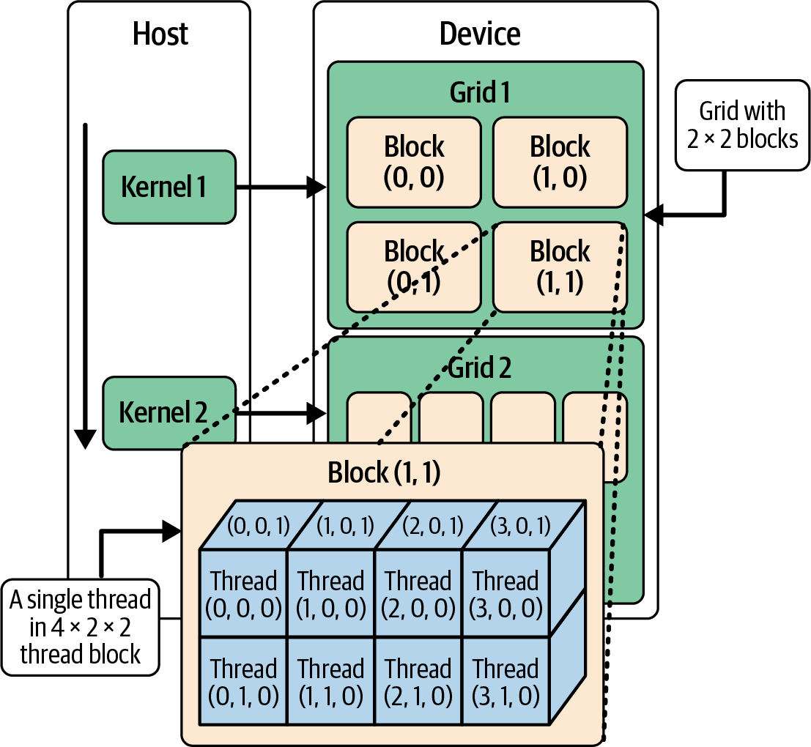

###### Figure 6-4. View of thread hierarchy, including the CPU-based host, which launches a kernel running on the GPU device

Traditionally, threads from different thread blocks could not work with one another directly. However, modern GPU architectures and CUDA versions support thread block clusters. Threadblock clusters are groups of thread blocks that can communicate with one another across SMs.

Specifically, within a thread block cluster, threads in different thread blocks can access one another’s shared memory and use hardware-supported, cluster-scoped barriers. These allow for much larger compute operations, including matrix multiplies, which are very common in today’s massive LLM workloads. Thread block clusters share a distributed shared-memory (DSMEM) address space between SMs that participate in the thread block cluster, as shown in Figure 6-5.

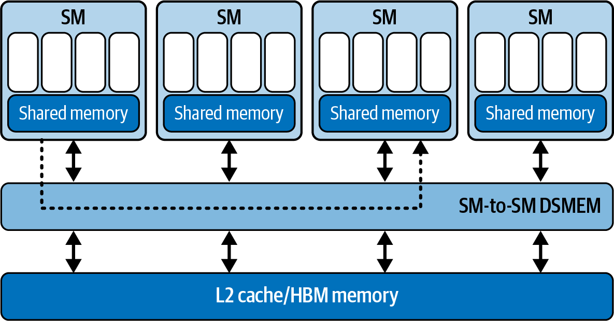

###### Figure 6-5. Hardware-supported DSMEM used in thread block clusters containing multiple thread blocks

DSMEM is a hardware feature that links the shared-memory banks of all SMs into a thread block cluster over a fast on-chip interconnect. With DSMEM, the SMs share a combined multi-SM distributed shared-memory pool. This unification allows threads in different blocks to read, write, and atomically update one another’s shared buffers at on-chip speeds—and without using global memory bandwidth.

We’ll cover advanced topics like thread block clusters and DSMEM in Chapter 10. These are an extremely important addition to modern GPU processing—and very important for an AI systems performance engineer to understand. For this chapter, our focus remains on intrablock shared-memory optimizations.

Within each thread block, threads share data using low-latency on-chip shared memory and synchronize with `__syncthreads()`. Because each barrier incurs overhead, you should minimize synchronization points, as shown in [Figure 6-6](https://learning.oreilly.com/library/view/ai-systems-performance/9798341627772/ch06.html#ch06_figure_6_1757308039123612).

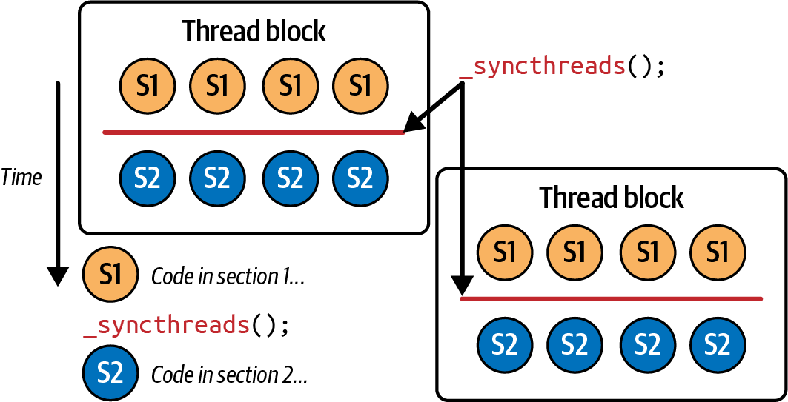

###### Figure 6-6. Synchronizing all threads within a thread block between two sections of code

The goal is to minimize synchronization points. However, the GPU hardware will attempt to hide long-latency events such as global-memory loads, cache fills, and pipeline stalls by rapidly switching among warps.

Thread blocks are subdivided into warps of 32 threads that execute in lockstep under the SIMT model using a warp scheduler. This is shown in Figure 6-7.

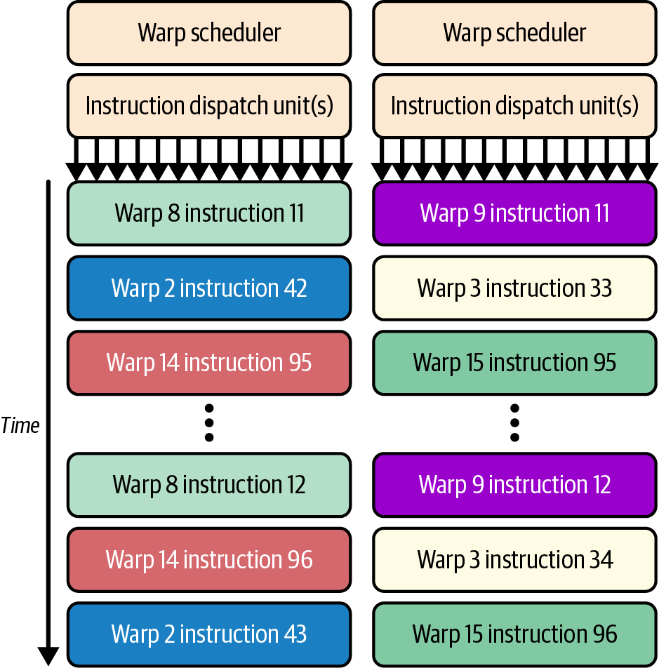

###### Figure 6-7. Warps (32 threads) advance as a whole with instructions managed by the warp scheduler

Keeping more warps in flight is known as high occupancy on the SM. When your CUDA code allows high occupancy, it means that when one warp stalls, another is ready to run. This keeps the GPU’s compute units busy.

However, high occupancy must be balanced against per-thread resource limits, such as registers and shared memory. Spilling registers to slower memory can create new stalls. Profiling occupancy alongside register and shared-memory usage helps you choose a block size that maximizes throughput without triggering resource contention.

We will cover occupancy tuning in Chapter 8, but it’s a key concept to understand in the context of SMs, warps, threads, etc.

Thread blocks execute independently and in no guaranteed order. This allows the GPU scheduler to dispatch them across all SMs and fully exploit hardware parallelism. This grid–block–warp hierarchy guarantees that your CUDA kernels will run unmodified on future GPU architectures with more SMs and threads.

Throughput also hinges on warp execution efficiency. Threads in a warp must follow the same control-flow path and perform coalesced memory accesses. []()[]()If some threads diverge such that one branch takes the `if` path and others take the `else` path, the warp serializes execution, processing each branch path sequentially. This is called <em>warp divergence</em>, and it’s shown in [Figure 6-8](https://learning.oreilly.com/library/view/ai-systems-performance/9798341627772/ch06.html#ch06_figure_8_1757308039123643).[]()[]()[]()[]()[]()[]()[]()

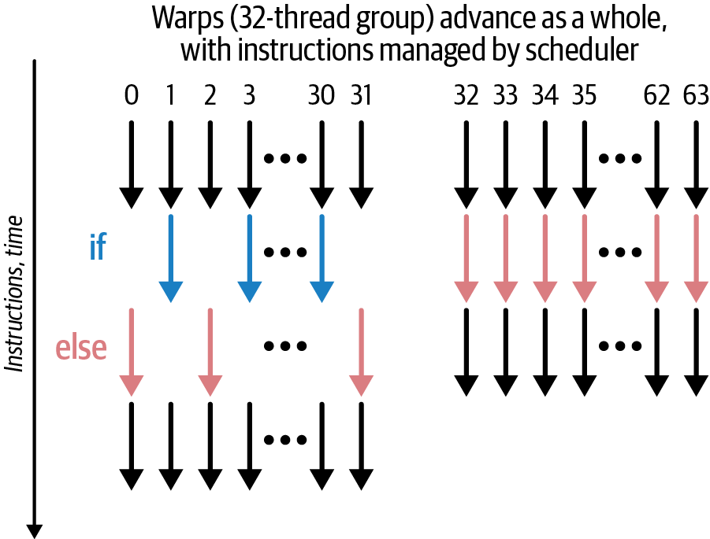

###### Figure 6-8. SIMT warp divergence (left) versus uniformity (right)

By masking inactive lanes and running extra passes to cover each branch, warp divergence multiplies the overall execution time by the number of branches. We’ll dive deeper into warp divergence in Chapter 8—as well as ways to detect, profile, and mitigate it.

Divergence is an issue only for threads within a single warp. Different warps can follow different branches with no performance penalty.

## Choosing Threads-per-Block and Blocks-per-Grid Sizes

A critical aspect of GPU performance is choosing a thread block size that aligns with the hardware’s 32-thread warp size. As such, you typically pick thread block sizes that are exact multiples of 32. For example, a 256-thread block (8 warps = 256 ÷ 32) fully occupies each warp, whereas a 33-thread block will require two warp slots and use only 1/32 of the second warp’s lanes. This wastes parallelism opportunities since every warp occupies a scheduler slot whether it’s actively running 32 threads or just 1 thread.

Additionally, different GPU generations have different hardware limits, including maximum threads per SM and the number of registers per SM. This naturally limits the size of our blocks if we want to maintain good performance. For instance, too large a block might require too many registers, which will cause register spilling and decrease the kernel’s performance.

A large block might also require too much shared memory, which is finite in GPU hardware. Specifically, Blackwell provides only 228 KB (227 KB usable) per SM of shared memory addressable by all resident thread blocks running on the SM.

These hardware limits affect how many blocks/warps can be active on an SM at once. This is a measurement of occupancy, as we introduced earlier. Smaller blocks might enable higher occupancy if they allow more concurrent warps to run concurrently on the SM.

It’s important to understand the relative scale and hardware thread limits for your GPU generation, including number of threads, thread blocks, warps, and SMs. Figure 6-9 shows the relative scale of these resources, including their limits.

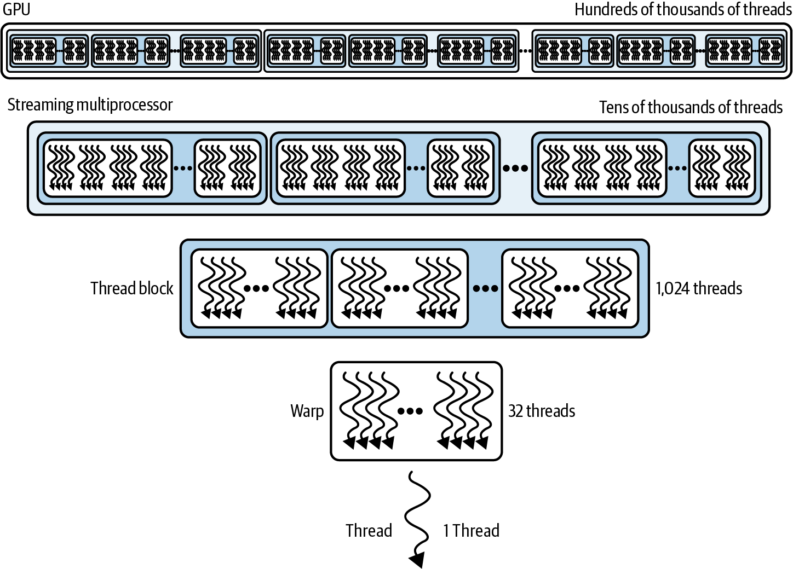

###### Figure 6-9. Relative scale and hardware limits for threads on a Blackwell GPU

Table 6-2 summarizes these GPU limits for the Blackwell B200 GPU. The rest of the limits are available on NVIDIA’s website. (Other GPU generations will have different limits, so be sure to check the exact specifications for your system.)

We already discussed the warp size limit of 32 threads, which encourages us to choose block dimensions that are multiples of 32 threads to create “full warps” and avoid underutilized warps. Note that each block can have up to 1,024 threads and, correspondingly, a block can contain only 32 warps. These limits affect your occupancy since, once a block is scheduled, each SM can host a limited number of warps and blocks simultaneously.

Additionally, there are per-SM limits, or SM-resident limits as they are commonly called, for the different GPU generations. These SM-resident Blackwell limits are summarized in Table 6-3.

Hardware can keep up to 64 warps in flight (64 × 32 threads = 2,048 threads).

Note: This limit has held for many generations and remains true for Blackwell.

Equals 64 warps × 32 threads/warp. If each block uses 1,024 threads, then at most 2 such blocks (64 warps) can reside on one SM concurrently.

Using smaller blocks (e.g., 256 threads) allows more blocks to reside on the SM (up to 8 blocks × 256 = 2,048 threads), which can increase occupancy and help hide latency—though too many tiny blocks can add scheduling overhead.

At most, 32 thread blocks can be simultaneously resident on one SM (if blocks are smaller, more can fit up to this limit).

Here, we see that the maximum number of concurrent warps per SM on Blackwell is 64. This hasn’t changed for recent GPU generations, so occupancy considerations carry over. Maximum active blocks on an SM is 32, and, correspondingly, maximum resident threads per SM is 2,048 threads. CUDA grids also have maximum dimensions, as shown in Table 6-4.

X: 2,147,483,647 blocks

Y: 65,535 blocks

Z: 65,535 blocks

While it’s good to know the theoretical grid limits, you will typically be bound by the thread/block/per-SM limits shown previously. If you ever need more than 65,535 blocks in one dimension, you can launch a 2D or 3D grid to split your work across multiple kernel launches (multilaunch). We show an example of this in a later section. In practice, it’s rare to hit the grid size limit before hitting other resource limits.

## CUDA GPU Backward and Forward Compatibility Model

One of CUDA’s core strengths[]()[]()[]()[]()[]()[]()[]()[]()[]() is its forward and backward compatibility model. Kernels compiled today will generally run unmodified on future GPU generations—as long as you include PTX in your binary for forward compatibility. If you ship only SASS for a single architecture (e.g., `sm_90` for Hopper or `sm_100` for Blackwell) without PTX, that binary will not forward-run on newer architectures. Family-specific targets such as `sm_100f` or `compute_100f` restrict portability to devices in the same feature family. It’s best to ship a fatbin that includes both generic cubin/PTX and family-specific cubins needed (e.g., optimizations, etc.).

You can verify compatibility by forcing PTX JIT compilation at load time by setting `CUDA_FORCE_PTX_JIT=1` to JIT-compile the PTX and cache the result. If your binary lacks PTX, the kernel launch will fail. This forces you to rebuild with PTX support. This compatibility model is fundamental to the large CUDA ecosystem. It lets you target both legacy and cutting-edge hardware from a single codebase.

To truly maintain both backward and forward compatibility across current and future GPU generations, you should compile with generic targets—or explicitly include the PTX. When you need specific optimizations from newer hardware features, you can use generation-specific targets. When doing this, be sure to provide fallback paths for other architectures.

# CUDA Programming Refresher

In CUDA C++, you define parallel work[]()[]()[]()[]()[]()[]()[]()[]()[]()[]()[]()[]()[]()[]()[]()[]()[]() by writing kernels. These are special functions annotated with `__global__` that execute on the GPU device. When you invoke a kernel from the CPU (host) code, you use the `<<< >>> `“chevron” syntax to specify how many threads should run—and how they’re organized—using two configuration parameters: `blocksPerGrid` for the number of thread blocks and `threadsPerBlock` for the number of threads within each block.

Here is a simple example that demonstrates the key components of a CUDA kernel and kernel launch. This kernel simply doubles every element in the input array in place so no additional memory is created—just the input array. Behind the scenes, CUDA compiles the `__global__` function into GPU device code that can be executed by thousands or millions of lightweight threads in parallel:

```cpp
//-------------------------------------------------------
// Kernel: myKernel running on the device (GPU)
// - input : device pointer to float array of length N
// - N : total number of elements in the input
//-------------------------------------------------------

__global__ void myKernel(float* input, int N) {
// Compute a unique global thread index
int idx = blockIdx.x * blockDim.x + threadIdx.x;

// Only process valid elements
if (idx < N) {
input[idx] *= 2.0f;
}
}

// This code runs on the host (CPU)
int main() {
// 1) Problem size: one million floats
const int N = 1'000'000;
float *h_input = nullptr;
float *d_input = nullptr;

// 1) Allocate input float array of size N on host
cudaMallocHost(&h_input, N * sizeof(float));

// 2) Initialize host data (for example, all ones)
for (int i = 0; i < N; ++i) {
h_input[i] = 1.0f;
}

// 3) Allocate device memory for input on the device
cudaMalloc(&d_input, N * sizeof(float));

// 4) Copy data from the host to the device
cudaMemcpy(d_input, h_input, N * sizeof(float),
cudaMemcpyHostToDevice);

// 5) Choose kernel launch parameters

// Number of threads per block (multiple of 32)
const int threadsPerBlock = 256;

// Number of blocks per grid (3,907 for N = 1000000)
const int blocksPerGrid = (N + threadsPerBlock - 1) /
threadsPerBlock;

// 6) Launch myKernel across blocksPerGrid blocks
// Each block has threadsPerBlock number of threads
// Pass a reference to the d_input device array
myKernel<<<blocksPerGrid, threadsPerBlock>>>(d_input,
N);
// 7) Wait for the kernel to finish running on device
cudaDeviceSynchronize();

// 8) When finished, copy the results
// (stored in d_input) from the device back to
// host (stored in h_input)
cudaMemcpy(h_input, d_input, N * sizeof(float),
cudaMemcpyDeviceToHost);

// Cleanup: Free memory on the device and host
cudaFree(d_input);
cudaFreeHost(h_input);

// return 0 for success!
return 0;
```

This code is not fully optimized. We will optimize performance as we continue through the book. But this gives you a simple, complete template to start building your own CUDA kernels.

Here, we are passing kernel input arguments, `d_input` and `N`, which are accessible inside the kernel function for processing. The processing is shared, in parallel, across many threads. This is by design.

The full data flow is as follows:

- Allocate memory on the host (h_input).
- Copy data from the host (h_input) to device (d_input) using cudaMemcpy with cudaMemcpyHostToDevice.
- Run the kernel on the device with d_input.
- Synchronize to ensure the kernel has finished executing on the device.
- Transfer the results (d_input) from device to host (h_input) using cudaMemcpy with cudaMemcpyDeviceToHost.
- Clean up memory on the device and host with cudaFree and cudaFreeHost.

Allocate memory on the host (`h_input`).

Copy data from the host (`h_input`) to device (`d_input`) using `cudaMemcpy` with `cudaMemcpyHostToDevice`.

Run the kernel on the device with `d_input`.

Synchronize to ensure the kernel has finished executing on the device.

Transfer the results (`d_input`) from device to host (`h_input`) using `cudaMemcpy` with `cudaMemcpyDeviceToHost`.

Clean up memory on the device and host with `cudaFree` and `cudaFreeHost`.

You can pass additional, advanced, []()[]()[]()[]()[]()[]()[]()CUDA-specific parameters to your kernel at launch time with `<<< >>>`, including shared-memory size (and many others), but the two core launch parameters, `blocksPerGrid` and `threadsPerBlock`, are the foundation of any CUDA kernel invocation. In the next section, we will discuss how to best choose these launch parameter values.

And you might be wondering why we have to pass `N`, the size of the input array. This seems redundant since the kernel should be able to inspect the size of the array. However, this is the core difference between a GPU CUDA kernel function and a typical CPU function: a CUDA kernel function is designed to work inside of a single thread, alongside thousands of other threads, on a partition of the input data. As such, `N` defines the size of the partition that this particular kernel will process.

Combined with the built-in kernel variables `blockDim` (1 in this case since we’re passing a one-dimensional input array), `blockIdx`, and `threadIdx`, the kernel calculates the specific `idx` into the input array. This unique `idx` lets the kernel process every element of the input array cleanly and uniquely, in parallel, across many threads running across many different SMs simultaneously.

Note the bounds check `if (idx < N)`. This is needed to avoid out-of-range access (bounds check) since `N` may not be an exact multiple of the block size. For instance, consider a scenario in which the input array is size 63, so `N = 63`. The warp scheduler will likely assign two warps (32 threads each) to process the 63 elements in the input array.

The first warp will run 32 instances of the kernel simultaneously to process elements 0–31 and never exceed `N = 63`. That’s straightforward. The second warp, running in parallel with the first warp, will expect to process elements 32–64. However, it will stop when it reaches `N = 63`.

Without the `if (idx < N)` bounds check, the second warp will try to process `idx = 64`, and it will throw an illegal memory access error (e.g., `cudaErrorIllegalAddress`). The bounds check ensures that every thread either works on a valid input element or exits immediately if its `idx` is out of range.

CUDA kernels execute asynchronously[]()[]()[]()[]()[]() on the device without per‐thread exceptions; instead, any illegal operation (out-of-bounds access, misaligned access, etc.) sets a global fault flag for the entire launch. The host driver only checks that flag when you next call a synchronization or another CUDA API function, so errors surface lazily (e.g., as `cudaErrorIllegalAddress` or a generic launch failure).

This design keeps the GPU’s pipelines and interconnects fully occupied but requires you to explicitly synchronize and poll for errors on the host—usually with `cudaGetLastError()` and `cudaDeviceSynchronize()` immediately after kernel launches. This way, you catch faults as soon as they occur.

You will see a bounds check in a lot of CUDA kernels. If you don’t see it, you should understand why it’s not there. It’s likely there in some fashion—or the CUDA kernel developer can somehow guarantee the illegal memory access error will never happen.

And finally, we get to the actual kernel logic. After computing its unique index `idx` into the input array, this kernel (running separately on thousands of threads in parallel across many SMs) multiplies the value at index `idx `in the input array by 2. It then updates the value (in place) in the input array. In this specific kernel, no additional memory is needed except the temporary `idx` variable of type `int`.[]()[]()

## Configuring Launch Parameters: Blocks per Grid and Threads per Block

As discussed earlier, using[]()[]()[]()[]()[]()[]()[]()[]()[]() a block size that’s a multiple of the warp size (32) is critical. A `threadsPerBlock` size of 256 (eight warps) is a common starting point to balance occupancy and resource usage. This will help us avoid partially filled warps during kernel execution, hide latency, and balance SMs and other hardware resources:

Choosing a block size that is a multiple of 32 threads helps to avoid empty warp slots. Otherwise those underfilled warps occupy scarce scheduler resources—without contributing useful work.

Hundreds of threads per SM are needed to hide DRAM and instruction‐latency stalls. If you launch, say, eight blocks of 256 threads on an SM with 2,048 threads of capacity, you can keep the pipeline busy without oversubscribing.

With 256 `threadsPerBlock`, for example, you need only eight warps per block. This tends to give good occupancy without running out of registers or shared memory per block.

For modern GPUs like Blackwell, consider 256–512 threads per block to maximize occupancy while respecting register and shared-memory limits.

256 is small enough that you rarely exceed the 1,024-thread-per-block limit. And it’s large enough that you’re not leaving too many warps idle when threads in other warps stall.

Starting with `threadsPerBlock=256`, you can tune up or down (128, 512, etc.) based on your kernel’s register and shared-memory requirements—as well as occupancy characteristics.

For `blocksPerGrid`, you can base this on the number of `N` input elements and the value of `threadsPerBlock`. For instance, the `blocksPerGrid` is commonly set to `(N + threadsPerBlock - 1) / threadsPerBlock` to round up so that you cover all elements if `N` is not an exact multiple of `threadsPerBlock`. This is a common choice that guarantees every input element is covered by a thread. Here is the code that shows the calculation:

```cpp
//-------------------------------------------------------
// Kernel: myKernel running on the device (GPU)
// - input : device pointer to float array of length N
// - N : total number of elements in the input
//-------------------------------------------------------
__global__ void myKernel(float* input, int N) {
// Compute a unique global thread index
int idx = blockIdx.x * blockDim.x + threadIdx.x;

// Only process valid elements
if (idx < N) {
input[idx] *= 2.0f;
}
}

// This code runs on the host (CPU)
int main() {
// 1) Problem size: one million floats
const int N = 1'000'000;

float* h_input = nullptr;
cudaMallocHost(&h_input, N * sizeof(float));

// Initialize host data (for example, all ones)
for (int i = 0; i < N; ++i) {
h_input[i] = 1.0f;
}

// Allocate device memory for input on the device (d_)
float* d_input = nullptr;
cudaMalloc(&d_input, N * sizeof(float));

// Copy data from the host to the device using cudaMemcpyHostToDevice
cudaMemcpy(d_input, h_input, N * sizeof(float),
cudaMemcpyHostToDevice);

// 2) Tune launch parameters
const int threadsPerBlock = 256; // multiple of 32
const int blocksPerGrid = (N + threadsPerBlock - 1) /
threadsPerBlock; // 3,907, in this case

// Launch myKernel across blocksPerGrid number of blocks
// Each block has threadsPerBlock number of threads
// Pass a reference to the d_input device array
myKernel<<<blocksPerGrid, threadsPerBlock>>>(d_input, N);
// Wait for the kernel to finish running on the device
cudaDeviceSynchronize();

// When finished, copy results (stored in d_input) from device to host
// (stored in h_input) using cudaMemcpyDeviceToHost
cudaMemcpy(h_input, d_input, N * sizeof(float), cudaMemcpyDeviceToHost);

// Cleanup: Free memory on the device and host
cudaFree(d_input);
cudaFreeHost(h_input);

return 0; // return 0 for success!
```

This is the same kernel as previously but calculates the `blocksPerGrid `and `thread⁠s​PerBlock` dynamically based on the size of `N`. Note the familiar `if (idx < N)` bounds check. This ensures that any “extra” threads in the final block that fall outside of `N` will simply do nothing—and not cause an illegal memory address error. Next, let’s explore multidimensional inputs like 2D images and 3D volumes.[]()[]()[]()[]()[]()[]()[]()[]()

## 2D and 3D Kernel Inputs

When your input data naturally lives in two dimensions (e.g., images), you can launch a 2D grid of 2D blocks. For example, here’s a kernel that processes a two-dimensional 1,024 × 1,024 matrix using a 16 × 16 dimensional thread block for a total of 256 threads:

```cpp
// 2d_kernel.cu

#include <cuda_runtime.h>
#include <iostream>

//-------------------------------------------------------
// Kernel: my2DKernel running on the device (GPU)
// - input : device pointer to float array of size width×height
// - width : number of columns
// - height : number of rows
//-------------------------------------------------------
__global__ void my2DKernel(float* input, int width, int height) {
// Compute 2D thread coordinates
int x = blockIdx.x * blockDim.x + threadIdx.x;
int y = blockIdx.y * blockDim.y + threadIdx.y;

// Only process valid pixels
if (x < width && y < height) {
int idx = y * width + x;
input[idx] *= 2.0f;
}
}

int main() {
// Image dimensions
const int width = 1024;
const int height = 1024;
const int N = width * height;

// 1) Allocate and initialize host image
float* h_image = nullptr;
cudaMallocHost(&h_image, N * sizeof(float));

for (int i = 0; i < N; ++i) {
h_image[i] = 1.0f; // e.g., initialize all pixels to 1.0f
}

// 2) Allocate device image and copy data to device
cudaStream_t s; cudaStreamCreateWithFlags(&s, cudaStreamNonBlocking);
float* d_image = nullptr;
cudaMallocAsync(&d_image, N * sizeof(float), s);
cudaMemcpyAsync(d_image, h_image, N * sizeof(float),
cudaMemcpyHostToDevice, s);

my2DKernel<<<blocksPerGrid2D, threadsPerBlock2D,
0, s>>>(d_image, width, height);

cudaMemcpyAsync(h_image, d_image, N * sizeof(float),
cudaMemcpyDeviceToHost, s);
cudaStreamSynchronize(s);

cudaFreeAsync(d_image, s);
cudaStreamDestroy(s);
```

Here, again, is the full kernel (device) and invocation (host) code. This same pattern generalizes to 3D by using `dim3(x, y, z)` for both `blocksPerGrid` and `threadsPerBlock`, letting you map volumetric data directly onto the GPU’s thread hierarchy.

For the most part, this book[]()[]() uses 1D or 2D (tiled) values for `block⁠s​PerGrid` and `threadsPerBlock`. In the 1D case, you can define `blocksPerGrid` and `threadsPerBlock` as simple constants instead of `dim3`.

## Asynchronous Memory Allocation and Memory Pools

Standard `cudaMalloc`/`cudaFree` calls, as shown[]()[]()[]() in the previous examples, are synchronous and relatively expensive. They require a full device synchronization (relatively slow) and involve OS-level calls like `mmap`/`ioctl` to manage GPU memory.

This OS-level interaction incurs kernel-space context switches and driver overhead, which makes them relatively slow compared to purely device-side operations. As such, it’s recommended to use the asynchronous versions, `cudaMallocAsync` and `cudaFreeAsync`, for more efficient memory allocations on the GPU.

By default, the CUDA runtime maintains[]()[]()[]() a global pool of GPU memory. When you free memory asynchronously, it goes back into the pool for potential reuse in subsequent allocations. `cudaMallocAsync` and `cudaFreeAsync` use the CUDA memory pool under the hood.

A memory pool recycles freed memory buffers and avoids repeated OS calls to allocate new memory. This helps to reduce memory fragmentation over time by reusing previously freed blocks instead of creating new ones for each iteration in a long-running training loop, for instance. Memory pools are enabled by default in many high-performance libraries and runtimes such as PyTorch.

In fact, PyTorch uses a custom[]() memory caching allocator, configured with `PYTORCH_ALLOC_CONF` (formerly `PYTORCH_CUDA_ALLOC_CONF`). The PyTorch memory caching allocator is similar in spirit to CUDA’s memory pool: it reuses GPU memory and avoids the cost of calling the synchronous `cudaMalloc` operation for every new PyTorch tensor created during each iteration of a long-running training loop, for instance.

In CUDA applications that perform frequent, fine-grained allocations, it’s far more efficient to use the asynchronous pool-based routines—`cudaMallocAsync` and `cudaFreeAsync`—rather than the traditional synchronous `cudaMalloc`/`cudaFree`, which incur full-device synchronization and even OS-level calls. []()[]()[]()To use stream-ordered allocation, create a non-blocking stream:

```cpp
cudaStream_t stream1;
cudaStreamCreateWithFlags(&stream1, cudaStreamNonBlocking);
```

Using explicit CUDA streams is a best practice for overlapping transfers, kernels, and memory operations. Think of each stream as an isolated channel that enforces ordering among its own operations. Also, it’s recommended to create nonblocking streams with `cudaStreamCreateWithFlags(..., cudaStreamNonBlocking)` to avoid legacy default-stream barriers. We’ll explore multistream overlap techniques and best practices in more detail in [Chapter 11](https://learning.oreilly.com/library/view/ai-systems-performance/9798341627772/ch11.html#ch11_inter_kernel_pipelining_synchronization_and_cuda_1757308065280308).

Then, whenever you need a buffer of `N` floats, you allocate and free it on that stream using `cudaMallocAsync` and `cudaFreeAsync`, as shown here:

```cpp
float* d_buf = nullptr;
cudaMallocAsync(&d_buf, N * sizeof(float), stream1);

// ... launch kernels into stream1 that use d_buf ...
myKernel<<<blocksPerGrid, threadsPerBlock, 0, stream1>>>(d_buf, N);

// Free is deferred until all work in stream1 completes—
cudaFreeAsync(d_buf, stream1);
```

These APIs allocate from a per-device memory pool but respect the ordering of the stream you pass, so frees are deferred until that stream’s work completes. And because `cudaFreeAsync` waits for only `stream1` to finish, there is no expensive global `cudaDeviceSynchronize` and no implicit synchronization with other streams. The result is much lower allocation overhead when your code issues thousands—or millions—of allocate/free cycles, reducing fragmentation and smoothing out latency spikes. Overall, this pattern reduces global synchronization and fragmentation relative to traditional `cudaMalloc` and `cudaFree`.

You can further tune the behavior of stream-ordered allocations from the device’s memory pool—for example, by setting `cudaMemPoolAttrReleaseThreshold` to hint how much reserved memory the pool should retain before attempting to release it. You can also use `cudaMemPoolTrimTo` to proactively return memory. These will help balance total GPU memory footprint against fragmentation.

For simple, one-time buffers, a blocking `cudaMalloc `and `cudaFree` may suffice. In more complex, long-running loops where you repeatedly allocate and free memory, however, switching to `cudaMallocAsync `and `cudaFreeAsync` on dedicated streams and leveraging their pools will yield more consistent performance and higher throughput.

Switching to `cudaMallocAsync `and `cudaFreeAsync` on dedicated streams and leveraging their pools will yield more consistent performance and higher throughput. You can further tune pool behavior with `cudaMemPoolSetAttribute` (for example, adjusting `cudaMemPoolAttrReleaseThreshold`) to <em>tune release thresholds and strike the right trade-off between a minimal memory footprint and low fragmentation. </em>[]()[]()[]()[]()[]()[]()

## Understanding GPU Memory Hierarchy

So far, we’ve been discussing memory allocations broadly at a high level and typically from global memory. These allocations come from a stream’s memory pool—including the default stream 0 memory pool.

In reality, however, the GPU provides a multilevel memory hierarchy and helps balance capacity and speed. The hierarchy includes registers, shared memory, caches, global memory, and a specialized TMEM on Blackwell GPUs and beyond. TMEM, discussed in more detail in a bit, is a dedicated ~256 KB per-SM on-chip memory used by Blackwell’s 5th-generation Tensor Core instructions (`tcgen05.*`). It isn’t directly pointer-addressable from CUDA C++. Instead, data movement is orchestrated by TMA hardware (global memory ↔ SMEM) and tcgen05 Tensor Core data-movement instructions (SMEM ↔ TMEM implicitly using tensor descriptors.

Global memory (HBM or DRAM) is large, off-chip, and relatively slow. Registers are tiny, on-chip, and extremely fast. L1 cache, L2 cache, and shared memory are somewhere in between. The benefit of caching and shared memory is that they hide the relatively long latency of accessing the large off-chip memory stores. A high-level view of the GPU memory hierarchy (including the CPU) is shown in Figure 6-10.

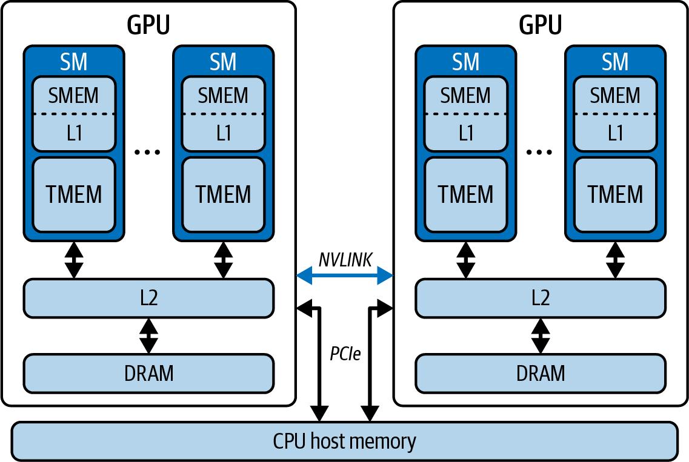

###### Figure 6-10. GPU memory hierarchy, including the CPU

TMEM is a dedicated 256 KB per-SM buffer that transparently communicates with the Tensor Cores at tens of terabytes per second of bandwidth. This reduces the Tensor Core’s reliance on global memory. Figure 6-11 shows TMEM servicing the Tensor Cores—along with SMEM—to compute a C = A × B matrix multiply.

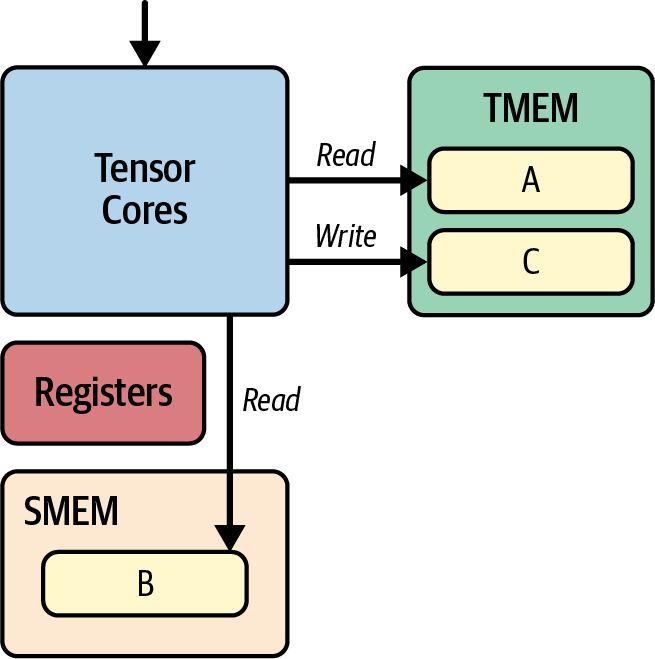

###### Figure 6-11. TMEM and SMEM servicing the Tensor Cores for C = A × B matrix multiply

Here, operand B is sourced from SMEM. Operand A is in TMEM (although it may be in SMEM, as well). The accumulator is in TMEM, as well. Tiles flow from global memory to SMEM through L2 cache using TMA (e.g., `cuda::memcpy_async`). Operands move between SMEM and TMEM implicitly through Tensor Core instructions such as unified matrix-multiply-accumulate (UMMA) and `tcgen05.mma`.

Table 6-5 shows the different levels of memory and their characteristics for the Blackwell GPU. A description of each level of the memory hierarchy follows.

Here, you can see why maximizing data reuse in registers, shared memory, and L1/L2 cache—and minimizing reliance on global memory and local memory (backed by global memory)—is essential for high-throughput GPU kernels. Next is a bit more detail about each of these levels of the hierarchy:

On Blackwell, every thread begins its journey at the register file, a tiny on-SM SRAM array that holds each thread’s local variables with essentially zero added latency. Each SM houses 64 K 32-bit registers (256 KB total), but the hardware exposes at most 255 registers per thread.

Because reads and writes complete in a single cycle and contend with almost nothing else, register bandwidth can reach tens of terabytes per second per SM. However, if your kernel needs more registers—either through many thread-local variables or compiler temporaries—the overflow spills into local memory, mapped to off-chip DRAM, and incurs hundreds to over a thousand cycles of latency. This local memory is shown in Figure 6-12.

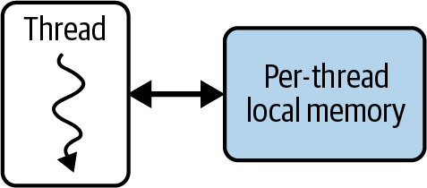

###### Figure 6-12. Local memory per thread

One step up is a unified L1/data cache and shared-memory block. This is 256 KB of on-SM SRAM per SM that you can dynamically split between user-managed shared memory (up to 228 KB per block) using `cudaFuncSetAttribute()` with `cudaFuncAttributePreferredSharedMemoryCarveout` to select the memory carveout on architectures like Blackwell with unified L1/Texture/Shared Memory. The maximum dynamic shared memory per block is 227 KB (CUDA reserves 1KB per block), and the total allocatable shared memory per SM is also bounded by this limit.

Accesses here cost roughly 20–30 cycles, but if you design your thread blocks to avoid bank conflicts, you can achieve terabytes-per-second throughput. Thread-block shared memory is shown in Figure 6-13.

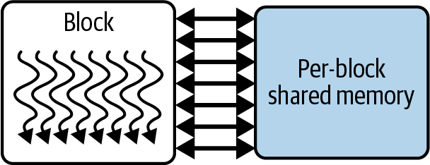

###### Figure 6-13. Thread-block shared memory

TMEM is a dedicated on-chip memory per SM (256 KB on Blackwell) used by Tensor Core–specific operations and instructions including unified matrix-multiply-accumulate and `tcgen05`, discussed in [Chapter 10](https://learning.oreilly.com/library/view/ai-systems-performance/9798341627772/ch10.html#ch10_intra_kernel_pipelining_warp_specialization_and_1757308054839290). It is not a normal pointer addressable space in CUDA C++. Instead, transfers are orchestrated with the Tensor Memory Accelerator (TMA) using descriptors. This frees the developer from having to manually manage data flow with the Tensor Cores. Some arithmetic operands, for instance, reside in shared memory, while the <span class="keep-together">accumulator</span> resides in TMEM. TMA is then responsible for moving the data between global memory, shared memory, and TMEM memory to perform the <span class="keep-together">computations</span>.

For tiny, read-only tables, Blackwell provides a per-SM constant memory cache of about 8 KB fronting the 64 KB `__constant__` space. When all 32 threads in a warp load the same address, this cache broadcasts the value in a single cycle.

Divergent reads serialize across lanes. It’s perfect for sharing small lookup tables for rotary positional encodings, Attention with Linear Biases (ALiBi) slopes, LayerNorm γ/β vectors, and embedding quantization scales. These are shared across every thread without global-memory traffic.

Beyond on-chip SRAM sits the L2 cache, a 126 MB GPU-wide buffer that glues all SMs to off-chip HBM3e. With latencies near 200 cycles and aggregate bandwidth in the tens of terabytes per second, L2 absorbs spillover from L1.

With the L2, data is fetched by one thread block and reused by other thread blocks without revisiting DRAM. To maximize L2’s benefits, structure your global loads into 128-byte, coalesced transactions that map cleanly to cache lines. We’ll show how to do this in a bit.

Structure your global loads into 128-byte aligned, coalesced segments that map cleanly to cache lines. This avoids split transactions and maximizes use of the L2 and DRAM bandwidth.

The global memory tier, local spill space and HBM, live off-chip. Any spilled registers or oversized automatic arrays reside in local memory, paying full DRAM latency (hundreds to more than 1,000 cycles) despite HBM3e’s ~8 TB/s bandwidth.

For Blackwell, the HBM3e tier provides up to 180 GB of device-wide storage at ~8 TB/s total. However, its high latency makes it the slowest link in the chain. Per-device global memory is shown in Figure 6-14.

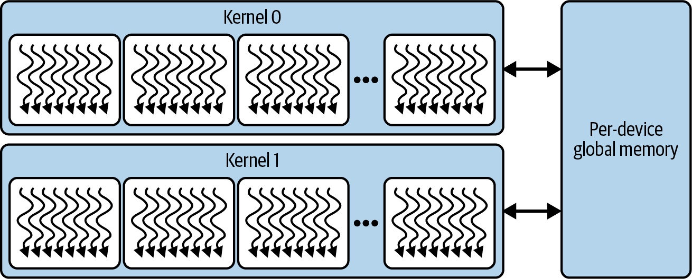

###### Figure 6-14. Per-device global memory, or HBM

Using tools like Nsight Compute to track spills and cache hit rates, you can keep your kernels operating as close as possible to the on-chip peaks of this memory hierarchy. These tools can help you orchestrate data effectively through registers, shared/L1, constant cache, and L2 cache. Modern GPUs like Blackwell allow kernel developers to exploit the memory hierarchy by using L2 caches and unified L1/shared memory to buffer and coalesce accesses to HBM, as we’ll soon see.

The Blackwell B200 presents as a single GPU built with a unified, global address space. However, it’s made up of two reticle-limited dies connected by a 10 TB/s chip-to-chip interconnect. Each die is connected to four HBM3e stacks for a total of eight HBM3e stacks. From a developer’s perspective, however, HBM memory access is uniform across this combined address space, but it’s worth understanding the low-level details of this architecture.

The point of coherency (PoC) for the different levels in the memory hierarchy depends on your needs and the level at which the threads are communicating. It typically happens at the following levels: thread, thread-block (aka CTA), thread block cluster (aka CTA cluster), device, or system, as shown in Figure 6-15.

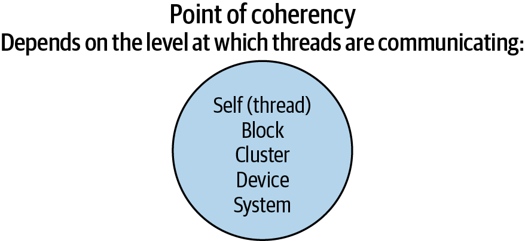

###### Figure 6-15. Point-of-memory coherency for your GPU threads

In summary, it’s important to understand the GPU’s memory hierarchy and target each level appropriately. By doing so, you can structure your CUDA kernels to maximize data locality, hide memory-access latency, increase occupancy, and fully leverage Blackwell’s massive parallel compute capabilities, as we’ll explore in a bit. First, let’s discuss NVIDIA’s unified memory, which is important to understand given the unified CPU-GPU superchip designs of Grace Hopper and Grace Blackwell.

## Unified Memory

Unified Memory (also known as CUDA Managed Memory) gives you a single,[]()[]()[]()[]()[]()[]() coherent address space that spans both CPU and GPU, so you no longer have to juggle separate host and device buffers or issue explicit `cudaMemcpy` calls. Under the hood, the CUDA runtime backs every `cudaMallocManaged()` allocation with pages that can migrate on-demand over whatever interconnect links your CPU and GPU, as shown in [Figure 6-16](https://learning.oreilly.com/library/view/ai-systems-performance/9798341627772/ch06.html#ch06_figure_16_1757308039123767).

While accessing Unified Memory is super developer-friendly, it can cause unwanted on-demand page migrations between the CPU and the GPU. This will introduce hidden latency and execution stalls. For example, if a GPU thread accesses data that currently resides in CPU memory, the GPU will page-fault and wait while that data is transferred over the NVLink-C2C interconnect. Unified Memory performance depends greatly on the underlying hardware.

On traditional PCIe or early NVLink systems, those migrations travel at relatively low bandwidth—often making on-fault transfers slower than a manual `cudaMemcpy`. But on Grace Hopper and Grace Blackwell Superchips, the NVLink-C2C fabric delivers up to ~900 GB/s between the CPU’s HBM and the GPU’s HBM3e. As such, page-fault–driven migrations come far closer to device-native speed—although they still carry nonzero latency.

That said, any unexpected page-fault during a kernel launch will stall the GPU while the runtime moves the needed page into place. To avoid those “surprise” stalls, you can prefetch memory in advance with `cudaMemPrefetchAsync()`, as shown in [Figure 6-17](https://learning.oreilly.com/library/view/ai-systems-performance/9798341627772/ch06.html#ch06_figure_17_1757308039123781).

This hints to the driver to move the specified range onto the target GPU (or CPU) before you launch your kernel, turning costly first-touch migrations into overlappable, asynchronous transfers. You can also give memory advice, as shown in this code:

```cpp
cudaMemAdvise(ptr, size, cudaMemAdviseSetPreferredLocation, gpuId);
cudaMemAdvise(ptr, size, cudaMemAdviseSetReadMostly, gpuId);
```

Here, you can use `PreferredLocation` to tell the driver where you’ll mostly use the data, and `ReadMostly` when it’s largely read-only, as shown in [Figure 6-18](https://learning.oreilly.com/library/view/ai-systems-performance/9798341627772/ch06.html#ch06_figure_18_1757308039123803).

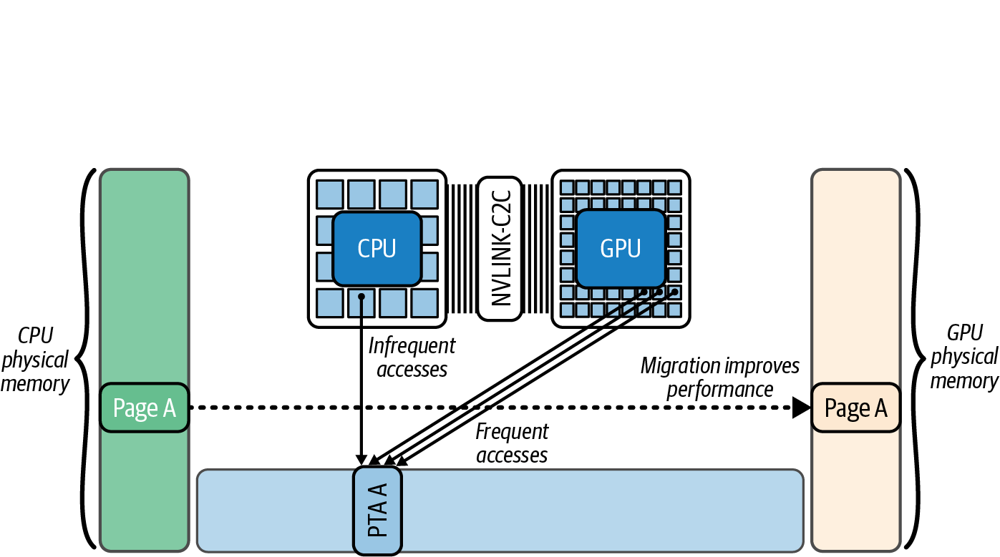

###### Figure 6-16. Automatic page migrations with CPU-GPU Unified Memory

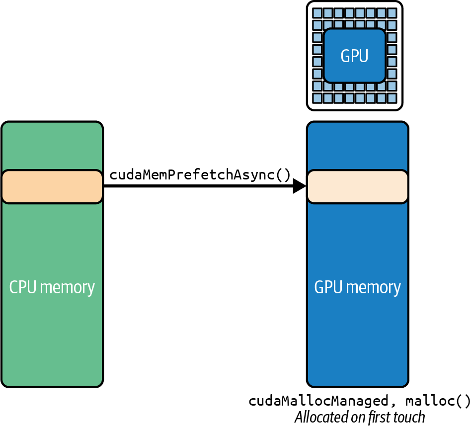

###### Figure 6-17. Streaming data from CPU to GPU over NVLink-C2C with cudaMemPrefetchAsync()

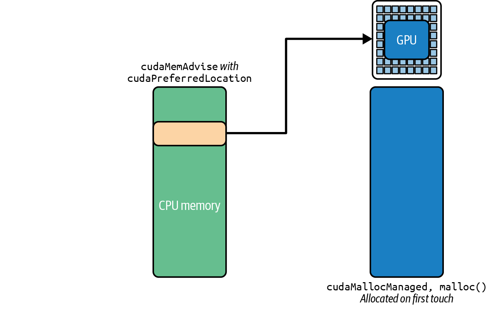

###### Figure 6-18. Specifying “preferred location” to tell the CUDA driver how the data is mostly used (e.g., ReadMostly for largely read-only workloads)

You can also call the following to let a second GPU map those pages without triggering migrations at launch:

```cpp
cudaMemAdvise(ptr, size, cudaMemAdviseSetAccessedBy,
otherGpuId);
```

By default, any CUDA stream or device kernel can trigger a page fault on a managed allocation. This can cause unexpected migrations and implicit synchronizations. If you know a certain buffer will be used only in one stream/GPU at a time, attaching it to that stream allows migrations to overlap with operations in other streams. Calling the following ties that memory range to the specified stream:

```cpp
cudaStreamAttachMemAsync(stream, ptr, 0,
cudaMemAttachSingle);
```

In this case, only operations in that stream will fault and migrate its pages. This prevents other streams from accidentally stalling on it. As such, attaching a range to a particular stream defers its migrations so they overlap with only that stream’s work. This avoids cross-stream synchronization.

In multi-GPU systems without NVLink-C2C, you can also use `cudaMemcpyPeerAsync()` or a prefetch to a specific device to pin data in the nearest NUMA-local GPU memory, preventing slow remote accesses.

In short, explicitly prefetching managed memory and providing memory advice can eliminate most of the “surprise” stalls from Unified Memory. Instead of the GPU pausing to fetch data on demand, the data is already where it needs to be when the kernel runs.

With techniques like proactive prefetching, targeted memory advice, and stream attachment, Unified Memory can deliver performance very close to manual `cudaMemcpy` while preserving the simplicity of a unified address space.[]()[]()[]()[]()[]()[]()

## Maintaining High Occupancy and GPU Utilization

GPUs sustain performance by running many warps concurrently so that when one warp stalls waiting for data, another warp can run. This ability to rapidly switch between warps allows a GPU to hide memory latency. As we described earlier, the fraction of an SM’s capacity actually occupied by active warps is called occupancy.

If occupancy is low (just a few active warps), an SM may sit idle while one warp is waiting on memory. This leads to poor SM utilization. On Blackwell, achieving high occupancy is a bit easier given its large register file (64K registers per SM), which can support many warps without spilling.

As you saw earlier, each thread in a warp can use up to 255 registers. Make sure to use your profiling tools to check achieved occupancy—and adjust your kernel’s block size and register usage accordingly.

Conversely, high occupancy (many active warps per SM) will keep the GPU compute units busy since, while one warp waits on memory access, others will swap in to the SM and execute. This masks the long memory access delays. This is often referred to as hiding latency.

Let’s show an example that improves occupancy and ultimately GPU utilization, throughput, and overall kernel performance. This is one of the most fundamental rules of CUDA performance optimization: launch enough parallel work to fully occupy the GPU.

If your achieved occupancy (the fraction of hardware thread slots in use) is well below the GPU’s limit and performance is poor, the first remedy is to increase parallelism—use more blocks or threads so that occupancy approaches the 80%–100% range on modern GPUs.

Conversely, if occupancy is already moderate to high but the kernel is bottlenecked by memory throughput, pushing it to 100% may not help. You generally need just enough warps to hide latency, and beyond that the bottleneck might lie elsewhere (e.g., memory bandwidth).

To illustrate the impact of occupancy,[]()[]()[]()[]() consider a very simple operation: adding two vectors of length <em>N</em> (computing C = A + B). We’ll examine two kernel implementations: `addSequential` and `addParallel`. `addSequential` uses a single thread (or a single warp) to add all <em>N</em> elements in a loop. `addParallel` uses many threads so that the additions are done concurrently across the array.

In the sequential version, one GPU thread handles the entire workload serially, as shown here:

```cpp
#include <cuda_runtime.h>

const int N = 1'000'000;

// Single thread does all N additions
__global__ void addSequential(const float* A,
const float* B,
float* C,
int N)
{
if (blockIdx.x == 0 && threadIdx.x == 0) {
for (int i = 0; i < N; ++i) {
C[i] = A[i] + B[i];
}
}
}

int main()
{
// Allocate and initialize host
float* h_A = nullptr;
float* h_B = nullptr;
float* h_C = nullptr;
cudaMallocHost(&h_A, N * sizeof(float));
cudaMallocHost(&h_B, N * sizeof(float));
cudaMallocHost(&h_C, N * sizeof(float));

for (int i = 0; i < N; ++i) {
h_A[i] = float(i);
h_B[i] = float(i * 2);
}

// Allocate device
float *d_A, *d_B, *d_C;
cudaMalloc(&d_A, N * sizeof(float));
cudaMalloc(&d_B, N * sizeof(float));
cudaMalloc(&d_C, N * sizeof(float));

// Copy inputs to device
cudaMemcpy(d_A, h_A, N * sizeof(float), cudaMemcpyHostToDevice);
cudaMemcpy(d_B, h_B, N * sizeof(float), cudaMemcpyHostToDevice);

// Launch: one thread
// Note: This kernel assumes <<<1,1>>>
// (one block, one thread).
// Do not change the launch config when running this example.
addSequential<<<1,1>>>(d_A, d_B, d_C, N);

// Ensure completion before exit
cudaDeviceSynchronize();

// Copy d_C => h_C (back to host)
cudaMemcpy(h_C, d_C, N * sizeof(float), cudaMemcpyDeviceToHost);

// Cleanup
cudaFree(d_A);
cudaFree(d_B);
cudaFree(d_C);
cudaFreeHost(h_A);
cudaFreeHost(h_B);
cudaFreeHost(h_C);

return 0;
}
```

In this single-threaded version, the GPU’s vast resources are mostly idle. Only one warp, or even one thread within the warp, is doing work while all others sit idle. The result is very poor occupancy and, ultimately, low performance.

One must be also careful to avoid indirectly executing inefficient GPU code in high-level libraries and frameworks like PyTorch. For instance, the naive PyTorch code that follows mistakenly performs elementwise operations using a Python for-loop that issues N separate add operations on the GPU one after another:

```python
import torch

N = 1_000_000
A = torch.arange(N, dtype=torch.float32, device='cuda')
B = 2 * A
C = torch.empty_like(A)

# Ensure all previous work is done
torch.cuda.synchronize()

# Naive, Sequential GPU operations - DO NOT DO THIS
with torch.inference_mode(): # avoids unnecessary autograd graph construction
# This launches N tiny GPU operations serially
for i in range(N):
C[i] = A[i] + B[i]

torch.cuda.synchronize()
```

This code effectively uses the GPU like a scalar, nonparallel processor. It achieves very low occupancy similar to the previous native `addSequential` CUDA C++ code.

Let’s optimize the CUDA kernel and PyTorch code to implement a parallel version of the vector add operation. Figure 6-19 shows how a vectorized add operation works.

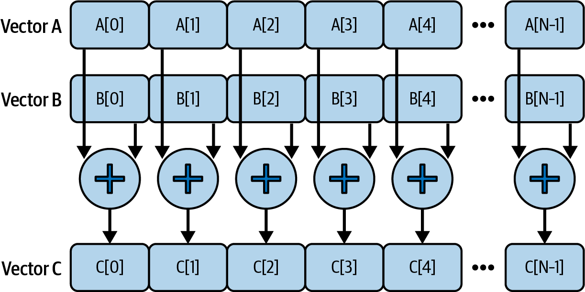

###### Figure 6-19. Vectorized addition operating happening in parallel across elements in the vectors

In the following CUDA C++ code, we launch enough threads to cover all elements (`<<< (N+255)/256, 256 >>>`) so that 256 threads per block process <em>N</em> elements in parallel across however many blocks are needed:

```cpp
#include <cuda_runtime.h>

const int N = 1'000'000;

// One thread per element
__global__ void addParallel(const float* __restrict__ A,
const float* __restrict__ B,
float* __restrict__ C,
int N)
{
int idx = blockIdx.x * blockDim.x + threadIdx.x;
if (idx < N) {
C[idx] = A[idx] + B[idx];
}
}

int main()
{
// Allocate and initialize host (pinned for faster DMA)
float* h_A = nullptr;
float* h_B = nullptr;
float* h_C = nullptr;
cudaMallocHost(&h_A, N * sizeof(float));
cudaMallocHost(&h_B, N * sizeof(float));
cudaMallocHost(&h_C, N * sizeof(float));
for (int i = 0; i *lt; N; ++i) { h_A[i] = float(i); h_B[i] = float(2*i); }

// Create a non-blocking stream and allocate device buffers
cudaStream_t s; cudaStreamCreateWithFlags(&s, cudaStreamNonBlocking);
float *d_A = nullptr, *d_B = nullptr, *d_C = nullptr;
cudaMallocAsync(&d_A, N * sizeof(float), s);
cudaMallocAsync(&d_B, N * sizeof(float), s);
cudaMallocAsync(&d_C, N * sizeof(float), s);

// Async HtoD copies on the same stream
cudaMemcpyAsync(d_A, h_A, N*sizeof(float), cudaMemcpyHostToDevice, s);
cudaMemcpyAsync(d_B, h_B, N*sizeof(float), cudaMemcpyHostToDevice, s);

// Launch (same stream)
int threads = 256;
int blocks = (N + threads - 1) / threads;
addParallel<<<blocks, threads, 0, s>>>(d_A, d_B, d_C, N);

// Async DtoH copy and stream sync
cudaMemcpyAsync(h_C, d_C, N*sizeof(float), cudaMemcpyDeviceToHost, s);
cudaStreamSynchronize(s);

// Cleanup (stream-ordered free)
cudaFreeAsync(d_A, s); cudaFreeAsync(d_B, s); cudaFreeAsync(d_C, s);
cudaStreamDestroy(s);
cudaFreeHost(h_A); cudaFreeHost(h_B); cudaFreeHost(h_C);
return 0;
}
```

With a sufficiently large <em>N</em>, the difference in GPU utilization is significant. Now let’s optimize the PyTorch code, which launches a single vectorized kernel (`A + B`) that engages many threads on the GPU concurrently like the previous optimized `addParallel` CUDA C++ example. Here is the parallel version of the PyTorch code:

```python
# add_parallel.py
import torch

N = 1_000_000
A = torch.arange(N, dtype=torch.float32, device='cuda')
B = 2 * A

torch.cuda.synchronize()

# Proper parallel approach using vectorized operation
# Launches a single GPU kernel that adds all elements in parallel
C = A + B

torch.cuda.synchronize()
```

In practice, high-level frameworks like PyTorch will do the right thing when you use vectorized tensor operations. Just be aware that introducing Python-level loops around GPU operations will serialize work and negatively impact performance. Avoid them if possible. Unless you are writing something novel, there is almost always an optimized PyTorch-native implementation available—including code emitted by the PyTorch compiler.

To quantify the performance impact[]()[]() of using a parallel versus sequential implementation, we can use Nsight Systems and Nsight Compute to measure the total kernel execution time, GPU utilization, occupancy, and warp execution efficiency metrics for the two approaches. Here are the Nsight Systems (`nsys`) and Nsight Compute (`ncu`) commands:

```python
# Sequential add
nsys profile \
--stats=true \
-t cuda,nvtx \
-o sequential_nsys_report \
./add_sequential.py

ncu \
--section SpeedOfLight \
--metrics
sm__warps_active.avg.pct_of_peak_sustained_active,gpu__time_duration.avg \
--target-processes all \
--print-summary per-gpu \
-o sequential_ncu_report \
./add_sequential.py

# Parallel add
nsys profile \
--stats=true \
-t cuda,nvtx \
-o parallel_nsys_report \
./add_parallel.py

ncu \
--section SpeedOfLight \
--metrics sm__warps_active.avg.pct_of_peak_sustained_active \
--target-processes all \
--print-summary per-gpu \
-o parallel_ncu_report \
./add_parallel.py
```

We use `nsys` to uncover where the time is spent and whether the GPU is starved or blocked. Then we use `ncu` to explain why the kernel is performing the way it <span class="keep-together">is—perhaps</span> due to poor occupancy, etc.

If you run only `nsys`, you may miss fine-grained kernel inefficiencies. And if run you only `ncu`, you won’t know if your kernels are being fed data fast enough, for example. [Table 6-6](https://learning.oreilly.com/library/view/ai-systems-performance/9798341627772/ch06.html#ch06_table_6_1757308039130184) shows the unified results.

Other profiling tools may label these metrics differently. For example, Nsight Systems reports overall “GPU Utilization,” while Nsight Compute provides a per-kernel “SM Active %” metric—but both reflect how fully the GPU’s SMs were occupied by active warps.

As expected, moving from a single-thread, single-warp implementation to a fully parallel, multiwarp implementation improves occupancy from 1.3% to ~38.7% on average. This reduces the runtime by about 22× from 48.21 ms down to 2.17 ms.

In the sequential case, only one warp, and just one thread, is doing work on a single SM. This is why we see a low 1.5% GPU utilization, whereas in the parallel case, many SMs are running multiple active warps. This increases warp execution efficiency from 3.1% to 100% since all 32 threads in a warp are doing useful work during each instruction. This improves GPU utilization from 1.5% to 95%.

This example shows why sufficient parallelism is critical on GPUs. No matter how fast each thread is, you need lots of threads to leverage the GPU’s throughput potential.

Remember that the GPU is a throughput-optimized processor that interacts with CPUs to launch the CUDA kernel—as well as the memory subsystem to load data from caches, shared memory, and global memory. As such, GPU performance greatly benefits from hiding these latencies.

When written properly, kernels will instruct the GPU to interleave memory loads and computations (e.g., additions) from different warps in parallel. This helps to hide memory latency across the warps.

The parallel kernel running within multiple warps, in particular, benefits from warp-level latency hiding. While one warp is waiting for a memory load, another warp can be executing the add computation, while yet another could be fetching the next data, etc. We’ll explore many techniques to hide memory latency in the upcoming chapters.

In the sequential kernel, there are no other warps to run while one is waiting, so the hardware pipelines often sit idle. The timeline is one long series of operations with idle gaps during memory waits. In the parallel version, those gaps are filled by other warps’ work, so the GPU is busy continuously. The comparison is shown in Figure 6-20.

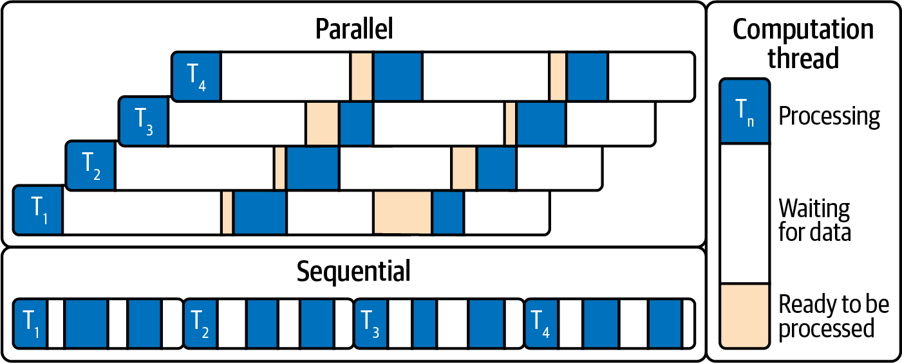

###### Figure 6-20. Parallel versus sequential timeline comparison

Here, the sequential timeline is one long series of operations with idle gaps during memory waits. In the parallel version, those gaps are filled by other warps’ work, so the GPU is busy continuously.

The key takeaway is to first ensure enough parallel work to fully occupy the GPU. High occupancy—enough warps to cover latency—maximizes throughput and minimizes idle stalls—in our example, parallelizing boosted GPU utilization to ~95%.

Once sufficient threads are launched, the next step is optimizing how efficiently each warp executes, through instruction-level parallelism and other per-thread improvements. But note: even at 100% occupancy, performance can still suffer if the workload is memory bound—that is, limited by slow memory access rather than compute.

A well-known example of a memory bound workload is the “decode” phase of an LLM. During decode, the LLM needs to move a large amount of data (model weights or parameters) from global HBM memory into the GPU registers and shared memory.

Since modern LLMs contain hundreds of billions of parameters (multiplied by, let’s say, 8 bits per parameter, or 1 byte), the models can be many hundreds of gigabytes in size. Moving this much data in and out of the GPU can easily saturate the memory bandwidth.

GPU FLOPS are outpacing memory bandwidth. For instance, Blackwell’s HBM3e delivers ~8 TB/s, but compute capability and model sizes are growing even faster. As such, optimizing memory movement is absolutely critical to avoid memory‐bound bottlenecks in modern AI workloads.

## Tuning Occupancy with Launch Bounds

In some cases, simply using[]()[]()[]()[]()[]()[]()[]()[]()[]()[]()[]()[]()[]()[]() more threads isn’t enough—especially if each thread uses a lot of resources such as registers and shared memory. We can guide the compiler to optimize for occupancy by using CUDA’s `__launch_bounds__` kernel annotation.

This annotation lets us specify two parameters for a kernel at compile time: a maximum number of threads per block we will launch and minimum number of thread blocks we want to keep resident on each SM. These hints influence the compiler’s register allocation and inlining decisions. An example is shown here:

```cpp
__global__ __launch_bounds__(256, 16)
void myKernel(...) { /* ... */ }
```

Here, `__launch_bounds__(256, 16)` promises that the CUDA kernel will never be launched with more than 256 threads in a block. It also requests that the compiler allocate enough registers and inline functions so that at least 16 blocks of 256 threads, or 4,096 threads (16 blocks × 256 threads per block), can be resident on the SM simultaneously.

Remember that we can have only 1,024 threads per block and at most 2,048 resident threads per SM on modern GPUs (e.g., Blackwell).

In practice, since current NVIDIA GPUs limit each SM to 2,048 total threads and each block to 1,024 threads, the compiler will reduce your request to the hardware maximum—in this case, 2,048 threads (8 blocks × 256 threads per block) per SM. And it will emit a warning since the 4,096 request (16 blocks × 256 threads per block) exceeds the SM’s capacity.

The warning will be something like “ptxas warning: Value of threads per SM…is out of range. `.minnctapersm` will be ignored.”

In practice, using `__launch_bounds__` often causes the compiler to cap per-thread register usage (and to sometimes restrict unrolling or inlining) to avoid spilling and to allow higher occupancy. We are essentially trading a bit of per-thread performance and not using every last register or unrolling to the max. This is in exchange for more consistent warp throughput by keeping more warps in flight.

Increasing occupancy must be balanced against per-thread resources. You want to avoid register spilling (which occurs if you force too many threads such that they run out of registers and spill to local memory, causing slow memory accesses).

You can also determine an optimal launch configuration at runtime using the CUDA Occupancy API. For example, `cudaOccupancyMaxPotentialBlockSize()` will calculate the block size that produces the highest occupancy for a given kernel, considering its register and shared memory usage. Essentially, `cudaOccupancyMaxPotentialBlockSize` can autotune your block size for optimal occupancy, as shown here:

```cpp
int minGridSize = 0, bestBlockSize = 0;

// If your kernel uses dynamic shared memory (extern __shared__),
// set this correctly:
size_t dynSmemBytes = /* bytes per block (e.g., tiles * sizeof(T)) */ 0;

cudaOccupancyMaxPotentialBlockSize(
&minGridSize, &bestBlockSize,
myKernel,
dynSmemBytes, // must match your kernel's dynamic shared memory use
/* blockSizeLimit = */ 0);

// Compute a grid that covers N, but don't go below the min grid
// that saturates occupancy
int gridSize = std::max(minGridSize, (N + bestBlockSize - 1) / bestBlockSize);

myKernel<<<gridSize, bestBlockSize, dynSmemBytes>>>(...);
```

This API computes how many threads per block would likely optimize occupancy given the kernel’s resource usage. We can then use `bestBlockSize` (and the suggested grid size) for our kernel launch. It’s important to note that `minGridSize` is the minimum grid size that saturates occupancy for this kernel on this device. It is not necessarily the right grid size to cover an input of length N. Compute `gridSize = max(minGridSize, ceil_div(N, bestBlockSize))`, and pass the kernel’s actual dynamic shared-memory bytes if it uses extern `__shared__`.

Validate Occupancy API suggestions by timing kernels at ±1–2 candidate block sizes. Register pressure and L2 behavior on modern GPUs can actually make a slightly sub-maximal occupancy configuration faster in practice.

When applied, the compiler’s heuristics are usually good, but `__launch_bounds__` and occupancy calculators give you explicit control when needed. Use them when you <em>know</em> your kernel can trade some per-thread resource usage for more active warps. This helps prevent underoccupying SMs due to heavy threads.

The trade-off between registers and occupancy is important. Using fewer registers per thread—or capping them using launch bounds—allows more warps to be resident, which improves latency hiding. However, using too few registers can force the compiler to spill data to local memory, hurting performance. Finding the sweet spot often requires experimentation. Nsight Compute’s “Registers Per Thread” and “Occupancy” metrics can guide you here.

# Debugging Functional Correctness with NVIDIA Compute Sanitizer

Since CUDA applications can spawn thousands of threads per kernel, traditional debugging may fail to catch subtle memory bugs and race conditions. NVIDIA Compute Sanitizer, a functional-correctness suite included with the CUDA Toolkit, addresses these challenges by instrumenting code at runtime to find errors early in development. This reduces debugging interactions—and improves overall code reliability.

Sanitizer is invoked using[]()[]()[]()[]()[]()[]()[]() the `compute-sanitizer` CLI and supports NVIDIA Tools Extension (NVTX) annotations for finer-grained analysis. NVTX should be used extensively for both correctness and performance analysis. To use the CLI, you can specify options with `--option value` and include flags like `--error-exitcode` to fail on errors. You can also apply filters to sanitize only specific kernels, such as using <span class="keep-together"><code>--kernel-name</code></span> and `--kernel-name-exclude`. You can enable NVTX with `--nvtx yes` to help narrow the scope of your analysis and minimize false positives in memory-leak reports, for instance:

```shell
compute-sanitizer [--tool toolname] [options] <application> [app_args]
```

It’s recommended to integrate[]() Compute Sanitizer into your continuous integration (CI) pipelines with `--error-exitcode` to catch correctness regressions using kernel filters and NVTX region annotations.

Compute Sanitizer consists of four primary tools: memcheck, racecheck, initcheck, and synccheck. These help detect out-of-bounds memory accesses, data races, uninitialized memory reads, and synchronization issues in your CUDA code:

The memcheck tool precisely detects and attributes out-of-bounds or misaligned accesses in global, local, and shared memory; reports GPU hardware exceptions; and can identify device-side memory leaks. It supports additional checks such as `--check-device-heap` for heap allocations using command-line switches.

Racecheck reports shared-memory data hazards, including Write-After-Write, Write-After-Read, and Read-After-Write, which can lead to nondeterministic behavior. Racecheck helps developers verify correct thread-to-thread communication within warps and thread blocks.

Initcheck flags any access to uninitialized device global memory. This can be due to missing host-to-device copies or skipped device-side writes. This tool helps avoid subtle bugs that arise from stale or garbage data.

Synccheck detects invalid uses of synchronization primitives such as mismatched barriers. It identifies thread-ordering hazards that can cause deadlocks and inconsistent state across threads.

In short, NVIDIA Compute Sanitizer provides a set of tools for uncovering and resolving memory, race, initialization, and synchronization bugs in CUDA applications. These tools, when integrated with CI systems, can help developers find correctness issues early. This way, they can ship reliable, high-performance code with confidence.

# Roofline Model: Compute-Bound or Memory-Bound Workloads

A roofline model is a useful visualization that charts two hardware-imposed performance ceilings: one horizontal line at the processor’s peak floating-point rate and one diagonal line set by the peak memory bandwidth. Together, these form a “roofline” envelope that reveals whether a given kernel is limited by computation (compute bound) or data movement (memory bound).

Where these lines intersect is called the ridge point. This corresponds to the “arithmetic intensity” threshold at which a kernel transitions from being memory bound (left of the ridge) to compute bound (right of the ridge). Arithmetic intensity is measured as the number of FLOPS performed per byte transferred between off-chip global memory and the GPU.

Let’s consider a simple example to illustrate why arithmetic intensity matters. Suppose a kernel loads two 32-bit floats (8 bytes total), adds them (1 FLOP), and writes back one 32-bit float result (4 bytes). In this case, the algorithm carries out 1 FLOP for 12 bytes of memory traffic, yielding an arithmetic intensity of 0.083 FLOPs/byte (1 FLOP/12 bytes ≈ 0.083 FLOPs per byte).

Compare this to a GPU’s ridge point of 10 FLOPs per byte (10 FLOPs = ~80 TFLOPs ÷ 8 TB/s). This float-add kernel’s ridge point of 0.083 is orders of magnitude to the left (memory-bound side) of the roofline. This is more than 100× below that threshold, so it cannot keep the arithmetic logic units (ALUs) busy. This kernel is in the memory-bound regime, where performance is dominated by memory stalls rather than compute. Figure 6-21 shows a representative of the roofline model for Blackwell, including peak compute performance (horizontal line at ~80 FLOPs/sec) and peak memory bandwidth (diagonal line corresponding to 8 TB/s).

Here, we see that the ridge point for the Blackwell GPU is the sustained FLOPs/sec divided by the sustained HBM bandwidth. Here, it’s the intersection point shown at 10 FLOPs/byte. Our example kernel’s arithmetic intensity is to the left along the slanted, memory-bandwidth diagonal at 0.083 FLOPs/byte. As such, this kernel lies on the slanted, memory-bandwidth ceiling of the roofline. This confirms that it is memory bound.

To make this kernel less memory bound (and thus more compute bound), you can increase its arithmetic intensity by doing more work per byte of data. This will move the kernel to the right, which pushes performance up toward the compute roofline.

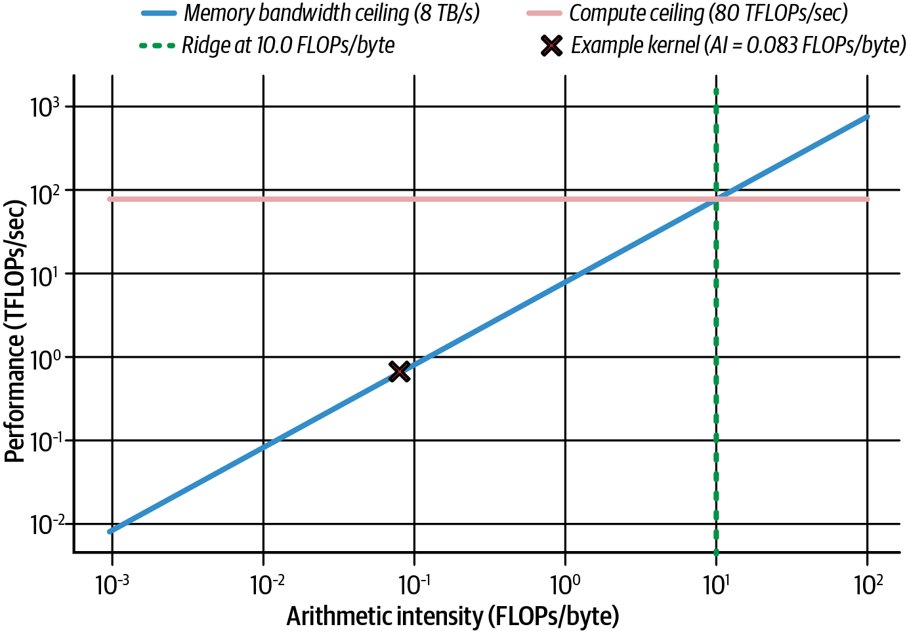

###### Figure 6-21. Roofline model for a Blackwell-class GPU (~80 TFLOPs/sec FP32, ~8 TB/s HBM3e) showing our kernel’s point and the ~10 FLOPs/byte arithmetic intensity ridge

One simple way to make the kernel less memory bound is to use lower-precision data. For instance, if you used 16-bit floats (FP16) instead of 32-bit (FP32), you’d halve the bytes transferred per operation and instantly double the FLOPs/byte intensity.

Modern GPUs also support dedicated 8-bit floating point (FP8) Tensor Cores. Blackwell also introduced native support for 4-bit floating point (FP4) Tensor Cores for certain AI workloads. These further reduce the bytes per operation and increase the FLOPs/byte intensity even more.

For example, Blackwell supports FP8 Tensor Cores (1 byte per value), which doubles throughput and halves memory use relative to FP16. It also supports FP4 (half a byte per value) for some workloads like model inference.

A single 128-byte memory transaction can carry 32 FP32, 64 FP16, 128 FP8, or 256 FP4 values. Blackwell introduces hardware decompression to accelerate compressed model weights. For instance, models can be stored compressed in HBM, even beyond FP4 compression, and the hardware can decompress the weights on the fly. This effectively increases the usable memory bandwidth further when reading those weights.

As such, Blackwell has an architecture advantage for memory-bound workloads like transformer-based token generation. Weights are stored in a compressed 4-bit or 2-bit scheme and decompressed by hardware at load time and cast to FP16/FP32 for higher-precision aggregations and computations. This shows how lower precision can reduce the amount of data transferred, increase arithmetic intensity for your kernel, and improve overall memory throughput for your workload.

For memory-bound workloads, the goal is to push the kernel’s operational point to the right on the roofline to increase its arithmetic intensity and move closer to becoming compute bound. By moving closer to the compute-bound regime, your kernel can better exploit the GPU’s full floating-point horsepower.

Transformer-based models (e.g., LLMs) can be both compute bound and memory bound in different phases. For example, attention layers (prefill phase) are typically compute bound, while matrix multiplications (decode phase) are often memory bound. We will discuss this more in Chapters 15–18 when we dive deep into inference.

When a kernel is memory bound, Nsight Compute will report very high DRAM bandwidth utilization alongside low achieved compute metrics such as low ALU utilization. This indicates that warps spend most of their time stalled on memory accesses.

To drill into what’s happening, it’s best to use Nsight Compute for per-kernel counters, including latencies, cache hit rates, and warp issue stalls. In addition, modern versions of Nsight Compute have range replay (with instruction-level source metrics), improved source correlation navigation, and a launch-stack size metric. These features help diagnose dependency stalls, register pressure, and launch configuration effects more quickly.

You can then use Nsight Systems for a holistic timeline view showing GPU idle gaps, overlap with CPU work, and PCIe/NVLink transfers. Together they give you both the why (which stalls and which resources) and the when (how those stalls fit into your application’s overall execution.)

The key is to iteratively profile and identify memory hotspots using metrics from both Nsight Compute and Nsight Systems. You should add NVTX ranges around suspect code, zoom in on timeline behavior, and use the feedback to optimize.

For instance, you can use NVTX to label regions as “memory copy” or “kernel execution” and see them in the Nsight Systems timeline. This is incredibly useful to confirm overlapping host-device transfers with compute, as discussed earlier.

For instance, to verify the overlap, you can mark the start/end of both the data transfer and kernel calls with NVTX markers. Nsight Systems will show these NVTX ranges on a timeline, making it easy to see overlap. With asynchronous memory copies (`cudaMemcpyAsync`), the data transfer overlaps with kernel execution on the GPU (see [Figure 6-22](https://learning.oreilly.com/library/view/ai-systems-performance/9798341627772/ch06.html#ch06_figure_22_1757308039123878)), comparing a synchronous and asynchronous memory <span class="keep-together">transfer</span>.

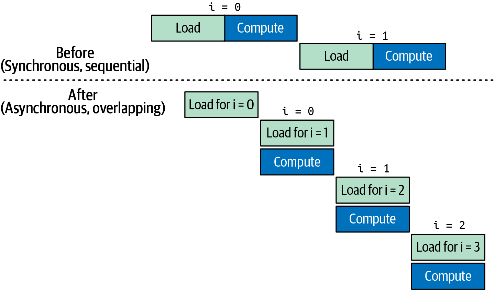

###### Figure 6-22. Synchronous (sequential) and asynchronous (overlapping) data transfers with kernel computations

If you expect overlap but see the copies and kernels running sequentially versus parallel, then it’s something like an unwanted default-stream synchronization. Otherwise, a missing pinned-memory buffer is likely preventing true overlap.

Without using pinned (page-locked) memory, the `cudaMemcpy​A⁠sync` transfer cannot overlap with kernel execution. This is a common performance issue.

When you suspect a kernel is starved for data, start by running it under Nsight Compute and Nsight Systems. In Nsight Compute you’ll see the global load efficiency metric drop. This signals that your DRAM requests aren’t being satisfied quickly enough. At the same time, the Nsight Systems timeline will reveal idle stretches between kernel launches as the GPU waits on data transfers.

Once you’ve applied the memory-hierarchy optimizations from this chapter, those idle gaps will all but disappear, and Nsight Compute will show memory pipe utilization percentage climbing toward its peak. You’ll also see a corresponding jump in end-to-end kernel throughput.

Always measure after each change. Profiling tools will confirm if an optimization actually reduces memory stalls or not.

# Key Takeaways

In this chapter, you learned how to choose launch parameters that optimize occupancy, manage GPU memory asynchronously, and apply roofline analysis to distinguish compute-bound from memory-bound kernels. Here are some key takeaways worth reviewing:

GPUs execute threads in warps (32 threads) under the single-instruction, multiple thread (SIMT) model, with each warp issuing instructions in lockstep. High occupancy—keeping many warps in flight—hides memory and pipeline latency.

Threads are grouped into thread blocks (up to 1,024 threads), and thread blocks form a grid to scale across millions of threads without code changes. Synchronization (`__syncthreads()` or cooperative groups) enables data reuse in shared memory but incurs overhead, so minimize barriers.

Choose block sizes as multiples of 32 to avoid underfilled warps and maximize scheduler utilization. Be mindful of per-SM limits. For Blackwell, the maximum registers per thread is 255, maximum per-SM shared memory is 228 KB, maximum resident warps is 64, and maximum resident thread blocks is 32.

Start with `threadsPerBlock = 256` (8 warps) for a balance of occupancy and resource use; compute `blocksPerGrid = (N + threadsPerBlock – 1) / threadsPerBlock` to cover all elements. Tune these values based on profiling feedback (register/register spilling, shared-memory usage, achieved occupancy).

Prefer `cudaMallocAsync`/`cudaFreeAsync` on dedicated streams and leverage CUDA memory pools to avoid global synchronizations and OS-level overhead. PyTorch’s caching allocator follows a similar [pattern](https://oreil.ly/KyJ2V) for efficient tensor allocations and avoids costly `cudaMalloc()` and `cudaFree()` <span class="keep-together">invocations</span>.

Registers → L1/shared → L2 → global (HBM3e) → host: each level trades capacity for latency/bandwidth. Maximize data reuse in registers and shared/L1 cache.

CUDA Managed Memory (Unified Memory) simplifies programming but can incur implicit page migrations; use `cudaMemPrefetchAsync` and memory advice to avoid surprise stalls.

Arithmetic intensity (FLOPS per byte) determines whether a kernel is memory bound or compute bound. Use lower precision (FP16/FP8/FP4 and hardware decompression) to boost FLOPS/byte ratio and push kernels toward the compute roofline. Profile with Nsight Compute (per-kernel metrics) and Nsight Systems (timeline) to identify and eliminate memory stalls. Using TMEM with Blackwell unified matrix-multiply-accumulate (UMMA) can shift kernels from memory-bound to compute-bound when combined with FP8 and FP4. We’ll cover UMMA in more detail in Chapter 10.

# Conclusion

This chapter has laid the groundwork for high-performance CUDA development by demystifying the GPU’s SIMT model, thread hierarchy, and multilevel memory system. Remember that occupancy, the ratio of active warps to the theoretical GPU maximum, is important for latency hiding.

However, maximizing occupancy does not guarantee best performance in every case. GPUs can often achieve very high throughput at moderate or even low occupancy if threads have sufficient instruction-level parallelism (ILP)—or if other resources are the bottleneck.

While higher occupancy helps to hide latency, there are scenarios in which reducing the number of active threads will free up registers for other threads. This allows more computations per thread—and ultimately boosts throughput. Always benchmark different occupancy levels to find the optimal setting for your workload and hardware.

With these fundamentals and profiling techniques in hand, you’re now ready to dive into targeted optimizations such as avoiding warp divergency, exploiting the GPU memory hierarchy, and asynchronously prefetching memory. We’ll also dive into the TMA, which handles bulk memory transfers and frees up the GPU to focus on useful work and increase computational goodput.

---