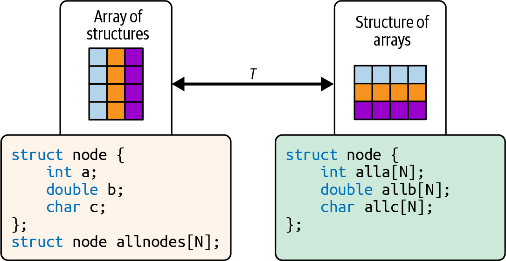
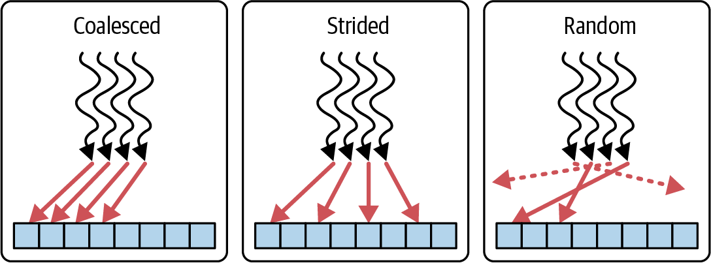
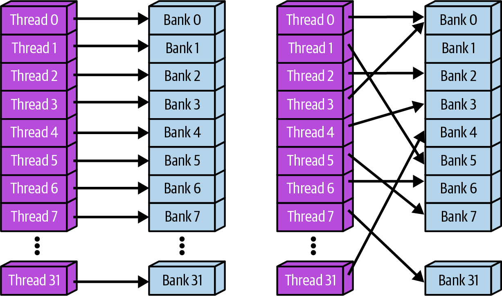
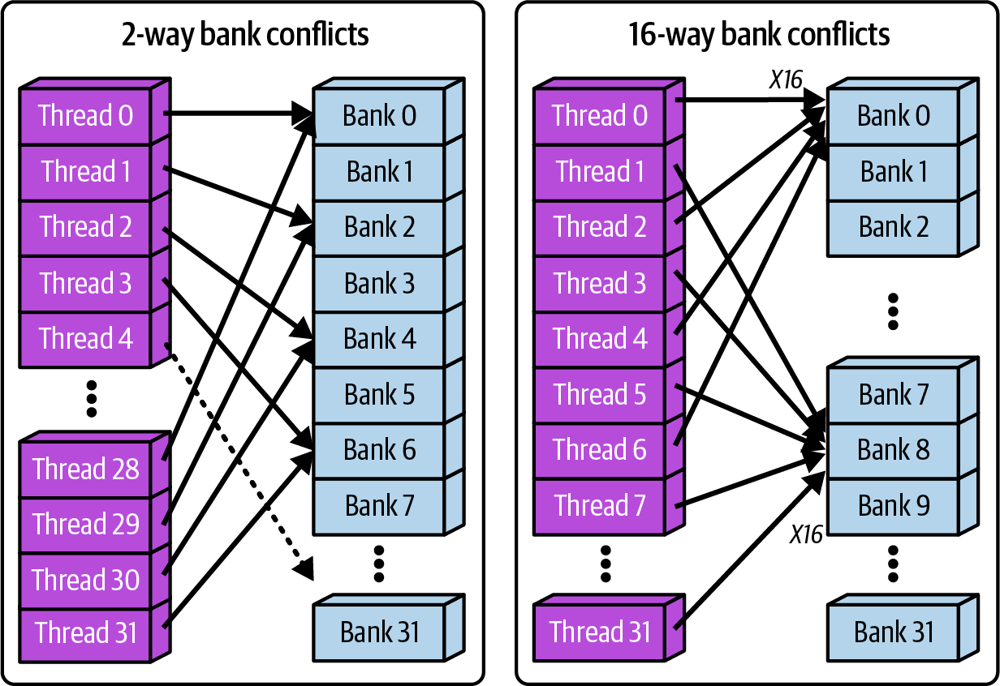
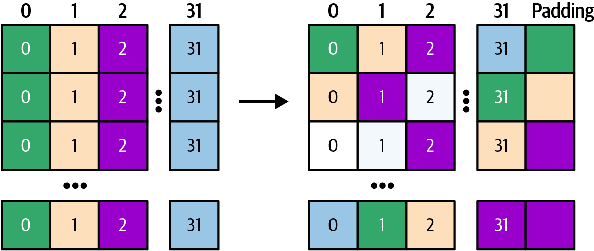
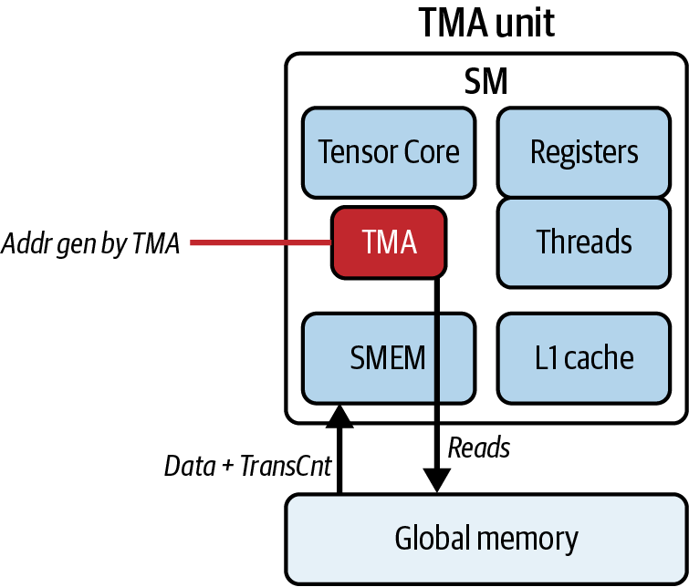

# AI Systems Performance Engineering

*Uploaded by Pedro Valera - AI Specialist*

---

## Chapter 7

# Profiling and Tuning GPU Memory Access Patterns

# Chapter 7. Profiling and Tuning GPU Memory Access Patterns

As AI models grow in size and complexity, a GPU’s memory system often becomes the bottleneck that stands between theoretical compute capability and real-world performance. As you saw in Chapter 6, modern NVIDIA GPUs combine thousands of simple, throughput-optimized cores with specialized Tensor Cores. They also include high-bandwidth memory (HBM), coherent CPU-GPU unified memory address space (e.g., Grace Blackwell Superchip), on-chip shared memory, caches, and specialized direct memory access (DMA) engines like the Tensor Memory Accelerator (TMA).

In this chapter, you’ll see various CUDA C++ and PyTorch optimization techniques to align data structures for efficient memory access, eliminate redundant data loads, and overlap data transfers with computation using hardware.

Through concrete before-and-after examples of matrix multiplies, tensor operations, and more, you’ll see how small changes in memory access patterns, tiling strategies, and asynchronous data transfers can reduce wasted bandwidth, boost arithmetic efficiency, and transform kernels from memory bound to compute bound.

By the end of this chapter, you’ll know how to write CUDA kernels that can better utilize the GPU’s memory hierarchy and hardware-optimized data transfer engines.

# Coalesced Versus Uncoalesced Global Memory Access

The memory access pattern of your code can greatly impact performance. Global memory accesses are fastest when threads in a warp access contiguous memory addresses that the hardware can combine into fewer, larger transactions. If threads access scattered or misaligned addresses, the device cannot coalesce requests into the minimal number of cache line transactions, which on modern GPUs are 128-byte lines composed of four 32-byte sectors. This results in many more memory transactions retrieving unused data, which quickly eats up memory bandwidth.

On a Blackwell GPU, per-device HBM3e bandwidth is up to 8 TB/s. Within the Grace Blackwell GB200 and GB300 (two GPU superchips), this increases 16 TB/s across both GPUs. Using uncoalesced memory accesses will leave most of this bandwidth unused due to excess memory transactions and stalls.

In the uncoalesced case, each thread in a warp loads from scattered addresses. This results in many separate memory transactions. Even if threads in a warp access consecutive addresses, if the first address isn’t 128-byte aligned, the warp’s request will span two 128-byte cache lines.

For example, if a warp’s first thread starts at an address that isn’t 128-byte aligned, the warp’s memory request will cross a cache-line boundary, often resulting in two 128-byte transactions instead of one. In that case the warp may fetch an extra sector beyond the optimal four sectors, for a total of five sectors across the two lines. This is a waste of bandwidth. Whether a misaligned, contiguous 128-byte warp load touches 5× 32 B sectors or 8× 32 B sectors depends on the start offset. Aligned accesses keep it to 4× 32 B sectors.

In the coalesced case, however, threads load from consecutive addresses combined into a single wide transaction. Figure 7-1 compares coalesced and uncoalesced memory access.


###### Figure 7-1. Comparing coalesced versus uncoalesced memory access pattern

In kernel code, this problem typically appears as strided or irregular indexing such that each thread reaches into different cache lines. When a kernel’s threads fetch data with strided or irregular indices, the GPU issues many small, uncoalesced global‐memory transactions rather than a handful of full‐width loads.

In Nsight Compute, the Memory Workload Analysis section will show lower Global Memory Load Efficiency, higher DRAM sector read counts, and average sectors per request above 4.0 when uncoalesced patterns are present. This is because more sectors are being fetched than a properly coalesced memory access pattern, and it indicates that you’re wasting bandwidth by fetching mostly unused bytes. And DRAM throughput percentage will remain well below peak. This confirms that your warp is spending cycles stalled on memory rather than driving the ALUs.

To break out of this memory‐bound regime, you can reorganize your data so that each warp’s 32 threads load contiguous elements. Either index the array with `input[idx]` where `idx = blockIdx.x * blockDim.x + threadIdx.x` or switch to a structure‐of‐arrays (SoA) layout so that thread `i` always touches element `i`. The difference between an array of structures (AoS) and an SoA is shown in [Figure 7-2](https://learning.oreilly.com/library/view/ai-systems-performance/9798341627772/ch07.html#ch07_figure_2_1757308047295166).



###### Figure 7-2. Array of structures (AoS) versus structure of arrays (SoA)

Once you make the change, the hardware will automatically combine the warp’s global memory loads into fewer, wider transactions with more usable (less wasted) data being returned. The Nsight Compute counters will immediately show improvement.

Let’s demonstrate this with an example. The following before-and-after code demonstrates how restructuring global memory accesses from a strided pattern to a contiguous pattern produces a significant performance gain.

Before example (C++): uncoalesced strided access. In this example, each thread copies from an input array with a stride of 2, causing misaligned memory accesses:

```cpp
#include <cuda_runtime.h>
#include <iostream>

__global__ void uncoalescedCopy(const float* __restrict__ in,
float* __restrict__ out,
int N, int stride) {
// n = 1048576, stride = 2
int idx = blockIdx.x * blockDim.x + threadIdx.x;
if (idx < N) {
// Loads from in[] with a stride, causing
// multiple memory segments to be fetched
out[idx] = in[idx * stride];
}
}

int main() {
const int N = 1 << 20;
const int stride = 2;

float* h_in = nullptr;
float* h_out = nullptr;
cudaMallocHost(&h_in, N * stride * sizeof(float));
cudaMallocHost(&h_out, N * sizeof(float));

for (int i = 0; i < N * stride; ++i) {
h_in[i] = static_cast<float>(i);
}

float *d_in, *d_out;
cudaMalloc(&d_in, N * stride * sizeof(float));
cudaMalloc(&d_out, N * sizeof(float));
cudaMemcpy(d_in, h_in, N * stride * sizeof(float),
cudaMemcpyHostToDevice);

// Number of threads per block (multiple of 32)
const int threadsPerBlock = 256;

// Number of blocks per grid
const int blocksPerGrid = (N + threadsPerBlock - 1) /
threadsPerBlock;

uncoalescedCopy<<<blocksPerGrid,
threadsPerBlock>>>(d_in, d_out, N, stride);
cudaDeviceSynchronize();

cudaFree(d_in);
cudaFree(d_out);
cudaFreeHost(h_in);
cudaFreeHost(h_out);
return 0;
}
```

The CUDA C++ kernel issues global memory loads at addresses separated by a stride > 1, which is, by definition, noncontiguous. This causes each warp to generate multiple small transactions instead of a single wide transaction.

Before example (PyTorch). In PyTorch, an analogous situation can be created using a strided index for a gather operation:

```python
import torch

def uncoalesced_copy(input_tensor, stride):
# Flatten to 1D so we know exactly
# which dimension we're indexing
flat_tensor = input_tensor.contiguous().view(-1)

# Generate indices with a fixed stride to gather
assert flat_tensor.numel() % stride == 0,"stride must divide tensor length"
idx = torch.arange(0, flat_tensor.numel(), stride,
device=flat_tensor.device, dtype=torch.long)
# index_select uses a gather kernel that issues uncoalesced loads
return torch.index_select(flat_tensor, 0, idx)

# Usage
n, stride = 1 << 20, 2
inp = torch.arange(n * stride, device='cuda',
dtype=torch.float32)
out = uncoalesced_copy(inp, stride)
```

This PyTorch snippet uses `torch.index_select` with a strided index pattern, which causes the underlying GPU gather kernel to perform uncoalesced loads. Specifically, a warp of 32 threads will access addresses that are `stride * 4 bytes` apart.

This does not allow a single wide transaction and instead generates 32 separate loads. Each thread loads a value from `inp` that is far apart in memory from the value loaded by the next thread, which prevents coalescing. [Figure 7-3](https://learning.oreilly.com/library/view/ai-systems-performance/9798341627772/ch07.html#ch07_figure_3_1757308047295185) shows the coalesced versus strided access pattern—as well as random access.



###### Figure 7-3. Coalesced, strided, and random memory access patterns

After running the C++ and PyTorch codes on a GPU, we measure performance metrics. In the uncoalesced version, each warp’s memory request is broken into 8 separate 32-byte sectors on average. Since each 128-byte cache line fetch is split into 4 separate 32-byte sectors (more on this number 4 in a bit), the access pattern spans two lines per warp to retrieve the 8 separate 32-byte sectors.

In the unoptimized version, each warp’s uncoalesced loads break a single logical request into up to eight separate 32-byte sectors, ballooning transaction counts and starving the memory pipeline. As a result, Nsight Compute reports only about 25% of sustained peak dynamic random-access memory (DRAM) throughput.

Now, let’s optimize this by coalescing the memory accesses and making threads read contiguous elements so each warp issues fewer, larger transactions.

After example (C++): coalesced access. By simply removing the stride (or setting it to 1), each thread copies a contiguous element. This alignment of thread accesses allows the hardware to coalesce memory requests into full 128-byte transactions:

```cpp
#include <cuda_runtime.h>
#include <iostream>

__global__ void coalescedCopy(const float* __restrict__ in,
float* __restrict__ out,
int n) {
int idx = blockIdx.x * blockDim.x + threadIdx.x;
if (idx < n) {
// Contiguous load
// Threads copy neighboring elements
out[idx] = in[idx];
}
}

int main() {
const int n = 1 << 20;
const size_t bytes = n * sizeof(float);

// 1) Allocate pinned host memory
float *h_in = nullptr, *h_out = nullptr;
cudaMallocHost(&h_in, bytes); // page-locked host alloc
cudaMallocHost(&h_out, bytes);

// 2) Initialize input
for (int i = 0; i < n; ++i) {
h_in[i] = static_cast<float>(i);
}

// 3) Allocate device memory
float *d_in = nullptr, *d_out = nullptr;
cudaMalloc(&d_in, bytes);
cudaMalloc(&d_out, bytes);

// 4) Copy to device
cudaMemcpy(d_in, h_in, bytes,
cudaMemcpyHostToDevice);

// 5) Launch kernel
dim3 block(256);
dim3 grid((n + block.x - 1) / block.x);
coalescedCopy<<<grid, block>>>(d_in, d_out, n);
cudaDeviceSynchronize();

// 6) Copy back to host
cudaMemcpy(h_out, d_out, bytes,
cudaMemcpyDeviceToHost);

// 7) Clean up
cudaFree(d_in);
cudaFree(d_out);
cudaFreeHost(h_in);
cudaFreeHost(h_out);

return 0;
}
```

We leave out the coalesced PyTorch implementation for brevity since it’s already built into PyTorch. A coalesced version in PyTorch would simply do something like `out = inp.clone()`. This copies contiguous elements efficiently. In fact, `clone()` on a contiguous tensor uses a vectorized memory copy under the hood, analogous to our coalesced kernel.

You can also use `torch.compile` with the[]() default TorchInductor backend to reduce redundant copies and to fuse adjacent operations when safe. `clone()` is already a device-to-device copy, so it’s typically not fused into a separate custom kernel. Enable autotuning (e.g., `mode="max-autotune"`) to help TorchInductor pick coalesced and vectorized schedules when shapes are stable. We’ll cover the PyTorch compiler in depth in Chapters [13](https://learning.oreilly.com/library/view/ai-systems-performance/9798341627772/ch13.html#ch13_profiling_tuning_and_scaling_pytorch_1757308071445147) and [14](https://learning.oreilly.com/library/view/ai-systems-performance/9798341627772/ch14.html#ch14_pytorch_compiler_openai_triton_and_xla_backends_1757308073265113).

With coalesced access, or no stride, each warp’s threads access adjacent addresses. In this case, the hardware coalesces each warp’s loads into the minimum number of 128-byte transactions—often one 128-byte transaction per warp when the first address is 128-byte aligned, or two if the access straddles a boundary. Table 7-1 shows the dramatic improvements resulting from this optimization.

Note: The numeric values in all metrics tables are illustrative to explain the concepts. For actual benchmark results on different GPU architectures, see the GitHub repository.

After fixing the data layout and coalescing global memory accesses, DRAM throughput rises from 25% to 90% of peak, about 3.6× higher. Kernel execution time improves by about 3.7×, from 4.8 ms to 1.3 ms, as fewer stalls free the SMs to make forward progress.

Global Memory Load Efficiency rises from 23% to 99%, meaning nearly every fetched byte is useful. At the same time, Average Sectors per Request falls to about 4.0.

A value near 4.0 means the warp’s loads are fully coalesced. With the first address 128-byte aligned, all 32 threads map to one 128-byte line. This line has four 32-byte sectors, so the metric reports an average of 4.0 sectors per request.

In the worst case with strided or scattered access, the value can approach 32 because activity is reported in 32-byte sectors at L2. Values above 4.0 indicate uncoalesced or misaligned access. In an unoptimized version, uncoalesced loads can break a single logical access into many sectors per request, approaching the worst case.

Here we are at about 4.0 sectors per request, which indicates that requests map cleanly to 128-byte lines with no unused sectors. With fewer memory stalls, SM Active percent improves from 62% to 99%.

In summary, by aligning each warp’s threads on successive addresses, the GPU’s memory controller can service each warp with a few large transactions instead of dozens of tiny ones. This boosts the Global Memory Load Efficiency (fraction of each transaction that returns useful data) to near 100% and raises SM Active % by keeping warps busy instead of idle.

And with that, you’ve seen how coalescing reshapes your thread-to-address mapping so an entire warp’s loads line up on the GPU’s 128-byte segments. However, even a fully coalesced warp still issues 32 individual 4-byte reads under the hood, one per thread, forcing the hardware to stitch them back together into each 128-byte transaction.

To eliminate that last layer of inefficiency, we turn to vectorized memory access: having each thread fetch a wider, aligned chunk (e.g., a 16-byte `float4`) in a single instruction so that a coalesced warp issues exactly four 128-byte transactions, not 32. Let’s dive into how to pack your per-thread loads into CUDA’s built-in vector types.[]()[]()[]()[]()

# Vectorized Memory Access

While memory coalescing is a[]()[]()[]()[]() runtime hardware optimization on NVIDIA GPUs, vectorized memory access is a compile-time strategy in which each load or store instruction explicitly fetches multiple contiguous elements (e.g., `float4`, or 16 bytes) per thread. This reduces instruction count and eliminates stitching overhead.

Efficient global‐memory access on Blackwell relies on matching your loads to the GPU’s native 128-byte transaction size. When each thread reads only a 4-byte float, a 32-thread warp still has to stitch together 32 4-byte requests to fill one 128-byte line.

In ideal coalesced cases, a warp that reads 32 4-byte words aligned to a 128-byte boundary maps to exactly four 32-byte sectors. Nsight Compute captures this waste in the average sectors per request metric, which can climb well above 4.0 when your accesses are misaligned, strided, or scattered. As such, you’ll see Global Memory Load Efficiency drop as bandwidth goes underutilized.

The fix is to bundle each thread’s work into a larger, naturally aligned vector that maps cleanly onto those 128-byte transactions. CUDA’s built-in `float4` type does exactly that: it packs four 4-byte floats into a 16-byte struct guaranteed by the compiler to be 16-byte aligned. For illustration purposes, it looks something like the following code:

```cpp
// Example of a custom float4 for illustration purposes.
// Note: it's recommended to use the built-in CUDA float4 type.
// Note: if N is not divisible by 4, handle the last N % 4 elements
// (e.g., a short scalar cleanup) or assert divisibility in host code. The
// input and output pointers must be 16-byte aligned for float4 loads/stores.
struct my_float4 {
float x; // 4 bytes
float y; // 4 bytes
float z; // 4 bytes
float w; // 4 bytes
};
```

When all 32 threads in a warp issue a `float4` load, they together fetch 32 × 16 bytes = 512 bytes of contiguous data, which the Blackwell memory controller then splits into exactly four 128-byte transactions (512 bytes ÷ 128 bytes per transaction = 4 transactions). This preserves the ideal 4.0 sectors per 128-byte transaction (discussed earlier re: coalesced memory access) because the warp requests 512 bytes, and the hardware services the request with four aligned 128-byte transactions for a total of 16 sectors, each fully utilized.

Compared to an unaligned or strided case that can inflate sector counts, vectorized `float4` loads reduce per-thread load instructions by 4×. This helps maintain the ideal 4.0 sectors per request when alignment is satisfied.

High-level GPU compilers like the PyTorch compiler can often generate vectorized memory operations when alignment and contiguity requirements are met. You can encourage this behavior by using per-thread tiles that match vector widths. As such, frameworks can usually achieve a similar reduction in memory transactions under the hood. However, it’s still beneficial to align data properly from the start.

As a result of this vectorized memory access optimization, global memory load efficiency increases toward 100%. Sectors per transaction remain at 4.0 when each 128-byte transaction is fully utilized, while the warp issues multiple aligned transactions to serve a wider request.

Vectorized loads reduce the number of memory instructions per byte moved and often increase effective bandwidth. To benefit from vectorized loads, data pointers must be aligned to the vector width. The CUDA runtime and driver allocation functions, such as `cudaMalloc` return device pointers aligned to at least 256 bytes.

The base alignment is sufficient for 16-byte and 32-byte vector alignment at the allocation boundary. Adding an element offset can break alignment if the offset is not a multiple of the vector width. The following cast asserts the intended type to the compiler and assumes the pointer is already correctly aligned:

```cpp
auto ptr4 = reinterpret_cast<const float4*>(ptr);
```

Make sure the pointer value is a multiple of 16 bytes (4 `float`s) before casting. This is because `cudaMalloc()` returns at least 256-byte alignment. Adding an element offset can break alignment if the offset is not a multiple of 4 `float`s. Correct alignment is a precondition for vectorized loads.

With a base address aligned to 32 bytes, each thread reads 32 bytes per iteration, typically compiling into two 16-byte vector load instructions per thread (Hopper) or one 32-byte load instruction (Blackwell). A 32-thread warp therefore requests 1,024 bytes. Each 128-byte cache line comprises four 32-byte sectors. As such, the warp generates eight aligned 128-byte transactions for a total of 32 sectors when accesses are aligned properly. This way, each access falls on a natural boundary and avoids split transactions.

It’s worth noting that CUDA,[]()[]()[]()[]() as of this writing, does not provide a built-in 8-float aggregate CUDA vector type (e.g., eight combined `float32`s) in its `<vec⁠tor_​types.h>`. You can define your own struct of 8 `float` values, then load it as two `float4` values per thread. You would use 32-byte alignment on the type with <span class="keep-together"><code>alignas(32)</code>.</span> This way, the pointer value is a multiple of 32 bytes. Global memory vector instructions on modern GPUs typically load 16 bytes per thread (Hopper) or 32 bytes per thread (Blackwell). In the case of Hopper’s 16 bytes per thread, an 8-float aggregate load will compile into two 16-byte loads per thread to include all 32 bytes. <span class="keep-together">Blackwell,</span> on the other hand, would compile into a single 32-byte load per thread when using proper 32-byte aligned data.

With 32-byte per-thread loads (e.g., 8 floats × 4 bytes per float), a warp moves 1,024 bytes (1,024 bytes = 32 threads per warp × 32 bytes per thread). This typically maps to 8 × 128-byte lines since each line consists of four 32-byte sectors. With 16-byte per-thread loads (e.g., four `float4`s), a warp moves 512 bytes (512 bytes = 32 threads per warp × 16 bytes per thread) or 4 × 128-byte lines. When the base pointer and per-thread stride are naturally aligned, the hardware coalescer combines lane accesses into full lines and avoids split sectors. This type of mechanical sympathy is crucial to achieving peak throughput. Therefore, for 256-bit loads on Blackwell, you should enforce 32-byte alignment to maintain peak performance.

Let’s see an example of scalar versus vectorized memory access in a simple vector copy kernel.

Before example (C++): scalar copy. Each thread copies one float:

```cpp
#include <cuda_runtime.h>

__global__ void copyScalar(
const float* __restrict__ in,
float* __restrict__ out, int N) {
int idx = blockIdx.x * blockDim.x + threadIdx.x;
if (idx < N) {
// Scalar load: 4-byte copy per thread
out[idx] = in[idx];
}
}

int main() {
const int N = 1 << 20;

float* h_in = nullptr;
float* h_out = nullptr;
cudaMallocHost(&h_in, N * sizeof(float));
cudaMallocHost(&h_out, N * sizeof(float));

for (int i = 0; i < N; ++i) h_in[i] = float(i);

float *d_in, *d_out;
cudaMalloc(&d_in, N * sizeof(float));
cudaMalloc(&d_out, N * sizeof(float));
cudaMemcpy(d_in, h_in, N * sizeof(float), cudaMemcpyHostToDevice);

dim3 block(256), grid((N + 255) / 256);
copyScalar<<<grid, block>>>(d_in, d_out, N);
cudaDeviceSynchronize();

cudaFree(d_in); cudaFree(d_out);
cudaFreeHost(h_in);
cudaFreeHost(h_out);
return 0;
}
```

Before example (PyTorch). A scalar elementwise copy in PyTorch could be done with a Python loop for illustration:

```python
import torch

def copy_scalar(inp: torch.Tensor) -> torch.Tensor:
out = torch.empty_like(inp)
flat_in = inp.view(-1)
flat_out = out.view(-1)
for i in range(flat_in.numel()):
# Each iteration issues a 4-byte load on the GPU
# This is extremely slow. DO NOT DO THIS!
# Use vectorized operations to avoid Python loops
# on GPU tensors as shown in optimized version
flat_out[i] = flat_in[i]
return out

# Usage
N = 1 << 20
inp = torch.arange(N, device='cuda', dtype=torch.float32)
out = copy_scalar(inp)
```

With scalar 4-byte loads, a warp often issues one 128-byte transaction for 128 bytes when aligned. Otherwise, it uses two transactions if the access straddles a 128-byte boundary. Using `float4` (16 bytes per thread) means each warp issues 4× more data per memory instruction—512 bytes per warp—split into four 128-byte transactions. This allows the transfer to complete in fewer instructions. Next, let’s optimize by using vector loads.

<em>After example (C++): vectorized copy.</em> Each thread copies a `float4` (16 bytes):

```cpp
#include <cuda_runtime.h>

// 16-byte (128-bit) vector copy: one float4 per thread
static_assert(alignof(float4) == 16, "float4 alignment must be 16 bytes");
__global__ void copyVector16B(const float4* __restrict__ in,
float4* __restrict__ out,
int N4) // number of float4 elements
{
int idx = blockIdx.x * blockDim.x + threadIdx.x;
if (idx < N4) {
// Per-thread 16B load+store.
// On sm_90, NVCC emits ld.global.v4.f32 / st.global.v4.f32.
// for 16-byte vector loads and stores
// On sm_90 (Hopper) (Blackwell), NVCC emits
// ld.global.v8.f32 and st.global.v8.f32 for 32-byte aligned data
out[idx] = in[idx];
}
}

int main() {
const int N = 1 << 20; // total number of floats
const int N4 = N / 4; // total number of float4s (16B chunks)

float4 *d_in = nullptr, *d_out = nullptr;
cudaMalloc(&d_in, N4 * sizeof(float4)); // >=256B aligned
cudaMalloc(&d_out, N4 * sizeof(float4));

dim3 block(256);
dim3 grid((N4 + block.x - 1) / block.x);
copyVector16B<<<grid, block>>>(d_in, d_out, N4);
cudaDeviceSynchronize();

cudaFree(d_in);
cudaFree(d_out);
return 0;
}
```

Here we use CUDA’s built-in `float4` type from <`cuda_runtime.h>`. We launch N/4 threads to maintain 16-byte alignment and issue true vector loads/stores, and each thread copies one `float4` (16 bytes). This means each thread handles four `float`s, and each warp handles 128 floats total in four transactions. `cudaMalloc` returns pointers aligned to at least 256 bytes which satisfies the `float4` (16-byte) requirement and helps with 32-byte aligned vectors when you use 32-byte alignment for the data’s starting address. It’s important to note that misaligned casts can forfeit vectorization. Following is an example that takes advantage of Blackwell’s support for 32-byte vectorized loads:

```cpp
// --- Blackwell-only variant: 32-byte per-thread vector copy
// (PTX: ld.global.v8.f32)
// Requires 32B alignment.
#include <cuda_runtime.h>

// Proof of 32-byte alignment
static_assert(alignof(float8) == 32, "float8 alignment must be 32 bytes");
struct alignas(32) float8 { float v[8]; };

__global__ void copyVector32B(const float8* __restrict__ in,
float8* __restrict__ out, int N8) {
int idx = blockIdx.x * blockDim.x + threadIdx.x;
if (idx < N8) {
// Per-thread 32B load+store
// NVCC emits ld.global.v8.f32/st.global.v8.f32 on sm_100
out[idx] = in[idx];
}
}

int main() {
const int N = 1 << 20;
const int N8 = N / 8;

float8 *d_in, *d_out;
// cudaMalloc returns pointers aligned to ≥256 bytes
// This will allow the compiler to emit
// optimized ld.global.v8.f32 and st.global.v8.f32 instructions
cudaMalloc(&d_in, N8 * sizeof(float8));
cudaMalloc(&d_out, N8 * sizeof(float8));

dim3 block(256), grid((N8 + block.x - 1) / block.x);
copyVector32B<<<grid, block>>>(d_in, d_out, N8);
cudaDeviceSynchronize();

cudaFree(d_in); cudaFree(d_out);
return 0;
}
```

After example (PyTorch). We can simulate vectorized copy by using a tensor view and clone:

```python
import torch

def copy_vectorized(inp: torch.Tensor) -> torch.Tensor:
# Reshape into groups of 4 floats for bulk copy
vec = inp.view(-1, 4)
# clone() on a contiguous CUDA tensor performs a device-to-device copy
# using optimized runtime paths such as cudaMemcpyAsync().

out_vec = vec.clone()
return out_vec.view(-1)

# Usage
N = 1 << 20
inp = torch.arange(N, device='cuda', dtype=torch.float32)
out = copy_vectorized(inp)
```

Calling `clone()` on the reshaped tensor causes PyTorch to perform contiguous copies. This is in contrast to copying element by element. By using `float4` vector loads, each thread moves 16 bytes per instruction, which is optimized for Hopper. (Blackwell supports 32-byte vector loads per thread.) A warp issues 512 bytes for that load, typically split into four 128-byte transactions when aligned. The benefit comes from fewer instructions per byte moved, better sector utilization, and proper alignment to maximize memory throughput on modern GPUs. This shows far better utilization of memory bandwidth, as shown in [Table 7-2](https://learning.oreilly.com/library/view/ai-systems-performance/9798341627772/ch07.html#ch07_table_2_1757308047301312).

Blackwell doubles the number of bytes for vector loads/stores per thread relative to Hopper. With CUDA 13, Blackwell can perform 32-byte vector loads and stores instead of 16 bytes on Hopper. This requires that the compiler can prove 32-byte alignment. Otherwise, it may split the per-thread load/store into two 16-byte instructions. This will increase the number of instructions required to load/store the same amount of data which will negatively impact performance.

By using properly aligned `float4` vector loads, each thread moves 16 bytes per instruction. This shows far better utilization of memory bandwidth, as shown in the results in [Table 7-2](https://learning.oreilly.com/library/view/ai-systems-performance/9798341627772/ch07.html#ch07_table_2_1757308047301312).

These metrics confirm the improvement. Global Memory Load Efficiency jumped from 28% to 97% (~3.5×), and percentage of peak DRAM throughput increased from 25% to 90% (~3.6×), trimming the overall kernel runtime by ~3.5×.

This optimization trimmed the kernel execution runtime by roughly 3.5× from 4.2 ms down to 1.2 ms. Global Memory Load Efficiency jumps from 28% (scalar) to 97% (vectorized), meaning that almost every fetched 128-byte transaction is now used.

The average sectors per request drops toward the 4.0 sector-per-line ideal value. This indicates that each 128-byte line is fully utilized. Each warp-wide `float4` instruction issues four aligned 128-byte transactions to move 512 bytes. As such, every transaction is fully utilized.

The reduction in memory requests and the replacement of four scalar loads with one vector load increase global memory load efficiency from 28% to 97% and raise sustained DRAM throughput from about 25% to about 90% of peak. In this case, warps are doing far fewer memory operations and get more data with each operation, so they spend much less time waiting on memory and more time executing useful work. The end result is a significantly faster kernel.

Vectorization reduces instruction count. Coalescing and alignment improve the number of sectors per request.

Let’s quickly compare coalesced global memory access from the previous section to vectorized memory access discussed here. Coalescing makes sure threads in a warp all hit one big contiguous block. Vectorizing makes sure each thread fetches a wide chunk that exactly maps onto those big blocks. The differences are summarized in Table 7-3.

By combining both strategies, you ensure that warps hit contiguous blocks such that each thread fetches a wide, aligned vector. This helps you push your kernel’s memory bandwidth utilization to its peak and unlock the full power of your GPU.

It’s worth noting that, prior to Blackwell and CUDA 13, global memory vector loads were limited to 16 bytes (128 bits) per thread. However, Blackwell and CUDA 13 added 32-byte (256-bit) load/store instructions and data types for specific vector types with 32-byte alignment.

When available, prefer these wider 32-byte types and instructions for user-defined 8-float aggregates. This will reduce the number of instructions needed to load and store wider 32-byte aligned data.

Custom 8-float aggregates will still compile into two 16-byte loads unless you explicitly use the 32-byte-aligned types that map to a single 32-byte instruction.

Even though a Blackwell thread can load a full 32-byte vector type, the memory coalescer can still only service requests in 128-byte chunks, or four 32-byte sectors. On Blackwell, a 32-thread warp moving 32 B per thread transfers 1024 B (8 × 128 B lines). Hopper’s 16 B/thread variant moves 512 B (4 × 128 B). Note that the transaction count scales with bytes moved. Both are fully efficient when properly aligned: 16-byte (Hopper) or 32-byte (Blackwell and beyond).

# Tiling and Data Reuse Using Shared Memory

A common performance pitfall is repeatedly reading the same data from global memory. Tiling is a technique to avoid this by loading chunks of data into faster on-chip shared memory—and reusing those chunks across many threads.

For example, a naive matrix multiplication of size N × N might load each element of matrix A from HBM N times, once for each row of B it multiplies with. This results in N–1 redundant loads per element. And on Blackwell, which can easily execute tens of teraFLOPS (TFLOPS), redundant loads can waste memory bandwidth, which could otherwise be feeding more math operations to the GPU SMs.

Tiling eliminates this waste by having each thread block pull a small submatrix (a tile) of A and B into shared memory exactly once. It then reuses the cached values across all threads for multiple multiply-accumulate operations. In our next example, we’ll use a 32 × 32 tile, which is a common choice that fits well in shared memory.

Threads within a block can cooperatively[]() load the tile into shared memory, then call `__syncthreads()` to synchronize the data. Then the threads perform parallel matrix-multiply computations using the data in shared memory. This amortizes the global memory access cost over many threads and computations. It’s worth noting that these tile loads are also arranged to be coalesced. Specifically, each warp loads a full 128-byte segment from global memory into shared memory—consistent with the coalescing example from earlier.

By reading each element from DRAM only once (into shared memory) and reusing it for many calculations, we reduce global memory traffic. Let’s illustrate this with an N × N matrix multiplication example. First, consider a naive implementation.

Before example (CUDA C++): naive matrix multiply. Each thread computes one element of the result matrix C, reading entire rows of A and columns of B from global memory for each output:

```cpp
#include <cuda_runtime.h>
#include <iostream>

__global__ void naiveMatMul(const float* A, const float* B, float* C, int N) {
int row = blockIdx.y * blockDim.y + threadIdx.y;
int col = blockIdx.x * blockDim.x + threadIdx.x;
if (row < N && col < N) {
float sum = 0.0f;
for (int k = 0; k < N; ++k) {
// Each thread loads A[row, k] and B[k, col]
// from global memory for every k.
// This is very memory heavy.
sum += A[row * N + k] * B[k * N + col];
}
C[row * N + col] = sum;
}
}

int main() {
const int N = 1024;
size_t bytes = N * N * sizeof(float);

float* h_A = nullptr;
float* h_B = nullptr;
float* h_C = nullptr;
cudaMallocHost(&h_A, N*N * sizeof(float));
cudaMallocHost(&h_B, N*N * sizeof(float));
cudaMallocHost(&h_C, N*N * sizeof(float));

for (int i = 0; i < N*N; ++i) { h_A[i] = 1.0f; h_B[i] = 1.0f; }

float *d_A, *d_B, *d_C;
cudaMalloc(&d_A, bytes);
cudaMalloc(&d_B, bytes);
cudaMalloc(&d_C, bytes);
cudaMemcpy(d_A, h_A, bytes, cudaMemcpyHostToDevice);
cudaMemcpy(d_B, h_B, bytes, cudaMemcpyHostToDevice);

dim3 block(32, 32);
dim3 grid((N + 31) / 32, (N + 31) / 32);
naiveMatMul<<<grid, block>>>(d_A, d_B, d_C, N);
cudaDeviceSynchronize();

cudaFree(d_A);
cudaFree(d_B);
cudaFree(d_C);
cudaFreeHost(h_A);
cudaFreeHost(h_B);
cudaFreeHost(h_C);
return 0;
}
```

This CUDA C++ kernel issues global memory loads for every multiplication inside the inner loop. Each thread reads `A[row, k]` and `B[k, col]` from DRAM for every <em>k</em>, causing massive redundant traffic. The result is a heavily memory-bound kernel with low SM utilization and frequent stalls waiting on global memory. Here is the PyTorch version of the naive matrix multiplication:

```python
import torch

def naive_matmul(A, B):
N = A.size(0)
C = torch.zeros((N, N), device='cuda')
for i in range(N):
for j in range(N):
# Each dot product loads A[i,:] B[:,j] from global memory repeatedly
C[i, j] = (A[i, :] * B[:, j]).sum()
return C

# Usage
N = 1024
A = torch.ones((N, N), device='cuda', dtype=torch.float32)
B = torch.ones((N, N), device='cuda', dtype=torch.float32)
C = naive_matmul(A, B)
```

This PyTorch implementation uses nested Python loops. While the innermost operations are offloaded to GPU as elementwise multiply and sum operations, it still triggers repeated global memory loads under the hood for each dot product. This mimics the memory-bound behavior of the naive CUDA kernel since the GPU spends most cycles waiting on memory rather than computing multiplications.

This PyTorch code is extremely slow on purpose to illustrate the extreme case of performing redundant global memory access loads inside of a loop. In practice, frameworks like PyTorch use optimized kernels for this type of operation.

Now, let’s apply tiling to improve this. We divide the matrices into 32 × 32 tiles. 32 × 32 is a convenient tile size since it aligns with a warp size of 32, it fits well in shared memory, and it maps to a full warp of 32 threads reading each row. This allows each warp to collaboratively load and process one single row (per tile) at a time.

As such, each thread block loads one 32 × 32 tile of A and one 32 × 32 tile of B into shared memory, performs the 32 × 32 matrix multiplies, and accumulates the results. This way, each element of A and B is loaded from HBM only once per tile instead of 32 times in the naive version. The optimized version using shared memory to cache tiles for matrix multiplies is shown here:

```cpp
#include <cuda_runtime.h>
#include <iostream>
#define TILE_SIZE 32

__global__ void tiledMatMul(const float* A, const float* B, float* C, int N) {
__shared__ float sA[TILE_SIZE][TILE_SIZE];
__shared__ float sB[TILE_SIZE][TILE_SIZE];

int row = blockIdx.y * TILE_SIZE + threadIdx.y;
int col = blockIdx.x * TILE_SIZE + threadIdx.x;
float sum = 0.0f;

// compute partial results using the tile
// in shared memory
for (int t = 0; t < N; t += TILE_SIZE) {
// Cooperative load of a tile of A and B into shared memory
// Load tile A with boundary check
if (row < N && (t + threadIdx.x) < N) {
sA[threadIdx.y][threadIdx.x] = A[row * N + t + threadIdx.x];
} else {
sA[threadIdx.y][threadIdx.x] = 0.0f;
}

// Load tile B with boundary check
if ((t + threadIdx.y) < N && col < N) {
sB[threadIdx.y][threadIdx.x] = B[(t + threadIdx.y) * N + col];
} else {
sB[threadIdx.y][threadIdx.x] = 0.0f;
}

// We will optimize this later to use a
// thread-block-scoped cooperative-groups barrier
__syncthreads();

// Compute using the tile loaded in shared memory
for (int k = 0; k < TILE_SIZE; ++k) {
sum += sA[threadIdx.y][k] * sB[k][threadIdx.x];
}
// We will optimize this later to use a
// thread-block-scoped cooperative-groups barrier
__syncthreads();
}

if (row < N && col < N) {
C[row * N + col] = sum;
}
}

int main() {
const int N = 1024;
size_t bytes = N * N * sizeof(float);

float* h_A = nullptr;
float* h_B = nullptr;
float* h_C = nullptr;
cudaMallocHost(&h_A, N*N * sizeof(float));
cudaMallocHost(&h_B, N*N * sizeof(float));
cudaMallocHost(&h_C, N*N * sizeof(float));

for (int i = 0; i < N*N; ++i) { h_A[i] = 1.0f; h_B[i] = 1.0f; }

float *d_A, *d_B, *d_C;
cudaMalloc(&d_A, bytes);
cudaMalloc(&d_B, bytes);
cudaMalloc(&d_C, bytes);
cudaMemcpy(d_A, h_A, bytes, cudaMemcpyHostToDevice);
cudaMemcpy(d_B, h_B, bytes, cudaMemcpyHostToDevice);

dim3 block(TILE_SIZE, TILE_SIZE);
dim3 grid((N + TILE_SIZE - 1) / TILE_SIZE, (N + TILE_SIZE - 1) / TILE_SIZE);
tiledMatMul<<<grid, block>>>(d_A, d_B, d_C, N);

// synchronize the kernel with the device
// for timing accuracy
cudaDeviceSynchronize();

cudaFree(d_A);
cudaFree(d_B);
cudaFree(d_C);
cudaFreeHost(h_A);
cudaFreeHost(h_B);
cudaFreeHost(h_C);

return 0;
}
```

In this tiled kernel, each block cooperatively loads a 32 × 32 tile of A (into `sA`) and a 32 × 32 tile of B (into `sB`) from global memory. These loads happen in the first two lines inside the loop and are followed by `__syncthreads()` to ensure the tile is fully loaded before use.

Then the block performs 32 × 32 multiply-accumulate operations using the shared memory tiles. This inner loop, running over `k` in steps of 32, reuses each loaded value 32×, yielding a 32× reduction in global memory reads for those elements.

After finishing all tile iterations, each thread writes its result to `C`. The result is a dramatic 8× reduction in global memory accesses per thread, as you’ll see in a bit.

These examples are focused on memory access patterns and are using FP32 CUDA cores—not the reduced-precision Tensor Cores. Chapter 9 demonstrates the use of reduced-precision computations (e.g., 16-bit, 8-bit, 4-bit) to improve performance even further.

This PyTorch version manually tiles the matrices and invokes `torch.mm` on each tile. PyTorch’s `torch.mm` leverages NVIDIA’s cuBLAS and CUTLASS, which implement shared memory tiling and reuse internally at the C++ level. Here is the PyTorch version of the tiled matrix multiply:

```python
import torch

def tiled_matmul(A, B, tile_size=32):
N = A.size(0)
C = torch.zeros((N, N), device='cuda')
for i in range(0, N, tile_size):
for j in range(0, N, tile_size):
C_block = torch.zeros((tile_size, tile_size), device='cuda')
for k in range(0, N, tile_size):
A_block = A[i:i+tile_size, k:k+tile_size]
B_block = B[k:k+tile_size, j:j+tile_size]
# torch.mm uses an optimized kernel (likely tiling internally)
C_block += torch.mm(A_block, B_block)
C[i:i+tile_size, j:j+tile_size] = C_block
return C

# Usage
N = 1024
A = torch.ones((N, N), device='cuda', dtype=torch.float32)
B = torch.ones((N, N), device='cuda', dtype=torch.float32)
C = tiled_matmul(A, B)
```

With a 32 × 32 tile, threads in a warp will contend for the same shared-memory bank when they all access the same column. In practice, you can avoid this by padding the tile to 33 columns—or using techniques like swizzling—so that each access falls in a different bank. We will apply this optimization in the next section. For now, let’s focus on tiling as an optimization on its own.

The performance impact of tiling is significant. By structuring the computation in tiles and reusing data in shared memory, we reduce DRAM traffic and raise arithmetic intensity because each byte retrieved from memory is used for many more floating-point operations. Along with fewer global memory transactions, we also observe higher achieved occupancy. Table 7-4 compares key metrics before and after applying shared memory tiling.

Staging 32 × 32 tiles in shared memory makes sure that each element is fetched once from DRAM and reused across all threads in a block. DRAM throughput falls from 90% to 25%, a reduction of about 3.6×, which is expected when redundant traffic is removed.

The drop in DRAM throughput is desirable because the kernel now performs more work per byte moved. Arithmetic intensity increases, and sustained floating-point throughput rises from 15 GFLOPS to 170 GFLOPS, a gain of nearly 11×.

The optimized 170 GFLOPS is far below Blackwell’s theoretical FP32 peak near 80 TFLOPS. This is expected for small tiles and frequent memory access. The important result is the 11× improvement after removing the memory bottleneck. Larger problems or more compute work per byte would move performance closer to peak.

This shift in arithmetic intensity moves the kernel from memory bound toward compute bound, which is ideal because performance becomes limited by abundant floating-point throughput rather than comparatively scarce chip bandwidth. Global memory load sectors drop substantially from 9,800 down to 1,200 because each element is fetched once into shared memory and reused across threads. This eliminates redundant loads. The tiled kernel also accesses `sA` and `sB` in a way that avoids shared-memory bank conflicts, which is why shared memory throughput approaches 100%.

Overall, we shifted this kernel from memory bound to compute bound, which was the goal. We successfully relieved memory pressure, freed up the memory bus for other useful work, and achieved higher compute throughput.

We also see a large increase in achieved occupancy percentage from 42% to 89%. This metric nearly doubles because the tiled kernel keeps allowing more resident warps to make progress with fewer stalls. As such, the SMs remain busy more consistently.

By introducing shared memory tiling, we increased per-thread work without increasing per-thread resource usage beyond available registers and shared memory. This helped our kernel achieve higher occupancy and utilization, which is important on GPUs like Blackwell, which offer a very large register file (65,536 32-bit registers per SM) that threads can exploit up to the 255-register per-thread limit without spilling.

Recall that each thread can use up to 255 registers. Our tiling kernel implementation stays within this limit, avoids register spilling, and preserves high performance.

We can compare the arithmetic intensity of the naive and tiled kernels by examining their sustained FLOP rates and average DRAM bandwidth. The naive version ran at 15 GFLOPS while moving 10 GB/s of data on average, or 1.5 FLOPS per byte. The tiled implementation, by contrast, sustained 170 GFLOPS while moving 21 GB/s on average, or 8 FLOPS/byte.

It might be tempting to increase the tile size further to 64 × 64 or 128 × 128 in order to reduce memory traffic even more and increase data reuse. Just remember that larger tiles consume more on-chip resources, including both registers and shared memory. This leaves less capacity for additional thread blocks on each SM.

For instance, Blackwell GPUs provide up to 228 KB of allocatable shared memory per SM. This can easily accommodate a 64 × 64 tile of 4-byte floats in which each A and B tile requires 16 KB (16,384 bytes = 64 × 64 floats × 4 bytes per float). However, in addition to shared-memory usage, you need to budget for the additional registers per thread.

Each Blackwell SM provides up to 64K registers (32-bit each) in total with a per-thread maximum of 255 registers. When you launch a 32 × 32 thread block (1,024 threads) to compute a 64 × 64 tile, each thread handles a 2 × 2 subtile, which produces 4 outputs.

For a 64 × 64 tile size, you need the following: four accumulator registers (one per output), two registers for A-tile elements (reused across two outputs), two registers for B-tile elements (same reuse), and ~4 registers for loop counters, thread indices, and address arithmetic. In total, this is ~12 registers per thread.

12 registers per thread × 1,024 threads per block = 12,288 registers needed per thread block. And since each Blackwell SM has 65,536 32-bit registers (maximum 255 registers per thread), in theory, up to 5 blocks’ worth of registers can fit (≈61,440 registers). However, the SM can support only 2,048 concurrent threads (64 warps). So, in practice, occupancy is limited by the smaller limits of registers, shared memory, warps, and threads. For this configuration, two blocks per SM will saturate the 2,048-thread limit.

If your kernel uses additional registers for double-buffering registers, vectorized loads, etc., you can recalculate the occupancy <span class="keep-together">with <code>cudaOccupancyMaxPotentialBlockSize</code></span> or Nsight Compute’s occupancy report.

For a 64 × 64 tile size, 22 registers per thread are needed for a total of 22,528 registers for a 32 × 32 thread block (1,024 threads). In this case, you can only fit up to two thread blocks per Blackwell SM. This translates to a maximum occupancy of only 2,048 threads—hitting the SM’s thread limit with only two blocks (out of the 16 maximum concurrent blocks per SM).

A reduction in concurrent thread blocks caused by using a larger tile size will lower occupancy and hurt performance if you exceed the hardware’s limits. In practice, your tile dimensions must fit within the GPU’s shared-memory and register budgets to maintain high occupancy and throughput.

For a Blackwell GPU with ~228 KB of allocatable shared memory per SM, a 64 × 64 tile (~16 KB per input matrix tile) might still fit, but doubling the tile dimensions squares the reuse factor while quadrupling shared memory usage. There are diminishing returns and possible trade-offs.

It is recommended to experiment with different tile dimensions to balance on-chip reuse against resource limits. A 32 × 32 tile is a solid starting point on modern NVIDIA GPUs, but depending on your shared-memory and register usage, you may find that a slightly smaller or larger tile delivers better throughput.

Libraries like CUTLASS also include profilers that automate this exploration, letting you find the optimal tile size for your kernel and hardware.

In short, we transformed a naive, global-memory-only matrix multiplication into a tiled implementation that uses shared memory. This enabled cooperative data reuse, reduced the number of DRAM transactions, and boosted arithmetic intensity. Both the CUDA C++ and PyTorch implementations benefited from this tiling technique.

It’s worth noting that the tiling techniques we applied manually are exactly what high-performance GPU libraries do under the hood. NVIDIA’s CUTLASS library, for instance, provides templated components to implement general matrix multiplies (GEMMs) with multiple layers of tiling. These CUTLASS components load fragments of matrices into registers and shared memory—and then compute partial results much like our previous 32 × 32 tile example.

In fact, NVIDIA’s optimized cuBLAS and cuDNN libraries use similar blocking strategies at the thread, warp, and block levels to achieve near-peak throughput. NVIDIA even announced a Python-first API in early 2025 called cuTile that lets programmers describe these tile shapes in a more convenient Pythonic way. In fact, NVIDIA has developed a Tile-based intermediate representation (IR) called TileIR to support cuTile and facilitate automatic compilation and tuning.

Other high-performance libraries encapsulate these tiling patterns as well. For instance, NVIDIA’s CUTLASS C++ and Python libraries expose templated tile iterators and profilers. And PyTorch-based compilers like TorchInductor (using the OpenAI Triton library) generate tiled kernels automatically when shapes and alignment permit. These libraries lower the barrier to using these tiling optimizations—and reduce the amount of boilerplate code.

The key idea is that reusing data in registers/shared memory as much as possible before going back to DRAM is fundamental, and libraries encapsulate this. So whenever possible, leverage these highly optimized libraries (or refer to them) for performant tiling patterns.

For instance, if you use `torch.mm` in PyTorch or `cublasSgemm` in your code, under the covers it’s doing exactly this kind of tiling and memory coalescing. This is why our PyTorch example saw the same benefits automatically.

In practice, you would use high-performance libraries like cuBLAS and PyTorch’s `torch.matmul`, which already implement tiling and other optimizations in C++. In production code, directly using `torch.mm` or `torch.matmul` would produce the same benefits—and possibly more, thanks to highly tuned kernels.

While you can definitely reuse existing tiling libraries and frameworks, understanding how they work, as we’ve done here, is invaluable for when you need to diagnose performance issues and possibly write your own custom kernels for specialized situations that these libraries and frameworks don’t cover. Just don’t forget to give back to the community as they’ve given you a lot!

As mentioned earlier in this section, when using a 32 × 32 tile, the threads in a warp will contend for the same shared-memory bank when they access the same column. Let’s explain this issue—as well as some optimizations—in the next section.

# Avoid Shared-Memory Bank Conflicts

On modern NVIDIA GPUs,[]()[]()[]() including Blackwell, shared memory has 32 banks with a 4-byte bank width (i.e., addresses map `mod 32`). As such, a warp that strides by 128 B (32 floats × 4 B) maps all threads to the same bank. If multiple threads in a warp access the same bank, a <em>bank conflict</em> occurs. This forces the memory accesses to serialize, which negates the speed advantage of shared memory.

In code, bank conflicts often occur when threads access a shared-memory array with a stride that causes them to fall into the same bank. Figure 7-4 shows two examples of conflict-free memory bank accesses.



###### Figure 7-4. No bank conflicts

Here, there are no two threads accessing the same memory bank concurrently. This is ideal. Figure 7-5 shows examples of both a 2-way and 16-way bank conflict.



###### Figure 7-5. 2-way and 16-way bank conflicts

Here, multiple threads are accessing the same memory bank, which will cause conflicts and impact performance. A classic example of a bank conflict is a naive matrix transpose that uses a 32 × 32 shared memory tile. If 32 threads each read `tile[i][threadIdx.x]` such that the same column index `(threadIdx.x)` is read across <span class="keep-together">different</span> rows (`i`), all 32 threads in the warp will each access memory addresses that lie in the same shared-memory bank, causing a 32-way bank conflict.

Specifically, during a matrix transpose, you are reading down the same column of a row-major tile by holding the column index constant (`threadIdx.x`) and varying the row index (`i`) across threads. And because each row is 128 bytes apart in memory (32 columns × 4 bytes per column = 128 bytes), the accessed memory addresses will differ by exact multiples of 128 bytes.

Remember that the address-to-bank mapping repeats every 128 bytes because there are 32 banks with a 4-byte bank width (per access). Therefore, accessing memory addresses offset by 128 bytes will always land back in bank 0—hence, the full 32-way bank conflict.

There is one exception worth noting: If all 32 threads in a warp access the exact same address in the same memory bank, the hardware will broadcast the value to all threads in a single cycle. This avoids the bank conflict. Any other scenario in which two or more different memory addresses are accessing the same bank will cause a bank conflict and serialize the memory accesses.

Another common pitfall is using a stride equal to the number of memory banks, 32 in this case. For instance, if you stride your index by exactly 32 floats, each 4 bytes, then every thread’s address ends up differing by multiples of 128 bytes. In this case, all threads map to bank 0, as shown in this code:

```cpp
// Allocate a shared buffer big enough for several warps (warpCount)
__shared__ float arr[32 * warpCount];

// Each thread reads from arr[threadIdx.x * 32]
float x = arr[threadIdx.x * 32];
```

Here, `threadIdx.x * 32` in floats becomes `(threadIdx.x * 32 * 4)` bytes. Because `32 * 4 = 128`, every thread’s memory-load address is `threadIdx.x * 128` bytes. And `threadIdx.x * 128 mod 128 = 0` for all threads. They all hit bank 0 simultaneously, creating a 32-way bank conflict.

When this happens, the hardware must serialize what should have been 32 parallel reads into a sequence of single-bank accesses. In Nsight Compute (Shared Memory section), you will see an increased bank conflict count and lower shared-memory efficiency. At the same time, the shared‐memory throughput is a fraction of its expected bandwidth. In Nsight Systems, you’ll see warps are waiting on long bank-conflict stalls rather than doing useful work.

Bank conflicts force what should be parallel on-chip shared-memory accesses to replay one by one, wiping out any speedup you expected from buffering and often yielding disappointing, lower-than-anticipated performance. If your kernel isn’t accelerating as it should, bank conflicts are a likely culprit.

Always choose your stride and data layout so that threads in the same warp hit different banks and avoid that serializing bottleneck.

The solution is to adjust data layouts in shared memory to avoid conflicts. []()[]()A common technique is <em>padding</em> shared arrays so that each row, or each memory-access pattern, maps to different banks. For instance, if you have a 32 × 32 shared tile, you can declare it as `[32][33]` by adding one extra padding column so that each row now occupies 33 floats. This extra 1-element offset means that when thread `k` of a warp accesses `tile[i][k]`, successive rows start at addresses that shift across shared-memory banks. This keeps all threads from hitting the same bank, as shown in [Figure 7-6](https://learning.oreilly.com/library/view/ai-systems-performance/9798341627772/ch07.html#ch07_figure_6_1757308047295229).



###### Figure 7-6. Avoiding bank conflicts with padding

By changing the stride to 33, no two threads in a warp will contend for the same bank when accessing a given column. This eliminates what would have been a 32-way bank conflict.

The padding adds a negligible overhead, ~3% more memory for a 32-wide tile, but it completely eliminates the conflicts, which greatly improves performance. And remember that Blackwell has > 200 KB shared memory per SM. A 3% memory overhead is only 1 KB for a 32 × 32 tile. This is worth the performance increase.

Let’s show an example of removing shared-memory bank conflicts for a simple transpose kernel. In this example, each thread accesses shared memory addresses that fall into the same shared-memory bank as other threads. This causes the memory access to serialize, prevents parallelism, and shows slow performance. Here is the native implementation of the transpose kernel that incurs bank conflicts.

Before example (C++): naive transpose with bank conflicts:

```cpp
#include <cuda_runtime.h>
#define TILE_DIM 32

__global__ void transposeNaive(const float *idata, float *odata, int width) {
__shared__ float tile[TILE_DIM][TILE_DIM];
int x = blockIdx.x * TILE_DIM + threadIdx.x;
int y = blockIdx.y * TILE_DIM + threadIdx.y;

// threads in a warp write a row
tile[threadIdx.y][threadIdx.x] = idata[y * width + x];
__syncthreads();

// Read from shared memory with transposed indices
// This is a classic case of all threads in a warp
// hitting the same bank causing a bank conflict
// Read transposed from shared memory and write out
odata[x * width + y] = tile[threadIdx.x][threadIdx.y];
}

int main() {
const int N = 1024;
size_t size = N * N * sizeof(float);
float *h_idata = (float*)malloc(size);
float *h_odata = (float*)malloc(size);
// Initialize input h_idata...
float *d_idata, *d_odata;
cudaMalloc(&d_idata, size);
cudaMalloc(&d_odata, size);
cudaMemcpy(d_idata, h_idata, size, cudaMemcpyHostToDevice);

dim3 block(TILE_DIM, TILE_DIM);
dim3 grid(N / TILE_DIM, N / TILE_DIM);
transposeNaive<<<grid, block>>>(d_idata, d_odata, N);
cudaDeviceSynchronize();

cudaFree(d_idata);
cudaFree(d_odata);
free(h_idata);
free(h_odata);
return 0;
}
```

In this kernel, the `tile` write into shared memory is row-major (`tile[ty][tx]`) and therefore coalesced such that each warp writes a full row of 32 floats to shared memory in a contiguous manner. (Note: Writing the tile to shared memory with `column-major tile[tx][ty]` would make the warp stride by 128 bytes and trigger a 32-way bank conflict.) In contrast, the `tile` read is transposed since each thread reads a value where `threadIdx.y` is the row index and <span class="keep-together"><code>threadIdx.x</code></span> is the column index.

As such, for a given warp, fixed `threadIdx.y` across threads 0–31, all threads access `tile[constant_row][varying_col]`, meaning the same row index is used across different columns. This means all 32 addresses are in the same row of the `tile` array, which occupies a single memory bank segment and causes a 32-way bank conflict. As a result, those reads are serialized by a factor of 32.

Remember that Blackwell’s shared memory has 32 banks. This number exactly matches the number of threads in a warp, 32. So if all threads index into the same bank, as happens when you fix the row and vary the column, you will always get a full 32-way conflict. This one-to-one correspondence means any misaligned access pattern at warp granularity will force every thread to serialize through the same bank—regardless of the GPU’s architectural advancements.

In this case, 32 threads attempt to read from 32 different addresses, all in bank 0. This results in heavy serialization of memory accesses and poor performance. Let’s apply padding to remove the conflicts.

After example (C++): padded transpose (avoiding bank conflicts). Here, we add a small padding, an extra unused column, so that each row of shared memory starts at a different bank modulo. This way, the bank-index collisions are eliminated by the offset:

```cpp
#include <cuda_runtime.h>
#define TILE_DIM 32
#define PAD 1 // padding columns to avoid bank conflicts

__global__ void transposePadded(const float *idata, float *odata, int width) {
// Each row is TILE_DIM+1 elements to shift bank mapping
__shared__ float tile[TILE_DIM][TILE_DIM + PAD];
int x = blockIdx.x * TILE_DIM + threadIdx.x;
int y = blockIdx.y * TILE_DIM + threadIdx.y;

tile[threadIdx.y][threadIdx.x] = idata[y * width + x];
// We will optimize this later to use a thread-block-scoped
// cooperative-groups barrier
__syncthreads();

odata[x * width + y] = tile[threadIdx.x][threadIdx.y];
}
```

(The host code and setup are the same as in the naive version and omitted for brevity.)

PyTorch itself doesn’t expose any high-level APIs for shared-memory padding, so you would have to implement those manually in CUDA kernels and load them with `torch.utils.cpp_extension`). However, in practice, PyTorch relies on optimized libraries like cuDNN and cuBLAS, which implement techniques under the hood to avoid bank conflicts and maximize throughput.

Padding each shared-memory row with an extra element makes each row 33 floats long. Padding by 1 changes the indexing math so that `tile[row][col]` addresses differ in the lower 5 bits for each thread, rather than all threads sharing the same 5-bit bank index. This ensures each thread index maps to a different bank.

In the padded kernel, when a warp reads `tile[threadIdx.y][threadIdx.x]`, the addresses for threads 0–31 span multiple banks rather than all hitting bank 0. Now that each thread in the warp accesses distinct banks on reads, bank conflicts are eliminated entirely, as shown in [Table 7-5](https://learning.oreilly.com/library/view/ai-systems-performance/9798341627772/ch07.html#ch07_table_5_1757308047301365).

The Nsight Compute metrics in Table 7-5 confirm the impact: shared-memory load bank conflicts dropped to 0. Shared memory throughput, according to Nsight Compute, rose from 52% to 100% after eliminating conflicts. The warp stall fraction, the percentage of cycles warps spend stalled on shared-memory reads, dropped from ~38% to near 0%.

Here, we have successfully eliminated bank conflicts and unlocked the full performance of the on-chip shared memory. This change improved the kernel’s execution time by about 3× from 4 ms to 1.3 ms since shared-memory accesses went from serialized to fully parallel.

This restores full parallelism for the shared-memory accesses. The cost of padding, 1 extra float per 32, is trivial (~3% memory overhead) compared to the performance gain.

An effective alternative to padding is swizzling. Swizzling is a compile-time index transformation that “scrambles” the linear index used for shared memory so that sequential threads map to different banks. For example, one can XOR the index with a bit mask or use a modulo offset to achieve a conflict-free pattern.

Swizzling avoids the slight memory overhead of padding while still ensuring perfect bank parallelism. Padding is simpler to implement, but swizzling can achieve the same goal with zero memory overhead—and it’s fun to say!

NVIDIA’s CUTLASS library and other high-performance CUDA-based libraries use index swizzling in their tile iterators to ensure threads map to separate banks, avoid bank conflicts, and optimize shared-memory usage.

In summary, when using shared memory, it’s important that threads in a warp access different memory banks in parallel rather than queueing up on the same bank. Techniques like padding and swizzling improve shared-memory load/store efficiency, yielding higher throughput and better performance whenever shared memory is used.

Next, let’s explore a technique to avoid shared memory altogether and communicate directly between threads.

# Warp Shuffle Intrinsics: Avoid Shared Memory and Explicit Synchronization

The preceding avoiding-bank-conflicts technique assumes that we use shared memory for communication between threads. But what if we could avoid shared memory altogether—and its bank conflict issues?

NVIDIA GPUs support warp-synchronous primitives that allow threads in the same warp to exchange data through registers instead of shared memory. In fact, these primitives work only within a single warp such that threads exchange data with their 31 siblings. So no memory banks are involved for this intrawarp communication—and therefore no bank conflicts are possible.

The most common are the `__shfl_sync` intrinsics (shuffle). `__shfl_sync` lets you broadcast a value from one thread to all other threads in a warp. You can also perform warp-level reductions without ever writing to shared memory. And remember that these intrinsics let threads exchange values through registers (instead of shared memory), which completely eliminates shared-memory bank conflicts.

Modern GPUs will automatically broadcast a single shared-memory value if all threads access the exact same memory address. This will avoid a bank conflict in this special, single-address case. Warp shuffles, on the other hand, use broadcasting to avoid bank issues for the more general, arbitrary, multivalue pattern of data access.

Imagine you need to sum the 32 per-thread partial results within a single warp. The naive shared-memory approach would have each thread write its value into a shared array, call a synchronization barrier, and then read and accumulate all 32 entries. This risks bank conflicts and adds additional synchronization overhead.

With `__shfl_sync`, you can do a tree-style reduction entirely in registers. For example, let’s use a convenience variant called `__shfl_down_sync` to perform a butterfly-style reduction such that each thread reads the value held by another thread that is `offset` a number of lanes away, as shown here:

```cpp
unsigned mask = __activemask();
float val = threadVal; // each thread’s partial sum

// Perform butterfly reduction: exchange values with increasingly distant lanes
for (int offset = 16; offset > 0; offset >>= 1) {
float other = __shfl_down_sync(mask, val, offset);
val += other;
}

// After the loop, lane 0 holds the warp’s total sum
```

Here, each `__shfl_down_sync` directly reads another lane’s register, halving the active threads each step, until lane 0 accumulates the full sum. Because all communication stays in registers, there’s no shared-memory traffic and thus zero bank conflicts or extra synchronizations.

In short, `__shfl_sync` and its variants perform operations entirely within the warp’s execution lanes. This avoids bank conflicts because no shared memory is used. And it’s often faster since it uses registers and cuts down on the number of shared-memory instructions.

Many high-performance warp-level reductions bypass shared memory entirely by using shuffle intrinsics, which exchange values directly through registers in just a few instructions and incur no bank conflicts. []()[]()[]()CUDA’s Cooperative Groups API builds on these primitives. This API provides calls like `thread_group.shuffle()` to simplify intrawarp communication. Helper intrinsics like `__reduce_sync()` ultimately compile down to these shuffle patterns for intra-warp data exchange on modern NVIDIA GPUs.

Shuffles work within a single warp only. For interwarp exchange on modern GPU architectures, also consider thread-block-wide reductions using cooperative groups or thread-block-cluster-level communication when supported. We will discuss these concepts in Chapter 10.

Remember, however, that shuffles are limited to the 32 threads within a single warp. Whenever you need to pass data across warps, you must still fall back on shared or global memory with proper synchronization.

In Chapter 10, we’ll explore interwarp patterns like cooperative group (CG) synchronization primitives, multiwarp shuffle methods, and thread block clusters (CTA clusters). All of these ultimately use the same hardware intrinsics under the hood. Mastering both intrawarp and interwarp techniques is essential because memory-related bottlenecks remain one of the most common causes of GPU performance issues.

# Read-Only Data Caches

When all threads read the same values or a thread rereads data that does not change, failing to use the GPU’s caching mechanisms can bottleneck performance. For example, consider a large lookup table such as an embedding vector in a natural language processing (NLP) model that is read-only during inference. Many threads might need to access this vector in parallel. A naive implementation might fetch from global memory each time, even though the data is immutable and could be cached on-chip.

Note that the read-only cache we refer to here is different from the 64 KB constant memory cache discussed previously in the GPU memory hierarchy section. It’s a large cache for immutable data. The constant memory cache, on the other hand, is too small for big arrays. Modern architectures rely on the larger L1/read-only cache for these types of embedding-vector lookups—rather than trying to squeeze this data into the small 64 KB constant memory cache.

On modern GPUs, global memory loads[]()[]()[]()[]()[]()[]() are automatically cached in L2 and often L1. You can use `const __restrict__` qualified pointers to define your function arguments as non-coherent and read-mostly (versus read-only). For read-only data, the compiler may route loads through this read-only path when it can prove immutability, nonaliasing, and safety. This lets the compiler/hardware route unchanging data through the read-only L1 cache, which has lower latency—especially for broadcast accesses—and doesn’t evict other cached data.

In modern CUDA, you usually don’t need to call `__ldg()` explicitly. If a pointer is `const __restrict__`, the compiler may use the read-only data cache for global memory loads when it can provide safety. The older `__ldg()` intrinsic is still available for explicit control, but it’s generally not needed with modern compilers.

A common performance pitfall is forgetting to tell the compiler that a buffer is truly read-only, which means it won’t use the read-only (non-coherent) data path and won’t route those loads through the specialized read-only cache. Instead, every access becomes a plain global memory load, resulting in redundant DRAM traffic and spurious cache misses.

When you profile such a kernel, you’ll spot the same addresses fetched repeatedly from off-chip memory, see no `__ldg()` operations in the instruction stream, observe a surprisingly low L2 hit rate for that array, and measure elevated DRAM throughput reminiscent of an uncached workload.

The solution is to leverage the read-only path by marking data as `const __restrict__` , or by explicitly using the `__ldg()` intrinsic to load it. This tells the hardware that the data will not be modified, allowing it to be cached in the specialized read-only cache, which sits alongside L1 and has lower latency for broadcast loads.

When a warp issues a constant‐cache load (`__constant__` or uniform `__ldg()` in older GPUs), the hardware can service all 32 lanes with a single transaction if they hit the same address. By broadcasting that value to every thread, it uses only one cycle instead of doing 32 separate loads. This warp-wide broadcast reduces both latency and memory bandwidth usage for uniform data like lookup tables, coefficients, etc. This lets you fetch a shared constant, for free essentially, once per warp rather than 32 times per warp (1 per thread).

As an example of caching benefits using the standard read-only cache, suppose we have a kernel that, for each thread, looks up a value from a table of size T = 1,024 and writes it to an output. This simulates an embedding-lookup pattern and is shown here in both CUDA C++ and PyTorch:

```cpp
#include <cuda_runtime.h>
#define T 1024

__global__ void naiveLookup(const float* table, float* out, int N) {
int idx = blockIdx.x * blockDim.x + threadIdx.x;
if (idx < N) {
// __ldg not used here, each access goes to
// global memory without using read-only cache
int t = idx % T;
out[idx] = table[t];
}
}

int main() {
const int N = 1 << 20;

float* h_table = nullptr;
float* h_out = nullptr;
cudaMallocHost(&h_table, T * sizeof(float));
cudaMallocHost(&h_out, N * sizeof(float));

for (int i = 0; i < T; ++i) h_table[i] = float(i);

float *d_table, *d_out;
cudaMalloc(&d_table, T * sizeof(float));
cudaMalloc(&d_out, N * sizeof(float));
cudaMemcpy(d_table, h_table, T * sizeof(float),
cudaMemcpyHostToDevice);

dim3 block(256), grid((N + 255) / 256);
naiveLookup<<<grid, block>>>(d_table, d_out, N);
cudaDeviceSynchronize();
cudaMemcpy(h_out, d_out, N * sizeof(float), cudaMemcpyDeviceToHost);
cudaFree(d_table);
cudaFree(d_out);
cudaFreeHost(h_table);
cudaFreeHost(h_out);

return 0;
}
```

Here is a rough PyTorch equivalent to the naive version shown in CUDA C++:

```python
import torch

def vectorized_lookup(table, N):
flat = table.view(-1)
T = flat.size(0)

# build indices [0,1,2,...,N-1] % T all on GPU
idx = torch.arange(N, device=flat.device) % T

# one gather kernel does all N loads in parallel
return flat.index_select(0, idx)

# Usage
T = 1024
N = 1 << 20
table = torch.arange(T, dtype=torch.float32,
device='cuda')
out = vectorized_lookup(table, N)
```

In these naive versions, each lookup likely hits in L2 after the first use (since L2 will cache it), but there is no use of the specialized read-only cache. The hardware may still treat it as normal global data, which could evict other useful data or not take full advantage of broadcast caching if multiple threads read the same `table[t]` in a warp.

Now we optimize the kernel by marking the table as `const __restrict__`. This will hint to the hardware that it should use the read-only cache path, which is shown here:

```cpp
#include <cuda_runtime.h>
#define T 1024

__global__ void lookup(const float* __restrict__ table,
float* out, int N) {
int idx = blockIdx.x * blockDim.x + threadIdx.x;
if (idx < N) {
int t = idx % T;
// Compiler can turn this into a load from the
// read-only cache for faster loads
out[idx] = table[t];
}
}

int main() {
const int N = 1 << 20;

float* h_table = nullptr;
float* h_out = nullptr;
cudaMallocHost(&h_table, T * sizeof(float));
cudaMallocHost(&h_out, N * sizeof(float));

for (int i = 0; i < T; ++i) h_table[i] = float(i);

float *d_table, *d_out;
cudaMalloc(&d_table, T * sizeof(float));
cudaMalloc(&d_out, N * sizeof(float));
cudaMemcpy(d_table, h_table, T * sizeof(float), cudaMemcpyHostToDevice);

dim3 block(256), grid((N + 255) / 256);
lookup<<<grid, block>>>(d_table, d_out, N);
cudaDeviceSynchronize();
cudaMemcpy(h_out, d_out, N * sizeof(float), cudaMemcpyDeviceToHost);
cudaFree(d_table);
cudaFree(d_out);
cudaFreeHost(h_table);
cudaFreeHost(h_out);

return 0;
}
```

In a PyTorch setting, you could implement[]()[]()[]() the same trick by writing a small CUDA extension with `torch.utils.cpp_extension` that declares your embedding table pointer as `const __restrict__`. You could also use the PyTorch compiler to optimize this code. We’ll cover the PyTorch compiler in depth in Chapters [13](https://learning.oreilly.com/library/view/ai-systems-performance/9798341627772/ch13.html#ch13_profiling_tuning_and_scaling_pytorch_1757308071445147) and [14](https://learning.oreilly.com/library/view/ai-systems-performance/9798341627772/ch14.html#ch14_pytorch_compiler_openai_triton_and_xla_backends_1757308073265113).

In short, marking the table `const __restrict__` tells the compiler that these values are immutable and not aliased, which permits the use of the read-only data path when safe to do so. This increases cache hit rate and reduces off-chip traffic. [Table 7-6](https://learning.oreilly.com/library/view/ai-systems-performance/9798341627772/ch07.html#ch07_table_6_1757308047301380) shows Nsight Compute measurements before and after this change.

After adding `const __restrict__`, the kernel time improves by about 2.5×, from 2.5 milliseconds to 1.0 millisecond, because warps spend less time stalled on DRAM. SM Active % rises from 45% to 93%, indicating that nearly every cycle has active work rather than idle memory waits.

DRAM throughput falls from 600 GB/s to 200 GB/s, while L2 read throughput increases from 1,500 GB/s to 1,800 GB/s as more requests are satisfied in cache. Global Memory Load Efficiency increases from 52% to 97%, confirming that most fetched cache lines carry useful data.

Nsight Systems presents a timeline view of overall GPU activity, while Nsight Compute reports per-kernel metrics such as SM Active %. Use Nsight Compute when you need quantitative per-kernel analysis.

Because more traffic is served by on-chip caches rather than traveling to DRAM, the compute units remain fed and arithmetic intensity increases. This balance is what moves a kernel from the memory-bound regime toward the compute-bound regime. []()[]()Texture objects and surface objects are also available for read-only and read/write access patterns with strong two-dimensional or three-dimensional locality. By binding an array to a `cudaTextureObject_t` and using `tex1Dfetch` or `tex2D` fetches, the hardware can exploit spatial locality with high cache hit rates and features such as wrapping and interpolation. Surface objects allow writes on similar access patterns.

While texture reference and surface reference APIs are deprecated, texture object and surface object APIs remain supported and are appropriate for access patterns with two- or three-dimensional locality. However, for most AI workloads involving 1D data, using the read-only data cache with constant memory is much simpler and preferred.

In summary, mark read-only data[]()[]()[]() as `const __restrict__` to tap into the low-latency read-only cache, cutting DRAM traffic and lifting SM activity. Consider texture or surface memory whenever your access pattern has 2D/3D locality that a regular cache might not handle optimally. Together, these techniques collapse memory stalls, boost cache utilization, and unlock substantial performance gains for memory-bound <span class="keep-together">kernels</span>.[]()[]()[]()[]()

# Asynchronous Memory Prefetching and Tensor Memory Accelerator

In earlier sections, we saw how coalescing dozens of 4-byte loads into a single 128-byte transaction significantly improved global-load efficiency and cut wasted sectors per request. Yet even a perfectly coalesced load still stalls a warp for the full DRAM round trip.

On Blackwell, for instance, a full DRAM round-trip is on the order of hundreds of cycles before any computation can begin. To hide that latency, we need to overlap data transfer with compute. This overlap is what hides most of the DRAM latency.

CUDA’s Pipeline API together with the Tensor Memory Accelerator (TMA) hardware engine take this idea to the thread-block level. Instead of having each warp use the SM’s load and store (LD/ST) units to fetch data from global memory, you can invoke the TMA engine to asynchronously fetch an entire tile from global memory into shared memory, as shown in Figure 7-7.



###### Figure 7-7. TMA asynchronously fetching data from global HBM into shared memory

To start the TMA transfer, you can[]() call `cuda::memcpy_async()`. On modern GPU architectures, `cuda::memcpy_async()` together with `cuda::pipeline` exposes the hardware engines for asynchronous global to shared transfers. This includes the TMA when available. This will use TMA’s on-chip DMA engine to perform the asynchronous bulk data transfer. This is implemented in CUDA as follows:

```cpp
cuda::memcpy_async(sharedBuf,
globalPtr + offset,
cuda::aligned_size_t<16>(bytes),
pipe);
pipe.producer_commit();
```

And while TMA handles the bulk copy, including coalescing, strided transfers, and even multidimensional transfers, the kernel computes the previous tile. This is called double buffering, or ping-ponging.

By implementing double buffering with TMA, the SM’s load/store units are now free to do real work because TMA’s DMA engine moves data for us in the background. In effect, data movement becomes asynchronous such that while TMA streams in the next tile of data, the SM’s warps compute on the previous tile. This overlap is what hides the 800-cycle DRAM latency.

Specifically, TMA is capable of 1D–5D bulk copies and arbitrary strides between global and shared memory without blocking the SM instruction pipeline. By offloading these transfers from the SM to TMA, your kernel issues far fewer LD/ST instructions, eliminates extra synchronization, and lets the warp schedulers spend almost every cycle on useful computation instead of waiting on memory.

Here is a code snippet showing how to initiate an asynchronous copy from global to shared memory using the CUDA C++ Pipeline API and the TMA hardware engine:

```cpp
#include <cuda/pipeline>
#include <cuda_runtime.h>
#include <cstdint>
#include <cassert>

#define TILE_SIZE 1024 // example tile size
// User-provided compute function operating on a shared-memory tile
__device__ void processTile(const float* tile);

__global__ void kernelWithTMA(const float* __restrict__ global_ptr,
int nTiles) {
// Two ping-pong buffers in shared memory
// On Blackwell (CUDA 13+), prefer 32B alignment for 256-bit vectors
// (v8.f32 / double4).
__shared__ __align__(VEC_BYTES) float tile0[TILE_SIZE];
__shared__ __align__(VEC_BYTES) float tile1[TILE_SIZE];

float* tiles[2] = { tile0, tile1 };

// Alignment / size guards for vectorized copies
// --- choose vector width -------------------------------------------------
#ifndef VEC_BYTES
// Prefer 32B vectors on CUDA 13+/Blackwell.
// Define -DUSE_256B_VEC to force.
#if defined(USE_256B_VEC) || (defined(CUDA_VERSION)&&CUDA_VERSION >= 13000)
#define VEC_BYTES 32 // 256-bit: v8.f32, double4
#else
#define VEC_BYTES 16 // 128-bit: v4.f32, float4
#endif
#endif
constexpr int VEC_ELEMS = VEC_BYTES / sizeof(float); // 4 (128b) or 8 (256b)
constexpr int WARP = 32;

// Alignment / size guards for vectorized copies/compute
static_assert((TILE_SIZE % (WARP * VEC_ELEMS)) == 0,
"TILE_SIZE must be a multiple of WARP_SIZE * VEC_ELEMS");
// Also guarantee the tile byte count
// is a multiple of the vector width
static_assert(((TILE_SIZE * sizeof(float)) % VEC_BYTES) == 0,
"Tile byte size must be a multiple of VEC_BYTES");

// On Blackwell (CUDA 13+), prefer 32B alignment
// for 256-bit vectors (v8.f32 / double4).

assert((reinterpret_cast<std::uintptr_t>(global_ptr) % VEC_BYTES) == 0);

size_t bytes = TILE_SIZE * sizeof(float);
// Block-scoped pipeline for TMA
__shared__ cuda::pipeline_shared_state<
cuda::thread_scope_block, 2> state;

auto pipe =
cuda::make_pipeline(cuda::this_thread_block(),
&state);

// Prime pipeline with the first async copy into tile0
pipe.producer_acquire();
cuda::memcpy_async(tiles[0],
global_ptr + 0 * TILE_SIZE,
cuda::aligned_size_t<32>{bytes},
pipe);
pipe.producer_commit();

// Loop over the remaining tiles
for (int t = 1; t < nTiles; ++t) {
// Wait for the previous copy to finish, then compute on it
pipe.consumer_wait();
processTile(tiles[(t - 1) & 1]);
pipe.consumer_release();

// Enqueue the next async copy into the alternate buffer
pipe.producer_acquire();
cuda::memcpy_async(tiles[t & 1],
global_ptr + t * TILE_SIZE,
cuda::aligned_size_t<32>{bytes},,
pipe);
pipe.producer_commit();
}

// Final wait and compute on the last tile
pipe.consumer_wait();
processTile(tiles[(nTiles - 1) & 1]);
pipe.consumer_release();
}
```

Immediately after kernel launch, each block allocates two shared-memory tiles (`tile0`, `tile1`) and constructs a block-scoped pipeline so all threads in the thread block coordinate their asynchronous DMA, as shown here:

```cpp
__shared__ cuda::pipeline_shared_state<
cuda::thread_scope_block, 2> state;

auto pipe =
cuda::make_pipeline(cuda::this_thread_block(),
&state);
```

To prime the pipeline, we submit an asynchronous copy using the TMA, which coalesces even strided or multidimensional transfers and streams `bytes` from global memory into `tiles[0]` in the background, as seen here:

```cpp
pipe.producer_acquire();
cuda::memcpy_async(tiles[0],
global_ptr + 0 * TILE_SIZE,
cuda::aligned_size_t<32>{bytes},
pipe);
pipe.producer_commit();
```

Before using that data, we do the following to ensure we block just long enough for the TMA to finish the copy:

```cpp
pipe.consumer_wait();
processTile(tiles[0]);
pipe.consumer_release();
```

Inside the main loop, we alternate buffers using `pipe.consumer_wait();` + `proces⁠s​Tile()` on the previous tile, `pipe.consumer_release()`, `pipe.producer_acquire()` + new `cuda::memcpy_async()` into the other tile, and `pipe.producer_commit()`. Then we repeat!

By ping-ponging between `tile0` and `tile1`, each new `memcpy_async` overlaps <span class="keep-together"><code>processTile</code></span> on the previous buffer. The load and store units on the SM experience lower pressure with more instruction issue slots available for computation. At the same time, the TMA moves data in parallel. This eliminates redundant global memory loads, reduces synchronization overhead, and keeps warps busy rather than stalled on <span class="keep-together">memory</span>.

Asynchronous prefetching from global memory to shared memory hides latency behind compute. Threads preload upcoming data into shared memory while they compute on data that was previously loaded.

This pattern is especially effective in memory-bound loops and tensor computations. On modern GPUs, the TMA can stream the next tile for a matrix multiply while the current tile is being processed.

TMA is the preferred path for tiled bulk copies when moving 2D and N-dimensional tiles between global memory and SMEM/TMEM. Prefer `cuda::memcpy_async` with `cuda::pipeline` at block scope; on Hopper/Blackwell the implementation will leverage TMA (`cp.async.bulk.* family`) when alignment and direction permit (e.g., global memory ↔ shared memory).

We trade many scattered global reads for one coalesced global copy plus many fast shared-memory loads. This is favorable given the gap between DRAM and on-chip SRAM. Table 7-7 summarizes Nsight Compute metrics before and after a TMA-based double-buffering implementation.

Here, we see SM Active % approaches 100%, which shows that the SMs have active warps for nearly all cycles. Global Memory Load Efficiency increases from 23% to 99%, meaning nearly every fetched byte is useful.

Average sectors per request falls from 6.4 to about 4.0, which indicates that requests map cleanly to 128-byte lines at the cache. DRAM throughput rises from 25% to 90% of peak, and overall time improves from 18 milliseconds to 7 milliseconds, about 2.6× faster. These results confirm that offloading bulk copies to the TMA and ping-ponging shared memory buffers keep the GPU busy and hide most of the DRAM latency behind useful work.

NVIDIA’s CUDA `pipeline` API plus TMA is a textbook[]()[]()[]()[]()[]()[]()[]() example of hardware-software codesign. The Pipeline API specifically exposes TMA’s capabilities—and the TMA hardware supports exactly the asynchronous, coalesced, multidimensional copies that `cuda::memcpy_async` needs.[]()[]()[]()

The API and the TMA DMA engine were developed hand in hand so you can express high-level pipeline operations that map closely to the hardware transfer capabilities. This allows the efficient overlap of memory movement with compute to boost performance.

For almost all cases, you should[]()[]()[]() write your CUDA kernels with the highest-level and most-recent APIs available for global-to-shared tiling. This includes the CUDA Pipeline API `(cuda::memcpy_async)`. These APIs and libraries are constantly improving and will transparently leverage the latest hardware features like TMA for bulk, strided, and 2D/3D transfers. In addition, they enable advanced performance optimization features like multicast with thread block clusters. When using these APIs, you get all of this “for free"-without requiring code changes.

In summary, when memory access limits your kernel’s performance, offload and overlap data movement by combining careful tiling, double buffering, and TMA-driven asynchronous prefetching. By staging tiles in shared memory and using `cuda::memcpy_async` alongside `pipe.producer_commit` and `pipe.consumer_wait`, you hand off coalesced, multidimensional DMA transfers to the TMA, offloading the global to shared memory transfer.

Using TMA to offload memory transfers helps to relieve pressure on the SM’s load/store units to help keep the computation pipeline full. As such, the SM focuses on compute, while shared memory traffic uses the on-chip TMA path. On Blackwell’s massive-bandwidth HBM3e fabric, these techniques are essential to hide DRAM latency, sustain peak throughput, and turn memory-bound kernels into near-compute-bound workhorses.

# Key Takeaways

Optimizing memory access patterns on GPUs—through coalescing, data reuse, and asynchronous transfers—can shift a kernel from being memory bound to approaching the hardware’s peak capabilities. Small code changes to better align with GPU architecture (such as proper thread grouping, using shared memory, avoiding bank conflicts) can yield massive performance gains. Here are the key takeaways from this chapter:

Coalescing is achieved when each warp’s accesses fall within as few 128-byte cache lines as possible. Arrange your data and thread indexes so that each warp’s threads read consecutive 4-byte words, letting the hardware fuse them into a few 128-byte transactions. Coalesced memory loads maximize effective DRAM bandwidth, or Global Memory Load Efficiency, and minimize average sectors per request down to the optimal 4.0 value. When using modern versions of Nsight Compute, you can also use `sm__sass_data_bytes_mem_* counters` and g`pu__dram_throughput​.avg.pct_of_peak_sustained_elapsed` to profile and optimize memory <span class="keep-together">coalescing</span>.

Use built-in vector types such as `float4` for 16-byte vectors. On Blackwell with CUDA 13+, prefer 32-byte per-thread vectors when 32-byte alignment is provable. This includes `double4` or a custom struct `alignas(32) { float v[8]; }`. This reduces instructions per byte and keeps sectors/request at the ideal 4.0 when properly aligned. This way, each thread moves as many elements as possible in one instruction. The number of 128-byte transactions per warp scales with the total bytes requested. Be mindful of alignment: ensure your arrays are allocated with at least 16-byte alignment for `float4`, which `cudaMalloc` does by default using 256-byte alignment, typically. Misaligned vector accesses will forfeit these benefits.

Pad your shared-memory arrays (e.g., make rows 33 floats wide for 32-thread warps) so that no two threads hit the same bank in the same cycle. Removing bank conflicts restores full shared-memory throughput. Try swizzling for a slightly more memory-efficient implementation than padding.

Stage working sets in on-chip shared memory (e.g., tiling a matrix in 32 × 32 blocks) so each element is fetched once from DRAM but used many times on the SM. This raises arithmetic intensity and shifts kernels toward being compute bound.

Mark small, static lookup tables or coefficients as `const __restrict__` so the compiler can route loads through the read-only data path when applicable. Uniform broadcasts are lower-latency than DRAM, avoid redundant transactions, and can be served from on-chip cache.

Allocate your host buffers as page-locked (“pinned”) memory, and use `cuda​Memc⁠py​Async` on multiple streams to overlap H2D/D2H transfers with kernel execution. Pinned memory enables asynchronous DMA transfers, and multiple streams allow copies to overlap with kernel execution to hide PCIe or NVLink transfer latency. Prefer `cudaMemcpyAsync` with explicit streams and events to overlap H2D/D2H and kernels. Remember that pageable (non-pinned) memory will disable DMA overlap. You should verify whether pageable or pinned memory is used, as observed transfer rates will vary widely depending on this <span class="keep-together">configuration</span>.

Use the C++ libcu++ barrier and pipeline APIs (`cuda::barrier` and `cuda::pipeline`) with `cuda::memcpy_async` to drive TMA (`cp.async.bulk.tensor`) for global memory → shared memory bulk copies when alignment and scope requirements are met. This offloads coalesced, strided (even multidimensional) copies into shared memory and overlaps them with computation with double buffering. This will reduce pressure on the SM’s LD/ST units and let the SM focus on <span class="keep-together">compute</span>.

It’s important to note that the `libcu++` pipeline APIs and TMA continue to evolve. Prefer the staged forms (e.g., `producer_acquire()`, `producer_commit()`, `consumer_wait()`, `consumer_release()`) for two-stage ping-pong buffers. Use a block-scoped pipeline (e.g., `cuda::thread_scope_block`) or block-scoped barrier (e.g., `cuda::barrier<cuda::thread_scope_block>`) unless you specifically need cluster-scoped or grid-scoped copies.

Rely on Nsight Compute metrics like Global Memory Load Efficiency, average sectors per request, shared-memory bank conflicts, SM Active %, warp stall reasons, etc. Also, review Nsight Systems timelines to visualize overlaps and stalls, pinpoint bottlenecks, and verify each optimization.

# Conclusion

With your memory-access pipeline now firing on all cylinders with coalesced global memory loads, conflict-free tiling, vectorized fetches, read-only caching, and TMA-driven prefetching, you’ve removed the biggest data-movement bottlenecks and freed the SMs to run at full speed.

Throughout this chapter we’ve relied on Nsight Compute and Nsight Systems to expose exactly where warps were starving for data. We also used them to confirm, step by step, that each optimization really did reduce stalls, collapse wasted transactions, and boost sustained bandwidth. Those tools remain your north star whenever you tune a new kernel.

In the next chapter, we’ll cover some fundamental latency-hiding techniques in CUDA and GPU programming. These techniques include tuning occupancy, increasing warp efficiency, avoiding warp divergence, and exposing instruction-level parallelism.

---