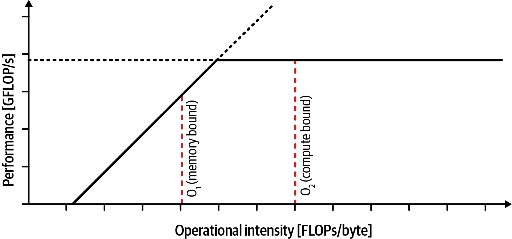
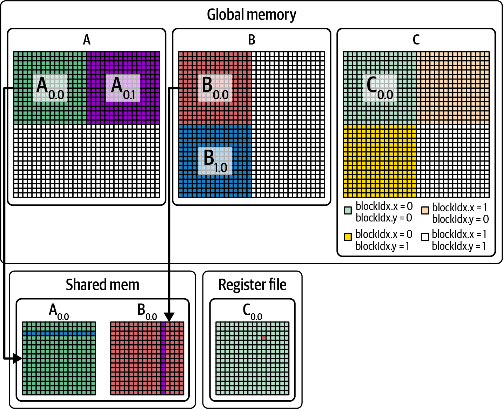
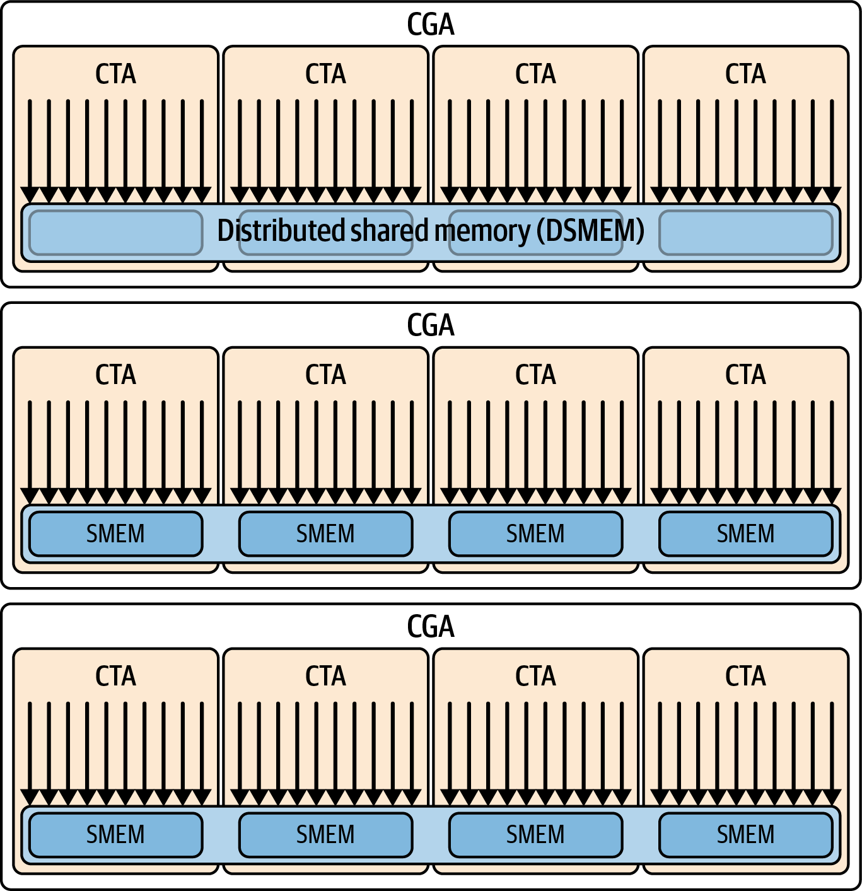
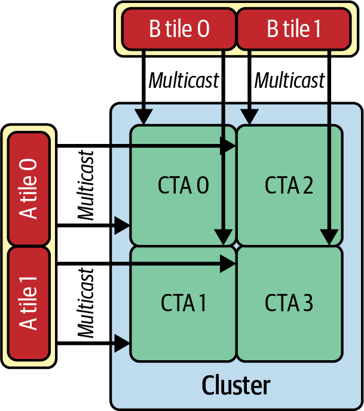
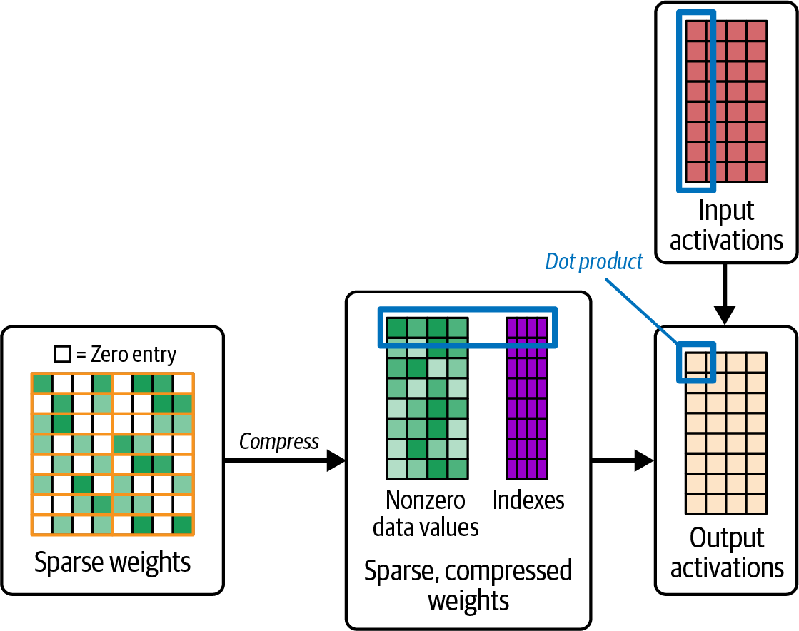
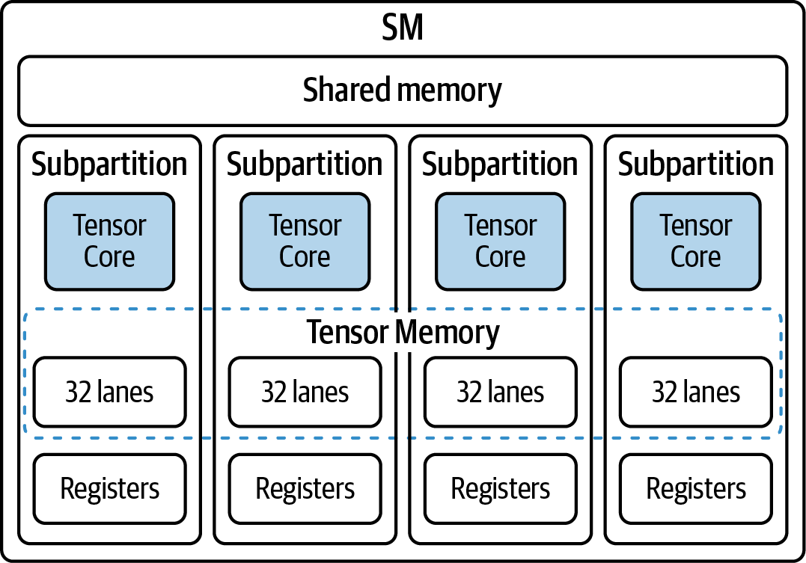
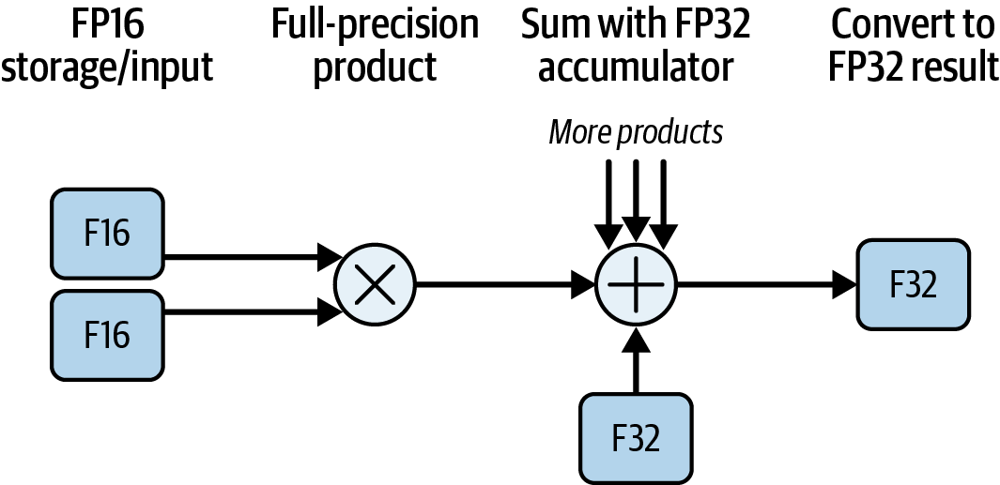
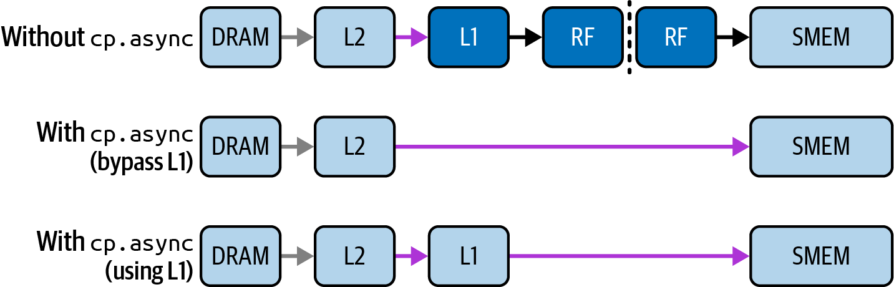

# AI Systems Performance Engineering

*Uploaded by Pedro Valera - AI Specialist*

---

## Chapter 9

# Increasing CUDA Kernel Efficiency and Arithmetic Intensity

# Chapter 9. Increasing CUDA Kernel Efficiency and Arithmetic Intensity

Even if you fully hide latency with massive parallelism and high ILP, a kernel’s performance may still be limited by how much useful work it does per memory access. Arithmetic intensity, also called operational intensity, measures how many floating-point operations are performed per byte of data transferred from memory, or FLOPS per byte.

Newer GPU generations are advancing compute throughput well beyond memory bandwidth. This widening gap means that increasing arithmetic intensity is even more critical than ever. Higher arithmetic intensity indicates a kernel does more computation for each byte fetched, which is essential for fully utilizing the GPU’s computational capabilities.

Arithmetic intensity is a key metric in the Roofline performance model. The Roofline model is a useful visual tool that plots kernel performance (FLOPs/sec) against arithmetic intensity (FLOPs/byte). It shows hardware ceilings (roofs) for memory bandwidth and compute throughput, allowing us to see if a kernel is memory bound, performance limited by memory transfers, or compute bound, performance limited by ALU throughput.

In practice, you can generate roofline charts using tools like Nsight Compute, which includes a Roofline analysis view. Using these tools, you can verify if your kernel is initially memory bound or compute bound—then continue to profile and verify improvements as you make optimizations.

The goal is to push the kernel toward the compute-bound regime and leverage the GPUs increasing computational power. A Roofline performance model can properly guide your optimizations toward that goal.

As shown in a previous chapter, a roofline chart uses one horizontal line to represent the hardware’s peak compute throughput (the roof)—and a diagonal line from the origin represents the peak achievable throughput limited by memory bandwidth. A kernel’s arithmetic intensity determines where it falls on the x-axis, and its performance can be compared against these ceilings, as shown in Figure 9-1.



###### Figure 9-1. Example Roofline model (GFLOP/s versus arithmetic intensity in FLOPs/byte

A kernel with low arithmetic intensity, or few math operations per byte of data moved, will be memory bound. In this case, the kernel’s speed is capped by the hardware’s memory bandwidth, because the GPU spends most of its time waiting for data rather than crunching numbers.

Conversely, a kernel with very high arithmetic intensity, or many FLOPs per byte moved, will be compute bound because it is utilizing the ALUs and Tensor Cores near their peak capabilities. In this case, the kernel’s memory bandwidth usage is a secondary concern.

The goal is always to increase arithmetic intensity where possible by doing more computational work for each byte of data transferred to and from global memory (FLOPs per byte). You can increase arithmetic intensity using techniques like loop tiling to reuse data, using on-chip L1/shared memory for reuse, and fusing multiple kernels into one so that intermediate results don’t get written to global memory.

Modern compiler frameworks such as PyTorch’s TorchInductor automatically do some of these optimizations to keep computations on the GPU, reduce off-chip memory traffic, and increase effective arithmetic intensity. However, as a developer, you may still need to manually combine these techniques or write custom CUDA kernels to ensure that data is reused optimally before being evicted from caches, for instance.

You can also use lower-precision data types (FP16, FP8, FP4) to reduce the amount of memory transfers—and utilize Tensor Cores to increase FLOPs per second. Together, these will increase the FLOPs per byte ratio and increase arithmetic intensity. Next, let’s discuss some of these techniques.

Keep in mind that not every workload can easily increase its arithmetic intensity. It’s constrained by algorithm characteristics. However, you should look for any opportunity to improve the algorithm, reuse data, fuse operations, and increase batch sizes to raise arithmetic intensity without changing the algorithm’s result (e.g., accuracy).

# Multilevel Microtiling and Software Prefetching

As discussed in Chapter 7, tiling (aka chunking or blocking) and data reuse are an effective way to raise arithmetic intensity. In that chapter, we showed how loading a small submatrix (tile) of A and B into shared memory lets each byte fetched from global memory be used for many multiply-accumulate operations at static random-access memory (SRAM) speed.

Whenever you restructure code so that each element is loaded once and used tens or hundreds of times, like in the case of tiling, you multiply your FLOPs per byte ratio by the reuse factor. For instance, in a typical matrix multiply, a 32 × 32 tile of A and B produces 1,024 (1,024 = 32 × 32) independent multiplies for each element in shared memory. As such, the arithmetic intensity rises compared to fetching each element directly from DRAM for every operation.

Beyond simple shared-memory tiling,[]()[]()[]()[]() you can further increase intensity and expose more ILP with multilevel tiling. With multilevel tiling, after staging a tile into shared memory, you have each thread load microtiles into registers using vectorized types such as `float4` and `<half2>`. This way, repeated operations happen entirely in registers. An example of multilevel tiling is shown in [Figure 9-2](https://learning.oreilly.com/library/view/ai-systems-performance/9798341627772/ch09.html#ch09_figure_2_1757308049959058).



###### Figure 9-2. Multilevel tiling between global memory (DRAM), shared memory (SMEM), and registers

This intra-SM reuse (register → SMEM → DRAM) reduces the working set at every level—and minimizes off-chip traffic. As always, be sure to coalesce global reads when filling shared memory and pad/swizzle shared data to avoid memory-bank conflicts, as we covered in Chapter 7.

On modern GPUs, these inner-loop tiling steps are often covered by using MMA fragment APIs. The hardware moves data between shared memory and Tensor Memory (TMEM) implicitly using Tensor Core instructions. TMEM usage is managed by the compiler and libraries. On modern GPUs, `tcgen05` instructions implicitly stage data between shared memory and TMEM. They use a distinct TMEM address space. However, developers can still manually move tiles into shared memory with `cp.async` or TMA when implementing certain algorithms and need explicit control.

A closely related technique is software prefetching, which is often implemented as double buffering. For instance, instead of waiting until the current tile’s computations finish, you can issue asynchronous loads for the next tile into shared memory. This will overlap DRAM → shared-memory (SMEM) transfers with ongoing arithmetic. Careful prefetching can significantly reduce stall time and improve throughput. The idea is to overlap data transfer with computation so the ALUs never starve waiting for data.

When using unified memory with a CPU-GPU superchip like Grace Blackwell, you can use `cudaMemPrefetchAsync()` to hint that a tile will be needed soon. This hints at the runtime to migrate pages over NVLink-C2C. However, prefetch is just a hint and not a guarantee. You still want to make sure you are overlapping transfers and synchronizing appropriately to avoid page fault stalls. Overlapping data movement with compute in this way ensures the ALUs remain fed whenever a new tile is needed. This further hides memory latency—and boosts achieved FLOPS.

Unified memory eases development but may not produce the best performance. Expert users often prefer explicit `cudaMemcpy` or pinned memory allocations to fully avoid page migration overheads.

In short, the more times that each byte from DRAM is reused at the on-chip levels (registers or shared memory), the higher your arithmetic intensity. And higher arithmetic intensity moves the kernel closer into the compute-bound regime.

# Tiling with Thread Block Clusters

On modern GPUs, you can extend the tiling-reuse idea using CUDA thread-block clusters from Cooperative Groups (discussed in Chapter 10). These allow multiple thread blocks to share data using distributed shared memory (DSMEM), as shown in Figure 9-3.



###### Figure 9-3. DSMEM shared by CTAs (thread blocks) within a CGA

We cover CGAs and thread block clusters in detail in the next chapter, but they’re worth mentioning here, as they can directly increase arithmetic intensity. For example, a cluster of four thread blocks can cooperatively load one tile using the Tensor Memory Accelerator (TMA) multicast feature, as shown in Figure 9-4, which uses four CTAs to demonstrate this mechanism.



###### Figure 9-4. For these four (2 × 2) thread block clusters, each tile of A and B is loaded into four CTAs (thread blocks) simultaneously using multicast (source: https://oreil.ly/EEO_O)

Each tile is partitioned across the four thread blocks so that global memory traffic for that tile is amortized over the cluster. The tiles are fetched only once and reused by all four thread blocks.

Thread block clusters can reduce global memory traffic by up to 4× in a 2 × 2 cluster when four CTAs reuse the same data using multicast. Also, thread block clusters increase arithmetic intensity per GPU by lowering the denominator, or number of bytes moved from global memory. A specialized form of these called thread block pairs will be discussed in a bit—in the context of tiling with Tensor Cores.

Blackwell supports thread block clusters[]() up to 16 thread blocks when you opt into a nonportable cluster size beyond the default portable limit of 8 CTAs. To enable this, set the `cudaFunc​Attribu⁠teNonPortableClusterSizeAllowed` attribute on the kernel. Larger clusters can raise reuse but may reduce occupancy, so profile before enabling 16. This can support even larger multi-SM tiles, which maximizes data reuse (16×) and increases arithmetic intensity by a similar factor.[]()[]()

# Kernel Fusion

Another way to increase arithmetic intensity is to fuse multiple operations—or loop iterations—into one operation. By fusing together multiple kernels, the data loaded from memory can be used for several computations and iterations before being written back.

Similarly, loop unrolling, discussed in the previous section, allows a single thread to perform more calculations on each loaded data element, but at the cost of more register usage. Too much fusion can increase per-thread register pressure and reduce occupancy, so there’s a trade-off.

Always profile fused kernels. If register usage becomes excessive and starts spilling to local memory, the benefits of fusion might be offset by the additional memory traffic. If you find the right balance, however, you can improve the FLOPS per byte moved, and this is beneficial if memory bandwidth is a limiting factor.

Modern deep learning frameworks can[]()[]()[]() automatically fuse and unroll through their just-in-time compilers and graph optimizers. For instance, PyTorch’s `torch.compile`, and specifically TorchInductor, can automatically fuse sequences of elementwise operations. We cover the PyTorch compiler in Chapters [13](https://learning.oreilly.com/library/view/ai-systems-performance/9798341627772/ch13.html#ch13_profiling_tuning_and_scaling_pytorch_1757308071445147) and [14](https://learning.oreilly.com/library/view/ai-systems-performance/9798341627772/ch14.html#ch14_pytorch_compiler_openai_triton_and_xla_backends_1757308073265113).

Elementwise operations, also called pointwise operations, apply a simple computation independently to each element of a tensor.

Fusing these elementwise operations eliminates unnecessary memory traffic by keeping intermediate values on-chip. This increases the amount of work done per byte fetched from global memory—raising the arithmetic intensity.

For instance, the naive implementation launches two kernels. The first kernel reads `x` and writes `y` to global memory. The second reads `y` and writes `z`:

```python
y = sin(x);
z = sqrt(y);
```

Here, each element is touched twice: once after `sin(x)` and once after `sqrt(y)`. As such, each kernel’s arithmetic intensity is very low, since it performs just one expensive math function (a multicycle ALU instruction) per element—per load/store operation. In contrast, the fused kernel performs this same set of operations in a single pass:

```python
z[i] = sqrt(sin(x[i]));
```

Each `x[i]` is loaded once, then both `sin` and `sqrt` are applied in registers, and only the final `z[i]` is written to memory. Because the intermediate `y` never goes out to global memory, the effective FLOPS per byte jump sharply, moving the operation closer to the compute roof.

As a rule of thumb, if data will be read more than once by threads in the same thread block, it’s often worth staging the data into shared memory to eliminate redundant global loads. This will help lift your kernel out of the memory-bound regime and into the compute-bound regime to better utilize the ample GPU FLOPS.

Fusion reduces global memory traffic and increases arithmetic intensity since each element now undergoes two math operations for each read and write memory operation. In our example, we doubled the FLOPS per element (`sin` + `sqrt`) while roughly halving the memory traffic since there is no intermediate write. This produces a significantly higher arithmetic intensity, or FLOPS/byte.

To drive this point home, let’s demonstrate arithmetic intensity with a concrete example. Suppose we want to L2-normalize each length-hidden row of a 2D tensor `x (shape [batch, hidden])`. For each row `b`, compute a single norm, `norm_b = sqrt(Σ_i x[b,i]*x[b,i] + ε)`, and then write `y[b,i] = x[b,i] / norm_b` for all `i`.

A naive implementation would square in one kernel, reduce each row to a scalar in a second kernel, and divide in a third kernel. This would require multiple kernel launches with intermediate writes to HBM.

Let’s assume that each of the 4 kernels requires 1 FLOP of compute. As such, the arithmetic intensity of each of the 4 kernels is 1 FLOP per 12 bytes (2 float reads, 1 float write), or 0.083 FLOPS/byte.

Instead, we can fuse the 4 kernels into a single kernel and increase the arithmetic intensity. The manually fused kernel code is shown here:

```cpp
__global__ void fusedL2Norm(const float* __restrict__ x,
float* __restrict__ y,
int hidden) {
extern __shared__ float sdata[]; // reduction buffer
const int batch = blockIdx.x; // one block per batch row
const int tid = threadIdx.x;
const float* batch_ptr = x + size_t(batch) * hidden;

// 1) Accumulate sum of squares into shared memory
float local = 0.f;
for (int i = tid; i < hidden; i += blockDim.x) {
float v = batch_ptr[i];
local = fmaf(v, v, local); // v*v + local
}
sdata[tid] = local;
__syncthreads();

// 2) Parallel reduction to sdata[0]
for (int offset = blockDim.x >> 1; offset > 0; offset >>= 1) {
if (tid < offset) sdata[tid] += sdata[tid + offset];
__syncthreads();
}

// 3) Normalize (guard tiny norms)
float norm = sqrtf(sdata[0]);
float inv = rsqrtf(sdata[0]); // prefer inverse

float* out_batch = y + size_t(batch) * hidden;
for (int i = tid; i < hidden; i += blockDim.x) {
// multiply by inverse (rsqrt) vs. divide by sqrt
out_batch[i] = batch_ptr[i] * inv;
}
}
```

In this fused kernel, each thread walks its slice of `x[b,*]` twice—once to accumulate a local sum of squares and once to write the normalized outputs—so global traffic is ~12 bytes per element (two reads + one write). Per element the kernel does ~1 multiply + 1 add during the reduction and 1 multiply during the normalize.

The `sqrt` and `rsqrt` are amortized over the whole row. For roofline placement, a conservative arithmetic intensity is ≈3 FLOPs / 12 bytes ≈ 0.25 FLOPs/byte (plus the tiny <span class="keep-together">1/(hidden * 12)</span> contribution from the per-row `sqrt`). This lets us hide `sqrt` and `rsqrt` latency by giving each thread multiple elements to increase ILP.

Additionally, as shown in the previous code, we compute the inverse `sqrt` (`rsqrtf`) and multiply instead of dividing. This is a common micro-optimization—especially for hot inner loops. The idea is to replace a slow division instruction stream for a high-throughput multiply instruction stream. We are also trading a `sqrtf` with a cheaper `rsqrtf` approximation. These are micro-optimizations because overall, this pipeline is memory-bound and not compute-bound—but it’s interesting to highlight. There is yet another optimization not shown here. It involves doing one `rsqrtf`/`sqrtf` in a single thread within the thread block and broadcasting the scalar result to the other threads using shared memory. This has more impact on improving performance. Please see the book’s [GitHub repo](https://github.com/cfregly/ai-performance-engineering) for more details on this optimization.

Compared to a naive three-kernel pipeline (square → reduce → divide) with intermediate writes to HBM, the fused version removes at least one global write/read round trip and one launch barrier. As such, its intensity and runtime are much better in practice—even though the per-element FLOP/byte is only ~0.25. This is due to latency savings and cache locality improvements.

In practice, this single fused kernel executes faster than a series of separate kernels due to higher arithmetic intensity (FLOPS/byte), better cache locality, and reduced launch overhead by collapsing three separate kernels into one.

Fusing not only increases arithmetic intensity and pushes the kernel more toward the compute-bound side of the roofline, but it also saves memory bandwidth. In the naive, multikernel version, we have to write intermediate results to global memory and read them back in the next kernel. In the fused version, the intermediate results (e.g., `ai*ai`) never have to leave the thread’s registers.

In the code example, the addition can use those registers directly to calculate the sum. The `sqrt` can then use the sum—all without requiring additional global memory traffic. Only the final result is written back to global memory.

As such, the fused kernel achieves perhaps 4 FLOPS for 12 bytes of data movement from/to global memory, whereas the naive, unfused approach achieves 4 FLOPS for 36 bytes loaded and stored after accounting for the intermediate memory movement. This means less DRAM traffic and lower latency.

This simple example shows how fusion increases our kernel’s arithmetic intensity and overall performance. Let’s look at another way to increase arithmetic intensity by utilizing our GPUs’ Tensor Core hardware units.

State-of-the-art GPU kernels achieve higher arithmetic intensity using vertical fusion, which combines sequential operations on the same data—as well as horizontal fusion, which combines parallel operations across data. Libraries like NVIDIA’s CUTLASS or OpenAI’s Triton (integrated into PyTorch’s compiler backend, TorchInductor) can help you implement these different types of fused kernels very efficiently using Tensor Cores, TMEM, TMA, etc.

# Structured Sparsity

On modern GPUs, 2:4 structured sparsity is accelerated in hardware by Sparse Tensor Cores and cuSPARSELt. 2:4 means that exactly two out of every four consecutive weights are nonzero. Creating this type of sparsity is sometimes called pruning.

By pruning half of the weights into a 2:4 pattern, each memory load now delivers twice as many nonzero values that actually participate in multiplication. In other words, you are no longer fetching weights that turn out to be zero. As such, you are not wasting a matrix multiply operation on something that you know is zero, as shown in Figure 9-5.



###### Figure 9-5. 2:4 structured sparsity

Structured sparsity is applied after a model is trained. The model is pruned and optimized for inference. Pruning and format conversion are done in software stacks such as cuSPARSELt and framework tooling. Note that the Transformer Engine accelerates supported sparse executions but does not enforce sparsity during conversion.

Pruning and format conversion are handled in software—typically through <span class="keep-together">cuSPARSELt</span> and framework tooling. []()In PyTorch, use `to_sparse_semi_structured()` to <span class="keep-together">convert</span> trained dense modules into 2:4 sparse format before deploying sparse GEMMs on Sparse Tensor Cores.

Once your model is converted, it will invoke optimized sparse GEMM kernels running on the Sparse Tensor Cores instead of standard kernels. Sparse Tensor Cores can approach up to a 2× speedup over their dense counterparts for many inference workloads—especially when submitting large batches of inputs, as these amortize kernel launch overhead.

Batching is a very common and practical way to increase arithmetic intensity. Instead of processing one item at a time—with all of the associated memory I/O, etc.—you process multiple items in one pass so that memory access (e.g., loading weights, etc.) is amortized over multiple computations.

This gives the sparse‐accelerated matrix multiplies enough parallel work to hide any overhead from handling indices or compressed representations. In smaller batches, this overhead can dominate and limit how much speedup you observe.

2:4 sparsity will produce maximum benefit when using large matrix multiplies, which are common in transformer-based models like LLMs. This is because the hardware can fully utilize the dedicated Sparse Tensor Cores. These Sparse Tensor Cores operate on half‐width data directly in hardware. This skips zeros and performs twice the work on the nonzero elements in the same cycle budget.

Because compute capacity on Blackwell has grown faster than HBM bandwidth, structured sparsity is a great way to stay compute bound. Even on a Grace Blackwell system in which NVLink-C2C lets the GPU stream data from CPU memory at very high throughput, you still want to maximize FLOPS per byte on every loaded tile.

By pruning 50% of weights in a 2:4 pattern, for instance, you ensure that half of your memory traffic is never needed. This immediately reduces global‐memory reads and raises effective arithmetic intensity by almost 2×.

NVIDIA GPUs implement this 2:4 structured sparsity in hardware such that every 16-element chunk can zero out 8 elements. This is the pattern used to double Tensor Core throughput for sparse matrices. As of this writing, no other arbitrary sparsity pattern gains this special acceleration in hardware.

The speedups from sparsity assume that the model’s accuracy is maintained. In practice, it’s important to fine-tune or carefully calibrate after pruning. This way, you can minimize accuracy loss.

Before applying sparsity, it is important to first implement the fundamental optimizations covered previously: coalesce all global loads, reuse data using tiling, and fuse pointwise operations to eliminate extra memory round trips. Once these basics are in place and verified, structured sparsity can provide another speedup for inference.

Structured sparsity typically applies to inference workloads. During training, gradients do not benefit from 2:4 sparsity. In addition, maintaining sparsity in gradient updates is complex. As such, it’s recommended to use it for deployment scenarios in which you’ve prepruned and calibrated the model. NVIDIA’s 2:4 sparse Tensor Core feature is primarily used for inference. Training support is limited and model-dependent and framework-dependent. Verify support in your software stack before relying on it.

# Recomputation Versus Memory Trade-Off

Also, instead of storing or loading precomputed[]()[]() values (e.g., `x²`), consider recomputing them on demand if memory bandwidth is the bottleneck. For instance, repeatedly computing `x*x` in registers is often faster than loading a previously computed `x²` from global memory. []()Continuous recomputation of cheap expressions can increase arithmetic intensity and is a useful technique whenever memory is scarce.

Many LLM inference engines use this technique to save memory. Instead of storing large activation tensors in HBM and reading them back later, they can recompute certain layers and activations on the fly. This is similar to activation checkpointing in a model training context.

Recomputation improves effective FLOPS/byte and can fit large models into a smaller amount of memory. In addition, recomputation frees up memory for larger batch sizes and trades a few extra FLOPS for a significant decrease in memory traffic.

# PyTorch and Arithmetic Intensity

In PyTorch, many of these ideas are automatically applied. As mentioned, PyTorch compiler (discussed in Chapters 13 and 14) can automatically fuse chains of elementwise operations—and even some reductions. It uses execution-graph-level optimizations to keep data on the GPU and reuse it as much as possible.

Because it uses optimized libraries[]()[]() like cuDNN and cuBLAS under the hood, PyTorch will perform tiling and use shared memory for you when performing matrix operations with `torch.matmul`. In addition, PyTorch’s `scaled_dot_product_attention` (SPDA) may dispatch to FlashAttention, memory-efficient, or cuDNN backends depending on tensor shapes and `dtypes`. To control the backend selection, use `torch.nn.attention.sdpa_kernel(SDPBackend.FLASH_ATTENTION)`, for instance. As a performance-minded developer, you should be aware of these optimizations and how to verify when they’re being used.

It’s important to note that while PyTorch can recognize and compile most operations, some nonstandard operations or custom CUDA operations might not get fused. In these cases, manual optimization may still be required, such as fusion, tiling, etc.

If you’re writing PyTorch code, prefer fused operations and optimized library calls that perform multiple computations rather than long sequences of individual kernel launches. In practice, this means using high-level operations like `torch.nn.functional` activations or `torch.matmul` instead of writing many small elementwise kernels in Python. These libraries call efficient kernels for these types of high-level operations. And the compiler knows how to fuse them efficiently with surrounding operations.

PyTorch’s [nested tensors](https://oreil.ly/ecX61), or[]()[]() ragged tensors, let you represent batches of variable-length inputs without padding. Each nested tensor packs the variable-length sequences into a single, efficient underlying buffer. `NestedTensor` exposes the normal tensor interface, but it eliminates unnecessary zero-padding. As such, global-memory loads become more efficient because each byte that is fetched is useful in the computation.

Nested tensors are useful for LLMs with varying-length sequences. When using nested tensors, operations like attention and batch-matrix multiplies will retrieve only the essential data from memory. This moves your kernel closer to the compute-bound regime on the Roofline model and helps to reduce memory-bound stalls. The result is higher sustained throughput—especially on memory-sensitive workloads.

In practice, nested tensors require careful validation for operator coverage and performance characteristics. Support is workload dependent, and speedups are shape dependent. You can verify end-to-end benefits with representative sequence length distributions and attention patterns. Profile both memory traffic and kernel time.

In short, PyTorch exposes various mechanisms to increase your kernel’s arithmetic intensity. It’s important to understand these options and decide what works best for your workload. Another effective method to increase arithmetic intensity on modern GPUs is by using the reduced-precision Tensor Cores. Let’s cover these mechanisms next.

# Mixed Precision and Utilizing Tensor Cores

Modern NVIDIA GPUs implement[]()[]()[]() reduced‐precision computations like TF32, FP16, FP8, FP4, and INT8 in Tensor Cores. Each SM in Blackwell has a 256 KB on-chip TMEM dedicated to Tensor Core data. It also has a specialized TMA unit that asynchronously copies tiles between global memory and shared memory. Tensor Core instructions (e.g., `tcgen05.mma`) then move operands and accumulators between shared memory and TMEM implicitly. This design feeds the Tensor Cores at high throughput and minimizes stalls. Blackwell’s TMEM-based accumulators help to reduce register pressure relative to previous GPU generations which accumulated directly in registers.

When used correctly, these features can transform a once memory‐bound, tensor‐heavy kernel into a fully compute‐bound one by raising arithmetic intensity (FLOPS per byte) by 2×, 4×, or even 8×. You can verify the impact by monitoring the Roofline chart and Stall Stats in Nsight Compute.

Nsight Compute’s Speed of Light analysis shows memory-bound stall reasons such as “Memory Throttle” and cache misses. These will drop significantly when using Tensor Cores with lower precision formats. And Nsight Compute integrates a Roofline chart to cross-check if arithmetic intensity increased to push your kernel toward the compute roof.

As you move from FP32 to lower-precision Tensor Core kernels such as TF32, FP16, FP8, or FP4, Nsight Compute’s Warp Stall metrics typically show a reduction in memory-related stall as well as a relative increase in dependency or pipeline stalls. This indicates an increase in arithmetic intensity and a shift from memory-bound toward compute-bound execution.

## Feeding Tensor Cores with TMEM and TMA

At the heart of high‐throughput tensor computation is TMEM, a 256 KB SRAM buffer per SM. At a high level, programmers do not explicitly allocate or manage TMEM, however. TMEM is handled by the hardware or libraries when you use Tensor Core operations. TMEM is shown in Figure 9-6.



###### Figure 9-6. TMEM supports the Tensor Cores by accumulating partial results (instead of registers)

Under the hood, Blackwell uses `tcgen05.mma` instructions that operate with TMEM for operand and accumulator storage.[]()[]()[]() CUTLASS and library kernels manage the required allocation and usage through the kernel configuration and Parallel Thread Execution (PTX) assembly. As such, the Transformer Engine uses TMEM for partial results. This reduces the MMA dependencies on registers.

High-level APIs like CUTLASS handle all of this complexity for you automatically. Use CUTLASS and other high-level libraries when possible as CUTLASS uses the `tcgen05.*` PTX instructions, which implement the Tensor Core matrix operations and memory load/store interfaces. Whenever you launch a Tensor Core MMA operation using CUDA MMA intrinsics or a CUTLASS GEMM, the implementation manages operand movement through shared memory and TMEM. []()TMA streams tiles between global memory and shared memory, and Tensor Core instructions move operands between shared memory and TMEM implicitly.

Nsight Compute includes a built-in roofline and speed-of-light analysis to confirm whether your kernel shifted from memory bound to compute bound after adopting low-precision Tensor Core paths.

Tensor Core instructions then move operands between shared memory and TMEM as part of the MMA pipeline. This happens behind the scenes and without explicit user code. This way, the data is staged where the Tensor Cores need it. To perform this data transfer from global memory into shared memory, use TMA or `cuda::memcpy_async` with a pipeline from the CUDA Pipeline API (`<cuda/pipeline>`.) In code, implementing a simple two-stage pipeline with `cuda::memcpy_async` and the CUDA Pipeline API looks like the following:

```cpp
# two_stage_pipeline.cu

#include <cuda/pipeline>
#include <cooperative_groups.h>
namespace cg = cooperative_groups;

extern "C" __global__
void stage_ab_tiles(const float* __restrict__ globalA,
const float* __restrict__ globalB,
float* __restrict__ outC,
int tile_elems,
int num_tiles) {
// Alignment / size guards for vectorized copies (runtime parameter)
assert((tile_elems % (32 * 4)) == 0 &&
"tile_elems must be multiple of 128 for float4 vectorization");
// If you cannot guarantee 16B alignment or sizes, handle
// the tail/ragged edges with a fallback 4B loop.
extern __shared__ float smem[];
auto block = cg::this_thread_block();

// Shared buffers for double buffering of A and B
float* A0 = smem + 0 * tile_elems;
float* A1 = smem + 1 * tile_elems;
float* B0 = smem + 2 * tile_elems;
float* B1 = smem + 3 * tile_elems;

constexpr auto scope = cuda::thread_scope_block;
constexpr int stages = 2;
__shared__ cuda::pipeline_shared_state<scope, stages> pstate;
auto pipe = cuda::make_pipeline(block, &pstate);

// Prime the pipeline with tile 0
pipe.producer_acquire();
cuda::memcpy_async(block, A0, globalA + 0 * tile_elems,
cuda::aligned_size_t<32>{tile_elems * sizeof(float)}, pipe);
cuda::memcpy_async(block, B0, globalB + 0 * tile_elems,
cuda::aligned_size_t<32>{tile_elems * sizeof(float)}, pipe);
pipe.producer_commit();

for (int t = 1; t < num_tiles; ++t) {
// Stage the next A and B tiles
pipe.producer_acquire();
cuda::memcpy_async(block, (t & 1) ? A1 : A0,
globalA + t * tile_elems,
cuda::aligned_size_t<32>{tile_elems*sizeof(float)}, pipe);
cuda::memcpy_async(block, (t & 1) ? B1 : B0,
globalB + t * tile_elems,
cuda::aligned_size_t<32>{tile_elems*sizeof(float)}, pipe);
pipe.producer_commit();

// Consume the previously staged tiles
pipe.consumer_wait();
float* prevA = (t & 1) ? A0 : A1;
float* prevB = (t & 1) ? B0 : B1;
// Perform compute using prevA and prevB
pipe.consumer_release();
}

// Consume the final staged tiles
pipe.consumer_wait();
int last = (num_tiles - 1) & 1;
float* lastA = last ? A1 : A0;
float* lastB = last ? B1 : B0;
// Perform compute using lastA and lastB
pipe.consumer_release();
}
```

When launching this kernel, set the dynamic shared memory size to `4 x tile_elems x sizeof(float)` to allocate `A0`, `A1`, `B0`, and `B1` in shared memory. This double buffering pattern ensures that as soon as one tile is resident in shared memory, Tensor Cores can begin processing it. Meanwhile `cuda::memcpy_async` fetches the next tile into shared memory in parallel. Because TMEM provides an on-chip data buffer for Tensor Core instructions and shared memory provides the staging space, you can stage and reuse FP16, FP8, or FP4 tiles entirely on chip. The result is fewer stalls when the pipeline is tuned and the tiles and copies are sized appropriately. <span class="keep-together"><code>cuda::memcpy_async</code></span> can overlap transfers from HBM to shared memory and keep the kernel busy. This helps hide memory latency behind computation.[]()[]()

## TF32 and Automatic Mixed Precision (PyTorch)

While Tensor Cores were originally designed for FP16, they also support TF32, which sits between FP32 and FP16. TF32 uses an 8-bit exponent like FP32 and a 10-bit mantissa like FP16. TF32 executes on Tensor Cores at substantially higher throughput than FP32 on CUDA cores while preserving FP32’s exponent range. In PyTorch, enabling TF32 is as simple as setting the following in your PyTorch code:

```python
import torch
torch.set_float32_matmul_precision('high') # {'highest'|'high'|'medium'}
```

Once these flags are set, high‐level operations such as `torch.matmul` and `torch.nn.Linear` automatically execute as TF32 Tensor Core kernels rather than in FP32 on standard CUDA cores.

Beyond TF32, PyTorch’s []()[]()[]()[]()[]()automatic mixed precision (AMP) can choose the optimal precision (FP16 or BF16) for each operation and accumulate the results in FP32 for stability. BF16 helps avoid FP16’s overflow issues. By default, CUDA `autocast` uses float-16. Simply pass `dtype=torch.bfloat16` to opt into BF16 on GPUs that support it. For instance, you can wrap your model code in a context manager, as shown here:

```python
with torch.amp.autocast("cuda", dtype=torch.bfloat16):
output = model(input)
```

Under the hood, TorchInductor (covered in Chapters [13](https://learning.oreilly.com/library/view/ai-systems-performance/9798341627772/ch13.html#ch13_profiling_tuning_and_scaling_pytorch_1757308071445147) and [14](https://learning.oreilly.com/library/view/ai-systems-performance/9798341627772/ch14.html#ch14_pytorch_compiler_openai_triton_and_xla_backends_1757308073265113)) fuses these precision conversions automatically to ensure the following: large GEMM operations run on Tensor Cores in FP16 or TF32, accumulation remains in FP32 for numeric stability, small “sensitive” kernels like layer normalization and softmax run in FP32, and `GradScaler` prevents underflow during training with FP16. Note that BF16 has FP32 exponent range. As such, `GradScaler` typically isn’t needed when training with BF16.

In PyTorch, these mixed-precision decisions are integrated into the compiler so you get optimal `dtype` selection (e.g., FP16/FP8 for compute, FP32 for accumulations) without requiring manual intervention. This is shown in [Figure 9-7](https://learning.oreilly.com/library/view/ai-systems-performance/9798341627772/ch09.html#ch09_figure_7_1757308049959152) as a mixed-precision matrix multiply-accumulate (MMA).

This automatic mixed-precision pipeline maximizes arithmetic intensity with minimal code changes. The fused Tensor Core kernels minimize round trips to HBM by staging and reusing data in shared memory (e.g., operands) and TMEM (e.g., accumulators).



###### Figure 9-7. Mixed-precision and matrix multiply-accumulate (MMA)

When using structured sparsity, described earlier, or extreme low-precision (FP8/FP4), be sure to maintain a large enough batch size or tile granularity so that TMEM and Tensor Cores remain fully utilized. Small batches incur overhead, including format conversions, sparse index handling, irregular memory patterns, etc. This can reduce achieved speedups.

For example, when using FP8 or 2:4 sparsity, a batch size of 1 may see little benefit because the fixed overhead isn’t amortized. In contrast, a batch size of 128 or 256 will fully utilize the TMEM pipeline and produce near-peak throughput.

## BF16/FP16, FP8, and FP4 Reduced Precision

BF16/FP16 (half-precision) has been supported for many GPU generations, but Tensor Cores on modern GPUs can often sustain greater than 90% of the BF16/FP16 peak throughput, around 4× the FP32 peak throughput. This is because at each cycle, the hardware issues many BF16/FP16 FMA operations in parallel.

FP16 training uses a narrower 5-bit exponent than FP32, so very small gradient values can underflow to zero unless you apply loss scaling. Loss scaling preserves numerical stability during backpropagation. This scaling can either be static or dynamic.

In contrast, BF16 matches FP32’s 8-bit exponent range and natively avoids underflow. There, it rarely (if ever) requires loss scaling. This simplifies mixed-precision workflows and often improves training accuracy on modern GPUs.

BF16 is typically preferred for training on modern GPUs as it can maintain accuracy comparable to FP32 without the complexity of loss scaling that FP16 demands.

To push throughput even higher, you can use FP8. By reducing 16‐bit weights by 50% down to 8 bits, you cut memory traffic in half—and double the number of weights loaded per HBM transaction. In practice, FP8 `matmul`s with FP32 or TF32 accumulation achieve 2–3× the BF16/FP16 TFLOPS—assuming that the model’s slight loss in accuracy due to quantization errors remains acceptable.

To address accuracy concerns at very low precision, the Transformer Engine supports FP8 as well as NVIDIA’s 4-bit NVFP4 format with micro-scaling. NVFP4 applies two-level scaling, combining per-microblock scaling and a higher-level scale so that models can retain accuracy while using 4-bit storage for weights. In addition, Blackwell B200’s NVFP4’s aggressive microscaling quantization provides 10 petaFLOPS (dense), while FP32 peak is about 80 teraFLOPS (dense). This is a speedup of approximately two orders of magnitude higher theoretical throughput per weight. And Blackwell’s B300 (Ultra) boasts 50% higher NVFP4 compute capacity than B200 at 15 petaFLOPS (dense).

If your model tolerates the precision drop after calibration, NVFP4 kernels can deliver substantially higher throughput than FP32 on supported hardware, but accuracy must be validated per model.

And since the precision is so low, the 256 KB TMEM per SM can hold large FP4 tiles (e.g., 256 × 256), which further increases on-chip reuse and improves performance. Note that all low-precision → accumulation conversions happen automatically. The kernel reads FP4 inputs from HBM, the Tensor Cores perform FP4 × FP4 multiplies, and the MMA API accumulates the results into BF16/FP16 or FP32 accumulators.

Each drop in precision doubles or quadruples the number of operations per byte and therefore increases arithmetic intensity. When TMEM/TMA overlap memory and compute, these low-precision formats turn formerly memory-bound kernels into entirely compute-bound ones. This fully utilizes the multi-PFLOPS-per-GPU Tensor Core engines in modern GPUs.

## INT8 Reduced Precision and DP4A Instructions for Inference

LLM inference use cases can typically tolerate reduced-precision INT8 quantization supported by modern GPUs using DP4A (SIMD dot-product) instructions on regular CUDA cores and integer matrix-multiply/accumulate (MMA) instructions on Tensor Cores. At the instruction level, DP4A performs four INT8 multiply-accumulate (MAC) operations per instruction compared to one FP32 fused multiply-add (FMA) per instruction.

Because weight traffic for INT8 is only one byte per element instead of four bytes for FP32, memory traffic for weights drops by 75%. INT8 inference workloads can significantly outperform FP32 due to higher peak INT8 Tensor Core throughput and reduced memory traffic. This is because each GPU can process approximately 4× more data per second from memory when using INT8 weights. This is made possible by TMEM and TMA keeping data and compute perfectly overlapped—and feeding the Tensor Cores as efficiently as possible.

## Transformer Engine and TMEM in Depth

Modern NVIDIA GPUs include[]()[]()[]() a Transformer Engine that combines Tensor Core hardware support for low-precision formats with a software runtime for scaling and casting. Kernels in cuBLASLt, cuDNN, CUTLASS, or OpenAI’s Triton perform `cp.async` instructions or TMA transfers into shared memory. The Tensor Core instructions then move operands between shared memory and TMEM implicitly.

Remember that TMEM is the 256 KB per-SM SRAM buffer that the Transformer Engine and Tensor Cores use to store results (instead of registers). In practice, you never explicitly allocate TMEM. It’s all handled by the hardware. For instance, when invoking Tensor Core’s MMA operations, the hardware handles all of the memory allocations and data transfers.

With the MMA instructions, each warp directly drives the Tensor Cores to perform high‐throughput mixed‐precision MMA operations. These operations manage fragment loads, register mappings, and mixed-precision MMA operations.

As of this writing, PyTorch’s INT8 quantization support is provided through TorchAO and vendor backends. Quantized modules run using dedicated INT8 kernels. Using cuBLASLt or CUTLASS for low-level INT8 GEMM can ensure Tensor Core utilization.

Any time you launch a Tensor-Core-based kernel or a GEMM library function (e.g., CUTLASS), the implementation manages operand movement through shared memory and TMEM automatically. This keeps the Tensor Cores full of tiles that are ready to be processed. (Note that the application code does not allocate TMEM directly.)

The Transformer Engine workflow is straightforward. First, your kernel issues a MMA call or launches a CUTLASS GEMM. Next, the Transformer Engine’s firmware arranges for TMA (or `cuda::memcpy_async`) to copy weights and activations from HBM into shared memory (SMEM). Tensor Core instructions (e.g., `tcgen05.mma`) then move operands between SMEM and TMEM implicitly during the MMA pipeline. Ideally, the weights are in FP8 or FP4, and the activations are cast to FP8/FP4 when possible—otherwise, the activations can be left in FP16/FP32 format.

Tensor Core MMA operations execute at low precision, such as FP8 × FP8 with higher-precision accumulation or FP16 × FP16 with FP32 accumulation. Partial sums accumulate in TMEM with higher precision (e.g., BF16, FP16, FP32) and are kernel dependent. The accumulator state resides in TMEM. This state is accessed using `tcgen05` load and store interfaces. The hardware manages these moves transparently.

If you build a custom tile loop, you can overlap data movement with Tensor Core compute. You can do this using `cuda::memcpy_async` and the CUDA Pipeline API, as shown in the code here:

```cpp
#include <cuda/pipeline>
#include <cooperative_groups.h>
namespace cg = cooperative_groups;

extern "C" __global__
void double_buffer_a(const float* __restrict__ globalA,
int tile_elems,
int numTiles) {
__shared__ float tileA0[TILE][TILE];
__shared__ float tileA1[TILE][TILE];

auto block = cg::this_thread_block();

constexpr auto scope = cuda::thread_scope_block;
constexpr int stages = 2;
__shared__ cuda::pipeline_shared_state<scope, stages> pstate;
auto pipe = cuda::make_pipeline(block, &pstate);

// Prime pipeline with tile 0
pipe.producer_acquire();
cuda::memcpy_async(block,
&tileA0[0][0],
globalA + 0 * tile_elems,
cuda::aligned_size_t<32>{tile_elems * sizeof(float)}
pipe);
pipe.producer_commit();

for (int t = 1; t < numTiles; ++t) {
// Stage next tile into the alternate buffer
pipe.producer_acquire();
float* nxtA = (t & 1) ? &tileA1[0][0] : &tileA0[0][0];
cuda::memcpy_async(block,
nxtA,
globalA + t * tile_elems,
cuda::aligned_size_t<32>{tile_elems * sizeof(float)}
pipe);
pipe.producer_commit();

// Consume the previously staged tile
pipe.consumer_wait();
float* curA = ((t - 1) & 1) ? &tileA1[0][0] : &tileA0[0][0];
pipe.consumer_release();
}

// Consume the final staged tile
pipe.consumer_wait();
float* lastA = ((numTiles - 1) & 1) ? &tileA1[0][0] : &tileA0[0][0];
// Use lastA with your compute
pipe.consumer_release();
}
```

Because TMEM is a dedicated on-chip buffer used by Tensor Core instructions, data is kept close to the compute units. While Tensor Cores process the current tile, `cuda::memcpy_async` streams the next tile from HBM into shared memory.

This overlap helps hide memory latency and can keep Tensor Cores busy when the pipeline is tuned. This collaboration between the Transformer Engine, TMEM, and TMA can substantially raise arithmetic intensity and approach speed-of-light efficiency in optimized cases.

While load and store operations are synchronous with respect to the calling warp, the overlap of compute and data movement should come from the CUDA Pipeline API. Used with pipeline primitives like wait/release, `cuda::memcpy_async` maps to the Tensor Memory Accelerator (TMA) and should always be preferred for bulk tensor transfers. Reserve `cp.async` for niche cases that TMA cannot express. However, these are rare. You should also make sure that copies complete before using the data.[]()[]()[]()[]()[]()[]()

# Using CUTLASS for Optimal Arithmetic Intensity and Tensor Core Performance

One of the easiest ways to leverage these optimizations yourself is to use NVIDIA’s CUTLASS library. With CUTLASS, you write a single templated call, and it will automatically apply many advanced optimizations.

Some optimizations that CUTLASS applies are shared‐memory tiling, asynchronous memory transfers, and double buffering with the help of TMEM’s 256 KB per‐SM buffer. This way, your Tensor Cores run at near‐peak throughput without any manual kernel tuning.

CUTLASS also implements warp specialization, which is a high-performance GPU optimization technique that we’ll discuss in the next chapter.

For example, suppose you want to compute a GEMM, `C = A * B`, with half‐precision inputs and a half‐precision output accumulating in FP16 or FP32 as appropriate. Instead of writing a hand‐tuned MMA loop, you can simply include CUTLASS and instantiate a template, as shown in the following code:

```cpp
#include <cutlass/numeric_types.h>
#include <cutlass/gemm/device/gemm.h>

using Gemm = cutlass::gemm::device::Gemm<
cutlass::half_t, // A (FP16)
cutlass::layout::RowMajor,
cutlass::half_t, // B (FP16)
cutlass::layout::ColumnMajor,
cutlass::half_t, // C / output (FP16)
cutlass::layout::RowMajor,
float, // accumulator (FP32 accumulate)
cutlass::arch::OpClassTensorOp,
cutlass::arch::Sm100 // e.g., Blackwell B200
>;

// ... (allocate device pointers A_d, B_d, C_d,
// set up dimensions M,N,K, and strides lda, ldb, ldc) ...

Gemm gemm_op;
cutlass::Status status = gemm_op(
{ M, N, K }, // GEMM shape
float(1.0f) // alpha
A_d, lda, // A pointer + leading dimension
B_d, ldb, // B pointer + leading dimension
float(0.0f), // beta
C_d, ldc // C pointer + leading dimension
);
```

When you compile and run this code, CUTLASS does several key things automatically. First, CUTLASS selects tiles to balance register pressure, shared memory capacity, and Tensor Core utilization. On modern GPUs, TMEM exists alongside shared memory and L1. CUTLASS stages tiles in shared memory and uses Tensor Core instructions that interact with TMEM to store accumulator data. The tile shapes are chosen empirically and per-kernel. For instance, it may select tile sizes such as 128 × 128 or 256 × 128. These would fit into TMEM’s 256 KB per-SM buffer and would remain on‐chip throughout the Tensor Core computation.

Depending on the precision, a 256 × 512 tile would max out the 256 KB per-SM TMEM budget since 256 × 512 elements × 2 bytes per element = 256 KiB. And 256 × 256 elements × 4 bytes per element = 256 KB. Larger tiles improve per-tile throughput but reduce the number of concurrent tiles per SM. This can lead to underutilization on smaller GEMMs. In contrast, very small tiles sacrifice arithmetic intensity for parallelism.

CUTLASS then emits asynchronous memory copies (`cp.async` or TMA) that stream each tile from DRAM into shared memory. The `cp.async` instruction stages data from global memory into shared memory without using per-thread registers (or optionally L1 cache), as shown in [Figure 9-8](https://learning.oreilly.com/library/view/ai-systems-performance/9798341627772/ch09.html#ch09_figure_8_1757308049959168). The caching behavior is controlled using `cp.async` modifiers or by using TMA for bulk tensor transfers.



###### Figure 9-8. Using the asynchronous memory copy instruction (cp.async) to load data from global memory into shared memory without involving the register file and optionally the L1 cache

CUTLASS stages tiles from global DRAM into SMEM using `cp.async` or TMA (`cp.async.bulk.tensor`). Tensor Core `tcgen05.mma` instructions then read operands from SMEM and accumulate the results implicitly into TMEM. This creates a software-managed staging area in shared memory, which is used for double-buffering. This way, while the Tensor Cores are processing the current tile, TMA is already fetching the next tile into shared memory.

Using the CUDA Pipeline API and warp‐specialized compute stages (discussed in the next chapter), CUTLASS keeps all of the Tensor Core pipelines busy. It accumulates partial sums in the precision that you specify (for example, FP32 when inputs are FP16 or FP8) to ensure numerical fidelity—and then writes the results from TMEM out to shared or global memory in a coalesced fashion.

CUTLASS also leverages thread block clusters when beneficial by tiling across multiple SMs for even larger effective tiles. We’ll cover thread block clusters in the next chapter.

Because all of this complexity is hidden, CUTLASS gives you a drop‐in, high‐performance GEMM kernel that matches a hand‐tuned MMA kernel—often within a few percent of overall Tensor Core utilization and performance compared to the hand-written version, as shown in Table 9-1.

Note: The numeric values in all metrics tables are illustrative to explain the concepts. For actual benchmark results on different GPU architectures, see the GitHub repository.

Here, both use FP16 inputs with FP32 accumulation. And both aim to maximize Tensor Core utilization. As the table shows, CUTLASS matches or exceeds hand‐tuned MMA performance within about 2%. And although CUTLASS used a few more registers and doubled the shared memory in this case, it stayed well within the hardware limits. The slight increases do not impact occupancy.

The small differences in register and shared memory usage are due to CUTLASS generalizing the kernel for flexibility. While this can be optimized away with hand-tuning, the extra complexity is likely not worth the effort in most cases—and the performance of CUTLASS remains virtually identical to the hand-tuned option.

It requires only a few lines of template code instead of weeks of low‐level tuning. In addition, CUTLASS templates already support FP4, FP8, FP16, and TF32 operand types. And they can fuse common postprocessing operations like bias‐add and activation into the same kernel.

And remember that CUTLASS templates transparently use thread block pairs, multi-SM tiling, and TMA multicast with distributed shared memory (DSMEM) to maximize data reuse, as mentioned earlier—and covered in more detail in the next chapter.

This is in contrast to writing a custom MMA kernel, which requires manually selecting tile sizes, writing asynchronous copy loops, managing double buffers, implementing warp specialization pipelines, and thread block cluster tiles. All of this is done for you automatically with CUTLASS.

Optimized libraries such as cuBLAS are built on CUTLASS. And high-level libraries like PyTorch call these optimized libraries for many kernels. In our earlier fused‐attention example, we showed that TorchInductor dispatched a CUTLASS fused‐attention kernel that used exactly the same double‐buffered TMEM pipeline. This results in 98% Tensor Core utilization and near‐zero memory stalls.

As more operators in PyTorch and other higher-level libraries adopt CUTLASS under the hood, you can utilize these same optimizations without writing any CUDA C++ code yourself.

There may still be scenarios in which you need to write a manual MMA kernel—for instance, when you need a highly specialized data layout or a unique fusion pattern that CUTLASS does not yet support.

In these cases, you would need to implement this complexity yourself. You would first need to choose a tile size that fits within TMEM (e.g., 128 × 128 FP16), then use `<cuda/pipeline>` to perform asynchronous memory copy (`cp.async`) instructions for each tile.

You would then need to implement warp‐specialized MMA loops and double‐buffer TMEM to hide DRAM latency. Last, you would interleave any custom postprocessing steps like softmax and elementwise nonlinearities—all within the same loop, if possible.

However, for almost every standard GEMM or fused‐attention use case, CUTLASS and the libraries built on it are the recommended approach.

Its template-based design, GPU-specific tuning, and built-in support for TMEM and TMA pipelines typically achieve high Tensor Core utilization on supported shapes. This allows you to achieve 96%–98% Tensor Core utilization, in some cases, with minimal developer effort.

By depending on CUTLASS’s automatic optimizations, you can spend your time on model architecture, numeric precision strategies, and end‐to‐end performance. CUTLASS gives you the confidence that your low‐level tensor operations will run at near‐peak arithmetic intensity optimized for your specific GPU hardware.

NVIDIA continually updates libraries like CUTLASS and cuBLAS to utilize the latest hardware features like FP8, FP4, thread block cluster pairs, TMEM, etc. Using these libraries keeps you from needing to rewrite new kernels for every new GPU generation. Always check for a new version of CUTLASS when switching to a new GPU architecture.

# Inline PTX and SASS Tuning for Microoptimizations

For those willing to venture beyond C++ and into low-level microoptimizations, CUDA allows inline Parallel Thread Execution (PTX) code and SASS (NVIDIA’s assembly language) to bring out the last bits of performance that may be left on the table.

This is truly advanced territory, as the CUDA compiler is already quite good at optimization. But in some extreme cases, you can hand-schedule assembly instructions—or use special-purpose instructions—to gain a small percentage of performance gain in very specific situations.

With PTX and Streaming Assembler (SASS), you can also enable features not yet exposed in the higher-level CUDA language. Modern GPUs don’t typically introduce radical new assembly instructions, but they do offer opportunities for custom tuning. For instance, you can tweak the GPU caching strategy, modify the coordination of CPU-GPU unified memory access, and implement other fine-grained micro-optimizations.

PTX (“pee-tex”) is a low-level parallel-thread execution virtual machine and exposes the GPU as a parallel computing device. It provides the programming model and instruction for NVIDIA GPUs. A high-level compiler (e.g., CUDA C++) generates PTX instructions, which are translated into native target-architecture instructions. SASS is the low-level assembly language that actually executes natively on NVIDIA GPU hardware.

As an example, consider a piece of code in which you know that a specific instruction sequence would be optimal, but the compiler isn’t generating the specific sequence. Common scenarios include using a GPU instruction that has no direct CUDA intrinsic, applying memory load modifiers (cache hints) on specific accesses, inserting memory fences or barriers at precise points, or manually reordering instructions to avoid pipeline stalls.

Another use is to read special registers or states such as SM ID, warp lane ID, etc., which might not have a high-level API. Inline PTX lets you embed assembly right in your CUDA C++ code using `asm()` statements. You can mix C++ and PTX by specifying inputs and outputs to the assembly code. The compiler will then incorporate your PTX instructions into the final SASS.

Let’s look at a simple example that uses an inline PTX directive to prefetch a global memory address into L2 cache. Here, we are using kernel-side prefetching using the PTX instruction `cp.async.bulk.prefetch.global`:

```cpp
__global__ void PrefetchExample(const float *in, float *out) {
// ... assume idx is our thread’s data index
int idx = blockIdx.x * blockDim.x + threadIdx.x;
// Manually prefetch the next cache line (128B) of in[] into L2:
// Prefetch 128B from global to L2.
// Address must be 16B-aligned
// and size is a 16B multiple.
asm volatile("cp.async.bulk.prefetch.L2.global [%0], %1;"
:: "l"(in + idx + 32), "n"(128));
float x = in[idx];
// (do some work here before using in[idx+32] to give time for prefetch)
out[idx] = x;
}
```

In this snippet, the inline PTX `cp.async.bulk.prefetch.L2.global [%0]` uses the address operand we provide (`in + idx + 32` bytes, i.e., 32 floats ahead) and issues a prefetch to L2. We mark it `volatile` to ensure the compiler doesn’t optimize it away.

These PTX instructions will be injected into the machine code. Using inline assembly like this will give us very fine-grained control. For instance, we could prefetch to L2 or L1 (by using `.L1`) or choose the distance (32 floats ahead, in this case).

It’s essentially what `__prefetch_async` likely compiles down to. More generally, we can use inline PTX to control the caching behavior of normal loads. For example, we might write `asm("ld.global.cg.f32 %0, [%1];" : "=f"(val) : "l"(ptr))` to load a float with the `.cg` (“cache global”) modifier.

On some architectures, this means we want to cache the data in L2 but bypass the L1 cache. If we knew a certain access was thrashing L1 and we preferred to use only L2, this could help. Normally, the compiler’s choice might default to caching in L1 (`.ca`), but we can use PTX to override the compiler’s decision.

For L2 prefetch on modern architectures, use `cp.async.bulk.prefetch.tensor.L2` where available. This is preferred over using undocumented built-ins. Regardless, it’s useful to know that this capability exists.

Another area in which inline PTX is helpful is instruction scheduling. By default, the compiler will issue instructions in the order that it deems optimal. But you might spot a case in which you want to intermix operations more effectively.

For instance, say you have two independent memory loads and then two uses of those results. The compiler might issue load1, then use1, then load2, then use2. But maybe the better instruction schedule is to perform load1 and load2 (back-to-back) and then use both results. This could overlap the memory latencies.

By writing inline PTX for the loads, you can enforce them early, then do the computations. This is a form of manually increasing ILP, discussed earlier. In practice, the compiler will already do a good job here since modern compilers try to fill load latency with other independent instructions. But inline PTX and SASS assembly can give you certainty.

On modern CPU-GPU superchips that share CPU and GPU memory, such fine-grained control might be useful if you’re managing a workload in which the GPU polls a memory location updated by the CPU. Here, you could use appropriate memory fences such as `membar.sys` or `__threadfence_system()` together with the desired cache operators on loads and stores to ensure coherence at the intended scope. This is something that high-level CUDA might not expose directly.

PTX is generally forward compatible; however, SASS assembly will change per GPU architecture generation.

You can also use inline PTX to leverage special registers. For instance, although there’s no C++ intrinsic for SM ID (the SM that a thread block is running on), you can do `asm("mov.u32 %0, %smid;" : "=r"(smid))` to get the SM ID. This flexibility is useful for debugging and work partitioning.

Some developers have used `%smid` in persistent kernels to have only one block per SM do certain work, for instance. This effectively performs manual SM partitioning, which is beyond what the CUDA C++ API offers.

If your code is already well optimized at the algorithmic level, gains from inline PTX/SASS tend to be just incremental and on the order of a few percent in most cases. For instance, in a memory-bound kernel you can carefully unroll and schedule instructions to reduce load-to-use latency bubbles and see maybe a 5%–10% speedup by using two independent load streams with PTX. In this case, the compiler may be more conservative.

In a compute-bound scenario, you might use inline assembly to use a faster math instruction instead of a more precise instruction. CUDA provides fast math intrinsics for this, including `__sinf()`.

Before the C++ intrinsics were available, developers writing matrix multiply kernels would sometimes embed PTX instructions to use Tensor Cores. Today, we have higher-level intrinsics for this purpose. But, in short, assembly lets you tap hardware features as soon as you know about them—without waiting for CUDA to support them.

Nsight Compute can help inform assembly tuning. By inspecting the “SASS throughput” metrics and the “Warp Stall Reasons,” you might identify a lot of stalls due to memory dependencies. You could attempt to reorder the loads as mentioned earlier.

After your change, you’d hope to see less “Stall Memory Dependency”—and perhaps higher instruction issue rate for more instructions executed per cycle. Note that assembly tweaking is labor-intensive—and can reduce code portability.

It’s usually only worth it for very hot inner loops in which you’ve exhausted higher-level optimizations. Also, any change in GPU generation might require retuning and verifying that your assumptions still hold, including memory latencies, cache behavior, etc.

To illustrate the potential microoptimizations, consider a scenario in which a kernel was already quite optimized but had one remaining bottleneck: a tight loop doing integer index calculations and memory loads.

You can use inline PTX to compute the byte address in one instruction with `mad.wide.u32 (base + index * stride)`. Next, issue the load as `ld.global.cg` to bypass L1 for this streaming access pattern. The result is that the loop uses fewer instructions and avoids L1 evictions. In this case, we squeeze about a 7% speedup in that kernel from 1.07 ms down to 1.0 ms. [Table 9-2](https://learning.oreilly.com/library/view/ai-systems-performance/9798341627772/ch09.html#ch09_table_2_1757308049964041) summarizes a hypothetical before-and-after for optimized CUDA C++ versus hand-written PTX with manual scheduling and cache hints.

Here we see that after tuning, our kernel’s memory stalls decreased by overlapping loads, and cache hints reduced some latency. Additionally, we increased ILP and the instructions per cycle (IPC). This gave a 7% net improvement in overall kernel execution time.

These numbers are in line with what to expect from manual assembly on an already-optimized kernel. In some cases, the gains might be larger if the compiler made a poor choice, for instance—and you can implement the fix. Otherwise, the gain is essentially zero if the compiler already chose the optimal implementation. It’s also possible to hurt performance with incorrect assembly ordering, so one must experiment and profile each change.

Inline PTX and SASS assembly can be viewed as the last resort optimization tool. It provides ultimate control at the cost of complexity. It’s recommended to use this last resource when you need a hardware feature or instruction that isn’t accessible in CUDA C++—or when you have pinpointed a small piece of code where the compiler’s scheduling can be improved upon. Examples include custom memory access patterns (cache hints, prefetches), fine-grained synchronization or fences, and utilizing new instructions before they are officially supported.

When applying inline assembly, it’s especially important to verify the impact with profiling. You want to see reductions in stall reasons or instruction count as intended. Also, you should keep such code isolated and well-documented. It will likely need updates for new GPU architectures—especially if you use SASS assembly, which is not always forward-compatible.

While PTX is more stable than SASS, some hardware changes may still require you to update the inline PTX for performance reasons.

Inline PTX/SASS tuning is for expert-level tweaking to shave off extra latency or enforce a specific scheduling. It can produce modest speedups and enable certain custom behaviors, but it should come after exhausting all other high-level optimizations. For instance, you may want to handcraft the assembly for critical loops that run millions of times. At the very least, it’s an effective way to learn exactly how the hardware executes your code.

In short, use inline PTX/SASS sparingly and profile diligently. The gains are real but usually incremental. The maintenance cost is much higher. For most use cases, relying on CUDA’s built-in optimizations—or highly tuned libraries like CUB and Thrust—is likely good enough. But it’s good to know that, if needed, you can drop to assembly and gain full control over the GPU.

# DeepSeek’s Use of Inline PTX for Memory Allocation Optimization

A well-known example of custom PTX[]()[]()[]()[]() is from DeepSeek’s DeepEP expert parallelism library. This library used a bespoke PTX instruction, `ld.global.nc.l1::no_allocate.l2::256b`, to optimize global memory access by bypassing L1 cache allocations, preserving critical data, and leveraging 256-byte L2 cache chunks. This is ideal for streaming large datasets directly into the L2 cache without disrupting frequent-access memory operations in the L1 cache.

This instruction is not part of NVIDIA’s official PTX ISA specification but was discovered “out-of-doc” by DeepSeek engineers to fine-tune cache behavior on their US-export-constrained H800 variant of the Hopper GPU.

Let’s break down the `ld.global.nc.l1::no_allocate.l2::256b` PTX instruction. The `ld.global.nc` prefix issues a noncoherent (`nc`) global memory load (`ld.global`), while the modifiers `l1::no_allocate` and `l2::256b` instruct the hardware to avoid allocating the data in the L1 cache (`l1::no_allocate`). Instead, it fetches 256 bytes at a time into L2 (`l2::256b`).

By bypassing L1, loads can stream large blocks of data directly into L2 without evicting frequently used L1-resident data. This is critical when you have hot working sets that need to stay in L1 for low-latency memory access.

In practice, streaming workloads such as expert-parallel all-to-all communication kernels benefit from this approach because they often read large contiguous buffers exactly once per dispatch. If these loads went through L1, they could evict earlier cache lines that are still actively in use by the SMs.

By fetching in 256-byte aligned chunks directly into L2, the instruction reduces unnecessary L1 traffic. This helps maintain high throughput for both memory-bound communication and compute operations.

However, using PTX in this way carries some risks because `ld.global.nc.l1::no_​allocate.l2::256b` is not guaranteed to remain stable across GPU generations. As such, code that relies on it may break or produce incorrect results on future architectures.

DeepSeek’s DeepEP setup even includes a build-time flag, `DISABLE_AGGRESSIVE_PTX_INSTRS=1`, to disable these aggressive instructions if compatibility issues arise. While DeepEP’s bespoke PTX hack can produce significant speedup, inline PTX/SASS should be used with caution and tested thoroughly whenever updating to a new GPU architecture.

# Key Takeaways

You saw how to uncover and eliminate GPU kernel bottlenecks by moving work from slow global memory into faster on-chip resources and compute units. By following a cycle of profiling, diagnosing, optimizing, and reprofiling, you can transform kernels from underutilized or memory‐bound into compute‐saturated, high‐throughput routines. These techniques will help utilize the full power of your GPUs:

To elevate FLOPS per byte transferred, stage data into shared memory and registers using multilevel tiling. Load a 32 × 32 submatrix into SMEM, for instance, so that each element is reused across many FMAs. Combine consecutive kernels by fusing elementwise operations so intermediate results stay on‐chip. Utilize software prefetching through asynchronous memory loading with the CUDA Pipeline API’s `cuda::memcpy_async` to overlap data movement with computation. This will hide DRAM latencies.

Dropping from FP32 to TF32/BF16/FP16/FP8/FP4 cuts weight traffic by 2× to 8×. This boosts arithmetic intensity accordingly. In PyTorch, you can use `torch.set_float32_matmul_precision('high')` and `torch.cuda.amp` to enable mixed precision. On modern GPUs, the TMEM and TMA engines stream tiles to Tensor Cores. Modern GPUs also provide a Transformer Engine to utilize these lower precisions specifically for AI workloads. This can further increase <span class="keep-together">throughput</span>.

Rather than hand‐coding MMA loops, instantiate CUTLASS GEMM templates to automatically manage double buffering, TMEM staging, and Tensor Core pipelines. This will produce a kernel that performs within a few percent of a hand‐tuned kernel. High‐level frameworks like cuBLAS and TorchInductor already rely on CUTLASS. Customizations are needed only when you require nonstandard layouts or unique fusion patterns.

Favor built‐in tensor operations such as `torch.matmul`, fused attention, and nested tensors since PyTorch typically inherits Tensor Core and other hardware optimizations from CUDA over time. And if you write custom kernel extensions for PyTorch, carry over the same strategies: minimize register usage, align data for coalesced memory loads, and target Tensor Cores. This makes sure your kernels are at parity with native kernels.

By following the systematic workflow of profiling, diagnosing, and applying targeted optimizations, from occupancy tuning and warp-level refinements to ILP and high arithmetic intensity with tiling, fusion, and Tensor Cores, you can transform a memory-bound GPU kernel into a compute-bound one. This can provide large speedups, and in strongly memory bound workloads, sometimes order-of-magnitude gains.

# Conclusion

In this chapter, you learned about optimization techniques related to advanced memory and compute hardware features such as TMA, TMEM, Transformer Engine, and Tensor Cores. The same principles scale from single GPUs to multi-GPU clusters. First, use a system-level profiler (e.g., NVIDIA Nsight Systems) to correlate CPU activity, GPU kernels, and NVLink/NVSwitch traffic across multiple GPUs. Then use Nsight Compute for deep dive into per-kernel details.

By systematically profiling, eliminating the dominant stalls, and mastering advanced hardware features, you can turn a memory-bound workload into a compute-bound workload—often producing large speedups, including order-of-magnitude improvements on strongly memory-bound paths.

And even with ultrascale, multi-GPU systems like NVIDIA’s GB200/GB300 NVL72 with its high NVLink/NVSwitch bandwidth, per-GPU arithmetic intensity optimizations are still the key to removing most bottlenecks. Kernels that do too little work per byte will require too much memory movement, saturate the interconnects, and max out memory bandwidth.

This interconnect and memory bandwidth saturation will happen well before our kernels can fully utilize the compute capabilities of the many interconnected GPUs (e.g., 72 in the case of NVL72). As such, increasing kernel arithmetic intensity is the key to scaling efficiently for multi-GPU training and inference workloads.

In the next chapter, we’ll continue diving deep into techniques like persistent kernels, megakernels, warp specialization, cooperative groups, and thread block clusters. These ideas are the basis of most modern LLM runtime optimizations, so it’s important to understand their implementation—and how to apply them in your own low-level system optimization efforts.

---