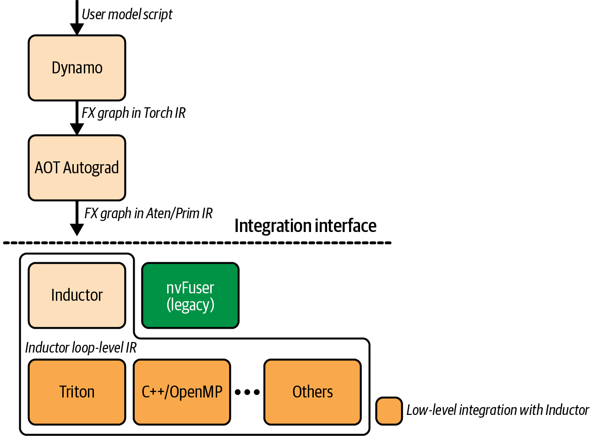
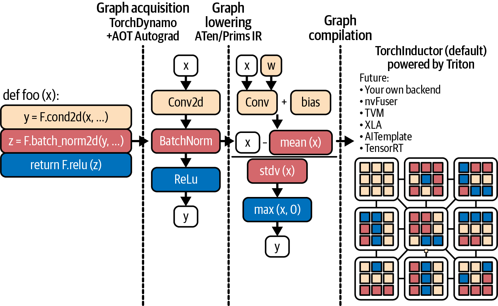
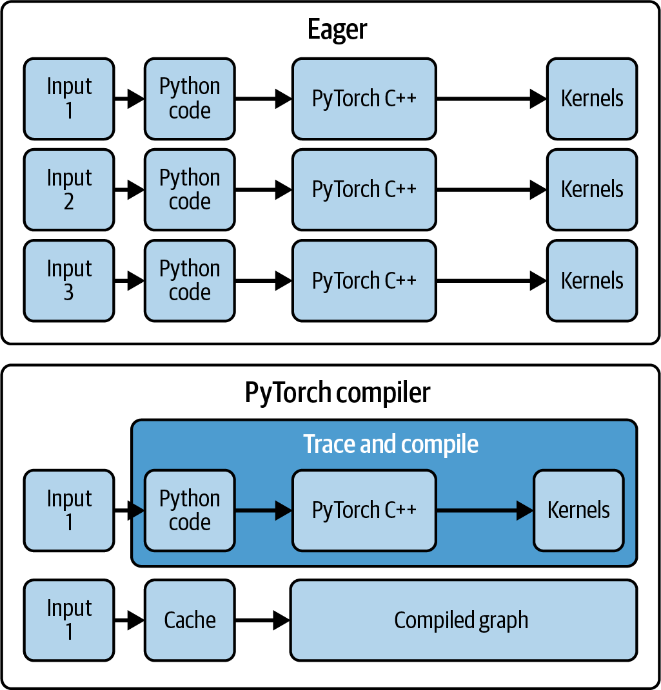
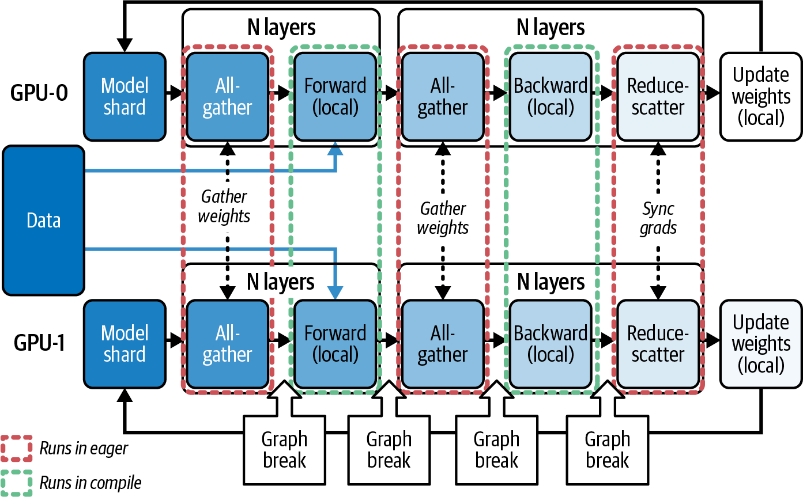
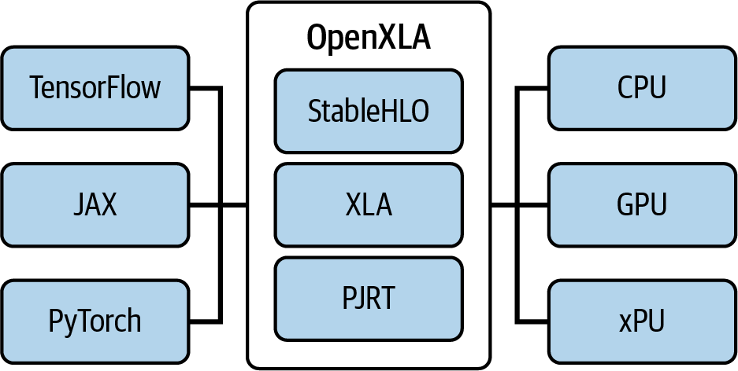

# AI Systems Performance Engineering

*Uploaded by Pedro Valera - AI Specialist*

---

## Chapter 14

# PyTorch Compiler, OpenAI Triton, and XLA Backends

# Chapter 14. PyTorch Compiler, OpenAI Triton, and XLA Backends

In Chapter 13, we discussed multiple ways to optimize and tune PyTorch-based training and inference workloads. We touched on the PyTorch compiler and how it automates kernel fusion and other kernel-level techniques to improve performance with very little changes to your code.

In this chapter, we dive deeper into the dynamic PyTorch compilation stack, including components like TorchDynamo, Ahead-of-Time Autograd (AOT Autograd), and PrimTorch Intermediate Representation (IR) (aka Prims or Prims IR)—as well as compiler backends like TorchInductor, Accelerated Linear Algebra (XLA), and OpenAI’s Triton ecosystem. The PyTorch compiler stack is shown in Figure 14-1.

We also cover tools for debugging the compilation pipeline as well as libraries for scaling PyTorch across multi-GPU and multinode clusters. We will then explore how `torch.compile` works under the hood and how to handle dynamic shapes and variable sequence lengths efficiently.

We will also examine the PyTorch compiler’s integration with the OpenAI Triton ecosystem. Our goal is to accelerate and scale our PyTorch models and applications without sacrificing the flexible, eager-execution development experience of PyTorch.



###### Figure 14-1. Overview of PyTorch compiler stack

# PyTorch Compiler Deep Dive

As described in [Chapter 13](https://learning.oreilly.com/library/view/ai-systems-performance/9798341627772/ch13.html#ch13_profiling_tuning_and_scaling_pytorch_1757308071445147), PyTorch’s `torch.compile` will compile your PyTorch code (and models) to []()[]()[]()produce significant speedups. In most cases, you can do this in just a single line of code, as shown next. We’ll talk about the different options as we go along:

```python
compiled_model = torch.compile(model,
mode="max-autotune",
# ...
)
```

This section breaks down the PyTorch compilation pipeline steps, including TorchDynamo’s graph capture, AOT Autograd’s combined forward/backward graph optimization, PrimTorch IR, and TorchInductor’s code generation. This pipeline is responsible for producing optimized kernels for the target GPU hardware and is shown in Figure 14-2.



###### Figure 14-2. PyTorch compiler pipeline (source: https://oreil.ly/55JDn)

## TorchDynamo for Bytecode Capture and Graph Extraction

TorchDynamo, or just Dynamo,[]()[]() is the first stage of `torch.compile`. It hooks into Python’s frame-evaluation mechanism to intercept model execution at the bytecode level.

Dynamo hooks into CPython’s frame evaluation to identify tensor-producing bytecode regions and constructs an execution graph for those regions. It then executes the compiled graph using the chosen backend. Unsupported code is left to run eagerly.

This interception and rewriting mechanism is what lets TorchDynamo capture sequences of PyTorch operations into a graph representation that can be optimized by the next steps, AOT Autograd and PrimTorch IR, covered in the next sections.

TorchDynamo leverages the CPython Frame Evaluation API (PEP 523) to capture the operations safely—and with minimal overhead. Normally, the Python interpreter executes each operation one by one. With Dynamo enabled, however, the interpreter redirects its execution to Dynamo, which aggregates the tensor operations into a graph before executing them. This enables whole-graph optimizations like kernel fusion, which reduces per-operation Python and host-side overhead.

Instead of launching a new GPU kernel for each operation and paying per-operation Python overhead, the compiled graph can fuse many operations into one or a few kernels. This reduces dispatch overhead and improves memory access patterns.

In Chapter 13, we saw how Python overhead and many small operations can bottleneck models. We also saw that TorchDynamo addresses this issue by batching small operations into larger units when possible—assuming the chain of operations is graph-friendly and doesn’t cause too many graph breaks.

When TorchDynamo is enabled by `torch.compile`, it inspects each Python opcode. Whenever it encounters a PyTorch tensor operation such as arithmetic or a neural network layer, it doesn’t execute it immediately. Instead, Dynamo appends the operation as a node in an FX graph and defers execution to the compiled backend for captured regions. TorchDynamo continues this process until it hits some code it can’t handle. At this point, a graph break occurs (more on this in a bit), and the unsupported operations run in regular, noncompiled eager mode.

TorchDynamo tries to compile as large a portion of your program as possible into a single graph, but it will fall back to Python eager execution when it can’t proceed due to unsupported constructs such as complex control flow or non-PyTorch library calls. It does this to ensure correctness.

After a block of unsupported operations has passed, Dynamo will resume capturing subsequent operations into a new graph after that point. This mix of compiled and noncompiled execution gives you the best of both worlds: you keep PyTorch’s flexibility where needed but compile everything else for speed.

You want to avoid graph breaks whenever possible, as they interrupt whole-graph optimizations and limit the performance benefits of the compiler.

You can use `torch.compiler.set_stance("fail_on_recompile")` to[]()[]() force Dynamo to raise an error to catch unsafe recompilations. It will log the reason for recompile and help you debug the graph break. This gives you full visibility into why your graph is splitting. The code is shown here:

```python
// fail on graph breaks, recompiles
torch.compiler.set_stance("fail_on_recompile")
compiled_model = torch.compile(model,
mode="max-autotune",
...
)
```

This way, you can refactor the code paths that are causing the break—or mark them as expected graph boundaries with `torch._dynamo.allow_in_graph()`, as you’ll see in a bit. Once your graph is clean, you can switch back to `torch.compiler.set_stance("eager_on_recompile")`. Remember, setting this back will cause TorchDynamo to silently fall back to eager mode if a subsequent graph break occurs.

The output of TorchDynamo’s capture[]()[]()[]() is called an <em>FX Graph</em> of your code. FX is an intermediate representation (IR) in which each node is a call to a PyTorch [aten](https://oreil.ly/dB_5I) operator or built-in Python function. For example, consider a simple Python function, as shown here:

```python
def f(x, y):
z = x.sin() + y
return z.sum()
```

Here, TorchDynamo will produce an FX Graph roughly equivalent to the following pseudocode:

```python
graph(): # pseudo-code for FX IR
%x : Tensor = Placeholder[target=x]
%y : Tensor = Placeholder[target=y]
%sin : Tensor = torch.sin(%x)
%add : Tensor = torch.add(%sin, %y)
%sum : Tensor = torch.sum(%add)
return %sum
```

The FX Graph nodes correspond to `Placeholder` inputs and calls to primitive ATen operations like `aten::sin`, `aten::add`, `aten::sum`, clearly representing the computation graph structure. []()[]()Once constructed, this FX Graph is handed off to AOT Autograd for combined forward-pass and backward-pass tracing.

AOT Autograd’s generated forward and backward combined trace is then sent to a backend compiler such as TorchInductor or XLA to perform kernel fusion and generate optimized device code. TorchDynamo itself remains framework-agnostic and focuses on accurate, low-overhead graph capture. TorchDynamo delegates all heavy optimizations to downstream compiler stages.

TorchDynamo inserts guards on Python values—such as tensor shapes, dtypes, and even global variables—that affect the graph trace. These guards ensure that if something changes that was assumed to be constant (e.g., tensor shape or dtype), the compiled graph is invalidated and recompiled if needed. This allows robust handling of dynamic shapes and model modifications—at the cost of additional recompilations when assumptions are violated.

It’s recommended to monitor the number of graph recompilations when using the PyTorch compiler.

Using the default `dynamic=None`, the compiler will specialize using the observed shapes. When it encounters dynamic shapes, it will recompile a more dynamic kernel. It may recompile again if it later detects additional sources of dynamism.[]()[]()

In practice, this means you’ll see one extra compilation on the first varying-shape input—and only one extra compile. If you already know which input dimensions <span class="keep-together">will vary,</span> you can use `torch._dynamo.mark_dynamic(tensor, dim)` before running your model. This will preempt the initial compile.

You can further tune the []()compiler’s “stance” with `torch.compiler.set_stance()` to change how and when TorchDynamo falls back to eager or recompiles. A stance governs the compiler’s tolerance or strictness in the face of errors or fallbacks. This gives you more control of the trade-off between developer feedback and uninterrupted execution. The following are the stances as of this writing:

The compiler tries to compile what it can, silently falling back to eager execution when unsupported code is encountered. This is the standard, default setting, which causes normal compilation behavior and fallbacks.

If a graph break or unsupported operation is encountered, the compiler raises an error. This is useful during development when you want to catch unexpected breaks or uncompiled paths.

When a recompile is necessary, run the code in eager mode. If compiled code is already cached (and valid for the input), it should still be used.

Use eager mode and ignore all `torch.compile` directives.

By capturing whole sequences of operations, TorchDynamo can perform whole-graph optimizations like kernel fusion to reduce launch overhead and minimize memory movement. It also eliminates Python-layer overhead for those fused operations. Figure 14-3 compares eager versus compiled modes, including the compiler cache.

Instead of executing each small operation and kernel launch separately, the compiler can fuse many operations into a single kernel. This reduces CPU-GPU synchronization points and improves memory locality. Otherwise, the GPU would be bottlenecked with lots of fine-grained operations, heavy synchronization, and excessive global memory accesses.



###### Figure 14-3. PyTorch eager versus compiled modes

TorchDynamo continues capturing until[]()[]() a graph break is needed. A graph break can be triggered by unsupported Python constructs (like certain control flows, e.g., an `if` statement using a Python bool instead of tensor operations) or by unsupported operations. When a graph break occurs, the current graph segment ends, and Dynamo falls back to eager mode for the code that can’t be captured. After that, TorchDynamo will start a new graph trace once it returns to traceable code.

You can successfully implement[]()[]() compiler-graph-friendly conditionals in PyTorch by expressing the logic as pure PyTorch tensor operations, including `torch.where()` with a mask. Here is an example that replaces a non-graph-friendly Python `if` statement with a pure-tensor operation masking approach:

```python
# Compute a boolean mask from a data-dependent tensor condition
# mask shape (batch_size,1) broadcastable to x’s
mask = x.sum(dim=1, keepdim=True) > 0

# Use torch.where to select element-wise between two tensor expressions
# picks f(x) where mask is True, otherwise g(x)
out = torch.where(mask, f(x), g(x))
```

This avoids a Python `if x.sum() > 0:` statement, which causes a graph break. It does this by staying entirely within PyTorch’s graph-friendly tensor operations. In this case, TorchDynamo captures the whole sequence, including the mask and `torch.where()` without breaking the graph.

With each new release, PyTorch expands which operations can be captured without causing a graph break. For instance, high-level conditional primitives like `torch.cond` can capture certain if/else logic in graphs. Specifically, both branches are traced and compiled. `torch.cond` requires a boolean scalar predicate. Both branches must return the same structure and `dtypes`. And shapes must be consistent at runtime. Data-dependent branches will often lead to graph breaks.

It’s recommended to minimize graph breaks by refactoring your code using tensor operations like `torch.where()` to maximize the continuous regions that TorchDynamo can capture.[]()[]()

## AOT Autograd Fusion for Forward and Backward Passes

Once TorchDynamo has captured an FX Graph for as much of the forward pass as possible, the next compiler phase is AOT Autograd. AOT Autograd runs the Dynamo-captured forward graph through PyTorch’s autograd engine in “functional” mode to record the backward operations. This is how the static backward graph is produced (this is in contrast to relying on PyTorch’s default autograd engine to execute the backward-pass operations one by one).

In essence, AOT Autograd generates a joint forward-backward graph that can then be optimized and fused as a whole. And it guarantees the same forward and backward results as eager mode.

AOT Autograd works by tracing the forward graph through the autograd engine to capture the gradient computations. It effectively runs the forward graph with `torch.autograd.forward_ad` (or a similar technique) to record which operations are needed for the backward computations. The result is a combined forward and backward graph. The combined graph can then be optimized using common-subexpression elimination, etc. []()[]()[]()Later, it’s compiled by a backend like TorchInductor or XLA.

By planning both the forward and backward ahead of time, the PyTorch compiler can holistically fuse across the boundary of the forward and backward passes together. This results in ahead-of-time fusion of operations that span the two phases. For example, it can fuse an elementwise operation in the forward pass with the corresponding elementwise gradient computation in the backward pass, if possible, into one kernel.

The compiler can also eliminate overhead by reusing intermediate results between forward and backward computations when safe to do so. This can improve performance greatly for model training workloads in which backward operations can dominate the overall runtime.

Without AOT Autograd, PyTorch would need to execute each backward operation separately using the default PyTorch autograd engine—independently of the forward pass. With AOT Autograd, the graph of execution is optimized holistically.

The resulting joint graph produced by AOT Autograd is guaranteed to compute the same results (this is why graph breaks are needed when the graph can’t guarantee correctness). This joint graph can be further optimized because the whole sequence of operations, forward and backward, is known.

By fusing operations and memory usage across the forward and backward passes, we reduce memory accesses and kernel-launch overhead. PyTorch’s compiled mode automatically uses AOT Autograd under the hood when you call `torch.compile` for operations and workloads that involve gradients, such as model training.

In short, AOT Autograd is used by `torch.compile` to compute gradients ahead of time during model training. It handles most autograd operations seamlessly and guarantees the same results as eager mode. It reuses buffers across the forward and backward passes to reduce peak memory usage. And while this phase is mostly invisible to the end user, it’s a key component to enabling large speedups in modern AI model training workloads.

## PrimTorch IR (Prims) Simplified Operator Set

Before handing the graph over to a low-level code generator, PyTorch performs an intermediate representation (IR) transformation known as PrimTorch IR (Prims) in some documentation and source code. PrimTorch IR is an IR that reduces the variety of operations in the graph down to a smaller core set of “primitive” operations, hence the name PrimTorch.

For context, PyTorch has thousands (> 2,000) of operations in its full API. PrimTorch IR reduces this to a much smaller set of primitives on which the compiler can focus. In practice, PrimTorch IR defines around 250 primitive operations, such as basic arithmetic, reductions, copy, reshape, etc.

Many complex or high-level[]() PyTorch `aten` operations can be decomposed into these primitives with PrimTorch IR. For instance, an “in-place” PyTorch operation like `x.add_(y)` is lowered into a functional `add` followed by an explicit `copy` back into `x`’s storage, as shown here:

```shell
%z = aten::add(x, y)
%copy = aten::copy_(x, %z) # writes z’s data into x
```

Here, the IR contains a separate `aten::copy_` node instead of a special in-place mutation. This makes all tensor updates explicit and simplifies downstream compiler kernels by treating mutations as ordinary copy operations.

Specifically, by converting in-place mutations into functional operations plus distinct copy nodes, the compiler no longer has to reason about aliasing or hidden side effects. As a result, fusion passes and memory-planning algorithms can operate on a purely functional dataflow. This allows more aggressive kernel fusion and predictable, high-performance code generation.

PrimTorch IR also helps with things like eliminating aliasing and mutation in the graph. It tries to convert operations into a form that does not perform in-place updates when possible since these can complicate optimization. []()[]()The output of the PrimTorch IR pass is an FX Graph that contains only [aten IR and PrimTorch IR operations](https://oreil.ly/BvHzg). The FX Graph is then ready for lowering by the <span class="keep-together">backend</span>.

By doing this IR standardization, PrimTorch IR provides a stable, simplified interface for compiler backends to target. Instead of having to implement thousands of PyTorch operations, a backend like TorchInductor only needs to support the 250 primitives—other higher-level operations are derived from the primitives. This greatly reduces complexity.

And since most high-level operations (e.g., 2,000+ PyTorch ops) can be decomposed into the existing primitives, the set of PrimTorch IR primitives evolves relatively slowly—even as PyTorch adds new operations to adapt to new algorithms, models, and techniques.

The stable PrimTorch IR interface means that to support a new accelerator, for example, developers need only implement the 250 primitives rather than thousands of ATen operations.

To summarize the pipeline so far: TorchDynamo captures a graph, AOT Autograd adds a backward pass and forms a joint forward-backward graph, and then PrimTorch IR canonicalizes the operations to a leaner, more primitive set. At this point, we have a fairly standard, device-agnostic representation of the whole computation—including the forward and backward passes—in terms of core operations. Now let’s turn to the actual code-generation stage performed by the compiler backend.

## TorchInductor Backend Code Generation

The final stage of the `torch.compile` stack is[]()[]() the compiler backend. TorchInductor, or Inductor, is PyTorch’s default compiler backend. Inductor takes the optimized, joined forward and backward FX Graph consisting of [aten](https://oreil.ly/BvHzg) [+ PrimTorch IR operations](https://oreil.ly/BvHzg) and generates high-performance code for the target hardware, including NVIDIA GPUs, AMD GPUs, CPUs, and <span class="keep-together">others</span>.

XLA is an alternate backend targeting non-CUDA hardware. It’s mainly used for Google Cloud TPUs through the OpenXLA project. But it can support other accelerators that adopt XLA IR. For example, Meta’s in-house inference ASIC, Meta Training & Inference Accelerator (MTIA), uses XLA. Additionally, AWS’s custom Inferentia and Trainium acclerator chips run PyTorch with an XLA compiler in its open source AWS Neuron SDK. NVIDIA GPUs typically use TorchInductor, however.

TorchInductor works by lowering the graph to a loop-level, define-by-run IR that it compiles to efficient code. Internally, Inductor represents operations as loops over multidimensional data. It automatically groups nodes from the FX Graph into fused loop blocks when possible. Each group becomes a kernel during code generation.

Inductor also supports symbolic shapes, which allow dynamic dimensions. The IR is somewhat higher-level than raw CUDA, as it represents things like elementwise computations as loops over tensor indices. The IR is user-inspectable, which helps debugging and even extending.

TorchInductor’s IR can also be used[]()[]() for ahead-of-time compilation flows with `torch.export()` and AOTInductor. AOTInductor compiles artifacts produced by `torch.export` for AOT use cases such as packaging and deployment. This allows saving and reusing the compiled code across runs. Export is highlighted in the context of `torch.compile()` in [Figure 14-4](https://learning.oreilly.com/library/view/ai-systems-performance/9798341627772/ch14.html#ch14_figure_4_1757308073242653).


###### Figure 14-4. PyTorch compile and export (TorchDynamo → AOT Autograd → PrimTorch IR → TorchInductor → Triton/LLVM NVPTX); export via torch.export/AOTInductor; CUDA Graphs are used when shapes are static

For NVIDIA GPU backends, TorchInductor uses OpenAI’s Triton JIT compiler to generate the actual GPU kernels. Triton is a CUDA-like domain-specific language (DSL) written in Python. Triton also includes a compiler for its DSL (we’ll cover Triton more in a bit).

TorchInductor translates its loop-level IR into Triton code and then uses the Triton compiler to convert the Triton code into NVIDIA PTX directly using LLVM. Remember that PTX is NVIDIA’s low-level instruction set architecture (ISA) for its NVIDIA GPUs.

Importantly, Triton lowers to NVIDIA PTX using LLVM NVPTX. It does not invoke NVCC for kernel compilation. This approach lets TorchInductor produce custom kernels on the fly that are tailored to your specific model or algorithm.

The loop-level IR is implemented in Python, which makes it easy to inspect and extend. For example, suppose a graph has an operation `z = x.permute(1,0) + x[2,:]`. Inductor might represent this operation with the following IR:

```python
def inner_fn(index: List[sympy.Expr]):
i1, i0 = index # index variables for dims
tmp0 = ops.load("x", i1 + i0*size1) # x[i1, i0]
tmp1 = ops.load("x", 2*size1 + i0) # x[2, i0]
return ops.add(tmp0, tmp1) # elementwise add

torchinductor.ir.Pointwise(
device=torch.device("cuda"), dtype=torch.float32,
inner_fn=inner_fn, ranges=[size0, size1]
)
```

Here, `size0` and `size1` are the dimensions of the input, `x`. And `inner_fn` describes how to compute one element of the output. The `Pointwise` node represents a loop nest over those ranges that applies `inner_fn` elementwise to produce the output.

This is a define-by-run style IR. By running this IR, it’s executing Python that iterates and calls `ops.load` + `ops.add`. Inductor then generates the corresponding NVIDIA PTX code using the Triton JIT compiler and LLVM.

Use `torch.library.wrap_triton` with `triton_op` to register[]()[]() a Triton kernel as a first-class PyTorch op with autograd and fake-tensor support. This means you can write a Triton kernel and have TorchInductor optimize it as part of your model graph.

## Autotuning with TorchInductor

TorchInductor includes an autotuner built on Triton’s autotuning capabilities, which we’ll describe in an upcoming section. The autotuner finds the best launch configuration for each generated GPU kernel. The autotuned configuration is cached per kernel so that subsequent runs don’t need to redo the tuning step.

The first time you compile code with the TorchInductor backend, it will spend extra time benchmarking different kernel variants using different block sizes, tile sizes, etc. Inductor picks the fastest variant and uses this going forward. Kernel autotuning increases initial compile-time latency, but the resulting kernels are highly optimized for runtime.

If you recall from the last chapter,[]() this aggressive autotuning is described as the `max-autotune` compiler mode. This is the most time-consuming compiler mode—and this is what’s happening under the hood.

Beyond kernel fusion and autotuning, TorchInductor applies many low-level optimizations. These include index simplification to reduce complex index arithmetic in loops, common-subexpression elimination within the generated code, and efficient memory planning to reuse buffers and reduce allocations.

TorchInductor also uses CUDA Graphs to capture sequences of kernels at runtime for faster graph replay with minimal CPU overhead. By default, Inductor will try to wrap its generated kernels into a CUDA Graph to reduce launch overhead on each iteration. This is especially beneficial for inference—or when running any code or model with many kernels.

The `reduce-overhead` and `max-autotune` compiler modes,[]()[]()[]()[]() described in [Chapter 13](https://learning.oreilly.com/library/view/ai-systems-performance/9798341627772/ch13.html#ch13_profiling_tuning_and_scaling_pytorch_1757308071445147), trigger the use of CUDA Graphs. However, CUDA Graphs require static shapes, so they are not used when dynamic-shape compilation is enabled. Said differently, if dynamic shapes are enabled with `dynamic=True`, TorchInductor will not use CUDA Graphs. Also, you can use `max-autotune-no-cudagraphs` when you need autotuning without CUDA Graph <span class="keep-together">capture</span>.

In general, start with the default mode and use `max-autotune` to provide additional speedup for large/critical workloads as the expense of significant compile time. You may not see much benefit for smaller models.

The end result of TorchInductor is highly optimized, device-specific code for your workload. In many cases, Inductor achieves performance close to, or even exceeding, hand-tuned libraries. For instance, Inductor can fuse an entire sequence of elementwise operations, including activations and pointwise transformations, into a single kernel. It can even fuse certain patterns of matrix multiplication followed by elementwise operations like bias-add + activation into one launch. This is relatively difficult to do by hand—and requires ongoing maintenance.

The PyTorch compiler uses heuristics and backends that may route certain operations (e.g., large GEMMs) to high-performance libraries such as cuBLAS/cuBLASLt or CUTLASS. It can even emit Triton kernels for fusable patterns. In practice, TorchInductor selects and caches whichever path performs best—or is known to be optimal for the given shapes.

For transformer models, TorchInductor will fuse the layernorm and residual connection elementwise operations around a large GEMM—while still using cuBLAS for the actual GEMM computation itself. Or, for models with irregular memory access, Inductor’s custom Triton kernel can outperform an existing library’s kernel by doing just the work that’s needed—and not benefit from a general-purpose library like cuBLAS or CUTLASS.

On modern GPUs, PyTorch’s compiler[]()[]() can work with NVIDIA’s Transformer Engine (TE) for certain transformer blocks and layers. However, PyTorch does not automatically substitute NVIDIA TE kernels when you call `torch.compile`. TE is a separate library that you must use explicitly via its modules or fused ops. But when you call TE APIs, `torch.compile` can compile and fuse around them. This complements the generated Triton kernels to provide maximum performance.

Make sure to install NVIDIA Transformer Engine[]() only if you plan to call TE modules directly in your model—for example, `transformer_engine.pytorch.layers`. `torch.compile` will not automatically swap TE kernels into a plain PyTorch model.

In essence, TorchInductor does the heavy lifting of turning code and models into high-performance GPU kernels. With each PyTorch release, hardware coverage is expanding and new optimized techniques are emerging. []()[]()For example, PyTorch provides FlexAttention, a new attention operator that TorchInductor can compile into fused kernels approaching FlashAttention performance. Specifically, FlexAttention’s fused kernels have been measured to reach up to [~85–90%](https://oreil.ly/BHIWu) of modern FlashAttention performance in both forward and backward passes, while allowing more flexibility including block-sparsity and custom masks. To enable the fast paths, set the following `torch.backend.cuda` attributes to `True`:

```python
# Ensure SDPA fast paths are enabled
torch.backends.cuda.enable_flash_sdp(True)
torch.backends.cuda.enable_math_sdp(True)
torch.backends.cuda.enable_mem_efficient_sdp(True)
```

When using `torch.nn.attention.flex_attention`, make sure your inputs meet the fast-path constraints. This way, TorchInductor can emit the fused Triton kernels.

TorchInductor and Triton support automated warp specialization on modern <span class="keep-together">GPUs. The</span> compiler will enable it selectively when it’s deemed beneficial. Warp specialization can be <span class="keep-together">tuned using</span> Triton meta-parameters such as `num_consumer_groups` and `num_buffers_warp_spec`. These optimizations further improve GEMM throughput. Triton’s automatic warp specialization supports TMA and tensor descriptor APIs on modern GPU targets including Blackwell (e.g., `tcgen05`).

It’s recommended to use descriptor-based tiled loads/stores to map to TMA and reduce register pressure. This method is preferred over manual `tl.load loops`.

In short, many models run significantly faster with `torch.compile`, though the exact gains depend on your models’ characteristics. The first time you run `torch.compile`, you pay a compile and autotune cost, but subsequent runs use the cached graph and kernels for lightning-fast execution.[]()[]()

## Dynamic Shapes and Variable Sequence Lengths

A major challenge with LLM training[]()[]()[]()[]()[]() and inference is the variable-sized sequence inputs. In traditional compilers and accelerators, varying shapes often cause recompilation or otherwise require padding inputs to a fixed, common size. This section discusses how dynamic shape tracing works in `torch.compile` to handle variable-length sequences.

Fortunately, the PyTorch compiler stack is designed to handle dynamic shapes gracefully. Specifically, it allows models to accept different input sizes without recompiling every time by using the SymPy library to represent unknown dimensions symbolically, as we’ll cover in a bit.

The PyTorch compiler will automatically mark dimensions as dynamic if it observes changes in their size. TorchInductor starts with static assumptions and then generalizes on recompile if it detects shape variability. You typically see one extra compile for the first new shape. By setting the `dynamic=True` flag upfront, you will force the compiler to consider all dimensions as dynamic from the start. However, remember that setting d`ynamic=True` will disable CUDA Graphs. Prefer marking the code with only known varying dimensions using `torch._dynamo.mark_dynamic()`.

TorchDynamo and TorchInductor insert a guard-like `sequence_length <= 256` (or whatever range you specify) during tracing on dynamic dimensions to generate code that works for a variety and range of sizes. For instance, if an output size is `x.size(0) + y.size(0)`, Inductor can represent that as a symbolic expression and ensure the generated code works for any values that satisfy the guard conditions.

When Dynamo encounters a new shape for `sequence_length`, it sets a new guard such as `sequence_length <= 1024` and compiles the kernels under this new assumption—treating the dimension as dynamic from that point on. Later, if a longer sequence is seen that violates the guard, the compiler will recompile a new version of the graph that handles the larger range. Over time, it builds up a cache of compiled kernels for each different shape range.

You can also manually mark expected dynamic dimensions on a tensor with `torch._dynamo.mark_dynamic(tensor, dim)` to preempt a recompile. You can also use `torch.compiler.set_stance()`, which lets you adjust how recompilations are handled. For instance, you can use an eager-on-recompile stance to fall back to eager mode after a certain number of recompiles. We’ll discuss best practices for avoiding recompiles in a bit.

TorchInductor attempts to generalize shapes after the first recompilation instead of repeatedly specializing on each new shape. For instance, it will emit conditional code inside the generated kernel using an `if` statement so that one kernel works for a range of `sequence_length`s without erroring out. This reduces the need for separate compilation for every single size.

Certain operations with data-dependent output ranks—or extremely complex indexing—may still trigger shape specialization. In these cases, the compiler will insert more guards—and if those are frequently violated, you might see frequent recompilations with `mark_dynamic()` or `set_stance()`.

For context, a simple but inefficient way to handle variable-length sequences without supporting dynamic shapes is to pad all input sequences to the max length in the batch. This way, you can use one static computation for all inputs. While padding simplifies the implementation, it is inefficient when input lengths vary widely since a lot of compute is wasted on the meaningless padding tokens.

Padding can hurt GPU utilization if the maximum length is much bigger than the average length of all the inputs. With dynamic shape-compilation, however, we can let the compiler generate code that only iterates up to the actual sequence length of each input. Dynamic shapes let you avoid excessive padding for variable lengths.

Let’s look at a typical text-based generative AI scenario in which sequence lengths continue to grow as the generation progresses. Compiling with dynamic shapes can consistently outperform eager execution—even as sequence length increases.

In contrast, if one were to pad everything to a power-of-two length to use static shapes, it would introduce a lot of wasted computation and increase compile time due to larger tensor sizes. In other words, using dynamic shapes provides better compile-time performance and runtime performance and easier usage since you don’t have to manually pad the inputs.

It’s recommended to bucket inputs by size in order to limit the number of distinct shapes. This will enable dynamic shapes for the remaining variability. This hybrid approach avoids excessive recompilations while still reducing padding waste.

With dynamic shapes, you can compile once and use the same compiled model on inputs of different shapes. If the variations are within the supported range, one compiled model can handle multiple configurations.

Internally, TorchInductor uses[]() the [SymPy library](https://www.sympy.org/) to represent dynamic dimensions symbolically. It will propagate these symbols through the IR so that an expression like `z.size(0) = x.size(0) + y.size(0)` can be handled symbolically. Inductor will reduce conditions to guard expressions.

If a guard fails because the dimension fell outside an expected range—or a data-dependent condition changed, Inductor will trigger a recompile. In essence, TorchInductor attempts to compile a general kernel for a range of sizes instead of a single fixed size.

Dynamic shape has significantly improved in recent releases. However, certain operations may force shape specialization if the compiler can’t handle them symbolically. In this case, the compiler might insert more guards, which, if violated often, could lead to frequent recompilations and negate the benefits of compiling.

Data-dependent control flow still triggers specialization. Use dynamic shapes for varying sequence lengths but not for truly data-dependent branches.

It’s worth noting that as of this writing, CUDA Graph replay requires static shapes (and fixed memory addresses). And only limited parameter updates are supported on instantiated graphs. Memory addresses and kernel-launch topology must remain compatible with capture. As such, enabling dynamic shapes will typically disable graph capture for those regions. This prevents the compiler from gaining the performance benefits of CUDA Graphs, including reduced kernel-launch overhead.

If you specify the `reduce-overhead` compiler mode but also set `dynamic=True`, the CUDA Graph optimization from `reduce-overhead` won’t apply since you are specifying that the shapes can vary. Enabling dynamic shapes will change guards and memory planning, which will disable graph capture. In practice, use `mode="reduce-overhead"` only with stable shapes to get CUDA Graphs. For variable sequence lengths, prefer `mode="default"` or `mode="max-autotune-no-cudagraphs"` and bucket/pad within ±10–20% to limit recompiles.

It’s recommended to profile your system to see if dynamic shapes are worth using for your use case. In certain cases, it might be better to pad to a fixed size, use static shapes with CUDA Graphs, and achieve higher throughput by not having to recompile for each unique length. In other cases, dynamic shapes will be better.

You should profile different approaches to find what works best for you. When you do this, be sure to monitor memory usage. Code that supports dynamic shapes will incur a slightly higher memory footprint due to the additional guards and generalized code needed for the maximum range.

A rule of thumb is that if your sequence lengths vary by only 10%–20%, you will likely benefit from fixed-length padding.

In short, dynamic shape support means you don’t have to disable `torch.compile` for variable-length inputs common in LLM models. By supporting dynamic shapes, the PyTorch compiler can perform kernel fusion and other optimizations across different input sizes.[]()[]()[]()[]()[]()

## Disabling the PyTorch Compiler and Reverting Back to Eager Mode

If you want to completely disable `torch.compile` without[]() changing your code—<span class="keep-together">useful</span> for A/B testing performance and isolating issues—you can use the `@torch.compiler.disable` decorator to disable compilation for that function. For region-scoped control, use `torch.compiler.set_stance()` as a context manager. This will force the code to run in eager mode. For example, you might want to disable compilation for complex data loading or one-time initialization logic to keep the compiled graph focused on computations. This is also useful around code that does not work well with tracing, as we’ll cover in a bit.

Or, you can simply change[]()[]() to use the eager backend as follows: `torch.compile(model, backend="eager")`. This will revert your code to run in eager mode. This lets you easily debug and compare correctness/performance results between compiled and eager modes.

`torch.compiler.disable()` and `torch.compiler.set_stance()` are a valuable escape hatches when certain operations don’t work with PyTorch compile—or you simply don’t want them in the graph for performance reasons. Speaking of performance, let’s explore ways to improve the performance of our compiled graphs and code using the PyTorch compiler logs.

## Performance Hints and Debugging Generated Code

Another extremely useful logging option[]()[]()[]()[]()[]()[]() to enable is `TORCH_LOGS="perf_hints"`. These logs will show you missed performance-optimization opportunities. For example, if a certain pattern could not be fused—or if a CUDA Graph could not be used—it will log a hint like “<em>PerfHint: CUDA Graph not used because input is mutated</em>” or “<em>PerfHint: fell back to eager for random op</em>,” etc. These hints guide you on what might be limiting the performance of your code or model.

For deeper performance debugging and tuning,[]()[]()[]() you likely want to see the exact code that TorchInductor generates. There are a couple of ways to inspect the code. First, you can set `TORCH_LOGS="output_code"` to print the generated code for each <span class="keep-together">compiled</span> graph. This will show the raw source code for the generated kernels. You can even modify the source code and further optimize, if needed.

You can also enable TorchInductor’s debug mode[]() by setting `TORCH_COMPILE_DEBUG=1`. When you run your program with debug mode enabled, Inductor will create a debug directory (e.g., `/tmp/torchinductor_<pid>/...`) that contains the FX Graph (`.fx`), Inductor artifacts such as `outputcode.py`, <em>fx_graph_runnable.py</em>, IR dumps, and generated Triton sources.

When reading the generated `.triton` code, you may notice Triton-specific constructs—or even raw PTX in advanced cases. If you also inspect the compiled PTX in the debug artifacts, you may see `mma.sync` instructions where `tl.dot` is lowered to Tensor Core operations. These logs, tools, and artifacts are incredibly useful for performance tuning because they let you see exactly what the compiler is doing. Understanding these can help you verify that the compiler is applying optimizations like kernel fusion, warp specialization, or double buffering. If you spot an inefficiency, you can manually create a custom Triton kernel for your specific use case.

If you’re feeling benevolent, you can even contribute your custom kernel back to the PyTorch and Triton ecosystems since it’s likely that somebody else can benefit from your optimization.

## Debugging Numerical Correctness and Accuracy

While very rare, it’s possible that `torch.compile` produces[]()[]()[]() a result that is numerically different compared to eager mode. If you suspect a bug in the compiler, there are a few strategies to verify and collect data before notifying the community and creating a GitHub issue.

First, you can use PyTorch’s minifier tools to create reproducible scripts. PyTorch has a TorchDynamo minifier tool and TorchInductor minifier tool, which will try to reduce your program to the smallest version that still reproduces the error. It’s very helpful to create a small, reproducible script for the PyTorch team to use if needed. You would attach this file to your GitHub issue if it gets to this point.

Additionally, you can configure TorchDynamo to debug numerical accuracy at each layer of the compiler stack. To help determine where a numerical discrepancy is introduced, you can set the following environment variables during compilation to compare eager mode to the different compiler stages and isolate if the issue is in TorchDynamo, AOT Autograd, or TorchInductor:

```shell
# Dump the outputs after each compilation stage
TORCHDYNAMO_REPRO_AFTER="aot"
TORCHDYNAMO_REPRO_LEVEL=4
```

These settings will cause TorchDynamo to dump the graph after each stage—and run each graph in eager mode for comparison. This can help pinpoint which stage introduced the error.

Specifically, setting `TORCHDYNAMO_REPRO_AFTER="aot"` tells TorchDynamo to dump the FX Graph and trigger the logic to generate a script to reproduce the error after the AOT Autograd stage. This is in contrast to generating the reproduction script after the initial Dynamo capture.

Using `TORCHDYNAMO_REPRO_LEVEL=4`, TorchDynamo will run each dumped graph in eager mode and compare its outputs to the compiled version. This halts and saves a minimal reproduction script if any numeric mismatch is detected.

The PyTorch compiler team loves[]() fixing correctness bugs, so if you do find a true error, report the issue on GitHub. Make sure to include the minified reproducible set of artifacts by setting `TORCHDYNAMO_REPRO_AFTER="aot"` and `TORCHDYNAMO_REPRO_LEVEL=4`.

If using random numbers (seeds) or sequences, you should make sure they are being generated consistently. By default, TorchInductor might not produce the exact same random seed or sequence as with eager mode. One reason is that fused or reordered kernels may not generate numbers in the same, expected order as eager mode.

If needed, you can set `torch._inductor.config.fallback_random=True` to force TorchInductor to generate random numbers exactly like it would with eager mode. This will incur a slight performance hit, but it may be required for numerical correctness when using the PyTorch compiler.

Numerical differences can also stem from floating-point precision. For example, if you use PyTorch automatic mixed precision (AMP) or BF16, the order of operations in a fused kernel might introduce slight numerical differences versus eager’s unfused sequence.

While such differences rarely affect convergence, they can in some cases. If you suspect precision-related instability, try disabling `torch.compile` and run the model in full FP32 to isolate the issue. You can also use `torch.set_float32_matmul_precision('highest')` to control TF32 usage and the accuracy-performance trade-off for full FP32 `matmuls` and maximum numerical accuracy.

It’s also important to understand that small discrepancies may arise from using mixed precision (e.g., FP16/BF16). You can enforce deterministic behavior by setting `torch.use_deterministic_algorithms(True)`. This causes PyTorch to throw an error if a nondeterministic operation is used. While `torch.compile` does reduce some sources of nondeterminism by design, it’s still good practice to enable this flag during debugging.

Keep in mind, however, that not all operations have deterministic implementations. For example, the default `torch.matmul()` operation that relies on cuBLAS does not have a deterministic implementation.

Specifically, the cuBLAS implementation relies on parallel optimizations like split-K, which can reduce operations in varying orders. This results in floating-point results that aren’t bitwise reproducible across runs.

As such, enabling this setting may cause your code to fail unless there is a fallback alternative available. To enforce full determinism for cuBLAS-dependent operations like `torch.matmul()`, you need to call `torch.use_deterministic_algorithms(True)` and set the `CUBLAS_WORKSPACE_CONFIG` to a fixed size, as shown here:

```shell
# Set this before starting the Python/PyTorch process
export CUBLAS_WORKSPACE_CONFIG=:4096:8 # or :16:8

# Use this with the PyTorch process
torch.use_deterministic_algorithms(True)
```

Here, the first value (e.g., `4096` or `16`) selects the size of the cuBLAS workspace buffer in bytes rounded to an internal bucket. The second value (e.g., `8`) selects how many such buffers are reserved. Set either `:4096:8` or `:16:8` as documented to enforce deterministic algorithms.

To force cuBLAS to use deterministic algorithms under `torch.use_deterministic_algorithms(True)`, set `CUBLAS_WORKSPACE_CONFIG` to a supported value like <span class="keep-together"><code>:4096:8</code></span> or `:16:8`, as documented. If you enforce determinism without setting this, PyTorch will raise at runtime for operations that would otherwise select nondeterministic cuBLAS algorithms.

Always test determinism on your actual hardware and model configuration to confirm reproducibility.

Also, for critical workloads, you might temporarily disable certain compiler optimizations by setting flags like `torch._inductor.config.triton.cudagraphs=False` to better isolate the cause of a discrepancy. This disables CUDA Graph capture for TorchInductor-generated Triton kernels.

Debugging PyTorch compiler optimizations[]() requires a slightly different mindset <span class="keep-together">since you’re</span> looking at the meta-level execution steps through logs and graph <span class="keep-together">visualizations—in</span> addition to the low-level generated code. Tools like `torch._dynamo.explain()` give a high-level overview of how your code is converted into graphs, graph breaks, and subgraphs, while the various `TORCH_LOGS` options let you peek into the decisions that the compiler makes—as well as the exact code that it generates.

In short, with these combined tools and debugging mechanisms, you can iteratively eliminate graph breaks and make sure your model and code are fully captured and optimized. The payoff is worth it, as a well-compiled model can significantly outperform its eager-execution counterpart—especially for large LLM architectures in which every bit of performance improvement will add up.

# Explaining and Minimizing Graph Breaks

When using `torch.compile`, diagnosing performance[]() and correctness requires <span class="keep-together">specialized</span> tools. In this section, we’ll show you how to use various tools and best <span class="keep-together">practices to</span> debug and pinpoint excessive graph breaks. These include `torch._dynamo.explain()`, environment variables to log compiler decisions, and best practices for debugging both the captured graphs and the kernels that they <span class="keep-together">generate</span>.

## Graph Breaks and TorchDynamo explain()

A graph break occurs when TorchDynamo cannot continue capturing a continuous sequence of operations into a single graph. When this happens, it falls back to eager execution for this part of the code.

Graph breaks are the enemy of performance. Each break means an optimized graph is cut short—and more Python overhead is introduced. If you compile a model and see only modest speedups, it may be caused by frequent graph breaks that are preventing large, fused graphs. Ideally, we want as few breaks as possible—ideally one large graph for the whole model or whole training step.

Complex graphs that involve collective communications (e.g., all-gather, reduce-scatter, etc.) often require graph breaks. Figure 14-5 shows the graph breaks in PyTorch’s FSDP strategy due to collective communication.



###### Figure 14-5. Graph breaks in PyTorch FSDP caused by communication layers (source: https://oreil.ly/TJW42)

PyTorch provides `torch._dynamo.explain()`[]()[]()[]()[]() to help analyze and debug graph breaks. When invoking this debugging function with your model and example inputs, it will run the model within TorchDynamo and return a report of how many graphs were generated, where the breaks occurred, and why they happened, as shown here, followed by the detailed graph-break analysis and explanation:

```python
import torch._dynamo as dynamo

def toy_example(a, b):
x = a / (torch.abs(a) + 1)
print("woo") # a print statement in the model
if b.sum() < 0: # dynamic control flow depending on data
b = -b
return x * b

explanation = dynamo.explain(toy_example)(torch.randn(10), torch.randn(10))
print(explanation)
```

```shell
Graph Count: 3
Graph Break Count: 2
Op Count: 5

Break Reasons:

Break Reason 1:
Reason: builtin: print [...ConstantVariable] False
User Stack:
<frame at toy_example: line 3, in toy_example>

Break Reason 2:
Reason: generic_jump TensorVariable()
User Stack:
<frame at toy_example: line 5, in toy_example>

Ops per Graph:
...
```

Here, the explanation shows that TorchDynamo splits the code into three graph segments across two graph breaks. Note the “User Stack” portions of the output that point to the specific line of code where the issue happens. This is very useful for pinpointing the code causing the graph break.

The first break is caused by the `print("woo")` near line 3. Because `print()` has a “side effect” of writing text to `stdio`, it isn’t capturable. As such, Dynamo breaks the graph into two graphs: before and after the `print()`.

The second graph break is caused by the dynamic control flow logic `if b.sum() < 0:` near line 5, which Dynamo couldn’t handle in a single graph because of the data-dependent dynamic control flow logic used in this specific scenario—and mentioned as a limitation in a previous section.

Using `dynamo.explain()` on your model—with representative inputs—is one of the first things to do if you’re not getting the performance you expect from the PyTorch compiler. It gives you a quick overview of how many graphs were made—and why it couldn’t make just one large graph.

Once you understand the causes, you can refactor the code to address the graph breaks one by one. In the preceding example, you can remove the `print()` or wrap it in a guard such as `if not torch._dynamo.is_compiling()` to avoid executing during tracing, as shown here:

```python
import torch

def model(a, b):
x = a / (torch.abs(a) + 1)

# avoid during compiling/tracing
if not torch._dynamo.is_compiling():
print("do not print during tracing/compiling")

if b.sum() < 0:
b = -b
return x * b

explanation = dynamo.explain(model)(torch.randn(10),
torch.randn(10))
print(explanation)
```

As mentioned earlier, if your model[]() truly needs data-dependent branches, you can wrap them in `torch.cond()`. This will capture both the “true” and “false” branches as graph subroutines, as shown here:

```python
import torch

def model_cond(a: torch.Tensor, b: torch.Tensor) -> torch.Tensor:
# Compute x as before
x = a / (torch.abs(a) + 1)

# Retain the compile-time check as a
# Python-level guard
# Avoid side-effects during tracing/compilation
if not torch._dynamo.is_compiling():
print("do not print during tracing/compiling")

# Handle the data-dependent sign flip on b
b = torch.cond(
b.sum() < 0, # predicate (0-dim bool tensor)
lambda b: -b, # true_fn: flip sign
lambda b: b, # false_fn: leave unchanged
(b,) # operands tuple
)

return x * b

# Generate and print the Dynamo explanation just like before
explanation = dynamo.explain(model_cond)(torch.randn(10), torch.randn(10))
print(explanation)
```

Here, the predicate `b.sum() < 0` must be either a Python `bool` or a one-element `torch.bool` tensor. The `true_fn` and `false_fn` are callables taking the same operands (here, just `(b,)`) and returning tensors of the same shape and dtype.

This code keeps the Dynamo compile-time check (`dynamo.is_compiling()`) as a Python `if` since it’s not data-dependent at runtime and we want to avoid side-effects (e.g., `print`) during tracing.

Note that `torch.cond()` currently only accepts a tensor predicate,[]() requires both branches to have the same inputs and return a single tensor of identical shape and dtype, and does not allow in-place mutations or arbitrary side-effects.

In contrast, you can use a pure-tensor masking approach with `torch.where()`, as described earlier. This will impose no such restrictions and avoids graph breaks, making it the simpler, more reliable choice when you don’t need the full expressivity of `torch.cond()`. This code is shown here:

```python
import torch
import torch._dynamo as dynamo

def model_where(a: torch.Tensor, b: torch.Tensor) -> torch.Tensor:
# Compute x as before
x = a / (torch.abs(a) + 1)

# Preserve compile-time guard to avoid side-effects during tracing
if not torch._dynamo.is_compiling():
print("do not print during tracing/compiling")

# Data-dependent branch expressed using torch.where
b = torch.where(
b.sum() < 0, # predicate: a 0-dim bool tensor
-b, # true branch: flip sign
b # false branch: unchanged
)

return x * b

# Display the Dynamo explanation just as before
explanation = dynamo.explain(model_where)(torch.randn(10), torch.randn(10))
print(explanation)
```

Here, `torch.where(condition, input, other)` returns a tensor selecting elements from `input` where `condition` is `True` and from `other` where `condition` is `False`. Because `b.sum() < 0` produces a 0-dimensional Boolean tensor, it can be broadcast across all elements of `b`. This allows a single, vectorized sign flip instead of an elementwise Python `if`.

Using `torch.where()` can avoid graph breaks in compiled and traced pipelines. This allows TorchDynamo to optimize operations inline.

It’s also helpful to use `torch.compiler.set_stance("fail_on_recompile")` to force[]() an error and refuse to run if the code is not cleanly capturable into a full graph. This is useful during development since it lets you catch graph breaks upfront at compile time instead of silently falling back to slower PyTorch eager execution.

`torch.compiler.set_stance("fail_on_recompile")` is also useful[]()[]() to add in your CI build to catch any graph breaks introduced later in the development process. Having robust and continuous performance-regression tests is extremely important throughout the life of a project.

## Minimize Graph Recompilations

Besides graph breaks, you should also monitor the number of recompilations. TorchDynamo might be compiling the graph many times if its guards keep invalidating input tensor shapes, etc. If a tensor’s shape changes at runtime, the guard fails and triggers a recompile. If you see more recompiles than expected, investigate which guard (shape, dtype, etc.) is causing it—and address the issue.

Typically, you’ll notice recompilations happening because iterations will continue <span class="keep-together">to be</span> slow—even after the initial warm-up/compile iterations. Fortunately, you can have PyTorch log each guard evaluation and any trigger recompilation using `TORCH_LOGS="graph_breaks,recompiles,guards"`.

If you observe frequent guard failures, it often means a Python-side constant, such as a random number seed, timestamp, or loop-varying value, is changing on every iteration—and continuously invalidating the guard and triggering a recompile. In this case, you’ll need to ensure those values are either made static or handled with the dynamic-shape APIs presented earlier (e.g., `torch._dynamo.mark_dynamic`). This will help avoid needless and excessive recompiles.

There are a few common mechanisms to minimize graph recompilations depending on the situation. First, for the constant scenario just mentioned, you can pass the constant into the code block as a tensor to prevent the compiler from guarding on the value and repeatedly failing.

Next, as mentioned earlier, you can mark dynamic dimensions that you know will change using `torch._dynamo.mark_dynamic(tensor, dim)` to preempt a recompile. Another option is to use `torch.compiler.set_stance("eager_on_recompile")` to avoid repeated recompiles by falling back to eager mode after <em>N</em> number of recompiles. This effectively caps the limit of recompilations.

Another option is to explicitly mark that part of the graph as safe using `torch._dynamo.allow_in_graph`. Let’s dive into this technique a bit more in the next section.

## Mark Functions and Code Blocks as Safe with allow_in_graph

When TorchDynamo doesn’t know how[]() to handle a function or code block because it’s using unsupported operations, for example, you can decorate the function or wrap the code with `torch._dynamo.allow_in_graph`—as either a Python decorator or context manager—to tell Dynamo that it has no side effects. When you do this, Dynamo will then include the code in the trace using a more lenient analysis and acceptance policy. `allow_in_graph` bypasses some Dynamo safety checks. As such, prefer fixing the root cause of graph breaks first.

This is an advanced feature and should be used carefully. You are essentially promising that the function is pure, always returns the same output tensor for the same input tensor, depends only on its tensor inputs, and has no side effects. If used incorrectly, you may silently get the wrong results. However, when used correctly, it can be a performance lifesaver if a specific function or code block is causing a graph break even though it’s safe to be traced.

In general, you should use `allow_in_graph` sparingly. It’s a tool for power users to override Dynamo’s conservative nature—but only when you’re absolutely sure that the function does not have side effects or hidden state that could impact the code’s correctness.

## Tips for Handling Graph Breaks

Graph breaks limit the compiler’s ability to perform large optimizations such as fusing many kernels into a smaller number of efficient kernels. This forces PyTorch to fall back to slower eager execution for certain parts of the graph.

It’s critical to understand what triggers graph breaks—and how to prevent them. Here are some common causes of graph breaks and tips on how to minimize them:

TorchDynamo can handle some mutations using a mechanism called <em>functionalization</em>, which converts in-place operations to out-of-place for tracing. But certain in-place operations might still cause a graph break. If you see a break reason about mutation, such as “mutation on data” or “modifying a global,” try to rewrite that part to avoid in-place operations. Often, you can simply rewrite in-place `x.relu_()` to out-of-place `x = x.relu()` to avoid a graph break if being in-place was causing the issue.

Appending to a Python list of tensors inside a function will confuse TorchDynamo since it doesn’t trace growing lists very well. Try to preallocate tensors or use tensor operations like `torch.stack()` instead of building Python (non-PyTorch) lists dynamically. Calls to many Python libraries, including I/O operations, `print`, `logging`, and `math.*` functions will most likely cause a graph break. It’s recommended to remove these from the performance-critical code paths.

It’s always recommended to use the PyTorch equivalent of Python data structures, collections, and tensor operations whenever possible. These are heavily optimized for PyTorch compilation, GPU processing, and distributed data transfers, which are common in PyTorch-based AI applications and models.

If you have `if tensor.sum() > 0:` style logic, TorchDynamo cannot easily trace through this because the condition is unknown at compile time. It would need to choose one branch or the other based on the first run, guard on that condition, and enforce this guard for subsequent invocations. Since this is incorrect, Dynamo will create a graph break.

PyTorch supports a high-level operation called `torch.cond()` to capture certain dynamic flows in graphs. This can encapsulate `if/else` statements such that both branches are compiled. However, it requires the condition to be a tensor and typically works best for things like parameter-dependent switches rather than arbitrary Python logic.

Apart from this, most data-dependent control flow still breaks graphs. Continue to prefer tensor operations (`torch.where()`, masks, etc.) when possible. If neither `torch.cond()` nor refactoring is feasible, you may have to accept the graph break and its performance impact.

PyTorch’s DDP works with TorchDynamo by explicitly breaking graphs at synchronization points, including the all-reduce buckets. You might see breaks in the explain output related to `allreduce` or `torch.distributed` ops. This is expected, as PyTorch may compile each gradient bucket’s reduction separately so that it can remove overlap communication with backward computation.

You can’t avoid graph breaks at DDP communication boundaries if you want to preserve compute-communication overlap. PyTorch’s compiler and DDP intentionally insert breaks at each all-reduce bucket so that gradient synchronization happens between subgraphs. This lets one bucket’s communication overlap with the backward computation of the next bucket.

While this does prevent a single monolithic graph, it preserves performance. TorchDynamo + DDP runs with similar performance to eager-mode DDP. And it can even outperform eager DDP at scale. So, although you can’t eliminate these communication graph breaks, they are necessary to achieve correct and efficient distributed training with the proper overlap.

PyTorch supports FSDP in compiled mode by using `use_original_params=True`. A best practice is to wrap submodules, like each transformer block, into their own FSDP submodule. Dynamo will then create explicit graph breaks at each FSDP submodule boundary. This allows each shard’s communication to overlap with computation, similar to the bucketization strategy described for DDP.

Compiled FSDP fuses forward and backward passes and reuses buffers across model shards using AOT Autograd and Inductor’s memory planner. As such, only the active parameter slices and minimal intermediate memory buffers are resident on each GPU. This reduces peak memory usage compared to DDP or eager mode.

The memory savings comes from avoiding redundant gradient storage, reusing intermediate allocations, and overlapping communication with computation across shards. And these allow larger models to fit into each GPU. If you don’t wrap submodules individually, FSDP falls back to treating all parameters as one big bucket. This still works, but it limits memory benefits and overlap potential. As such, combining `torch.compile` with per-module FSDP wrappers is recommended for maximum speed and memory efficiency—especially on large-scale training jobs.

Debugging can be very complex if issues arise—and even more complex in a larger cluster/configuration. Always test <span class="keep-together">on a</span> smaller configuration when using FSDP with `torch​.com⁠pile`.

If you rely on a custom or third-party CUDA extension that PyTorch doesn’t know about, Dynamo will create a graph break because it can’t reason about what that operation does—or whether it’s safe. If it’s performance-critical, consider rewriting the custom operation in Python using Triton.

PyTorch supports `torch.library.triton_op()` API that lets you integrate Triton kernels as custom operations into PyTorch seamlessly. This lets the compiler peek inside the Triton code to perform optimizations. Before diving into Triton, let’s quickly summarize how to debug various compiler phases, graph breaks, and compiler performance.

Many popular third-party libraries now provide either a Triton implementation or Dynamo/FX wrappers for their operations. Check if these exist before writing your own.

# Debugging Compiler Phases, Graph Breaks, and Performance

You can log and debug different types[]()[]()[]()[]()[]()[]()[]()[]()[]()[]()[]() of compiler events at runtime by setting various environment variables such as `TORCH_LOGS`, `TORCH_COMPILE_DEBUG`, and `TORCH​DYNAMO_REPRO_*`. These include graph breaks, recompiles, guards, and other compiler decisions. An example of setting `TORCH_LOGS` is shown next (see [Table 14-1](https://learning.oreilly.com/library/view/ai-systems-performance/9798341627772/ch14.html#ch14_table_1_1757308073250040) for common values):

```shell
# "graph_breaks", "dynamo", "aot_graphs", "inductor",
# "graph_outputs", "graph_code", "dynamic", "perf_hints",
# "output_code", "recompiles", "guards", etc.
TORCH_LOGS="graph_breaks" python train.py
```

This will cause PyTorch to print out whenever a graph break occurs. []()[]()[]()[]()To summarize the different logging options, you can set `TORCH_LOGS` to the following to debug `torch.compile`, including the different phases (TorchDynamo, AOT Autograd, and TorchInductor), graphs, graph breaks, generated code, performance, recompiles, and guards—as well as compiler decisions and performance, as shown in [Table 14-1](https://learning.oreilly.com/library/view/ai-systems-performance/9798341627772/ch14.html#ch14_table_1_1757308073250040).

These settings can be useful if you suspect an issue in how the subgraphs were segmented—and which shapes were compiled. With these settings, you will get a lot of internal debugging information without changing your code.

Be prepared for very verbose output. It’s recommended to start with just `"graph_breaks"` when debugging just graph breaks, for example.

Under the hood, setting `TORCH_LOGS` is analogous to using the `torch._logging​.set_logs()` API. However, setting `TORCH_LOGS` is sometimes easier to configure externally as an environment variable.

And remember that you can[]() also set `TORCH_COMPILE_DEBUG=1` to enable <span class="keep-together">TorchInductor’s</span> debug mode. This will log the FX Graph, the TorchInductor IR, the generated Triton code, and an HTML report with visualizations if Graphviz is installed.

You can also set `TORCHDYNAMO_REPRO_AFTER` and `TORCHDYNAMO_REPRO_LEVEL` to force TorchDynamo[]()[]() to dump its graph after each stage. It will also perform a runtime comparison against a noncompiled, eager-mode version of the code.

It’s also possible to trace through compilations logs using a tool called [tlparse](https://github.com/pytorch/tlparse). Trace logs are useful for debugging compilation events (e.g., recompilations) as well as generating bug reports.

To enable trace logs, specify the <em>trace-log</em> directory using the `TORCH_TRACE` environment variable. Then run `tlparse` on the <em>trace-log</em> directory to produce a tree representation of stack frames as shown here:

```shell
- /workspace/networks/layers/transformer.py:634 in forward
.../torch/nn/modules/module.py in _wrapped_call_impl
.../torch/nn/modules/module.py in _call_impl
- [2/2] [2/3] ../torch/_dynamo/convert_frame.py in __call__
- /workspace/networks/layers/transformer.py:753 in forward
- [8/2] [8/3] .../torch/_dynamo/convert_frame.py in __call__
...
```

In addition, you can use the Perfetto UI to display a trace timeline visualization. And since tracing incurs minimal overhead, it’s even possible to enable `TORCH_TRACE` in production.

Let’s now dive deeper into OpenAI’s Triton language and compiler used by TorchInductor. We’ll write some basic and advanced Triton kernels and then register them with PyTorch.

# Writing Custom Kernels with OpenAI Triton

Up until now, we’ve only briefly mentioned OpenAI’s open source Triton language and compiler. Now it’s time to dive deeper since TorchInductor uses Triton as its backend code-generation implementation—and because Triton is growing in popularity with backing from large companies like OpenAI.

As mentioned, Inductor uses Triton to generate optimized GPU kernels under the hood. By examining, understanding, and customizing these kernels, you can further improve performance beyond what TorchInductor could produce. Learning Triton is critical to performance optimizations in a PyTorch and NVIDIA GPU environment.

At a high level, OpenAI Triton is an open source, Python-native domain-specific language (DSL) for writing GPU kernels in familiar Python. Triton also includes a JIT compiler that converts Triton code into NVIDIA PTX code directly. In other words, Triton lets you create high-performance custom GPU operations in Python—without writing CUDA C++ by hand. Triton remains tightly integrated with PyTorch, making it the go-to choice for custom GPU kernels in this ecosystem.

Writing a GPU kernel in Triton is much more familiar and simpler than CUDA C++. This is especially true for researchers who prefer to stay in Python, iterate quickly, and not worry about complex C++ templates or detailed memory management. They simply don’t need to use C++ in an era when GPU-performance-focused compilers like PyTorch and Triton exist.

NVIDIA has recognized this trend. In 2025,[]()[]()[]() they announced Python-centric CUDA libraries (e.g., cuTile, CuTe Python DSL, CUTLASS Python DSL, and cuPyNumeric `numpy` replacement). These are essentially competing libraries to Triton. Integration with `torch.compile` continues to evolve, and as of this writing, TorchInductor still uses Triton as its primary GPU code generation path.

While PyTorch’s `torch.compile` automates a lot of kernel generation, custom Triton kernels can squeeze out the last drops of performance—especially for operations outside of TorchInductor’s current scope like complex sparse patterns and novel layer types. It’s sometimes possible to beat the performance of TorchInductor’s generated code—especially if you have domain-specific knowledge. However, this is very advanced and will require ongoing maintenance and potential rewrites for new hardware support.

Let’s now start with a quick Triton programming primer. Then we’ll dive into some interesting Triton topics, including accessing shared-memory, registering a Triton kernel with PyTorch, autotuning kernel-launch parameters, and profiling. Then we’ll progress to cover advanced Triton topics such as warp specialization and software pipelining (e.g., double buffering).

## Triton Programming Model

Triton uses a single-program, multiple-data (SPMD) model, as opposed to CUDA’s SIMT model. This is significant because Triton intentionally abstracts away the low-level details of CUDA instructions and threads.

Triton kernels (aka programs) operate at a higher level by running instances of the program on separate thread blocks (aka cooperative thread arrays, or CTAs) as the fundamental unit of compute. This is in contrast to CUDA kernels, which run on individual threads in a thread block.

The community tends to use Triton kernel and Triton program interchangeably—typically preferring Triton kernel, so this book uses Triton kernel for the most part.

You write a Triton kernel with the Triton Python DSL. Then the Triton JIT compiler compiles the kernel into GPU code that runs many parallel instances of this kernel. Each program instance maps to a CUDA thread block.

Triton kernels (aka <em>programs</em>) are defined by decorating a Python function with <span class="keep-together"><code>@triton.jit</code></span>. Within the kernel, you use special primitives from the `triton.language` module, commonly aliased as `tl`, to work with memory pointers, perform vectorized loads/stores, and compute per-program indices using `tl.program_id` and block offset arithmetic.

Triton’s SPMD model means you typically work with vectorized operations such as adding two `tl.arange` vectors. The Triton compiler maps vectorized SPMD code across the threads in a CUDA block. There is no guaranteed one-element-to-one-thread mapping.

You don’t explicitly need to manage individual threads or warps with Triton since its compiler does this for you. Here is a simple Triton kernel that adds two vectors of equal size, `n_elements`, in this case:

```python
import triton
import triton.language as tl

BLOCK_SIZE = 1024

@triton.jit
def vector_add_kernel(x_ptr,y_ptr,out_ptr,n_elements,BLOCK_SIZE: tl.constexpr):
pid = tl.program_id(axis=0) # unique program ID for each block
block_start = pid * BLOCK_SIZE
# each program handles BLOCK_SIZE elements
offsets = block_start + tl.arange(0, BLOCK_SIZE)
# Create a mask to guard against out-of-bounds
# (if n is not divisible by BLOCK_SIZE)
mask = offsets < n_elements
x = tl.load(x_ptr + offsets, mask=mask) # masked load
y = tl.load(y_ptr + offsets, mask=mask)
result = x + y
tl.store(out_ptr + offsets, result, mask=mask) # masked store
```

Here, you see that Triton abstracts away threads and warps. Note that `BLOCK_SIZE` is a compile-time constant that defines how many elements each program instance <span class="keep-together">processes</span>. The number of threads per CUDA block is controlled by the kernel’s configuration using `num_warps` and is not equal to `BLOCK_SIZE`.

Specifically, in the preceding code, `tl.arange(0, BLOCK_SIZE)` returns a vector of indices of size `BLOCK_SIZE` (`[0, 1, ..., BLOCK_SIZE-1]`). We add `pid * BLOCK_SIZE`, or `block_start`, to the vector of indices in order to derive the actual indices, `x_ptr + offsets` and `y_ptr + offsets`, into each vector for this instance of the kernel running on a thread block.

Assuming we launch enough Triton kernel instances to cover the total number of elements, `n_elements`, in each of the vectors, this kernel will add together every element of the two vectors, `x_ptr` and `y_ptr`, and store the result in `out_ptr`. In essence, <span class="keep-together">Triton</span> lets you write kernel logic in a tensorized manner.

Here, for example, we operate on a whole block of indices (`offsets`) at once. The <span class="keep-together">Triton</span> compiler takes care of splitting this work among actual GPU threads and makes sure that memory accesses (`tl.load` and `tl.store`) are coalesced when <span class="keep-together">possible.</span>

To launch instances of this Triton kernel, pass a grid function that computes the number of program instances from `meta['BLOCK_SIZE']`:

```python
import triton

def grid(meta):
return (triton.cdiv(n_elements, meta['BLOCK_SIZE']),)

vector_add_kernel[grid](x_ptr, y_ptr, out_ptr, n_elements, BLOCK_SIZE=1024)
```

Here, the code uses a mask to avoid out-of-bounds memory access when `n_elements` isn’t a multiple of `BLOCK_SIZE`. This is similar to earlier chapters on CUDA in which we used `if (idx < N)` within our kernel to avoid out-of-bounds index errors.

The use of a mask in loads/stores is a clever and convenient way to handle boundary conditions without requiring explicit checks or if/else branches.

Under the hood, Triton converts this program[]()[]()[]() to NVIDIA PTX such that each program uses a single CUDA thread block. Each program maps to a CUDA thread block. `tl.arange` produces per-lane indices within the program, and the compiler maps this vectorized index space across the thread in the block. You can also manage multidimensional indices for matrix operations in a straightforward way. Triton will automatically handle vectorizing your arithmetic and memory operations for you.

In short, Triton gives you the productivity of Python with the performance of optimized CUDA C++ kernels. It also lets you drop down into low-level optimizations to manipulate and utilize the full memory hierarchy (e.g., shared-memory tiling, etc.), as we demonstrate in the next section.

## Accessing Shared Memory in Triton

Efficient Triton kernels take advantage of the L2 cache and software-managed shared memory on each SM. When using shared memory, each thread block loads a tile from both matrix A and B into shared memory. This is in contrast to each thread repeatedly loading the same values from global memory.

The kernel then reuses those tiles for multiple computations. This better utilizes the on-chip memory caches and reduces the amount of data traveling between global HBM and the registers.

Triton does not expose an explicit shared-memory allocator. Instead, it stages tiles in on-chip shared memory using tensor descriptors (`tl.make_tensor_descriptor(...)`) and an asynchronous pipeline using the intended shapes and strides. This way, you can issue loads and stores through those descriptors inside a pipelined `tl.range(..., num_stages=...)`. This loop lowers to `cp.async`, TMA, and barriers.

## Registering Custom Kernels with PyTorch

After writing a Triton kernel, you can[]()[]()[]()[]()[]() register it as a custom operation in PyTorch using `torch.library.triton_op`. This makes the Triton kernel visible to `torch.compile` without treating it as an opaque, black-box operation that could fall back to eager execution mode. This way, the compiler knows about the Triton kernel, includes it during graph capture, and optimizes it along with the rest of the graph. This allows additional optimizations such as fusion.

Registering the Triton kernel helps avoid graph breaks when using custom Triton kernels/programs with the PyTorch compiler. Here is an example of registering and calling the Triton kernel `vector_add_kernel` from PyTorch:

```python
import torch
import triton
import triton.language as tl
from torch.library import triton_op, wrap_triton
from torch import Tensor

# Triton compute kernel
@triton.jit
def vector_add_kernel(
x_ptr, y_ptr, out_ptr, n_elements,
BLOCK_SIZE: tl.constexpr
):
pid = tl.program_id(0)
start = pid * BLOCK_SIZE
offsets = start + tl.arange(0, BLOCK_SIZE)
mask = offsets < n_elements
x = tl.load(x_ptr + offsets, mask=mask)
y = tl.load(y_ptr + offsets, mask=mask)
tl.store(out_ptr + offsets, x + y, mask=mask)

# Register as a Triton-backed PyTorch op
@triton_op("my_triton_lib::vector_add", mutates_args=())
def vector_add(x: Tensor, y: Tensor) -> Tensor:
assert x.device.type == "cuda" and y.device.type == "cuda"
n = x.numel()
out = torch.empty_like(x)
# Compute grid size
def grid_fn(meta):
return (triton.cdiv(n, meta["BLOCK_SIZE"]),)
# Wrap and launch the Triton kernel
wrap_triton(vector_add_kernel)[grid_fn](x, y, out, n, BLOCK_SIZE=1024)
return out

# Usage
a = torch.randn(10_000, device="cuda")
b = torch.randn(10_000, device="cuda")
c = torch.ops.my_triton_lib.vector_add(a, b)
```

Here, `triton_op("my_triton_lib::vector_add", mutates_args=())` registers the operator name and mutation metadata (empty) with PyTorch. Then `wrap_tri⁠ton​(vector_add_kernel)` wraps the raw Triton kernel into a callable that the compiler can inline and optimize within the `torch.compile` graph. The compiler will then fuse, reorder, and inline this kernel within the rest of the `torch.compile` graph.

Registering forward-only operations is straightforward. However, to leverage PyTorch’s automatic differentiation for full training support, you typically need to implement and register a custom backward computation. Otherwise, you need to compose it from existing differentiable primitives.

For training support, register an autograd formula using `vector_add.register_autograd(backward, setup_context=setup_context)`. If you prefer, you can wrap the logic in a `torch.autograd.Function` and register both the `forward` and `backward` arguments. However, `register_autograd` is the recommended path for `torch.compile` composability.

If OpenAI Triton doesn’t support something that you need—or doesn’t provide the performance that you expected—you can rewrite the kernel using CUDA C++ with a library like CUTLASS for efficiency. We would then register the CUDA C++ extension with PyTorch in a similar manner, including registering the autograd gradient computation for the backward pass.

## Tuning Kernel-Launch Parameters

Triton programs typically use 4 warps,[]()[]()[]()[]() or 128 threads, per block for many kernels. However, with modern GPU hardware’s larger shared memory and register file sizes per SM, you can typically push `num_warps` higher to 8 or 16 warps per block. For instance, you can increase `num_warps` to 8 when `BLOCK_SIZE >= 2048` and to 16 when `BLOCK_SIZE >= 4096`.

The number of warps is dependent on whether your kernel can make use of the parallelism without causing excessive contention. The optimal setting depends on the kernel’s arithmetic intensity and memory access pattern.

Consider launching a kernel as follows: `my_kernel[grid](..., num_warps=8)`. In this case, we are specifying 8 warps (256 threads) per Triton kernel. This configuration is typically effective for compute-heavy kernels. However, memory-bound kernels might still top out around 4 warps due to memory throughput limits.

For memory-bound kernels, using more warps per thread block can help hide memory latency by doing more in parallel. But too many warps per thread block can cause contention or cache thrashing.

New GPU generations are gaining more SMs and wider memory buses. This lets us increase the number of warps per block from the default 4 warps to 8 or 16 warps. This helps to increase occupancy, cover more memory-access latency, and saturate the available memory and compute.

Manually exploring combinations of `BLOCK_SIZE` and `num_warps` for each kernel can be tedious. As such, it’s usually best to use Triton’s built-in autotuner. This will benchmark and automatically pick the optimal `BLOCK_SIZE`, `num_warps`, tile size, and other parameters for you. Let’s explore the autotuner in the next section.

## Autotuning Triton Kernels

GPU kernel performance is highly sensitive[]()[]() to compile-time parameters such as tile dimensions, warp counts, loop unrolling stages, and the use of on-chip resources like registers and shared memory. Triton’s built-in autotuner automates the search for these optimal settings by letting you decorate a `triton.jit` kernel with `@tri⁠ton​.autotune`. You can pass in a list of `triton.Config` objects that describe the <span class="keep-together">different</span> candidate combinations of `BLOCK_SIZE`, `num_warps`, `num_stages`, tile size, and other kernel meta-parameters.

During the first kernel invocation, the Triton JIT-compiles and benchmarks each configuration combination. Be sure to use a representative input workload on this initial invocation, as Triton will cache the fastest configuration for that input using a key derived from its characteristics, such as input size/shape.

All subsequent calls that have these same input characteristics will automatically reuse the cached (fastest) configuration. This way, you only pay the autotuning cost once for each input size/shape—and immediately start benefiting from the optimal configuration in later kernel invocations.

If Triton detects a new input shape, it will perform another autotune process by iterating through the `triton.Config` objects using the new input characteristics. It will again choose the best configuration for this input and cache it for subsequent kernel invocations.

To avoid suboptimal tuning results, it’s recommended that you warm up the autotuner with realistic and representative inputs that closely match your production workload. This way, Triton populates the cache with an optimal configuration that closely reflects your production inputs.

You can override the optimal settings for specific input shapes and workloads by supplying a custom `key_fn` to `@triton.autotune(key_fn=...)` that maps the input metadata (e.g., tensor shapes) to a custom cache key. This is an advanced technique that gives you more control of the cache configurations for different types of input workloads.

When choosing possible kernel configurations, it’s worth remembering that larger tiles and more warps will increase arithmetic intensity at the expense of consuming additional registers and shared memory per thread block. In other words, by increasing the compute-to-memory ratio, you limit occupancy since fewer thread blocks can execute on each SM due to the increased resource needs.

Conversely, using smaller tiles and fewer warps will reduce per-thread work and data reuse but allow more blocks and warps to be active on each SM concurrently. This improves occupancy at the expense of lower arithmetic intensity.

In short, the optimal trade-off depends on both your input-matrix dimensions and your GPU’s specific resource limits. Manually tuning is time-consuming and error-prone. Triton’s autotuner handles this complexity automatically using a data-driven approach on realistic workloads to determine the optimal configuration that a manual search might miss. Using higher `num_warps` (e.g., 8–16) and multistage pipelining will often saturate `tcgen05.*` paths on Blackwell. It’s recommended to use autotuning as much as possible.

# Advanced Triton Kernel Implementations

To solidify these concepts, next are some self-contained Triton kernel examples for warp specialization and asynchronous double buffering of data transfers/computations. These illustrate how you can implement Triton to transform high-level Python code into highly optimized GPU kernels.

## Warp Specialization with Triton

TorchInductor can target Triton’s []()[]()[]()warp specialization support for many of its [generated GPU kernels](https://oreil.ly/xBYHI). It will try to split each thread block’s warps into “producer” (memory) and “consumer” (compute) roles by emitting `tl.range()` loops with `warp_specialize=True`, similar to the example shown here:

```python
// warp_specialize=True is supported on modern GPUs
// Use it together with num_stages > 1
// to enable producer/consumer warp partitioning
// and overlap
for k in tl.range(0, K_tiles, _warn_unused=False, warp_specialize=True):
# loop body
...
```

The memory warp prefetches the next tile while another warp computes the current tile. This will overlap memory latency with computation to produce higher throughput. Warp specialization works hand-in-hand with descriptor-based TMA copies. You can also use this in your own custom Triton kernels by passing `warp_specialize=True` to `tl.range()`, as shown in the code.

You can also drive warp specialization through Triton autotune configs by setting `num_consumer_groups>0` (e.g., 2) and `num_buffers_warp_spec` (e.g., 3) in `triton​.Con⁠fig` as shown in the following code snippet. This will keep the producers and consumers busy with work. If provided, TorchInductor will use these values under the hood:

```python
triton.Config(
{ 'BLOCK_M': 128, 'BLOCK_N': 128, 'BLOCK_K': 64,
'num_warps': 8, 'num_stages': 2,
'num_consumer_groups': 2, '
num_buffers_warp_spec': 3 }
)
```

This specialization approach is especially effective for long-running loops that iterate over a large K dimension in a GEMM. This dedicated approach keeps both the memory subsystem and the ALUs busy at all times and maximizes hardware utilization.

## Tiled and Persistent GEMM Kernel (Triton)

This Triton kernel computes a matrix multiplication (C = A * B) efficiently since each kernel launch does all the work by looping over the K dimension internally, instead of launching multiple kernels for each K chunk. This way, we pay the launch overhead only once, and warps stay busy until every tile is done. The following example tiles over K inside one launch but does not reuse the same thread block across multiple output tiles:

```python
@triton.jit
def tiled_gemm_kernel(
A_ptr, B_ptr, C_ptr,
M, N, K,
stride_am, stride_ak,
stride_bk, stride_bn,
stride_cm, stride_cn,
BLOCK_M: tl.constexpr, BLOCK_N: tl.constexpr, BLOCK_K: tl.constexpr,
):
"""
Tiled GEMM with Triton tensor descriptors + autotuning.

This is the BASIC PRODUCTION example showing:
1. Tensor descriptors (maps to TMA on Blackwell)
2. Autotuning across block sizes
3. Standard 2D grid decomposition
"""
pid_m = tl.program_id(0)
pid_n = tl.program_id(1)

m0 = pid_m * BLOCK_M
n0 = pid_n * BLOCK_N

offs_m = m0 + tl.arange(0, BLOCK_M)
offs_n = n0 + tl.arange(0, BLOCK_N)
offs_k = tl.arange(0, BLOCK_K)

# On Blackwell, descriptor .load/.store map to TMA
# tl.dot lowers to UMMA (tcgen05) with accumulators in TMEM.
A_desc = tl.make_tensor_descriptor(
A_ptr,
shape=[M, K],
strides=[stride_am, stride_ak],
block_shape=[BLOCK_M, BLOCK_K],
)
B_desc = tl.make_tensor_descriptor(
B_ptr,
shape=[K, N],
strides=[stride_bk, stride_bn],
block_shape=[BLOCK_K, BLOCK_N],
)

acc = tl.zeros((BLOCK_M, BLOCK_N), dtype=tl.float32)

K_tiles = (K + BLOCK_K - 1) // BLOCK_K
if K_tiles == 0:
c_ptrs = C_ptr + (offs_m[:, None] * stride_cm
+ offs_n[None, :] * stride_cn)
c_mask = (offs_m[:, None] < M) & (offs_n[None, :] < N)
tl.store(c_ptrs, acc, mask=c_mask)
return

k0 = 0
if (m0 + BLOCK_M <= M) and (k0 + BLOCK_K <= K):
a_cur = A_desc.load([m0, k0])
else:
col_ids = k0 + offs_k
row_offsets = offs_m[:, None] + tl.zeros((BLOCK_M, BLOCK_K),
dtype=offs_m.dtype)
col_offsets = col_ids[None, :] + tl.zeros((BLOCK_M, BLOCK_K),
dtype=col_ids.dtype)
a_cur = tl.load(
A_desc,
offsets=(row_offsets, col_offsets),
boundary_check=(0, 1),
padding_option="zero",
)

if (n0 + BLOCK_N <= N) and (k0 + BLOCK_K <= K):
b_cur = B_desc.load([k0, n0])
else:
row_ids = k0 + offs_k
row_offsets = row_ids[:, None] + tl.zeros((BLOCK_K, BLOCK_N),
dtype=row_ids.dtype)
col_offsets = offs_n[None, :] + tl.zeros((BLOCK_K, BLOCK_N),
dtype=offs_n.dtype)
b_cur = tl.load(
B_desc,
offsets=(row_offsets, col_offsets),
boundary_check=(0, 1),
padding_option="zero",
)

for kt in tl.range(0, K_tiles, num_stages=2):
k0 = kt * BLOCK_K
acc += tl.dot(a_cur, b_cur)

next_k = k0 + BLOCK_K
if next_k < K:
if (m0 + BLOCK_M <= M) and (next_k + BLOCK_K <= K):
a_cur = A_desc.load([m0, next_k])
else:
col_ids = next_k + offs_k
row_offsets = offs_m[:, None] + tl.zeros((BLOCK_M, BLOCK_K),
dtype=offs_m.dtype)
col_offsets = col_ids[None, :] + tl.zeros((BLOCK_M, BLOCK_K),
dtype=col_ids.dtype)
a_cur = tl.load(
A_desc,
offsets=(row_offsets, col_offsets),
boundary_check=(0, 1),
padding_option="zero",
)

if (n0 + BLOCK_N <= N) and (next_k + BLOCK_K <= K):
b_cur = B_desc.load([next_k, n0])
else:
row_ids = next_k + offs_k
row_offsets = row_ids[:, None] + tl.zeros((BLOCK_K, BLOCK_N),
dtype=row_ids.dtype)
col_offsets = offs_n[None, :] + tl.zeros((BLOCK_K, BLOCK_N),
dtype=offs_n.dtype)
b_cur = tl.load(
B_desc,
offsets=(row_offsets, col_offsets),
boundary_check=(0, 1),
padding_option="zero",
)

# Store results with masking
c_ptrs = C_ptr + (offs_m[:, None] * stride_cm + offs_n[None, :] * stride_cn)
c_mask = (offs_m[:, None] < M) & (offs_n[None, :] < N)
tl.store(c_ptrs, acc, mask=c_mask)

def persistent_matmul(A: torch.Tensor, B: torch.Tensor) -> torch.Tensor:
M, K = A.shape
K2, N = B.shape
assert K == K2
C = torch.empty((M, N), device=A.device, dtype=torch.float32)

MT = triton.cdiv(M, 128)
NT = triton.cdiv(N, 128)
grid = lambda META: (min(65536, MT * NT),) # bound launch overhead

matmul_kernel_persistent[grid](
A, B, C, M, N, K,
A.stride(0), A.stride(1),
B.stride(0), B.stride(1),
C.stride(0), C.stride(1),
)
return C
```

Here, the kernel launches a 2-D grid over the M×N tiles and performs the full K-loop inside a single kernel launch. This reduces launch overhead and can increase utilization when K is large, but comes at the cost of holding resources longer in a single kernel. Each program (thread block) loads tiles of A and B into shared memory and computes a partial dot product of the tiles with `tl.dot`. Triton accumulates the results in FP32. And, on Blackwell, Triton lowers the `tl.dot` to `tcgen05` and UMMA to engage the Tensor Cores. The Tensor Cores then accumulate results in specialized TMEM rather than general registers.

It’s best to express shared-memory–backed tile movement in Triton using tensor descriptors. For instance, `desc=tl.make_tensor_​descriptor(...)`. On modern GPUs, these tensor-descriptor calls map to TMA-based hardware operations using asynchronous, coalesced transfers.

Triton will unroll/vectorize these loops and computations for efficiency. In addition, when `dtypes` and tile shapes are supported (e.g., FP16/BF16, or TF32 for FP32), Triton lowers `tl.dot` to Tensor Core instructions. Here is a simple Python wrapper that launches this Triton kernel:

```python
def tiled_matmul(A: torch.Tensor, B: torch.Tensor) -> torch.Tensor:
"""
Tiled matrix multiplication using autotuned Triton kernel.

The kernel will automatically select the best block size configuration
for the given matrix dimensions (M, N, K).
"""
M, K = A.shape
K2, N = B.shape
assert K == K2, f"Inner dimensions must match: {K} != {K2}"
C = torch.empty((M, N), device=A.device, dtype=torch.float32)

# Grid is computed based on max block size from autotuning configs
# Triton's autotuner will pick the optimal block size at runtime
MAX_BLOCK_M = 128 # From largest config
MAX_BLOCK_N = 128
grid = (triton.cdiv(M, MAX_BLOCK_M), triton.cdiv(N, MAX_BLOCK_N))

# Launch with autotuning - Triton will select best config
tiled_gemm_kernel[grid](
A, B, C, M, N, K,
A.stride(0), A.stride(1),
B.stride(0), B.stride(1),
C.stride(0), C.stride(1),
)
return C
```

Here, we see that by doing the entire K-loop inside one kernel launch, we avoid launching multiple kernels per output tile. On modern GPUs, this approach can increase utilization when K is large—at the cost of holding resources for longer in a single kernel.

You can combine this tiled approach with a persistent kernel. This would reuse the same thread block across multiple output tiles. The persistent kernel would use a 1-D grid and stride the tile index by `tl.num_programs(0)` as shown in this code block:

```python
@triton.jit
def matmul_kernel_persistent(
A_ptr, B_ptr, C_ptr,
M, N, K,
stride_am, stride_ak,
stride_bk, stride_bn,
stride_cm, stride_cn,
# compile-time constants
BLOCK_M: tl.constexpr, BLOCK_N: tl.constexpr, BLOCK_K: tl.constexpr,
NUM_STAGES: tl.constexpr,
):
"""
Persistent thread GEMM with Triton tensor descriptors + autotuning.

Key Blackwell Optimizations:
1) Tensor descriptors -> TMA hardware acceleration
2) Autotuning across multiple block-size configurations
3) Persistent threads to amortize launch overhead
4) TMEM accumulation (accumulators live in ~256 KB/SM TMEM on Blackwell)

This is the PRODUCTION-READY version combining these best practices.
"""

# 1-D persistent launch: each program processes multiple tiles
pid = tl.program_id(0)
nprog = tl.num_programs(0)

MT = tl.cdiv(M, BLOCK_M)
NT = tl.cdiv(N, BLOCK_N)
TILE_COUNT = MT * NT

# --- Tensor descriptors (map to TMA on NVIDIA). Descriptor rules:
# leading strides must be multiples of 16 BYTES;
# last dimension contiguous.
A_desc = tl.make_tensor_descriptor(
A_ptr, shape=[M, K], strides=[stride_am, stride_ak],
block_shape=[BLOCK_M, BLOCK_K],
)
B_desc = tl.make_tensor_descriptor(
B_ptr, shape=[K, N], strides=[stride_bk, stride_bn],
block_shape=[BLOCK_K, BLOCK_N],
)

# Persistent stride over all output tiles handled by this program.
tile_idx = pid
while tile_idx < TILE_COUNT:
pid_m = tile_idx // NT
pid_n = tile_idx % NT

m0 = pid_m * BLOCK_M
n0 = pid_n * BLOCK_N

offs_m = m0 + tl.arange(0, BLOCK_M)
offs_n = n0 + tl.arange(0, BLOCK_N)
offs_k = tl.arange(0, BLOCK_K)

# FP32 accumulator (on Blackwell, accumulators live in TMEM,
# not registers)
acc = tl.zeros((BLOCK_M, BLOCK_N), dtype=tl.float32)

# ---- K loop (double-buffered ring-of-two using descriptors -> TMA) ----
K_tiles = (K + BLOCK_K - 1) // BLOCK_K
if K_tiles == 0:
# Masked store of zeros when K == 0
c_ptrs = C_ptr + (offs_m[:, None] * stride_cm + offs_n[None, :]
* stride_cn)
c_mask = (offs_m[:, None] < M) & (offs_n[None, :] < N)
tl.store(c_ptrs, acc, mask=c_mask)
tile_idx += nprog
continue

# Prefetch first CURRENT tiles
k0 = 0
if (m0 + BLOCK_M <= M) and (k0 + BLOCK_K <= K):
a_cur = A_desc.load([m0, k0])
else:
row_offsets = offs_m[:, None] + tl.zeros((BLOCK_M, BLOCK_K),
dtype=offs_m.dtype)
col_offsets = (k0 + offs_k)[None, :] + tl.zeros((BLOCK_M, BLOCK_K),
dtype=offs_k.dtype)
a_cur = tl.load(A_desc, offsets=(row_offsets, col_offsets),
boundary_check=(0, 1), padding_option="zero")

if (n0 + BLOCK_N <= N) and (k0 + BLOCK_K <= K):
b_cur = B_desc.load([k0, n0])
else:
row_offsets = (k0 + offs_k)[:, None] + tl.zeros((BLOCK_K, BLOCK_N),
dtype=offs_k.dtype)
col_offsets = offs_n[None, :] + tl.zeros((BLOCK_K, BLOCK_N),
dtype=offs_n.dtype)
b_cur = tl.load(B_desc, offsets=(row_offsets, col_offsets),
boundary_check=(0, 1), padding_option="zero")

# Pipeline: prefetch-NEXT -> compute-CURRENT -> swap
for kt in tl.range(0, K_tiles, num_stages=NUM_STAGES,
warp_specialize=True):
next_k = (kt + 1) * BLOCK_K

if kt + 1 < K_tiles:
if (m0 + BLOCK_M <= M) and (next_k + BLOCK_K <= K):
a_next = A_desc.load([m0, next_k])
else:
row_offsets = offs_m[:, None] + tl.zeros((BLOCK_M, BLOCK_K),
dtype=offs_m.dtype)
col_offsets = (next_k + offs_k)[None, :]
+ tl.zeros((BLOCK_M, BLOCK_K),
dtype=offs_k.dtype)
a_next = tl.load(A_desc, offsets=(row_offsets, col_offsets),
boundary_check=(0, 1),
padding_option="zero")

if (n0 + BLOCK_N <= N) and (next_k + BLOCK_K <= K):
b_next = B_desc.load([next_k, n0])
else:
row_offsets = (next_k + offs_k)[:, None]
+ tl.zeros((BLOCK_K, BLOCK_N),
dtype=offs_k.dtype)
col_offsets = offs_n[None, :] + tl.zeros((BLOCK_K, BLOCK_N),
dtype=offs_n.dtype)
b_next = tl.load(B_desc, offsets=(row_offsets, col_offsets),
boundary_check=(0, 1),
padding_option="zero")

# Compute on CURRENT tiles (UMMA on Blackwell; accumulators in TMEM)
acc += tl.dot(a_cur, b_cur)

# Swap in the prefetched NEXT tiles
if kt + 1 < K_tiles:
a_cur = a_next
b_cur = b_next

# ---- Store C with masking --------------------------------------------
c_ptrs = C_ptr + (offs_m[:, None] * stride_cm
+ offs_n[None, :] * stride_cn)
c_mask = (offs_m[:, None] < M) & (offs_n[None, :] < N)
tl.store(c_ptrs, acc, mask=c_mask)

# Advance to the next tile handled by this program (persistent stepping)
tile_idx += nprog
```

This persistent approach aligns well with modern GPUs, which have relatively large register files, shared memory, and L2 cache. These can accommodate larger tile sizes (`BLOCK_K`). This means more of the K-loop can be unrolled per iteration.

A persistent kernel like this will usually outperform a sequence of smaller `matmul` <span class="keep-together">kernels—especially</span> when K is very large (e.g., > 1,024). The trade-off is that one SM is occupied longer. But if the kernel can fully utilize the SM, this is often ideal.

In the preceding code, you can experiment with increasing `BLOCK_K` on modern GPUs since they have increased on-chip memory and can handle more data per tile. <span class="keep-together">However,</span> beyond a certain point, register pressure may increase and lead to register spilling. As such, it’s always important to profile and find the right balance for your workload and hardware.[]()[]()[]()[]()[]()

## Software Pipelining and Double Buffering with Triton

This example shows how to implement double buffering with Triton. Double buffering, a two-stage form of software pipelining, overlaps memory loads and computations in a single loop.

On modern NVIDIA GPUs, asynchronous global-to-shared copies allow multiple in-flight stages of prefetch to overlap memory transfers with compute. This makes double buffering (and triple buffering, etc.) a valuable and important performance optimization technique.

Triton implements pipelining through a `num_stages` meta-parameter used by Triton loop iterators. This parameter is passed to the `tl.range()` loop iterators. When you pass `num_stages>1`, the iterators automatically pipeline the loop by issuing asynchronous copy operations for up to `num_stages` iterations in flight.

This will overlap memory loads with computations across those staged iterations. This process continues until all tiles are processed. Here is an implementation of tile-based double buffering (`num_stages=2`) in Triton:

```python
@triton.jit
def pipelined_matmul(
A_ptr, B_ptr, C_ptr,
M, N, K,
stride_am, stride_ak,
stride_bk, stride_bn,
stride_cm, stride_cn,
# compile-time constants:
BLOCK_M: tl.constexpr, BLOCK_N: tl.constexpr, BLOCK_K: tl.constexpr,
NUM_STAGES: tl.constexpr,
):
# Program (CTA) ids for the MxN tiling
pid_m = tl.program_id(0)
pid_n = tl.program_id(1)
m0 = pid_m * BLOCK_M
n0 = pid_n * BLOCK_N

offs_m = m0 + tl.arange(0, BLOCK_M)
offs_n = n0 + tl.arange(0, BLOCK_N)
offs_k = tl.arange(0, BLOCK_K)

# ---------------- Descriptor creation (maps to TMA on Blackwell) ----------
# Requirements for descriptor/TMA on NVIDIA GPUs:
# - leading strides are multiples of 16 BYTES
# - last dimension contiguous
# - block_shape matches the tile you intend to move
A_desc = tl.make_tensor_descriptor(
A_ptr,
shape=[M, K],
strides=[stride_am, stride_ak],
block_shape=[BLOCK_M, BLOCK_K],
)
B_desc = tl.make_tensor_descriptor(
B_ptr,
shape=[K, N],
strides=[stride_bk, stride_bn],
block_shape=[BLOCK_K, BLOCK_N],
)

# Accumulator in FP32; on Blackwell this resides in TMEM, not registers.
acc = tl.zeros((BLOCK_M, BLOCK_N), dtype=tl.float32)

# Number of K tiles
K_tiles = (K + BLOCK_K - 1) // BLOCK_K
if K_tiles == 0:
# Nothing to do, store zeros (masked)
c_ptrs = C_ptr + (offs_m[:, None]
* stride_cm + offs_n[None, :] * stride_cn)
c_mask = (offs_m[:, None] < M) & (offs_n[None, :] < N)
tl.store(c_ptrs, acc, mask=c_mask)
return

# --------- Prefetch the first "current" tiles (fast path if fully in-bounds)
k0 = 0
if (m0 + BLOCK_M <= M) and (k0 + BLOCK_K <= K):
a_cur = A_desc.load([m0, k0])
else:
# Boundary: compute row/col offsets and use boundary-checked load
row_offsets = offs_m[:, None] + tl.zeros((BLOCK_M, BLOCK_K),
dtype=offs_m.dtype)
col_offsets = (k0 + offs_k)[None, :] + tl.zeros((BLOCK_M, BLOCK_K),
dtype=offs_k.dtype)
a_cur = tl.load(A_desc, offsets=(row_offsets, col_offsets),
boundary_check=(0, 1), padding_option="zero")

if (n0 + BLOCK_N <= N) and (k0 + BLOCK_K <= K):
b_cur = B_desc.load([k0, n0])
else:
row_offsets = (k0 + offs_k)[:, None] + tl.zeros((BLOCK_K, BLOCK_N),
dtype=offs_k.dtype)
col_offsets = offs_n[None, :] + tl.zeros((BLOCK_K, BLOCK_N),
dtype=offs_n.dtype)
b_cur = tl.load(B_desc, offsets=(row_offsets, col_offsets),
boundary_check=(0, 1), padding_option="zero")

# ------------- K loop with software pipelining and TMA prefetch -----------
# Put prefetch as early as possible in loop body; keep separate "current"
# tile so loads for the next iteration can overlap with the dot-product of
# current tile. Use warp_specialize to partition producer/consumer warps.
for kt in tl.range(0, K_tiles, num_stages=NUM_STAGES, warp_specialize=True):
next_k = (kt + 1) * BLOCK_K

# Prefetch NEXT tiles early (TMA), if there is a next tile
if kt + 1 < K_tiles:
if (m0 + BLOCK_M <= M) and (next_k + BLOCK_K <= K):
a_next = A_desc.load([m0, next_k])
else:
row_offsets = offs_m[:, None] + tl.zeros((BLOCK_M, BLOCK_K),
dtype=offs_m.dtype)
col_offsets = (next_k + offs_k)[None, :]
+ tl.zeros((BLOCK_M, BLOCK_K), dtype=offs_k.dtype)
a_next = tl.load(A_desc, offsets=(row_offsets, col_offsets),
boundary_check=(0, 1), padding_option="zero")

if (n0 + BLOCK_N <= N) and (next_k + BLOCK_K <= K):
b_next = B_desc.load([next_k, n0])
else:
row_offsets = (next_k + offs_k)[:, None]
+ tl.zeros((BLOCK_K, BLOCK_N), dtype=offs_k.dtype)
col_offsets = offs_n[None, :] + tl.zeros((BLOCK_K, BLOCK_N),
dtype=offs_n.dtype)
b_next = tl.load(B_desc, offsets=(row_offsets, col_offsets),
boundary_check=(0, 1), padding_option="zero")

# Compute on the CURRENT tiles (UMMA; accumulators in TMEM on Blackwell)
acc += tl.dot(a_cur, b_cur)

# Swap in prefetched NEXT tiles
if kt + 1 < K_tiles:
a_cur = a_next
b_cur = b_next

# ------------------------------- Store C ----------------------------------
c_ptrs = C_ptr + (offs_m[:, None] * stride_cm + offs_n[None, :] * stride_cn)
c_mask = (offs_m[:, None] < M) & (offs_n[None, :] < N)
tl.store(c_ptrs, acc, mask=c_mask)
```

Triton’s compiler sees `num_stages`, generates asynchronous loads/stores with TMA and TMEM using Triton tensor descriptors, and automatically manages the synchronization. The use of TMA tensor descriptors and TMEM reduces register pressure and simplifies expressing multidimensional transfers. The preceding loop performs prefetch-next → compute-current → swap. This preserves overlap with `num_stages>1` and avoids silent overlap collapse when you overwrite the current tile too early. Specifically, while one tile is being loaded into shared memory, the previous tile’s computation is being performed.

You can also use warp specialization, in which Triton partitions producer and consumer warps to overlap global-to-shared copies with compute. This is automatically enabled when heuristics select it.

It’s important to keep the pipeline’s overlap intact. When you set `num_stages > 1`, make sure the tile you are currently computing stays live across loop iterations. You don’t want to overwrite or drop its reference until the math that consumes it is <span class="keep-together">finished</span>.

Consider a 2-stage ring buffer in which you compute the `current` buffer while asynchronously fetching the `next` buffer. You then swap the `current` and `next` buffers. In this scenario, you need to wait and consume the “current” buffer before releasing it. At the same time, you need to use commit/wait to guard the “next” buffer (tile) until the swap.

If the current tile doesn’t survive across iterations (e.g., you overwrite its buffer or let the reference die), the compiler is free to reorder, sink, or hoist the “next” iteration’s copies past the “current” uses. This will cause your load/compute overlap to quietly disappear.

And If you manage shared-memory block pointers/TMA yourself, make sure to use the explicit handshake: enqueue async copies → `tl.commit()` → (later) `tl.wait()` → consume the tile → advance pointers. If you call `tl.wait()` right before you read the <span class="keep-together">tile—and</span> only release/swap after consumption—you will preserve true overlap.

On modern GPUs, Triton backs descriptor loads and stores with the Tensor Memory Accelerator (TMA). When you pipeline a loop (`num_stages > 1`), prefetch the next tile early and keep a separate variable for the current tile. Don’t overwrite or drop the “current” reference until the operation that consumes it is finished. Otherwise, the compiler may legally reorder the next iteration’s copies past current uses and your overlap will collapse. The simplest pattern is `prefetch-next` → `compute-current` → `swap`.

In short, software pipelining improves memory bandwidth utilization and hides latency. And if memory bandwidth isn’t the bottleneck, you can increase `num_stages` to 3 (e.g., triple buffering) to prefetch two tiles in flight and further improve performance at the cost of more shared memory usage for the additional buffers. However, on hardware with tighter shared-memory budgets—or for compute-heavy kernels—the extra stages might lead to a diminishing return, lower occupancy, and reduced overall performance.[]()[]()[]()[]()[]()

## Profiling with Triton Proton Profiler

To deeply profile Triton kernel performance, use Triton’s Proton profiler. This is a separate profiling package that integrates with Triton and emits NVTX ranges visible in Nsight Systems timelines. These NVTX ranges instrument code regions, collect timings, and track key metrics. The NVTX markers then appear in Nsight Systems timelines. Use these NVTX regions to jump from Proton summaries into Nsight Compute for more focused kernel-level analysis.

In practice, you wrap critical sections of Triton code using the `with proton.scope("name", metadata)` Python context manager. Before running the workload, you activate the profiler with `proton.start("matmul", hook="triton")`.

`metadata` in Proton is any user-provided dictionary of annotations or metrics, such as total FLOPS, memory byte counts, thread block indices, warp-level indices, or the number of recorded slots. These get recorded alongside timing data for richer performance analysis.

After execution, you finalize and fetch the profiling data. The output can be printed as a hierarchical table of timings. Here is an excerpt of a Proton profiling result that compares different `matmul` kernels for multiplying 8,192 × 8,192 matrices:

```shell
168.314 ms 16331.291 ROOT
├─ 174.920 ms 3928.623 cublas [M=8192,N=8192,K=512]
├─ 165.349 ms 4156.033 matmul_kernel [M=8192,N=8192,K=512]
├─ 159.352 ms 4312.421 matmul_kernel_persistent [M=8192,N=8192,K=512]
└─ 174.671 ms 3934.214 torch [M=8192,N=8192,K=512]
```

In the preceding profiling output, the label `K` denotes the reduction dimension, or the shared inner size of the matrix multiply (e.g., an M × K matrix multiplied by a K × N matrix). This represents the length of the dot product that drives both compute cost and memory traffic.

In this profile report, we see the Triton persistent kernel outperforms cuBLAS, 159.352 ms versus 174.920 ms. Proton makes it easy to quantify such differences. It also computes derived metrics like effective TFLOPS and memory bandwidth. If you supply additional `metadata` such as the total FLOPS count, Proton will show you if you’re nearing the theoretical hardware TFLOPS limit for the precision you are using (e.g., BF16/FP16, FP8, FP4, etc.). For many matrix shapes and precisions, cuBLASLt or CUTLASS paths in PyTorch will match or exceed a custom Triton kernel.

NVIDIA’s Nsight Systems and Nsight Compute tools support Triton kernels as well. For instance, Nsight Systems shows kernel-launch names and any NVTX ranges emitted by PyTorch or Proton. These can be used to correlate Proton scopes with Nsight timelines. This way, you can use Proton’s output to pinpoint interesting kernels in Nsight Systems and then dive deeper into Nsight Compute for low-level analysis. You would use Nsight Compute to analyze register usage, achieved occupancy, etc. Using these tools together provides a more complete system performance analysis.

# PyTorch XLA Backend

While TorchInductor is the PyTorch default backend for GPUs and CPUs, PyTorch XLA is a separate backend-compilation option that targets Google Cloud TPUs and other accelerators. PyTorch XLA allows PyTorch models to run on these accelerators by mapping PyTorch operations into XLA’s graph IR and executing them using the target hardware’s runtime, as shown in Figure 14-6.



###### Figure 14-6. OpenXLA, the basis of the PyTorch XLA compiler backend

To activate the XLA backend,[]() you can use `torch.compile(..., backend="openxla")`, which activates PyTorch XLA based on [OpenXLA](https://openxla.org/). This backend string is supported by the PyTorch XLA project and activates OpenXLA-based compilation. Similar to TorchDynamo and TorchInductor, XLA captures the graph of computations. However, it compiles whole programs ahead of time because XLA is designed to generate static graphs.

XLA is optimized for static shapes or bounded dynamic shapes. As such, when using XLA, dynamic shape support is a bit more limited. New shapes trigger whole-program recompilation, which is expensive for latency-sensitive inference. However, OpenXLA caches executables per shape signature, which can improve performance.

You may need to pad or use fixed-size buckets for your inputs. This is because XLA will recompile for new shapes rather than handling them symbolically.

The XLA compiler will cache each compiled graph per unique input shape and signature. As such, performance will improve after a few warm-up steps similar to TorchInductor. The major difference is that XLA will not incrementally compile mid-run. The graph is built statically ahead of time. And if a new shape is encountered, it will trigger a new whole-graph compilation, which is very expensive and impacts latency-sensitive workloads like inference.

In short, if you’re running on a hardware device not currently supported by the TorchInductor backend, you can potentially use the XLA backend if the device supports XLA. Many of the same principles apply, such as minimizing graph breaks. You can also use some distributed strategies with XLA, such as data and model parallelism. While XLA isn’t commonly used with NVIDIA GPUs, it’s a powerful backend for non-NVIDIA hardware (e.g., Google TPUs using OpenXLA or other accelerators that support XLA IR). XLA benefits from many similar compilation techniques discussed in this chapter.

# Key Takeaways

We covered quite a lot in this chapter, and we dove super deep into the PyTorch compiler stack and OpenAI’s Triton language and compiler. The following are some key takeaways:

Choose the compilation `mode` based on your needs (e.g., `"default"` for quicker startup, `"max-autotune"` for maximum performance). Always perform a few warm-up iterations to get past the initial compile. For short-running jobs or small models, the compile overhead might outweigh the speedup, so use it when you have enough work to amortize the one-time cost.

Following are the flags you should enable for fast FP32 matmuls and SDPA variants including Flash Attention. Always validate accuracy for your model and keep these enabled for the best performance:

```python
import torch
# maps to TF32/BF16 fast paths
torch.set_float32_matmul_precision("high")
torch.backends.cuda.matmul.allow_tf32 = True
# affects convs
torch.backends.cudnn.allow_tf32 = True
torch.backends.cuda.enable_flash_sdp(True)
torch.backends.cuda.enable_mem_efficient_sdp(True)
```

Inspect graph breaks using `torch._dynamo.explain` or `TORCH_​LOGS=​"graph_​breaks"`. Remove or refactor code that causes breaks (e.g., prints, data-dependent Python control flow, unsupported ops) to maximize the contiguous regions that can be compiled. Fewer, larger graphs generally mean better performance. If needed, use the new `torch.cond` API for conditional logic or move noncritical Python-side processing out of the model’s forward function. The goal is to present the compiler a long, purely tensor-in and tensor-out code path.

While not necessary, setting `torch.compile(dynamic=True)` upfront forces the compiler to consider all dimensions as dynamic. This way, one compiled model can handle a wide range of input shapes—reducing the need for padding. The compiler will do this dynamically, but setting `dynamic=True` forces the compiler to do this upfront. You can also mark only specific dimensions dynamic with `mark_dynamic()` instead of all dimensions. This way, you localize the flexibility to where it’s actually needed. This is great for variable sequence lengths, but make sure to measure the trade-offs. Enabling dynamic-shape support can disable CUDA Graphs and insert additional guards. If your shapes don’t vary too widely, a hybrid approach can work best. Specifically, you can bucket inputs by size—up to limit the number of distinct shapes and then enable dynamic shapes for the remaining variability. This hybrid approach avoids excessive recompilations while still reducing padding waste.

Use `TORCH_LOGS="graph_breaks,guards,recompiles"` to find which guard is triggering if you see multiple compilations. Common culprits are Python random values, changing tensor ranks, or varying device/dtype. Make those aspects static or mark them as safe with `allow_in_graph` if appropriate.

In a well-tuned training loop, you should see zero recompilations after the initial few iterations. If you do see continued recompiling, investigate immediately, as it usually means something is changing on every iteration. This includes debug print statements with an incrementing counter, etc. Use the `set_stance()` API and guard-logging to catch these. Also make sure that you’re not unintentionally mixing devices by sending a CPU tensor on one iteration and then a GPU on the next. This will trigger a recompile.

Compiled mode might use more memory for larger fused kernels and guard buffers. Monitor GPU memory. If you hit memory issues, consider using a smaller `BLOCK_SIZE` in Triton kernels or disabling certain fusions. Also ensure you free any large intermediate results promptly, as they might hang around longer in a compiled graph’s lifecycle. If you see out-of-memory errors during compilation, you might need to split your model or use lower `max_autotune` settings. PyTorch supports automatic checkpointing for large graphs to reduce memory pressure, but it’s not foolproof. You can also try compiling submodules (e.g., each layer or block) separately instead of compiling the entire model at once to limit memory usage during kernel generation.

When using DDP or FSDP, be aware of intentional graph breaks at communication points. They are expected and optimized by overlapping communication with computation. Wrap submodules in FSDP to get shard-wise compilation and memory savings. Keep an eye on any all-reduce-related warnings in `dynamo.explain`. PyTorch’s design tries to minimize performance degradation due to graph breaks. When using FSDP with `torch.compile`, you may see graph breaks for gradient prereduction and postreduction steps. These are expected and handled. Focus on the main forward and backward passes within each shard being compiled.

This will tell you, for example, if CUDA Graphs weren’t used due to input mutation—or if an operation fell back to eager mode. These hints can guide you to potential improvements by telling you to avoid certain patterns or wait for future support. Often, a hint will directly suggest the workaround. For instance, the “input is mutated” hint implies that you should avoid in-place operations on the input before compiling.

When developing custom kernels or testing compiled mode, use small tensor sizes to quickly catch correctness issues. Once it’s working, scale up. Use PyTorch’s `torch._dynamo.config.verbose` or even `TORCH_LOGS="output_code"` to inspect generated code for small cases. Be aware that performance measured on tiny inputs may not reflect behavior on real sizes. But, for debugging correctness and seeing what kernels are generated, this is a useful technique.

Before embarking on Triton kernel development, profile your model with and without compiling to identify hotspots. Often, TorchInductor already fuses many things. Focus your efforts on areas where Inductor falls short—maybe a custom op or an atypical fusion. Do not prematurely optimize everything. Use the compiler for most—and hand-tune the rest. For example, if TorchInductor fails to fuse a particular sequence of operations that is performance-critical, such as a multistep custom activation, this might justify a separate Triton kernel. Just weigh the maintenance cost since each custom kernel is code, and you may need to update this code when you change hardware—or if PyTorch eventually adds native support. Often, filing an issue or feature request for TorchInductor to support a pattern is worthwhile if it benefits many other users.

When writing Triton code, ensure memory accesses are coalesced, avoid bank conflicts in shared memory (pad if needed), `mask tl.load()` and `tl.store()` <span class="keep-together">at boundaries,</span> choose block and tile sizes that align with warp sizes (multiples <span class="keep-together">of 32 threads),</span> select tile sizes that fit into the L1/shared carve-out, and tune `num_warps` and `num_stages` settings with `@triton.autotune([... triton.Config(num_warps=..., num_stages=...) ...], key=[...]).`. Use Triton’s autotuner to find the best configuration if performance is critical. Start with `num_warps ∈ {4,8}` and `num_stages ∈ {2,3,4}`. Remember to check the Triton [documentation](https://oreil.ly/MY3Uc) and [examples](https://oreil.ly/xam0Z) since many common patterns like FlashAttention have already been implemented and optimized by the community. At a minimum, these existing examples are a good starting point for your own implementation.

Some forms of PTX loads (e.g., DeepSeek-style non-coherent + L1 no-allocate + 256B L2 prefetch) are undocumented and potentially undefined on certain hardware. This may break across driver versions and hardware generations. Prefer Triton’s `eviction_policy= (e.g., evict_last)` and `cache_modifier= knobs` to improve portability. Remember to profile when migrating to different CUDA drivers and GPU generations. Avoid introducing conflicting cache hints, as these are extremely difficult to debug.

PyTorch is rapidly evolving its compiler. Each version brings expanded operator support, better performance, and fewer graph breaks. Upgrading can often give free speedups or fix issues. The same goes for Triton. Staying up-to-date ensures you benefit from the latest work. This is especially important for rapidly evolving GPU hardware.

# Conclusion

As complexity increases and the PyTorch ecosystem continues to expand, it’s important that you embrace performance profiling and iterative optimizations. You should use Nsight Systems, Nsight Compute, PyTorch profiler, or Triton profiler together to verify that you’re getting the GPU utilization and performance that you expect. If not, adjust your performance strategy.

And remember to maintain a holistic view during your iterative approach. When one bottleneck is removed, the next one will emerge. Iterative performance tuning can lead you from GPU kernel occupancy to CPU overhead to tuning the input pipeline. The compiler helps with a big piece of this puzzle, but you likely need to optimize data loading, I/O, and algorithmic choices to achieve optimal performance.

---