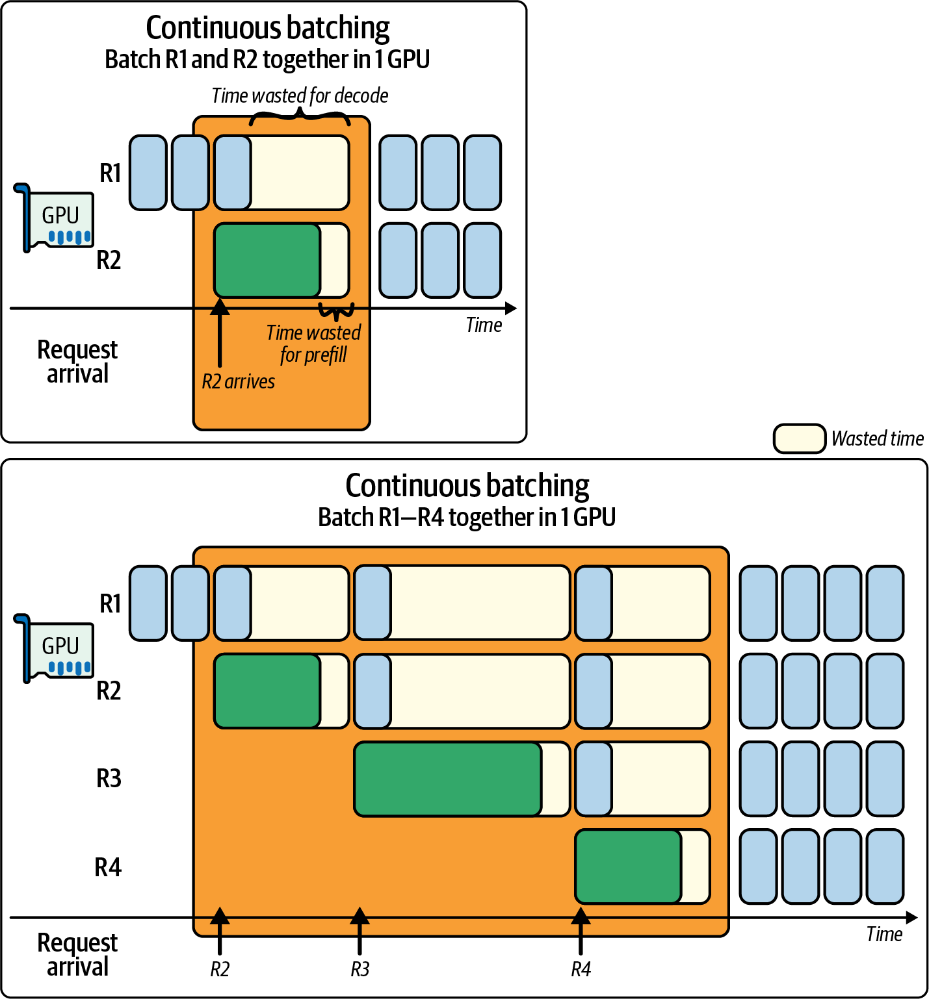
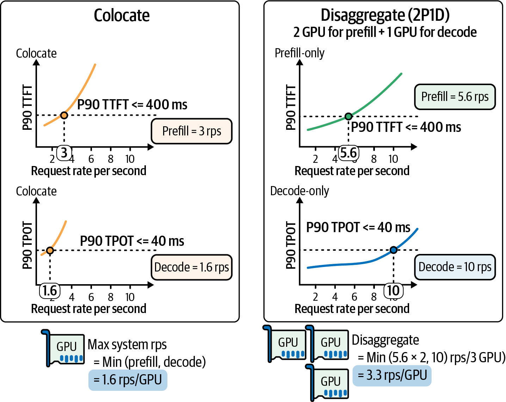
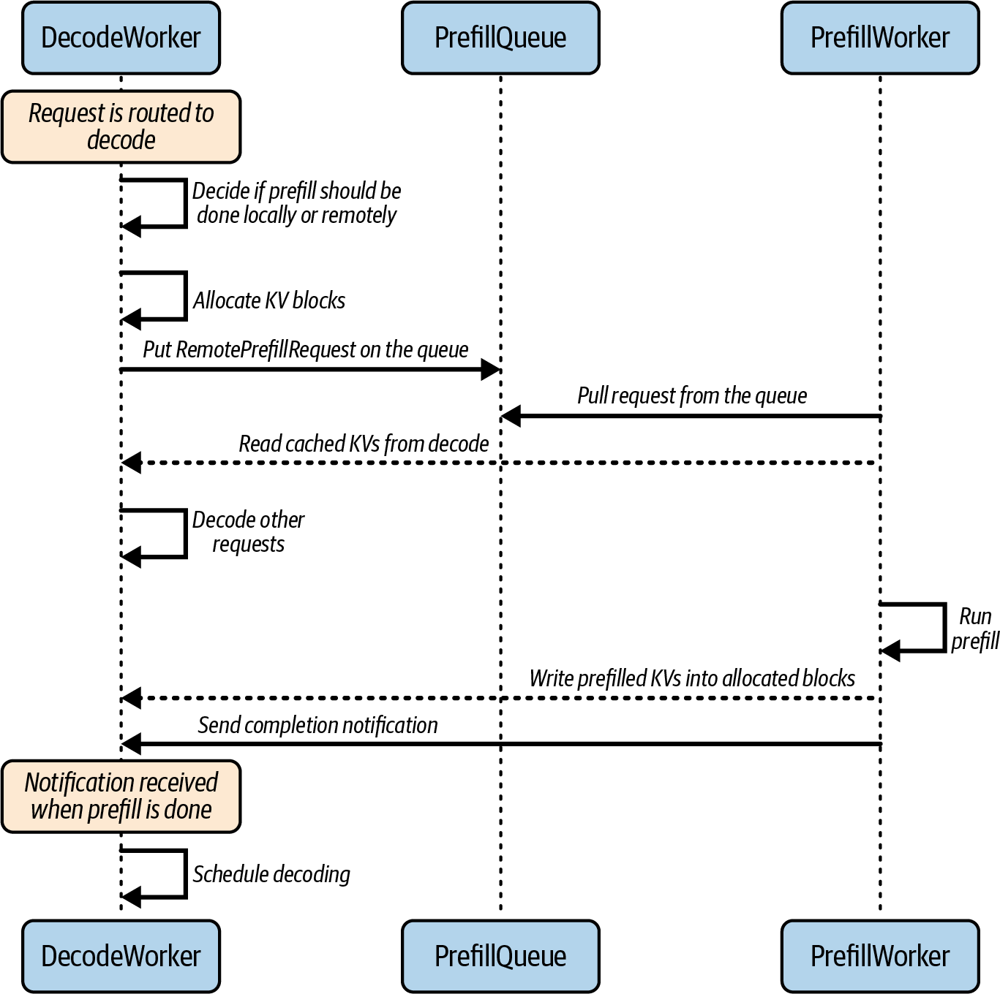
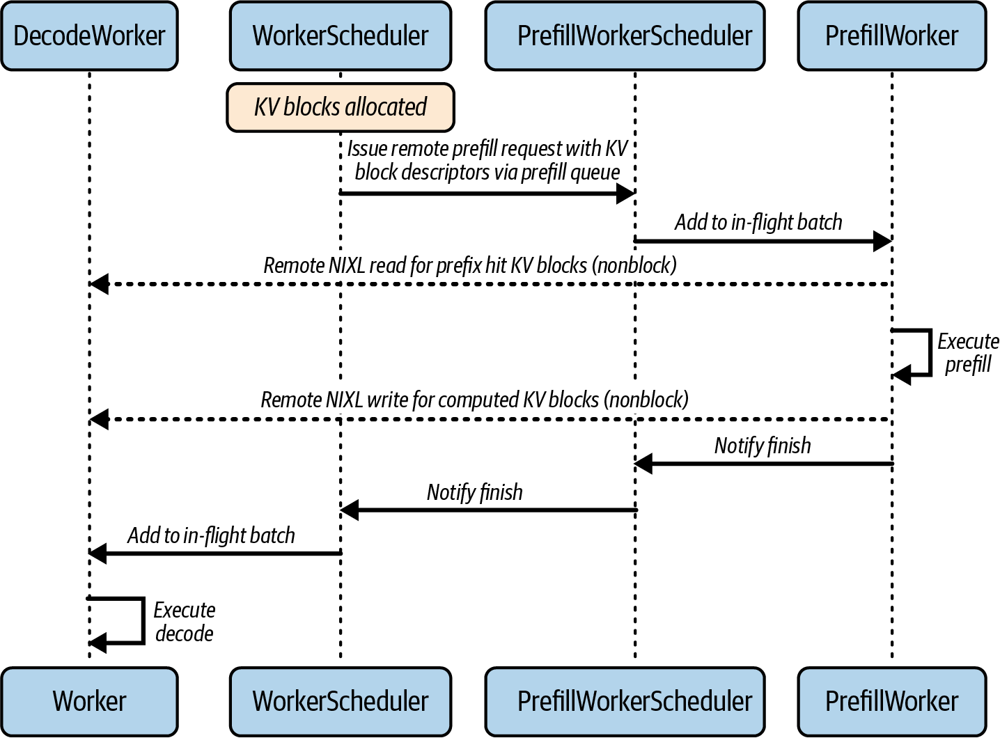
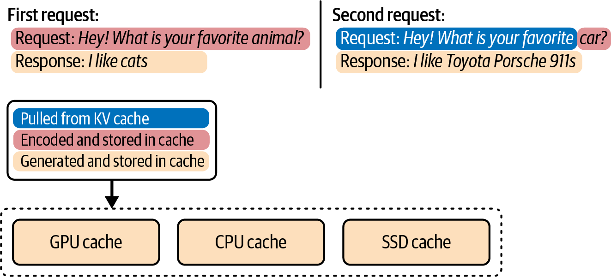
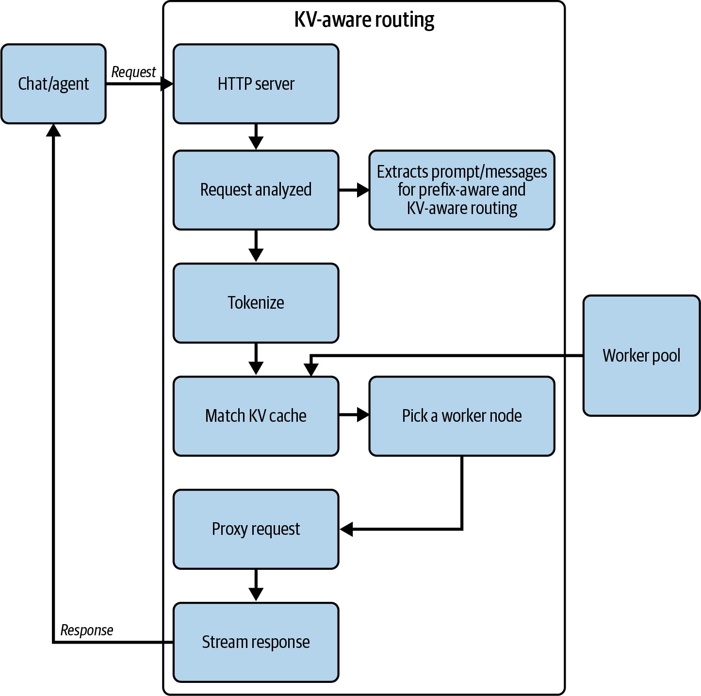
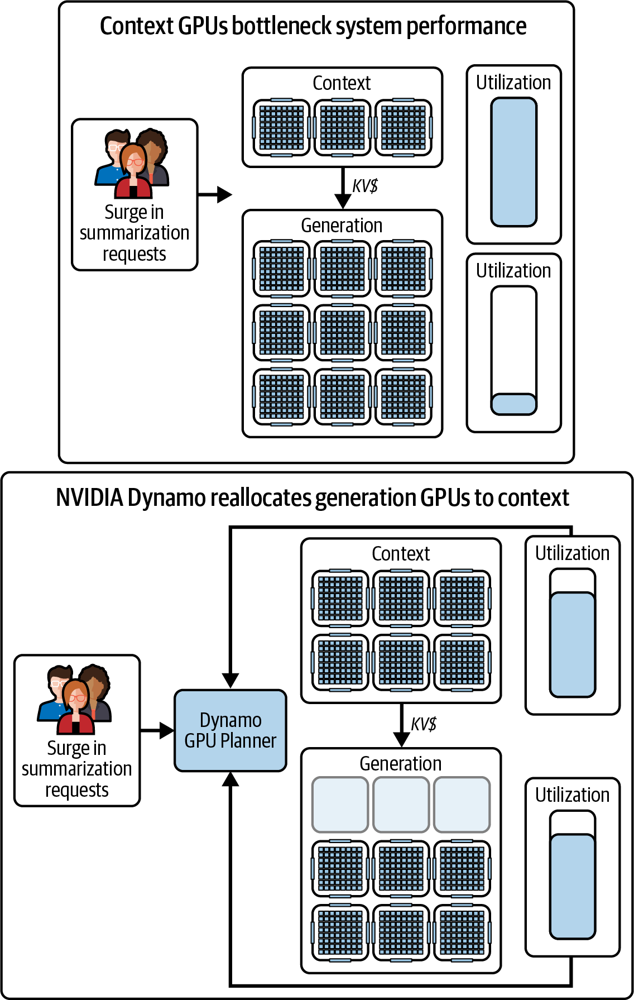

# AI Systems Performance Engineering

*Uploaded by Pedro Valera - AI Specialist*

---

## Chapter 17

# Scaling Disaggregated Prefill and Decode for Inference

# Chapter 17. Scaling Disaggregated Prefill and Decode for Inference

As mentioned in an earlier chapter, LLM inference can be divided into two distinct phases: the prefill phase and the decode phase. The prefill phase processes the input prompt to produce the model’s internal key-value (KV) cache for that prompt, while the decode phase generates output tokens one by one—or a few at a time, in the case of speculative decoding—using those cached values.

These two phases have fundamentally different performance characteristics. The prefill phase is compute bound, involves heavy matrix multiplications over potentially thousands of tokens in parallel, and consumes a significant amount of FLOPS. In contrast, the decode phase is memory I/O bound, reads the large KV cache for each token generation, writes new values, and stresses memory bandwidth. In simpler terms, prefill is a high-throughput, parallel workload, whereas decode is a sequential, latency-sensitive workload.

Early LLM serving systems treated the two phases as one monolithic pipeline on the same hardware. As such, they typically favored the prefill phase by prioritizing throughput using request batching. However, as interactive applications grew, latency metrics like time to first token (TTFT, or prefill latency for all tokens) and time per output token (TPOT, or decode latency per token) became as important as raw throughput. It’s difficult for a single GPU-based inference engine to optimize both TTFT and TPOT simultaneously when serving both phases together.

Batching many requests will improve throughput but will worsen TTFT since every request waits for the slowest prefill. It will also impact TPOT since the decode steps will get backlogged behind new-prompt prefills.

Monolithic inference systems must choose between improving (reducing) time to first token at the cost of slower subsequent token generation—or improving (increasing) per-token throughput while subjecting new requests to high initial latency. In extreme cases, one long prompt can completely tie up the GPU, which would block all other prompt prefill work for other users. And then, once decoding begins, the one-token-at-a-time processing would leave the GPU’s cores idle between each token generation.

To address these issues, researchers and engineers looked for ways to decouple the two phases. The key insight is that prefill and decode do not actually need to run on the same hardware—or even the same type of hardware.

Disaggregating the prefill and decode phases means assigning them to different resources that are each specialized for the needs of that specific phase. This idea was pioneered by systems in a paper on DistServe, which demonstrated that by eliminating interference between the phases, one can meet strict latency requirements for both TTFT and TPOT simultaneously.

DistServe’s evaluation showed the potential for serving 7.4× more requests within strict latency service-level objectives (SLOs) compared to a state-of-the-art baseline without prefill/decode disaggregation. As such, industry frameworks began to experiment with separate prefill and decode servers.

The open source vLLM library introduced disaggregated operation in conjunction with LMCache and other components. NVIDIA’s Dynamo implements disaggregated prefill and decode with dynamic routing and autoscaling and publicly documents operational details. Many providers and open frameworks implement or evaluate disaggregation. For instance, to meet strict latency SLOs, industry-scale serving systems from OpenAI, Meta, and xAI have reportedly adopted this disaggregated approach. As such, disaggregated prefill and decode is standard practice for LLM inference at scale.

At ultrascale, large inference deployments can involve hundreds of thousands or even millions of GPUs serving billions of requests. In these environments, the cost and performance benefits of disaggregation are massive.

By splitting the workload, you can optimize each phase in isolation and avoid one of them becoming the bottleneck for the other. The remainder of this chapter explores how to design and operate a disaggregated prefill/decode inference system at extreme scale.

In this chapter, we will explore scheduling algorithms to route requests between prefill and decode workers, techniques to maintain quality of service (QoS) under heavy load, and mechanisms that make this separation efficient. We’ll explore everything from high-speed interconnects to specialized decoding kernels. We will also discuss heterogeneous hardware strategies that use different GPU types for each phase.

# Why Prefill-Decode Disaggregation?

Modern interactive LLM services often target TTFT latency < 200–300 ms for p99 (99% of requests). This is nearly impossible to guarantee without separating the prefill work since a one-size-fits-all approach to LLM serving leaves significant performance on the table.

For context, the MLPerf v5.0’s (2025) inference benchmark for Llama2 70B (70 billion parameters) aimed for p99 (99th percentile) SLOs of ~450 ms TTFT and 40 ms TPOT latency. For Llama 3.1 405B (405 billion parameters), the benchmark aimed for ~6 seconds TTFT and 175 ms for TPOT. Specifically, these SLOs reflect p99 TTFT and p99 TPOT targets for Llama 2 Chat 70B and Llama 3.1 405B Instruct.

Consider a scenario in which one user’s request has an extremely long prompt on the order of many thousands of tokens—and another user’s request has a very short prompt. Without disaggregated prefill and decode, if these requests arrive around the same time, the long prompt’s prefill computation will block the GPU for an extended period.

Without disaggregation, the second request with the short prompt needs to wait an unnecessarily long time before even starting their decode. This is called interference since the prefill work for one request delays the decode work of another. Interference between prefill and decode is shown in Figure 17-1 in the context of continuous batching.

Under a simple FIFO scheduling strategy, long prompts can amplify tail latency for everyone. In general, long or compute-heavy prefills at the front of the queue will block shorter, lighter requests behind them. This is called head-of-line blocking, and it leads to poor utilization, latency outliers, and unhappy end users.

In a flexible disaggregated architecture, it’s possible to send a large prompt prefill to the dedicated pool of compute-optimized prefill workers, while a lightweight prompt prefill can be sent to the decode workers directly—bypassing the prefill workers. This type of flexibility allows shorter tokens to not suffer from head-of-line blocking. This maximizes overall throughput and minimizes latency tail effects.



###### Figure 17-1. Interference caused by colocated prefill and decode running on the same GPU (source: https://oreil.ly/GRkHs)

## Advantages of Disaggregation

Disaggregation has two primary advantages: reduced interference and phase-specific optimizations. Let’s discuss each of these next.

### Reduced interference

With disaggregation, prefill tasks no longer contend with decode tasks on the same device. A busy decode worker, generating many tokens, won’t prevent another user’s prompt from being processed, and vice versa.

Dedicated resources for each stage mean a long prompt’s computation won’t block another user’s token generation. In practice, this produces more predictable latency. Figure 17-2 shows the comparison between colocated and disaggregated prefill and decode. This experiment is described in more detail in the DistServe paper and subsequent blog post by the authors.



###### Figure 17-2. Comparison between colocated and disaggregated prefill and decode (source: https://oreil.ly/GRkHs)

Here, the SLO is set to 0.4 seconds for P90 TTFT and 0.04 seconds for P90 TPOT (e.g., horizontal line in Figure 17-2). The colocated system can support only ~3 requests per second (RPS) of goodput within the given TTFT latency bounds. And it can sustain only 1.6 RPS within the given TPOT latency bounds. As such, the goodput of the colocated configuration is only 1.6 RPS since both the TTFT and TPOT latency SLOs need to be met.

After disaggregating the two stages and assigning two prefill workers (two GPUs) and a single decode worker (one GPU), called a 2P1D configuration, both the prefill and decode workers achieve better overall RPS than the colocated configuration with a single GPU. Specifically, the prefill worker reaches ~5.6 RPS and the decode worker achieves ~10 RPS spread across the three GPUs. As such, the goodput for the 2P1D configuration is 3.3 RPS per GPU.

The 3.3 RPS per GPU is calculated by taking the minimum of the RPS of the prefill workers (5.6 RPS × 2 = 11.2 RPS) and the decode worker (10 RPS). This is 10 RPS total across all three GPUs. As such, we have to divide the RPS by the number of GPUs, or 3 in this case. Under the configured SLOs, this system’s goodput result is 10 RPS ÷ 3 GPUs = 3.3 RPS per GPU.

In this comparison, the decode side improvements primarily impact per-token latency. Meanwhile, prefill isolation primarily improves time to first token. Both SLOs must be satisfied to count as goodput.

This isolation can also improve tail latencies as well. Empirically, systems that disaggregate show tighter latency distributions—and avoid the long tails seen in monolithic systems. By eliminating cross-phase interference, each phase meets its SLO more reliably—and with more predictable consistency.

Now, you should also be asking, “Is the 3× cost worth the 2× improvement?” And you would be right to ask that. Additional tuning is required to make this solution more cost-effective, but it shows the right direction to tighten latency distributions and improve goodput. You need to decide based on your workload. Disaggregation is a popular option to meet goodput RPS needs.

### Phase-specific optimizations

Phase-specific optimizations let each phase use the hardware and parallelism that suits it best. The prefill phase, for instance, is compute bound. As such, you’d typically increase tensor parallelism to drive peak FLOPS on a high-FLOPS GPU. Additionally, modern GPUs provide lower precision modes (FP8 and FP4) that can increase throughput for the compute-heavy prefill phase.

You should prefer FP4 for weights and, where validated, activations, as well. Many stacks use FP4 for weights and FP8 for activations. These reduced precisions help to maximize throughput and minimize HBM footprint—with minimal accuracy loss. These precisions are supported by modern hardware and software stacks, including the NVIDIA Tensor Cores and Transformer Engine.

In contrast, the decode phase is memory-bandwidth-bound and suffers from cross-GPU synchronization overhead. So it’s most efficient with little or no tensor parallelism (often `TP=1`) as it relies more on fused kernels to increase arithmetic intensity—as well as high memory throughput GPUs.

In a monolith you’d have to pick one type of GPU and one parallelism strategy for both phases, which is suboptimal for at least one of the phases. Disaggregation, on the other hand, lets you independently tune each phase for maximum efficiency.

Splitting phases also opens the door to heterogeneous clusters in which different GPU types are assigned to prefill and decode roles for optimal cost-performance. For example, using compute-optimized GPUs for prompt prefill and memory-optimized GPUs for token generation can produce better throughput per dollar than a homogeneous deployment.

In practice, the latest GPUs typically have both higher FLOPS and more GPU memory. As such, it’s tempting—and more common—to just use the latest GPU generation for both prefill and decode. But just know that heterogeneity is a viable option to reduce cost.

We will explore the idea of heterogeneous clusters later in the chapter. We’ll show how using high-end GPUs for prompts and cheaper GPUs for generation can lead to significant cost savings at scale.

In summary, disaggregation removes cross-interference and enables specialized treatment of each phase. The expected results include tighter latency distributions since no more long tails are caused by mismatched prompt sizes, improved throughput under latency constraints (goodput), and better overall resource utilization.

You should use profiling tools (e.g., NVIDIA Nsight Systems) to identify bottlenecks in the prefill and decode phases. These can trace GPU kernels and RDMA transfers across the different worker nodes. This will help validate that decode kernels are fully overlapping communication, etc.

Next, let’s discuss how to actually implement a disaggregated serving system, including the system architecture, communication, and scheduling policies that decide how to fully utilize the disaggregated cluster.

## Disaggregated Prefill and Decode Cluster Pools

In a disaggregated deployment, we maintain two (or more) pools of workers such that one set of GPUs is dedicated to prefill prompt processing and another set is dedicated to token generation. These workers can be on separate nodes or racks in a data center—or even in separate data centers if the interconnect is fast enough. (Note: keeping prefill and decode within the same data center is the practical design choice to achieve realistic SLOs.)

The worker pools communicate over a network to hand off the model’s KV cache produced by the prefill to whichever GPU will perform the decode. A scheduler, or router, coordinates this communication.

Consider a configuration in which the model weights are loaded on two groups of GPU servers. One group, the prefill workers, handles prompts and computes the KV cache. The other group, the decode workers, handles token generation using the KV caches generated from the prefill workers.

The two worker groups typically communicate using a high-speed interconnect (e.g., NVLink/NVSwitch and InfiniBand) and zero-copy GPU-to-GPU transfers with RDMA. In practice, these transfers use GPUDirect RDMA or UCX and can be correlated in Nsight Systems alongside CUDA kernels, NVLink activity, storage metrics, and InfiniBand switch metrics for end-to-end validation.

For superchip-based NVL fabrics (e.g., Grace-Blackwell, Vera-Rubin, etc.), use NVIDIA Multi-Node NVLink (MNNVL), keep NVLink-first collectives enabled for TP decode, and enable SHARP for AllGather and ReduceScatter collectives when available.

When the system receives a new request, it typically receives it on the decode worker. This is called a decode-centric design. This is preferred because the prefill workers are already compute bound with the KV computations.

By having the decode workers handle the client I/O, routing, and session state management, the inference system avoids overloading the prefill workers. Also, centralizing request ingress on the decode nodes simplifies network management, autoscaling, and policy enforcement.

This is just one style of system architecture for prefill-decode in which the decode worker is the centralized ingress for all requests. This architecture is used in the NVIDIA Dynamo inference system. Another common architecture is to use a dedicated, centralized API router to route the request to either the prefill or decode worker. However, this requires an extra moving part in the system and additional coordination between the router and prefill/decode workers, —as well as additional scaling and latency considerations.

After the decode worker receives the requests, it decides whether to do the prefill itself or “offload” it to the prefill worker pool. If it decides to offload to the prefill worker pool, the decode worker will later receive the KV results back and then continue with decoding and generating the next token.

Next is a snippet from a simplified NVIDIA Dynamo cluster configuration that defines two roles that use NVIDIA’s Inference Xfer Library (NIXL) for GPUDirect RDMA-based KV cache transfers to let one GPU write into another GPU’s memory directly over the network:

```shell
roles:
- name: prefill_worker # Prefill worker role
model_path: models/llm-70b
instance_count: 4 # 4 prefill workers
gpu_type: B200 # B200 Blackwell compute-bound prefill

- name: decode_worker # Decode worker role
model_path: models/llm-70b
instance_count: 8 # 8 decode workers
gpu_type: B300 # B300 Blackwell Ultra high-memory decode
```

NVIDIA’s Rubin CPX accelerator is another option for prefill workers. Rubin CPX (the CP stands for “context processing”) is specifically designed for compute-bound workloads such as prefill. The Rubin CPX marks NVIDIA’s departure from “general accelerated computing” GPUs into specialized chips that are optimized for a specific stage (e.g., prefill) within a broader AI workload such as inference.

In this configuration, we have four prefill workers using B200 GPUs (adequate compute for compute-heavy prefills) and eight decode workers using B300 GPUs (high HBM capacity for heavy memory-bound decodes). Mixing B200s and B300s helps to match their FLOPS and HBM capacity characteristics while minimizing cost. Both roles will use NIXL and GPUDirect RDMA to transfer the KV cache blocks. NIXL abstracts transport for GPU-to-GPU data movement over NVLink and RDMA NICs. It also provides connectors for GPUDirect Storage so that KV cache pages can be read from (or written to) different storage tiers.

Under the hood, when this system runs, each decode worker registers a region of its GPU memory so that prefill workers can write directly into it using RDMA. Typically, memory-registration metadata such as NIXL descriptors are exchanged at startup or on first contact. This way, for each remote prefill task, only a small identifier needs to be sent rather than a full memory address structure.

For instance, Dynamo uses etcd for worker discovery and leases. Workers register the necessary memory handles with the router or control plane so that peers can obtain the descriptors when needed. The prefill workers will retrieve them on first use. This way, a prefill request can include just an ID for the target KV buffer, making control messages lightweight.

Furthermore, NVIDIA Dynamo’s NIXL implementation provides a high throughput RDMA and storage abstraction for inference data movement and includes plugins for NVLink, UCX-based fabric, and GPUDirect Storage. As such, prefill workers can write KV blocks directly into decode GPU memory.

In mixed parallelism deployments where prefill and decode use different TP layouts, you need to perform a layout transform on the decode side immediately after the NIXL read. This way, the KV pages match the decode kernel’s expected layout. This transform is latency-insignificant compared to network transfer and avoids re-prefill.

This architecture decouples scaling for each phase. If you find that prefill is the throughput bottleneck due to many concurrent long prompts, for instance, you can add more prefill workers to increase prompt processing capacity.

If decode becomes the bottleneck due to many users generating long outputs, for instance, you would scale out decode workers. Because decode and prefill are separated, scaling one doesn’t directly interfere with the other.

Systems like NVIDIA Dynamo support dynamic, runtime-configurable disaggregation such that you can add or remove prefill workers on the fly—without stopping the cluster. New prefill workers simply register and start pulling tasks from the queue. If a prefill worker leaves the cluster for whatever reason (crash, restart, autoscale event, network partition, etc.), the decode workers will temporarily do more local prefills to compensate.

NVIDIA Dynamo’s distributed runtime uses `etcd` for worker discovery and leases. Its Planner component can scale workers by revoking leases or launching new workers which are auto-discovered. This dynamic flexibility is crucial at ultrascale when load will often fluctuate. When this happens, you’ll want to swap workers between roles as needed.

### Prefill workers design

Prefill workers, or prompt servers, are the compute nodes dedicated to executing the initial prompt prefill processing phase of requests. This section discusses how prefill nodes are architected to handle the heavy computation efficiently—and how they balance latency versus throughput for KV cache population under load.

Because the prefill workload is computationally intensive, prefill nodes should use GPUs with high FLOPS and be optimized for large matrix multiplications. Each prefill task feeds n input tokens through all model layers.

The prefill workers will use thousands of GPU threads in parallel—and across many GPU nodes, if available. They use familiar parallelism techniques, including tensor parallelism and pipeline parallelism, to reduce TTFT.

#### Memory management

Memory-wise, prefill nodes need to load the full model weights and also allocate KV cache for the prompt. This KV cache is then transferred to the decode workers, as we’ll see in a bit.

Prefill populates GPU memory with model parameters and the working activations of the model’s forward pass with the prompt inputs. Once the KV cache is created, it’s immediately sent to the decode workers. The KV cache doesn’t persist long in the prefill node’s memory.

If a model is extremely large or a prompt is extremely long, prefill may require tensor or parallel splits across GPUs due to memory limitations. Prefill servers should be flexible with their parallelism strategies (data, tensor, pipeline, expert (MoE), and context) to meet latency targets.

Some inference frameworks preallocate a big chunk of GPU memory for prefills to use as working space. This reduces overall memory fragmentation and buffer allocation time.

#### Optimizing for latency versus throughput

When tuning a disaggregated prefill cluster, you face a fundamental trade-off between minimizing the TTFT for each individual prompt and maximizing overall requests per second (RPS), or reducing TPOT, under heavy load.

Disaggregated systems handle this trade-off by supporting different scheduling policies for a latency-first approach versus a throughput-first approach. Let’s describe each of these approaches next:

To reduce TTFT, prefill nodes should process prompts as soon as they arrive—and with little to no batching. In this mode, you avoid waiting for other requests to fill a batch. As such, every prompt starts execution immediately and finishes as fast as possible—assuming available GPUs in the cluster.

The downside of this latency-first approach is lower GPU utilization since you are using small or no batches. As such, GPUs often sit idle, and your system will serve fewer concurrent requests for a given cluster size. In this case, you can either over-provision your prefill cluster capacity or use a tiny batch size of 1 to guarantee strict latency SLOs for your requests.

If peak throughput, or RPS, and minimal TPOT are your priorities, you should batch prompts into larger groups to fully load each GPU. By accumulating 8–32 prompts into a single batch, you raise arithmetic intensity and keep the GPU compute units busy. This will increase the overall throughput.

The downside to the throughput-first approach is that each request incurs a batching delay equal to the time it takes to collect the batch. The larger the batch size, the longer the delay.

For extreme throughput inference system configurations, you can choose to assign multiple GPUs per request using either data parallelism or pipeline parallelism.

With data parallelism, the entire model is replicated on each GPU. The batch is split into minibatches across the GPUs. Each GPU performs a forward pass on its subset of data through its complete copy of the model. The output is then aggregated from all the GPUs for the final output.

Data parallelism aggregates memory bandwidth and compute power across all of the GPUs to increase per-batch performance. However, it reduces maximum parallelism to the total # of GPUs ÷ GPUs per request. This reduces your overall concurrent request capacity. This can leave resources idle if the system uses too many GPUs per single request. This will create an imbalance between throughput and concurrency.

Pipeline parallelism divides the model’s layers into sequential stages on different GPUs, such as GPU 0 and GPU 1. As soon as GPU 0 finishes its stage for microbatch 0, it forwards activations to GPU 1 and begins stage 1 for microbatch 1. This assembly-line pattern keeps all GPUs busy on different chunks of work.

Pipeline parallelism increases per-batch throughput, but it adds inter-GPU communication overhead and pipeline “bubbles” if the microbatch size or stage splits are not carefully balanced.

Ultimately, each additional GPU that you dedicate will increase throughput but decrease how many requests you can handle at once—given a fixed-size cluster. You can always scale out the GPU cluster, but assuming a fixed cluster size, you should choose your configuration based on whether latency SLOs or throughput SLOs are most important to your use case.

#### Latency-aware scheduling and batching

Disaggregated systems incorporate the latency-aware scheduling policies mentioned earlier to balance these factors. For instance, they might guarantee single-request execution—and not batch requests—unless load is high enough that combining a small number of requests won’t violate the TTFT target.

Many cluster designs include an SLO constraint in the scheduler. For instance, if p90 TTFT must be ≤ X ms, the system will choose the largest batch size or parallelism strategy that still meets the SLO for a typical prompt size.

Another strategy is adaptive batching windows. For instance, at low load, it can run requests immediately using a batch size of 1. And at higher loads, the system can allow microbatches of requests arriving within a small time window, such as 2–10 ms. This way, a slight delay can produce a big GPU utilization win—but only when it’s needed and tolerable.

Many inference engines favor latency for their prefill workers. Systems often execute prompt tasks as soon as possible and even tolerate some GPU underutilization, because a fast first token significantly improves user experience.

It’s common to provision more prefill capacity than needed for an average load. This way, the prefill cluster absorbs bursts of prompts without latency spikes. In the next chapter, we will discuss adaptive mechanisms to rebalance resources on the fly so that neither the prefill nor the decode workers become a bottleneck over time.

Modern orchestrators like Kubernetes can automatically scale each tier. For example, if prefill GPU utilization stays high and decode is low, the orchestrator can trigger an autoscaling event to add prefill pods (or nodes)—and possibly even remove some decode pods/nodes.

This kind of adaptive scaling is often implemented with metrics like prefill queue length to help drive the decisions.

Another option is to implement priority queues such that short prompts are scheduled on a separate fast lane with less batching. Long, batchable prompts go to a throughput-optimized queue. NVIDIA Dynamo supports latency classes in scheduling. You can emulate this by tagging requests and having different batching windows per class.

The key takeaway is that prefill workers prioritize quick turnaround. Disaggregation lets us do this without harming decode performance since decode is running on a different set of workers. We might “waste” some prefill GPU cycles during low-traffic periods, but we maintain low TTFT during peak traffic periods. It’s a worthwhile trade-off for interactive services.

### Decode workers design

Decode workers, or generation servers, are dedicated to the autoregressive decode phase. Once a prompt’s KV cache is ready, it is sent to a decode worker, which uses the KV cache to produce the remaining output tokens as quickly as possible to maintain a low TPOT latency.

If a request is initially routed to the decode worker, as in Figure 17-3, it must first decide if the prefill should be done locally or remotely using a disaggregated router. If it decides to prefill remotely, it will push the prefill request into a prefill queue to be picked up by the prefill worker.

The prefill worker continuously pulls from the prefill queue, reads any KV blocks cached in the prefix cache, and computes the prefill operations. It then writes the KV blocks back to the decode worker, which completes the decoding.



###### Figure 17-3. Prefill worker design: read prefix cache → compute prefill → write KV cache for decode

The decode worker design is focused on handling many concurrent sequence generations efficiently—as well as managing the memory footprint of the KV cache. In this section, we describe how decode servers achieve high throughput using techniques like continuous batching and clever memory management tricks. These help to reduce TPOT latency and increase scalability—especially for long sequences. Let’s start by detailing the KV cache transfer between the two stages.

#### KV cache transfer between prefill and decode

High-performance disaggregation requires moving KV cache data as efficiently as possible between the prefill and decode workers. By using libraries like NIXL (described in Chapter 4) for direct GPU-to-GPU transfers, we can avoid CPU involvement and utilize nonblocking operations. This way, while one GPU is transferring KV data, it can also service other forward-pass requests without waiting for the transfer to complete.

Consider a user request that arrives at a decode worker. In this case, the decode worker’s scheduler allocates the necessary KV blocks and adds a remote prefill request to the prefill queue. This prefill request contains the identifiers for those KV blocks. This interaction is shown in Figure 17-4.



###### Figure 17-4. Transfer of KV cache data between the prefill and decode workers using NIXL; coalesce multiple PagedAttention blocks into ~128-token payloads before RDMA (note: vLLM defaults to 16 tokens per block on CUDA)

The prefill worker uses NIXL to perform direct remote GPU memory reads and writes over the selected transport. This avoids CPU copies and enables nonblocking progress. As soon as the prefill worker completes the prefill request, the decode worker’s scheduler adds a corresponding decode request to its own decode pipeline. This allows compute and data movement to overlap seamlessly. Make sure to use pre-registered peer memory with large pinned window sizes to minimize re-registration churn. You can verify zero-copy transfer overlap with the Nsight Systems timeline.

When validating end-to-end data movement and overlap, it’s recommended to profile with Nsight Systems using trace flags. For InfiniBand link telemetry, add `--nic-metrics=true` for HCA/NIC counters and `--ib-switch-metrics-device=<GUIDs>` for switch counters. These will capture switch metrics and sample host/device activity. Together, this will produce correlated CUDA kernels, UCX activity, storage metrics, and network behavior. Following is a unified command that enables CUDA/UCX tracing and collects CPU activity, GPU metrics, storage metrics, and InfiniBand switch <span class="keep-together">telemetry</span>:

```shell
nsys profile --trace=cuda-hw,osrt,nvtx,ucx,gds \
--trace-fork-before-exec=true \
--cuda-event-trace=true \
--cuda-graph-trace=node \
--cuda-memory-usage=true \
--sample=cpu \
--gpu-metrics-device=all \
--nic-metrics=true \
--ib-switch-metrics-device=<GUIDs> \
--storage-metrics --storage-devices=all \
--gds-metrics=driver \
-o nsys_reports/prefill_decode \
<your_launch_here>
```

It’s possible that the prefill and decode engines use different parallelism (e.g., tensor‐parallel) layouts. In this case, the system can insert a layout transform kernel on the receiver side—after the NIXL read (and before the data is used) to realign each KV block to the layout expected by the decode worker.

#### Continuous batching

Decode servers rely heavily on continuous batching, also known as iteration-level batching. Unlike the prefill phase, which performs large matrix-matrix computations, the decoding phase performs many small computations since each new token generation is a relatively small vector-matrix computation since the individual token is represented as a vector.

To avoid low GPU utilization for small, per-token workloads, decode workers can batch together multiple input sequences to create larger matrix-matrix computations (e.g., multiple token generations) at each iteration. This increases the arithmetic intensity for each decode task.

For example, suppose 32 different text-generation requests are mid-stream and ready to generate their next token. Instead of computing 32 separate, single-token forward passes, a continuous batching scheduler will combine the requests and perform one forward pass that generates 32 tokens (one per sequence) in parallel.

This way, matrix multiplications see an effective batch size of 32, which keeps the GPU compute units busy. The challenge is that not all sequences request a token at the exact same time. Some may finish early, and others may start late.

Remember that you can batch across different requests and users. Most modern inference servers will automatically group decode steps from different users’ requests if the sequences have the same context length at that moment. This effectively performs batched decoding on the fly. Consider such solutions for maximizing decode throughput.

In vLLM, CUDA Graph capture coverage is controlled by the flag called `--max-seq-len-to-capture`. Capture sizes are typically aligned to the maximum number of sequences. When a sequence exceeds this length, vLLM falls back to eager mode. It’s important to note that this flag does not control how many sequences are batched at runtime. The number of concurrent decode slots is controlled by `--max-num-seqs` (upper bound on sequences in an iteration). Set this explicitly for predictable memory use along with <span class="keep-together"><code>--max-num-batched-tokens</code></span>.

Continuous batching addresses the issue of sequences requesting tokens at different times by dynamically updating the batch size at each step. Specifically, at each step, a continuous batching strategy will gather all sequences that are ready for a next token at that moment and batch them into a single decode step.

If new requests finish prefill and become ready while the decode is in progress, they will join the next batch without waiting an arbitrary long idle period. This is in contrast to static batching, which will wait to gather a full batch before decoding.

If a sequence finishes by hitting an end-of-text token or a sequence-length limit, it is removed from subsequent batches immediately. If a sequence is not yet ready—perhaps it’s a long prompt still being processed in prefill—it won’t be included until it becomes ready.

Effectively, with continuous batching, the batch size on each iteration can fluctuate. However, the server is always trying to maximize the batch size to include whatever sequences are available at that time—up to a limit. This achieves high utilization while minimizing per-token waiting time.

Continuous batching makes sure that decode GPU workers never sit idle. They are always working on available requests. This maximizes their throughput under latency constraints by keeping the GPU busy—even as individual sequences await new tokens.

Similarly, Microsoft’s DeepSpeed and NVIDIA’s TensorRT-LLM inference engines implement continuous or in-flight batching with paged KV caches to keep GPU utilization high during decoding. Specifically, DeepSpeed combines multiple generation requests, and TensorRT-LLM uses a scheduler to group decoding tasks across streams.

In a disaggregated decode cluster, continuous batching becomes even more powerful. Since decode GPUs handle only generation, they can devote 100% of their cycles to this continuous loop without ever being interrupted by a large, bespoke prompt task. This leads to smoother throughput metrics—especially under load.

Under high load, a decode node might have tens or hundreds of sequences concurrently active. It can batch a large number of them at each iteration. This will maximize hardware utilization.

And under low load, even if only one sequence is active, the decode worker can immediately generate the token. It doesn’t have to wait to fill a batch. In this case, the GPU will be underutilized for that moment, but the latency for that single sequence remains low. As such, continuous batching handles both extremes: at high concurrency it’s efficient, and at low concurrency it’s responsive. This is a good balance of high throughput and low latency.

#### Grouping variable-length sequences

Handling variable-length sequences in LLM inference requires careful scheduling and batching to avoid wasted computation and memory. Mixing short and long prompts in one batch leads to padding overhead—sometimes up to 50% padding relative to the number of tokens. This wastes scarce GPU and network resources.

When you batch prompts of differing lengths together, every shorter sequence must be padded to match the longest one. This padding introduces “no-op” tokens that still consume GPU cycles, memory bandwidth, and inter-GPU or network transfers. In some cases, padding can account for up to half of all tokens in common generative AI workloads. This significantly reduces inference efficiency.

A straightforward solution is to group requests into buckets based on sequence length. This way, each batch contains sequences of similar sizes. Using static-length buckets like 0–512 tokens, 513–1,024 tokens, etc., fixes the batch boundaries and minimizes padding overhead.

vLLM’s decode scheduler maintains a rotating pool of `SequenceGroup` instances (each prompt is a `SequenceGroup`). The scheduler advances each group after a fixed token budget per decode iteration. As soon as a `SequenceGroup` is done processing its chunk, it leaves the pool, and a new `SequenceGroup` joins the pool. This keeps the pipeline continuously full of work—without relying on static padding buckets or underutilizing GPUs.

These batching and scheduling techniques align well with disaggregated prefill-decode deployments with separate prefill and decode clusters. Using this deployment configuration, the separate decode nodes can use techniques like continuous batching to minimize TPOT variance under strict SLOs. Meanwhile, the dedicated prefill nodes can be tuned independently for maximum input-processing throughput and minimum TPOT.

NVIDIA’s Programmatic Dependent Launch (PDL) and device-initiated CUDA Graph Launch (discussed in Chapter 12) are used to reduce per-token launch overhead, overlap work, and eliminate bubbles between decode iterations. These features are generally enabled through the framework rather than manually in application code.

When using device-launched graphs, instantiate with `cudaGraphInstantiateFlagDeviceLaunch` and keep nodes on a single device. Use PDL to overlap dependent kernels at the end of a step (e.g., decode iteration). This further trims per-token launch <span class="keep-together">bubbles</span>.

By combining length-bucketing, continuous batching, disaggregation, PDL, and device-initiated CUDA Graphs, modern inference systems like vLLM, SGLang, and NVIDIA Dynamo can achieve both high throughput and low latency—even for wildly varying prompt lengths. And they do this without impacting resource efficiency or scalability.

In vLLM, `--max-seq-len-to-capture` controls the maximum sequence length covered by CUDA Graphs. By default, this value is set to 8192. In continuous batching, vLLM may pad to the nearest captured size, so align `--max-num-seqs` and `--max-num-batched-tokens` to minimize padding waste. CUDA Graphs help to minimize repeated CUDA-graph rebuilds for common sequence lengths. It does not directly dictate runtime batching behavior. Runtime batching in vLLM is managed by its decode scheduler’s dynamic `SequenceGroup` pool, as described previously. In production, it’s recommended to tune `--max-num-seqs` and `--max-num-batched-tokens` alongside `--max-seq-len-to-capture` to bound HBM (KV) usage and reduce padding under continuous batching.

#### Memory management for the KV cache

Because decoding involves attending to the entire sequence seen so far—including previously decoded tokens—KV cache memory is a critical resource for decode workers. Each sequence stores key and value tensors for each transformer layer—and each past token. Figure 17-5 shows an example KV cache being shared across different requests.



###### Figure 17-5. Managing and reusing KV cache data between requests

For large models and long sequences, KV memory grows linearly with tokens and depends on attention layout and `dtype`. A practical estimate is `bytes_per_token = ​2⁠ x n_layers x n_kv_heads x head_dim x bytes_per_element`. (Note: the `2 x` accounts for keys and values per token per layer.)

Consider a Llama-class 13B model with 40 layers, 40 attention heads (head dimension is 128), and FP16. For a 4,096-token context with standard multi-headed attention (MHA), the KV size is ~0.819 MB/token or ~3.36 GB total. With FP8 KV, that becomes ~1.68 GB.

With grouped-query attention (GQA) with 8 query groups (`n_kv_heads = 8`), the 4,096-token KV is ~0.671 GB at FP16 and ~0.336 GB at FP8. And for multi-query attention (MQA) with 1 kv head, it is ~0.084 GB at FP16.

Make sure to always compute using the model’s actual `n_layers`, `n_kv_heads`, `head_dim`, and KV precision since FP8 and FP4 change the `bytes_per_element`.

A GPU serving many concurrent sequences can quickly approach its memory limits purely due to KV cache storage—in addition to the model weights. As such, make sure your decode workers use such an optimized memory allocator to prevent GPU memory exhaustion when many long sequences are in flight. The following are strategies that decode workers use to manage KV memory efficiently:

vLLM’s PagedAttention mechanism is a prime example—it partitions the KV cache into fixed-size pages and can swap inactive pages to CPU memory. In addition to vLLM, paged KV memory managers are implemented in SGLang and NVIDIA TensorRT-LLM. NVIDIA Dynamo builds on these techniques. These systems also layer external KV tiers using DRAM and NVMe. And they can schedule recomputation versus I/O to balance bandwidth. This is common in projects like LMCache and other similar libraries and runtimes.

Decode servers often use GPUs with large HBM capacity (e.g., Blackwell B200’s 180 GB HBM and Blackwell B300’s 288 GB HBM) to store the KV cache. Additionally, systems like vLLM and NVIDIA TensorRT-LLM use optimized memory managers that allocate KV memory in fixed-size pages to reduce fragmentation, enable efficient prefix reuse across requests, and manage hundreds of sequences of varying lengths. This efficiently shares memory without causing excessive fragmentation and waste.

When GPU memory fills up, the decode workers can offload older KV blocks to CPU RAM or colder storage such as NVMe. For instance, if a sequence generates 1,000 tokens, but not all of them are currently needed right away, some earlier tokens’ KV can be moved to host CPU memory.

When they’re needed, they can be brought back into GPU memory on demand. Offloading introduces a bit of a latency penalty when the tokens are needed for attention, so you should be careful when using offload. Decode servers often try to prefetch or overlap data transfer so that paging in KV data won’t impact generation as much.

Some deployments impose a hard limit on the number of decoded tokens, or output sequence length. This is an application-level trade-off that caps the KV cache size and avoids unbounded growth. KV compression can also reduce KV memory required per token. For instance, storing KV at lower precision (FP16, FP8, INT8) can greatly reduce the memory usage.

Another example is using multiquery attention (MQA), in which heads share a KV vector per token. This reduces the KV size proportional to the number of heads. This is a model architecture change that directly lowers the KV footprint. Grouped query attention (GQA) and DeepSeek’s Multi-Latent Attention (MLA) also help reduce the size of the KV cache.

Another advantage of the disaggregated design is that the decode cluster’s GPU memory is fully dedicated to storing model weights + KV cache. It’s also not trying to handle large prompt prefill computations, which, on a monolithic serving system, would consume a lot of extra memory temporarily during prefill.

Each decode GPU typically loads the full model weights—unless using model parallelism—and then uses the remaining memory for KV storage. For instance, if model weights take 70 GB of a GPU’s memory and the GPU has 180 GB total, about 122 GB is left for KV.

This directly impacts roughly how many tokens × sequences can be in-flight on that GPU. Disaggregation doesn’t eliminate KV memory issues, but by separating roles, you can choose decode node types that optimize for memory capacity and memory bandwidth.

With the cluster configured this way, you need to decide when to offload a prefill to the prefill worker pool—or when to do it locally on the decode worker. Offloading has overhead, including queueing delays, network transfers, etc. As such, it should be used only when it will actually help latency. The decision is made by a routing policy, described next.

## Disaggregated Routing and Scheduling Policies

Not every request needs to be offloaded to a prefill worker. In fact, doing so when unnecessary would add overhead and not a lot of benefit. As such, a disaggregated inference system uses a routing policy to conditionally disaggregate and use the remote prefill path only when it is likely to help. Table 17-1 shows a high-level summary of routing strategies, including KV-aware and prefix-aware routing.

The disaggregated router runs for each new request on the decode worker that initially receives the request. And it makes a quick decision to either prefill locally or prefill remotely on the prefill worker pool.

### Routing factors

The decision to offload prefill to the prefill worker pool can be based on several factors related to the request and the system state. Common routing factors include current queue lengths, GPU memory availability, and even specialization since certain GPUs are better for certain models or prompt types.

Advanced routers like vLLM’s KV cache-aware router also consider cache locality. They will route a request to a decode worker that already holds some of its prefix in cache. Figure 17-6 shows how an example KV-cache-aware router moves a request through the system based on data received from KV cache events emitted by the workers.

The goal is to route in a way that maximizes cache hits and balances load. Table 17-2 summarizes some key factors that influence the routing decision in a typical disaggregated design.



###### Figure 17-6. KV-cache-aware request routing based on data received from KV cache events emitted by the workers

These factors will prefer to offload only requests that will benefit from the remote execution. These include long and compute-heavy prompts. Meanwhile, short and cache-hitting prompts are handled locally to minimize overhead. The thresholds are tunable. Each factor in Table 17-2 addresses a particular trade-off, as described next:

We don’t want to waste time offloading trivial prompts. The overhead of remote execution, even if small, isn’t worth it for a five-token prompt, for instance, since the decode GPU can handle that quickly on its own. Offloading is reserved for heavy prompts in which the decode GPU would otherwise be tied up for a long time.

Modern inference systems often implement a KV cache that can store the KV pairs for previously seen context, such as earlier turns of a conversation or repeated boilerplate system prompts. If a new request’s prompt has a long prefix that overlaps with a prompt that has already been processed, the decode worker may already have that prefix’s KV data in memory. In that case, it needs to compute only the remainder of the prompt for the cache-miss portion.

If the remaining part is short, the benefit of offloading is reduced. Also, if the entire prompt is already cached due to a complete prefix hit, then no prefill computation is needed at all. The decode can proceed immediately using the cached state. The router takes this into account by effectively considering effective prompt length = (`prompt_length` – `prefix_cached_length`).

A large prefix hit not only reduces compute needed but also means a lot of KV data would have to be transferred to a prefill worker and back, which is pointless. Hence, such requests are kept local and leverage the cache.

This essentially measures the load of the prefill worker cluster. If the prefill workers are overwhelmed with many tasks waiting, sending yet another task their way could hurt TTFT more than it helps since the request would just sit in the queue. In those cases, decode workers are instructed to temporarily do more work themselves.

This creates a natural load-shedding mechanism for the prefill cluster since the system gracefully degrades back toward local computation when the dedicated prefill tier is at capacity. When the prefill queue is short again and workers are caught up, offloading resumes for long prompts. This dynamic equilibrium is one reason disaggregation performs well across a variety of conditions.

While not always explicitly coded as such, the router inherently helps distribute the workload. If a decode worker is already busy decoding many streams, it can still offload new incoming prompts. This is good, as, otherwise, that GPU would have to juggle heavy compute and decoding concurrently—possibly slowing down both.

Conversely, if decode GPUs are free because the system is very lightly loaded, they could handle longer prefills locally. In practice, an idle decode GPU is also likely to have an empty prefill queue since the overall load is low. The conditions already cover this case indirectly. But some implementations might include a direct check on local GPU utilization to decide whether prefill-offload is needed or not.

In systems with mixed SLAs or priority classes, the routing can be modified to improve QoS. For a high-priority request that must have the fastest TTFT, one might bypass queue checks and immediately offload so that it starts computing immediately—even if the decode GPU is free. In this case, the system can reserve that decode worker for a different high-priority decode task.

Alternatively, if a request is low priority, the system might choose not to use prefill cluster resources at all. Instead, it will just let it happen locally on the decode worker—or even delay it. We revisit priority request handling in “QoS and early rejection policies”, but just know that the basic router can be extended with these types of considerations.

The specific threshold values and weights used in the routing policy should be determined empirically. For instance, you might find that prompts under 50 tokens are faster to compute locally on a given type of GPU (e.g., Blackwell B200), whereas larger prompts benefit from offload.

As new hardware is released, the thresholds might change since newer GPUs have higher FLOPS and more memory bandwidth. As such, the break-even prompt length for offload might become a bit higher since a single B200 can handle more tokens fully on the decode worker, for instance.

You should empirically adjust thresholds like `PREFILL_​LENGTH_THRESHOLD` when upgrading hardware due to improvements in compute FLOPS and memory bandwidth.

The outcome of effective routing is that the system achieves the best of both worlds. Short prompts are faster TTFT due to running locally—and they incur no extra overhead. Longer prompts get the benefits of parallelism since prefill and decode happen in parallel on different GPUs. Also, the prefill worker pool is utilized only when needed—and it avoids getting flooded when it can’t keep up.

This type of conditional strategy was crucial in the DistServe prototype and in modern inference servers like vLLM and Dynamo. This allows them to improve useful throughput under latency constraints (goodput) rather than just raw throughput.

### Example dynamic routing policy in code

In practice, the routing policy can be implemented as a simple conditional check. The code here shows a simplified version of this routing logic:

```python
# Offload prefill decision running on a decode worker
# (B200/B300 tuned)
def should_offload_prefill(prompt_length: int,
prefix_cached_length: int,
prefill_queue_size: int,
decode_active_reqs: int,
ttft_slo_ms: int = 500) -> bool:
# Effective prefill after prefix KV hits
eff_len = max(0, prompt_length - prefix_cached_length)

# Tunables (kept in config; shown here for clarity)
PREFILL_LENGTH_THRESHOLD = 256 # see split_policy.prompt_length_threshold
PREFILL_QUEUE_MAX = 10 # see autoscale/prefill queue-length guidance
DECODE_LOAD_THRESHOLD = 8 # active decode streams

long_prefill = (eff_len >= PREFILL_LENGTH_THRESHOLD)
prefill_available = (prefill_queue_size < PREFILL_QUEUE_MAX)

# Prefer remote when prefill is compute-heavy
# and the pool has capacity.
if long_prefill and prefill_available:
return True

# If local decode is busy and prefill is moderately long,
# free decode via offload.
if decode_active_reqs >= DECODE_LOAD_THRESHOLD and eff_len >= 64:
return True

# Otherwise keep prefill local
# (lower overhead / better cache locality).
return False
```

In this pseudo-code, `PREFILL_LENGTH_THRESHOLD` is a system-tuned parameter, such as 50 or 100 tokens, that defines what counts as a “long” prompt. `PREFILL_QUEUE_MAX` is a threshold beyond which the prefill worker pool is considered saturated, specifically if there are too many outstanding tasks.

The decode worker calls `should_offload_prefill()` as soon as it receives a new request. If the function returns `True`, the decode worker will package the prompt into a message and push it onto the global prefill task queue. It then performs other work while waiting for the KV cache result to return.

If `should_offload_prefill()` returns `False`, the decode worker immediately performs the prefill computation itself. This way, if prefill workers start lagging behind, new requests will fall back to local computation to avoid queuing delays. It’s a form of adaptive routing that balances the load between decode and prefill pools.

### Example dynamic routing policy configuration

In a production deployment, the routing policy should be configured through a file or UI rather than hard-coded. For instance, NVIDIA’s Dynamo allows specifying complex routing and autoscaling rules in a JSON or YAML config. Here is a simplified example of a Dynamo Planner JSON that encapsulates some of the policy logic:

```
model: ...
split_policy:
prompt_length_threshold: 256
prefix_cache_weight: 10.0
queue_length_weight: 1.5
decode_load_weight: 0.5
enable_hotspot_prevention: true
cache:
reuse_prefix: true
min_cache_hit_ratio: 0.75
autoscale:
prefill:
min_replicas: 4
max_replicas: 12
scale_up: { queue_length: 8, gpu_utilization: 80 }
scale_down: { queue_length: 2, gpu_utilization: 40 }
decode:
min_replicas: 8
max_replicas: 24
scale_up: { queue_length: 16, kv_cache_usage: 75 }
scale_down: { queue_length: 4, kv_cache_usage: 30 }
qos:
enable_early_rejection: true
low_priority_threshold_ms: 500
reject_on_slo_violation: true
```

Here, the configuration defines a `split_policy` with a `prompt_length_threshold` of 256 tokens. It also specifies weights for factors like cache hit, queue length, decode load, and others. It also configures `autoscale` behavior for both prefill and decode roles, including how to scale up or down based on queue lengths, GPU utilization, and KV cache usage.

In addition, it can apply some QoS rules like early rejection and tune what threshold to consider a request “slow.” In practice, Dynamo’s router reads this JSON at startup—or fetches it dynamically—to dictate each routing decision for requests spread across the entire cluster.

### Capacity-aware routing

As mentioned in the previous section, NVIDIA Dynamo supports dynamic routing policy. An implementation of this dynamic routing capability is Dynamo GPU Planner. The planner uses metrics like TTFT, TPOT, and the estimated cost of KV cache transfer to decide to modify routing—or even reallocate/scale phase-specific GPUs—to reduce bottlenecks and adapt to shifts in the workload. This allows the system to maintain high performance during heavy surges in demand, as shown in Figure 17-7.



###### Figure 17-7. NVIDIA’s Dynamo GPU Planner decides how to handle incoming requests and allocate GPU workers to prefill and decode based on GPU utilization metrics

Here, Dynamo’s Planner chooses to shift more GPUs to the prefill (context) phase because of an influx of large summarization prompts that require a heavy amount of prefill (large inputs) relative to decode (small summary outputs).

In contrast, if there is an influx of reasoning requests, the Planner can choose to reallocate GPUs to the decode phase since reasoning requests generate a lot of output tokens relative to the number of input tokens. In other cases, the Planner might choose to handle the request in a traditional monolithic fashion in which the prefill and decode happen on the same GPU worker node.

In short, a component like NVIDIA’s Dynamo Planner can automate this decision process by constantly monitoring real-time metrics and comparing them to application-level SLOs like TTFT and TPOT latencies. Using this information, Dynamo Planner can dynamically determine whether to serve a request with full disaggregation, no disaggregation, or somewhere in between with more or fewer GPU resources allocated to each prefill/decode phase. The resulting adaptive system optimizes resource utilization across prefill and decode workloads—and meets aggressive performance targets.

### Latency-aware routing

The inference router can go beyond a simple threshold rule and use a more sophisticated latency score model to pick the best worker for each request. For instance, it might continuously compute a latency cost for each potential worker based on real-time metrics like how busy it is, how much memory is used, whether it has relevant cache, etc. It then sends the request to the worker with the lowest latency cost, for instance.

Let’s assume that the worker with the lowest latency cost is the freest and most preferable worker. A simple latency cost function might be as shown here:

```python
# Lower cost is preferable
latency_cost = 0.7 * (occupancy_percent)
+ 0.3 * (active_req_count)
```

This particular latency cost function more heavily weighs the occupancy of the GPU. This correlates to how much work the GPU is currently doing. Secondarily, it correlates to how many requests are currently in flight on that engine. A new request would be sent to the engine with the lowest latency cost.

The weights, 0.7 and 0.3 in this example, could be tuned based on empirical data. If KV memory usage is found to be a big predictor of slowdowns due to lots of data to swap or higher memory bandwidth usage, you would want to weigh it more heavily.

A more advanced routing policy might include additional factors. For example, you can incorporate some of the following into your latency cost function:

If a worker already has the needed prefix KV in its cache, a prefix hit, then it can serve the request much faster. In this case, the system can assign a large negative weight to reduce the latency cost and prefer this worker since lower is better in this scenario.

Higher memory usage means the GPU is busier. In this case, the system assigns a positive weight to increase the latency cost and encourage the router to avoid this worker since lower is more preferable in this scenario.

More parallel requests mean potential context-switching overhead, so this adds to the latency cost, which avoids this worker.

If a GPU is currently using a lot of its memory bandwidth by handling many long sequences, for instance, adding more work will just slow things down. This would increase the latency cost and discourage the system from choosing this worker.

If the exact prefix was used recently on a worker engine—and the cache is “warm”—this will likely improve performance since the KV is still in an L2 cache or currently on its way from a prefill worker. In this case, you might include a small negative weight to reduce the latency cost and prefer this worker since it recently saw the prefix.

Table 17-3 summarizes this type of advanced routing policy configuration. It lists some factors and example costs.

Let’s modify the latency cost calculation with these additional metrics. The router now calculates a composite latency cost, as shown here:

```python
# Lower cost is preferable
def latency_cost(occupancy_percent: float,
active_reqs: int,
cache_match_flag: bool,
mem_bw_percent: float,
recent_prefix_flag: bool) -> float:
return (
3.0 * occupancy_percent
+ 1.0 * active_reqs
- 10.0 * int(cache_match_flag)
+ 0.5 * mem_bw_percent
- 1.0 * int(recent_prefix_flag)
)
```

Prefill and decode clusters might even use slightly different formulas. For prefill, a cache hit (e.g., prefix already computed) might be even more valuable to factor in, whereas for decoding, memory bandwidth or available KV space might dominate the decision.

The router needs telemetry from each worker. This includes metrics like its waiting queue length, KV cache usage, memory utilization, etc., so that the latency cost can be updated continuously.

The outcome is that the system can dynamically route traffic to where it will have the least impact on latency. Under low load, all workers have low scores, and it may not matter which one is chosen, as any worker can handle the request quickly.

Under high load, however, the router effectively load-balances by sending new work to the workers that are most free. This will also take advantage of data locality (cache hits) to reduce work. This reduces both average and tail latencies because work is less likely to pile up behind busy engines when others are free.

Earlier, we saw how factoring in cache hits can cause the router to choose a slightly busier server if it has relevant data cached. This results in faster service for that request. The score function quantitatively captures this trade-off.

NVIDIA Dynamo performs a similar but opposite calculation in which higher is better. Specifically, it computes a remote prefill score, and if the score exceeds a threshold, it will offload to the prefill worker pool. Here is an example YAML snippet that configures the system to use conditional disaggregation if the calculated score is above a configurable `remote_prefill_min_score` value:

```shell
disaggregated_router:
enable: true
policies:
- metric: prefill_length # Prompt length after prefix cache hit
threshold: 256
action: prefer_remote # if prompt > 256 tokens, offload prefill
weight: 0.7
- metric: prefill_queue_depth # requests queued for prefill workers
threshold: 10
action: prefer_local # if queue > 10, lean toward prefill locally
weight: 0.3
remote_prefill_min_score: 0.5 # overall threshold decide remote prefill
```

Here, the router computes a score based on `prefill_length` and `pre⁠fill_​queue_depth`. In this case, if the prompt is longer than 256 tokens, it votes to `prefill_remote` and offload the prefill. This part of the score calculation carries a weight of 0.7, as configured here.

But if the prefill queue is very deep with more than 10 waiting tasks, as configured here, it will vote to `prefill_local` with a weight of 0.3, as configured here. If the combined score is greater than `remote_prefill_min_score`, or 0.5 in this case, Dynamo will offload the prefill. Otherwise, it will keep the prefill local and not offload it.[]()[]()[]()

### Multipath inference (racing)

Multipath inference, or sending the same request to two different model sizes or two different routes, is used for high reliability. It’s essentially racing to the fastest result and is often called racing. Google’s and Meta’s production systems are known to race models to reduce tail latency. It’s a costly but effective technique.

If implementing multipath inference yourself, make sure your requests are idempotent and won’t cause issues if both paths execute. And make sure to cancel the slower path promptly to save GPU cycles.

### Multibranch, parallel speculative decoding across workers

As discussed in Chapter 15, some advanced inference servers support speculative decoding. Remember that speculative decoding generates multiple token branches in parallel, discarding those that are not the most ideal.

While not a direct part of disaggregation, speculative decoding can be layered on top of the router’s decision-making process. For instance, the system could detect an uncertain speculative decoding branch and send multiple speculative requests to different decode workers in parallel. This would generate multiple speculative next-token branches and mask the unpredictability in token-branch generation. This trades extra compute for lower latency for generations with unpredictable branches.

If implemented, the router would coordinate these speculative efforts and then merge results. Resource usage would need to be bound to avoid overwhelming the cluster, but multipath inference is worth noting as a potential optimization for ultra-latency-aware inference, at the expense of additional, potentially wasted compute and memory-bandwidth cluster resources.

In summary, a latency-aware router ensures each request is sent to the optimal place, considering both current load and potential speedups like cache reuse. It acts as the “brain” of a distributed serving system, working in concert with the lower-level scheduling on each GPU. Together with global scaling and KV caching strategies, it forms a comprehensive approach to maximize goodput and minimize latency.

### QoS and early rejection policies

QoS policies prioritize or throttle certain requests to meet latency targets. Early rejection, also called admission control, can refuse low-priority queries when the system is saturated. This way, it preserves resources and SLOs, such as latency for other requests.

Modern systems do this based on a queue time threshold. For example, if a request has sat in queue > X ms, it might be better to reject it or offload it to a lower-tier service rather than let it severely violate the SLO. This kind of QoS guard is increasingly common for mission-critical inference systems.

In ultrascale inference systems, QoS mechanisms are needed to maintain tail latency guarantees under heavy load. Even with an optimized disaggregated cluster configuration, if load exceeds capacity, requests will start queuing and latencies will rise.

Rather than allowing latency SLOs to be violated for all requests, a well-designed system will prefer to shed load gracefully. It can do this by rejecting or deferring some requests, especially lower-priority ones, when it is clear that serving them would break the latency guarantees for others.

This is analogous to how web servers return HTTP 503 “overloaded” errors under extreme load. For LLM serving, we might proactively refuse or down-sample requests if we can’t guarantee serving them in time. Here are a few components to QoS in the context of prefill/decode disaggregation:

The system should be aware of target TTFT and TPOT goals. For instance, the first token must return within 200 ms 99% of the time. Using internal telemetry, each decode worker can estimate the current TTFT for a new request if it were to be accepted right now and based on current queue lengths, etc. It can similarly estimate TPOT if another decode stream is added.

Before a request is fully accepted and assigned, the system can perform a check to see if admitting this request will overload the system or violate SLOs. If yes, it can reject the request immediately with a “server busy, try later” type of response. This is called early rejection. In practice, you can use a global view of system load or simply a single node’s heuristic to trigger the early rejection.

OpenAI’s public API, for instance, returns an error if the backlog is too high. It does this rather than violate the latency commitment. Some providers dynamically lower the maximum generation length during peak load. This effectively trades off answer quality for latency.

Not all requests are equal. Some requests might be high priority if they come from paying customers or critical services, for instance. Others might be lower if they’re from free-tier users or background jobs. The system can incorporate priority into scheduling decisions. For instance, a decode worker’s scheduler could serve high-priority decode tasks first. Or the prefill task queue could be ordered by priority. If things get busy, low-priority tasks may wait longer or be fast-failed in favor of high-priority ones.

If the system starts to get overloaded, instead of outright rejecting requests, it could degrade service for less important ones. For instance, it might use smaller models for less important requests, truncate their prompts, or cap the number of output tokens. One simple approach is to temporarily reduce the maximum allowed prompt length or output length for lower-tier requests when load is high.

In the context of disaggregation, one interesting form of graceful degradation is to temporarily disable remote prefilling for lower-priority requests when the system is under stress. Since remote prefill uses additional cluster resources to optimize latency, one could decide that low-priority queries should just do local prefill and use only the decode worker resources. This would produce a slower response for these requests, but it frees up the prefill workers for high-priority queries.

For instance, an inference server could tag each request with a priority and have the router ignore the `should_offload_prefill` logic for low-priority requests when prefill workers are busy with high-priority tasks.

Here is an example of an early rejection policy. This could run on each decode worker before processing a requestor even upstream on an LLM gateway:

```python
# Early rejection based on estimated latency and priority
from dataclasses import dataclass

class QoSController:
def __init__(self, ttft_slo_ms: int = 500):
self.ttft_slo_ms = ttft_slo_ms

def admit_request(self, priority: str) -> bool:
# The queue length and per-request averages are fed by the metrics system
est_ttft = (get_current_prefill_queue_length()
* get_avg_prefill_time_per_req()
+ get_current_decode_queue_length()
* get_avg_decode_time_per_req())

if est_ttft > self.ttft_slo_ms and priority.lower() == "low":
# reject low priority request to protect SLOs
return False
return True
```

Here, we estimate TTFT by looking at how many prefill tasks are queued since each will add some delay, as well as how many decode tasks are ahead. Note that decode tasks typically overlap, so this is a rough estimate. If the estimated TTFT exceeds the allowed maximum, the SLO, then for a low-priority request we reject it and return False from the `should_offload_prefill` function.

For a high-priority request, we still accept it and perhaps sacrifice some other queued work, if necessary. A more sophisticated approach is to preempt a low-priority request that’s already queued to make room for the new high-priority one. This is often implemented by maintaining separate queues per priority level.

Diving a bit deeper, in the preceding example, the `avg_prefill_time_per_req()` and `avg_decode_time_per_req()` functions compute the values on the fly using an exponential moving average of the observed per-request prefill and decode durations. They’re normalized by the number of prompt tokens (prefill) and generated tokens (decode). And for inputs of varying length, the engine extrapolates by multiplying these per-token averages by the actual token count for each request.

The `get_current_prefill_queue_length()` and `get_current_decode_queue_​length()` functions retrieve the number of pending prefill and decode tasks tracked by the scheduler’s internal queues. These values are maintained by the scheduler.

These per-token timing estimates are refreshed in real time using the scheduler loop, which, by default, updates every second from using `/metrics` endpoint. This captures dynamic workload changes.

Early rejection and prioritization make sure that when the system nears saturation, it fails in a controlled manner rather than collapsing. Users with the most important requests continue to get served within the provided SLO. Meanwhile, less important traffic is shed.

In many production deployments, implementing this requires coordination with the LLM gateway layer. Specifically, the gateway might return a specific error code or return a code indicating server-overload back to the client. The key is that the system keeps itself in a state where it can meet the latency promises for the work it does accept, rather than oversubscribing and missing SLOs for everyone.

Another QoS consideration is adaptive generation limits. If the decode phase threatens to run too long and cause a TPOT SLO violation, the system might cut off the generation early. For instance, if a user requested 1,000 tokens but the system is under pressure, it might only allow 200 tokens to be generated and then stop. This leaves resources for other requests. QoS policies prioritize or throttle certain requests to meet latency targets; early rejection can refuse low-priority queries when the system is saturated to preserve SLA for others.

In short, disaggregation reduces inherent interference, but load spikes can still overwhelm any fixed capacity. QoS mechanisms complement the disaggregation architecture by making sure it delivers on its latency promises. Early rejection will reject or deprioritize some work to protect the latency of the rest of the requests.

When building ultrascale systems, these policies are as important as core performance optimizations. Without them, a flood of requests could ruin all attempts to improve performance by creating huge queues and slowdowns.

## Scalability of Disaggregated Prefill and Decode

Another aspect of scalability is how performance holds as more nodes are added. The disaggregated approach, by design, scales relatively linearly in many respects. You can add more prefill nodes to handle more prompt throughput. And you can add more decode nodes to handle more token-generation throughput.

The main challenge is balancing them. Adaptive schedulers become even more important as scale increases. This is because the chance of an imbalance, such as a shifting traffic pattern, is much higher in a large system. A dynamic ratio configuration allows clusters to rebalance the ratio of prefill and decode on the fly.

Another consideration is multimodel serving. Disaggregation allows you to share decode capacity between models if their decoding characteristics are similar. For instance, if model A and model B are hosted on the same cluster, you can dedicate some decode workers to handle both types of models. This is particularly useful when hosting different LoRA adapters that reuse the same base model architecture.

This would give you a super flexible, multitenant, multimodel, prefill-decode-disaggregated inference server system. This is beyond our scope, but just know that disaggregation’s modularity gives you this type of flexibility. You can have a common decode pool for multiple models, each with its own prefill frontend.

Finally, let’s analyze tail latency in very large systems. As ultrascale inference systems scale out to thousands and millions of GPU nodes, it becomes harder and harder to control tail latency. This is because with more servers, the chance that one fails is much higher.

Disaggregation can help here, too. Isolating prefill tasks on one node and decode tasks on another means a slow node on one side won’t drastically impact tasks on the other side.

Techniques like early rejection, two-level scheduling, and KV cache reuse, discussed in this chapter, can help to mitigate stragglers. For instance, caching large parts of a request’s context means that one slow operation won’t slow down the whole generation as much—because a lot of the computation was already done.

In summary, disaggregated systems are more robust at scale when properly configured and tuned. These systems can maintain consistent latency even as concurrent requests grow into the millions and billions. By removing one interference factor and adding adaptability, the tail latency distribution improves —or, at least, won’t degrade as fast with load.

# Key Takeaways

The techniques covered in this chapter, from high-speed RDMA transfers of KV cache to dynamic routing algorithms and QoS policies, have proven to be essential components for large-scale production inference workloads. Here are the key takeaways:

Separating prefill and decode phases removes interference and head-of-line blocking. This yields tighter latency distributions since long prompts won’t delay shorter prompts. This also lets each phase meet its latency SLO reliably.

Prefill (prompt processing) is compute bound and benefits from maximum parallelism and high FLOPS. It prefers high-compute GPUs and techniques like FP8/FP4 reduced precision to minimize TTFT. Decode (token generation) is memory bound and benefits from high-memory bandwidth GPUs and techniques like continuous batching to maximize throughput per token. Disaggregation allows different hardware and parallelism settings for each phase. A fixed, one-size-fits-all configuration does not allow this.

It’s common to use a KV cache to avoid recomputing prompt prefills. A smart router can decide if a new request should be offloaded to a prefill worker or handled directly on the decode worker. The routing policy should consider prompt length, cache hits, and cluster load.

Modern inference servers like vLLM, SGLang, and NVIDIA Dynamo use a multifactor scoring algorithm to route prefill and decode requests to maximize throughput and maintain adequate latency. Many frameworks also refer to TPOT as inter-token latency (ITL) in schedulers and dashboards. It’s recommended to track TTFT (p50/p95/p99) and ITL/TPOT (p50/p95/p99) separately for prefill versus decode nodes. This way, performance regressions are easier to debug during upgrades, for instance. For example, they will skip remote prefill if the prefill servers are saturated or if the prompt is short.

Apply admission control and prioritization under heavy load. It’s best to fast-fail excess or low-priority requests than to let the system’s latency explode for everyone. Real-world systems implement early rejection by returning “busy” errors or a degraded response length—to guarantee that 99th-percentile latency stays under a given threshold. Disaggregation and QoS together prevent overload cascades—even in billion-request-per-day scenarios.

# Conclusion

Disaggregated prefill and decode is now common in modern high-scale LLM inference. Virtually all major AI providers like Meta, Amazon, NVIDIA, Google, and OpenAI (or “MANGO”) have embraced some form of disaggregated architecture in their large-scale LLM deployments.

While most of these companies do not publish their complete production architecture, there are numerous open source implementations (e.g., vLLM, SGLang, NVIDIA’s Dynamo) that demonstrate this approach and its benefits. Disaggregated PD produces higher goodput, or useful throughput under latency constraints, and better cost-efficiency than monolithic designs.

In the next chapter, we’ll continue combining modern GPU and networking hardware with more advanced scheduling and caching optimizations to serve multi-trillion-parameter model LLMs to billions of users without sacrificing latency or blowing up costs.

---