# AI Systems Performance Engineering

*Uploaded by Pedro Valera - AI Specialist*

---

## Chapter 19

# Dynamic and Adaptive Inference Engine Optimizations

# Chapter 19. Dynamic and Adaptive Inference Engine Optimizations

Ultralarge language model (LLM) inference on modern hardware requires dynamic runtime adaptation to achieve both high throughput and low latency under varying conditions. A static “one-size-fits-all” approach to model-serving optimizations is no longer sufficient.

Instead, state-of-the-art model serving systems use adaptive strategies that adjust parallelism, numerical precision, CUDA-kernel scheduling, and memory usage on the fly. This chapter explores these advanced techniques, including dynamic parallelism switching, precision scaling, real-time cache management, and reinforcement learning (RL)-based tuning.

This chapter provides best practices for ultrascale LLM inference, teaching you how to orchestrate an engine that monitors its own performance and adapts in real time to maximize efficiency.

# Adaptive Parallelism Strategies (TP Versus PP Versus Hybrid)

Massive LLMs require model parallelism, such as tensor and pipeline—or a hybrid approach—to spread computation across multiple GPUs. Each approach has benefits and drawbacks. Table 19-1 summarizes the recommended parallelism strategies for specific inference traffic patterns.

The data parallel and replica scaling strategy will replicate the full model on each GPU and load-balance incoming requests across these replicas. This requires no inter-GPU synchronization for individual inferences since each GPU handles separate requests independently.

This maximizes throughput for many small- or medium-sized inputs with minimal communication overhead. However, data parallelism is not an option if the model does not fit into a single GPU’s memory.

Tensor parallelism (TP) is a form of model parallelism (as opposed to data parallelism) that splits model matrices (e.g., weights, layers, etc.) across GPUs to speed up matrix multiplies. However, it introduces extra all-reduce communications to keep the GPUs in sync.

Pipeline parallelism (PP) is another form of model parallelism that splits the model as well. But instead of splitting individual model layers and matrices, it assigns whole layers to different GPUs to overcome memory limits—assuming the layers fit into a single GPU. PP incurs additional overhead in the form of sequential stage delays. These are called pipeline bubbles, as shown in Figure 19-1.

Expert parallelism, used in mixture-of-experts (MoE) model architectures, assigns each expert subnetwork its own GPU. A lightweight gating network then directs each input request or token to only the top-k active experts identified by the router. In this case, each GPU processes just the subset of experts that it hosts.

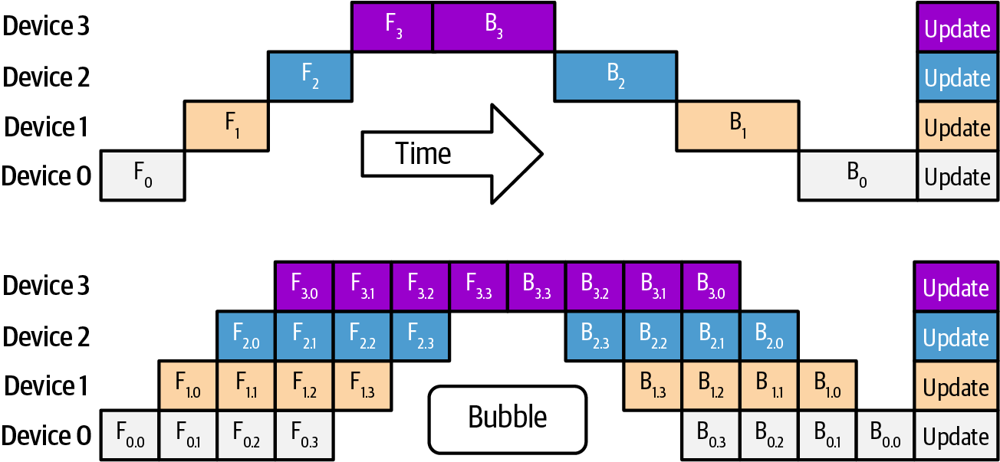

###### Figure 19-1. Pipeline bubbles caused by PP

By activating only a few experts per input, expert parallelism reduces per-device memory, inference time, and compute costs for models with a large number of experts, often called wide expert models. The conditional, router-based expert compute pattern scales efficiently as you add more experts. For instance, DeepSeek-R1 has 256 total experts, but only the top 9 experts (including 1 shared expert) are chosen by the router during inference.

Traditionally, the parallelization strategy—including a hybrid strategy of multiple parallelism techniques combined—is chosen and fixed upfront when the model is loaded. However, to maximize performance under dynamic workloads, modern inference engines can choose different parallelism strategies at runtime based on the characteristics of the input.

High-performance, adaptive inference systems use runtime metrics to choose TP, PP, or a hybrid approach on the fly. Key factors include batch size, sequence length, and memory utilization—as well as response latency and throughput requirements. For instance, very long prompts may be routed to a TP + PP instance since this spreads layers across GPUs to avoid out-of-memory (OOM) errors.

Meanwhile, short latency-sensitive requests would route to a TP-only model instance to avoid pipeline-stage overhead. To support this, your serving engine maintains multiple presharded model instances, each optimized for different workload profiles, and dynamically dispatches incoming queries to the model instance whose parallelism strategy best satisfies the job’s SLOs.

You can also use a different number of shards. This is shown in Figure 19-2, which uses two different numbers of TP shards in two different hybrid TP + PP parallelism configurations across eight GPUs.

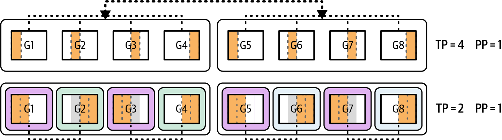

###### Figure 19-2. Preprovisioning two different hybrid-sharding pools (TP = 4, PP = 1 and TP = 2, PP = 1) for a given model across eight GPUs

Using PP on the fly for long sequence inputs helps to avoid OOM errors caused by the large input sequence. Conversely, for short prompts and latency-sensitive queries, the system can instead route to a tensor-parallel model instance optimized for low latency. In this case, the request avoids the overhead of PP.

Since each request can use a different parallelism strategy, the system needs to maintain multiple instances of the model for the inference scheduler/router to choose. One instance of the model would be optimized for low latency using TP, while another instance is optimized for high throughput and large input sequences using both TP and PP.

Maintaining multiple instances of the model is required because resharding on the fly would wreak havoc on GPU caches. This would also put too much pressure on the memory and network subsystems—especially when resharding massive models.

At runtime, each query is dispatched to the best‐fitting model instance (sharding strategy) based on its length and the specified service-level agreements (SLAs). DeepSeek-R1, for instance, is a ~680 billion-parameter sparse mixture-of-experts model that activates only 37 billion parameters per token across the experts.

To support different workload profiles, GPUs can be organized into logical worker pools, each presharded with a specific parallelism strategy—either tensor-parallel or hybrid tensor + pipeline parallel, for instance.

Let’s consider an example. If we have an 8× GPU Blackwell B200 server totaling 1,440 GB of HBM memory (1,440 GB = 180 GB per GPU × 8 GPUs), we can serve DeepSeek-R1 with four-way TP across four GPUs—leaving the other four GPUs idle.

If a single query arrives with an extremely long context (e.g., > 1 million tokens), the scheduler can spawn a two-stage pipeline such that stage 1 spans GPUs 0–3 and stage 2 spans GPUs 4–7. This effectively doubles the available GPU memory per stage to ~720 GB (180 GB per GPU × 4 GPUs) of total HBM (720 GB usable HBM). This helps avoid OOM errors when processing large inputs.

Conversely, when dozens of short, latency-sensitive prompts arrive concurrently, the system routes them to the tensor-parallel instance only. By avoiding pipeline bubbles, or idle periods that occur while filling and draining pipeline stages, this configuration delivers the lowest possible per-request latency across all available GPUs.

To implement dynamic parallelism switching, you can implement a decision function that inspects runtime metrics like input sequence length, GPU memory usage, and current load. You would use these metrics to select the best‐sharded model instance for each request, as shown here:

```python
def choose_worker_pool(seq_len, gpu_mem_util, concurrent_reqs):
# For long contexts or high memory pressure,
# use hybrid pipeline + tensor parallelism
# (example thresholds shown here)
if seq_len > 4096 or gpu_mem_util > 0.8:
return "tp_pp_hybrid"
# For many simultaneous small requests, stick with tensor parallelism
if concurrent_reqs > 4:
return "tensor_parallel"
# Fallback to tensor-parallel for typical workloads
return "tensor_parallel"
```

You’d prelaunch multiple model replicas on your GPU cluster—some sharded for TP-only and others for TP + PP—and have a router send each query to the appropriate replica based on the inputs and the decision strategy. This approach ensures that large, memory-intensive jobs get full pipeline support, while short, latency-sensitive calls run on TP-only instances to avoid unnecessary pipeline overhead.

It’s recommended to use telemetry from the model and hardware to inform parallelism switching. You can monitor GPU memory utilization, compute utilization, and interconnect (e.g., NVLink/NVSwitch) traffic in real time to make the decision. If you notice idle GPUs because of long pipeline bubbles—and you have extra memory headroom—you can collapse your pipeline into fewer stages so each GPU does more work and stays busy. Conversely, if some stages are hitting memory limits or compute bottlenecks, you can expand into more pipeline stages—or raise your tensor-parallel degree. This will spread the computations and memory footprint across additional GPUs.

The key is to adjust the balance of tensor and pipeline splits dynamically to keep every GPU well utilized. At the same time, you need to stay within memory constraints and hit latency targets. This is something a static, one-size-fits-all configuration cannot achieve.

# Dynamic Precision Changes

Modern GPUs like Blackwell introduce support for 8-bit and 4-bit floating point (FP8/FP4) Tensor Core math units. These lower precisions offer large speedups, memory savings, and minimal quality loss.

Dynamic precision switching is an advanced technique in which the inference engine adjusts the numerical precision at runtime based on model confidence or resource pressure. The goal is to increase throughput without significant quality loss. In practice, this means the system might execute certain parts of the model in FP8 or FP4 for efficiency but fall back to higher precision (FP16/BF16) when needed for stability.

One trigger for precision adaptation is logit sharpness, or the model’s output confidence. For example, if the model’s probability distribution for the next token shows extreme peaks due to high confidence in a specific token, small numerical errors from low precision are unlikely to change the outcome.

If low precision can be tolerated for the next token generation, the engine will safely use FP4 for the next few steps to gain speed. Conversely, if the distribution is flatter due to high uncertainty, the engine should stick to FP8 or FP16 to preserve fidelity.

The inference engine quantifies uncertainty by computing the Shannon entropy of the softmax distribution over the vocabulary. Lower entropy indicates a sharper (more confident) prediction. A fixed entropy threshold, tuned on a held-out validation set, determines when to drop to FP4 and when to remain in FP8/FP16 for numerical stability. The goal is to balance latency gains versus accuracy loss.

Use the lowest precision that maintains accuracy, and revert to higher precision when the model’s confidence drops as measured by the maximum softmax probability.

This leverages the fact that large LLMs often become more certain as they generate deterministic continuations, such as closing quotes or finishing a list. In these cases, lower precision is usually sufficient.

Another factor is memory pressure. If GPU memory usage is approaching its limit due to a very long context—or many parallel requests, the system can dynamically compress activations to a lower precision.

One could store the attention key/value tensors in INT4 instead of INT8 when memory is scarce. This would reduce the memory footprint by 50%. However, make sure the quantization error from using INT4 does not compound across many decoding steps. It’s recommended to periodically reevaluate output quality.

For instance, if an inference reaches a point where the KV cache is using 90% of memory, the engine might decide to quantize new cache entries from INT8 down to INT4—or even retroactively compress older entries—to free space. This can be done without stopping the model. In this case, the next attention layers simply read the INT4 cached values—with minor quantization error.

Combining 4-bit weight quantization with 8-bit activations can reduce memory significantly. For instance, pure compute-limited kernels FP8 activations can achieve up to 2× throughput—especially on high-bandwidth modern GPUs. For mixed or memory-bound workloads, 1.5× is achievable. Using FP4 for activations can push memory savings even further. However, it may introduce slightly higher cumulative error that requires careful layer-wise tuning.

Modern GPUs provide native FP8 and FP4 Tensor Cores. However, PyTorch’s AMP support (`torch.autocast`) still only targets FP16 and BF16 as of this writing. It does not target FP8 or FP4. While FP8 dtypes exist in PyTorch (e.g., `torch.float8_e4m3` and `torch.float8_e5m2`) alongside scaled math paths, AMP does not manage them. For inference and training, it’s recommended to use NVIDIA’s Transformer Engine (TE) and adopt its MXFP8 and NVFP4 when appropriate.

For latency-critical decode, prefer BF16 over FP16 on Blackwell when using AMP. For FP8 paths, the Transformer Engine’s MXFP8 format is the recommended default on Blackwell. Use NVFP4 selectively for KV cache and light layers with careful regression testing. Remember to validate numerics per layer on your specific workload.

Table 19-2 summarizes some example precision configurations and their trade-offs. Here, you see that lower precision reduces memory and increases throughput. However, there is slight quality degradation.

Here, we see that with FP8 activations, we get a memory reduction of ~50% from the baseline FP16 as expected by reducing the activation bit-width by 50%. Additionally, the quality loss measured here is negligible (< 0.1%) for FP8 activations. (Note: quality impact with reduced precision is model-dependent and kernel-dependent. You should validate with your own data and workloads.)

INT4 weight + FP8 activation workflows can produce about ~1.8× of the baseline throughput when memory is the main bottleneck. INT4 weights + FP4 activations can reduce memory down to 20% of the baseline. 4-bit targets. The speedup is around 3.5×, which is consistent with the theoretical peak 4× improvement over FP16.

The goal of dynamic precision switching is to maximize performance while keeping output quality within acceptable bounds. Ideally, the kernel runs in the fastest possible precision (e.g., FP8 or FP4) and falls back to higher precision (e.g., FP16) only when necessary. In practice, libraries like NVIDIA’s Transformer Engine for PyTorch allow layer-wise control over precision at runtime.

Linear layers might default to FP8, but a runtime hook could increase a layer’s precision to FP16 or reduce it to FP4 depending on the layer’s role. For instance, FP4 could be applied to lightweight layers like output projections in which minor accuracy degradation is tolerable, while FP8 or FP16 might be used for early layers that process raw user inputs and benefit from higher precision.

Beyond per-layer mixed-precision control, you can use a more fine-grained optimization strategy, which adjusts the precision per token. This approach lets the inference system run in the fastest mode possible, FP8 for instance, when predictions are confident. It would then fall back to higher-precision modes like FP16 when it’s more uncertain.

In practice, the model generates the current token using a default precision (e.g., FP16), then evaluates confidence based on runtime metrics, such as output entropy, maximum softmax probability, or logit variance.

If the model is highly confident in its prediction, the next token can be processed at a lower precision. If uncertainty is high, the system reverts to a more stable format to maintain output quality. Here is example code that demonstrates the concept:

```python
import contextlib
import torch

# ----------------------------
# Safe Transformer Engine (TE) FP8 autocast import
# ----------------------------
try:
# TE is only effective if your model actually uses TE-enabled layers
# (e.g., Linear, LayerNorm wrappers).
from transformer_engine.pytorch import fp8_autocast as _te_fp8_autocast
# type: ignore
_TE_AVAILABLE = True
except Exception:
_TE_AVAILABLE = False
# No-op stand-in so the code runs without TE installed. It never changes
# numerical behavior.
class _NullCtx(contextlib.ContextDecorator):
def __init__(self, **_): pass
def __enter__(self): return self
def __exit__(self, *exc): return False
def _te_fp8_autocast(**_):
return _NullCtx()

# ----------------------------
# Helper: choose the precision context *for this step* safely
# ----------------------------
def _precision_context_cuda(use_fp8: bool,
prefer_bfloat16: bool,
enable_fp8: bool):
"""
Enter exactly one precision context. If FP8 isn't enabled or TE is
missing/unused, fall back to AMP (BF16/FP16).
"""
if use_fp8 and enable_fp8 and _TE_AVAILABLE:
# Note: fp8_autocast affects only TE-enabled modules. Non-TE modules
# run at their native dtypes.
return _te_fp8_autocast(enabled=True)
amp_dtype = torch.bfloat16 if prefer_bfloat16 else torch.float16
return torch.autocast(device_type="cuda", dtype=amp_dtype)

def _precision_context(device: torch.device, use_fp8: bool,
prefer_bfloat16: bool, enable_fp8: bool):
return _precision_context_cuda(use_fp8, prefer_bfloat16,
enable_fp8) if device.type == "cuda"
else contextlib.nullcontext()

# ----------------------------
# Main decode loop with smoothed, hysteretic precision switching
# ----------------------------
@torch.no_grad()
def decode_with_dynamic_precision(
model,
tokens: torch.Tensor,
max_steps: int,
*,
device: torch.device = torch.device("cuda"),
prefer_bfloat16: bool = True, # B200: prefer BF16 over FP16 for AMP
enable_fp8: bool = True, # Allow FP8 when TE present
enter_fp8_threshold: float = 6.0, # hysteresis upper bound
# (logit margin average)
exit_fp8_threshold: float = 3.0, # hysteresis lower bound (avoid flapping)
reeval_interval: int = 8, # compute/inspect confidence every N steps
# to avoid per-step sync
topk_dim: int = -1, # last dimension holds vocabulary logits
eos_id: int | None = None,
):
"""
Autoregressive decode loop that *smoothly* switches between AMP (BF16/FP16)
and FP8 (TE) without per-step host sync. Works even when TE is not
installed; in that case, runs AMP only.

- Confidence signal: mean(top1 - top2) logits margin across the batch.
- Smoothing: EMA + interval re-evaluation to minimize CPU-GPU sync pressure.
- Hysteresis: separate enter/exit thresholds to avoid precision flapping.
"""
assert exit_fp8_threshold <= enter_fp8_threshold,
"Hysteresis requires exit <= enter threshold"

model.eval()
tokens = tokens.to(device, non_blocking=True)

# Internal state
use_fp8: bool = False # start in AMP.
# Upgrade to FP8 when sustained confidence permits
ema_conf: torch.Tensor | None = None # stays on device;
# host consults only at intervals
alpha = 0.2 # EMA smoothing factor for confidence
# A tiny helper to update on-device EMA without host sync
def _update_confidence_ema(logits: torch.Tensor) -> torch.Tensor:
# logits: [B, vocab] or [B, T, vocab]. Use the last time-step if 3D.
last = logits if logits.dim() == 2 else logits[:, -1, :]
# Compute top-2 margin on-device
top2 = torch.topk(last, k=2, dim=topk_dim).values # [B, 2]
margin = (top2[:, 0] - top2[:, 1]).mean() # scalar tensor on device
nonlocal ema_conf
ema_conf = (1 - alpha)
* (ema_conf if ema_conf is not None else margin)+alpha*margin
return ema_conf # device scalar

# Decode
for step in range(max_steps):
# 1) Precision context (exactly one).
# No nested contexts, no leakage across iterations.
with _precision_context(device, use_fp8, prefer_bfloat16, enable_fp8):
# Forward pass (HF-style or plain)
try:
logits = model(input_ids=tokens)
if hasattr(logits, "logits"):
logits = logits.logits
except TypeError:
logits = model(tokens)

# 2) Pick next token from the *last* position
last_step_logits = logits if logits.dim() == 2 else logits[:, -1, :]
next_token = torch.argmax(last_step_logits, dim=-1,
keepdim=True) # [B, 1]
tokens = torch.cat([tokens, next_token], dim=1)

# 3) Update on-device EMA signal every step (no host sync yet)
conf_dev = _update_confidence_ema(logits)

# 4) Periodically re-evaluate precision choice on host
# to avoid per-step sync
if (step + 1) % reeval_interval == 0:
conf_value = float(conf_dev) # exactly one tiny sync every N steps
if not use_fp8 and enable_fp8 and _TE_AVAILABLE
and (conf_value > enter_fp8_threshold):
use_fp8 = True
elif use_fp8 and (conf_value < exit_fp8_threshold):
use_fp8 = False

# 5) EOS handling
if eos_id is not None:
if (tokens[:, -1] == eos_id).all():
break

return tokens

# ----------------------------
# Example (commented):
# ----------------------------
# model = ... # your TE-enabled model (or any torch.nn.Module)
# input_ids = torch.randint(0, vocab_size, (batch_size, seq_len))
# out = decode_with_dynamic_precision(model, input_ids, max_steps=128,
# eos_id=tokenizer.eos_token_id)
# print(out.shape)
```

Here we see that PyTorch autocast supports only reduced-precision FP16 and BF16 as of this writing. In this case, you need to use the Transformer Engine library to route supported modules to FP8 kernels.

The threshold used in this example (enter = 6.0, exit = 3.0) should be calibrated on a validation set using representative prompts to prevent latency gains from impacting accuracy.

This pattern creates an elastic precision regime and maximizes throughput. When the model operates in predictable (e.g., low-entropy) regions, such as generating punctuation or boilerplate completions, it continues in FP8 to maximize performance. When it enters higher-entropy segments, such as ambiguous prompts or decision points, it returns to FP16 to preserve numerical accuracy.

When paired with a modern GPU’s support for low-precision operations, token-level dynamic precision switching offers an adaptive strategy for high-throughput, latency-sensitive inference. It applies low precision only when needed, reduces compute overhead, and maintains response quality across many different prompt conditions.

# Kernel Autotuning for Transformer Self-Attention and MLP Paths

The performance of neural network layers on GPUs can vary drastically depending on low-level parameters like thread block size, tile dimensions, loop unrolling, and memory access patterns. For fixed-size models, libraries typically choose these parameters only once—often using general heuristics or offline tuning.

However, in an online inference service scenario, input sizes, including sequence lengths and batch sizes, can vary from request to request. Kernel autotuning refers to a runtime mechanism that selects—or even JIT-compiles—the optimal kernel variant for the current workload.

In the context of large transformer models, the two major compute phases of inference are self-attention and feed-forward MLP layers. Both can benefit from autotuning of their GPU kernels. Let’s cover each of these in the context of kernel autotuning.

Consider an attention layer that processes a sequence of length L with H attention heads. There are many implementations of attention, including standard attention and optimized FlashAttention—and its multiple variants.

FlashAttention and its variants are significantly faster for long sequences due to tiling, parallelism, and memory-access improvements. However, for very short sequences, its overhead might outweigh its benefit. A dynamic engine can switch between a FlashAttention kernel and a simpler kernel depending on the sequence length, L.

For instance, if a request has L = 256 tokens, the engine might use a straightforward kernel launch that computes attention in one go using global memory reads, which are sufficient for small L. If another request comes in with L = 2,048, it could switch to FlashAttention’s specialized tiling kernel known to scale better for large L by reusing data in shared memory and avoiding unnecessary HBM data fetches. This is demonstrated as a condition statement based on the input sequence length, as shown here:

```cpp
// Note: example threshold shown here
if (seq_len < 256) {
// global-memory version, best for small L
attn_kernel = standard_attention_kernel;
} else {
// tiled loads, best for large L
attn_kernel = tiled_attention_kernel;
}
output = attn_kernel(Q, K, V, mask);
```

Behind the scenes, `attn_kernel` picks between completely different CUDA implementations. One implementation is optimized for small inputs using the default attention kernel, and another is optimized for large contexts using the tiled kernel.

The ideal tile dimensions depend on your GPU’s shared-memory capacity and compute resources. Frameworks like CUTLASS and OpenAI’s Triton include autotuners that benchmark a range of `(TILE_Q, TILE_K)` combinations at initialization—or even adaptively at runtime—to select the fastest variant. [Table 19-3](https://learning.oreilly.com/library/view/ai-systems-performance/9798341627772/ch19.html#ch19_table_3_1757308078873262) shows examples of how different tile sizes perform on a Blackwell-class GPU.

By choosing the right variant at runtime based on the input, you avoid the huge performance cliff of a one-size-fits-all approach. In practice you might benchmark on your target hardware to find that around L = 128 is the breakeven point.

Next, let’s analyze the feed-forward MLP kernels in the context of autotuning. The feed-forward layers are essentially large matrix multiplications—specifically, two linear projections with a nonlinear activation in between.

Modern AI frameworks like PyTorch use highly optimized GEMM kernels using optimized CUDA libraries like cuBLAS and CUTLASS. There are often multiple algorithmic variants in these libraries for a given matrix size that use different tiling strategies, different Tensor Cores, and separate fallback paths.

For instance, NVIDIA’s cuBLAS and cuBLASLt libraries can autotune GEMM kernels by first trying a few algorithms, then picking the fastest algorithm for the given dimensions. However, this typically happens the first time a GEMM of that shape is encountered—and not revisited.

Where available in cuBLAS/cuBLASLt or custom kernels, programmatic dependent launch (PDL) can reduce launch gaps and improve steady-state throughput. Make sure to profile to confirm overlap.

In an inference server that sees many different batch sizes, one can explicitly invoke such autotuning mechanisms—or maintain a cache of best algorithms. For instance, for the MLP’s GEMM of shape `[batch_size, hidden_dim] x [hidden_dim, 4*hidden_dim]`, the optimal kernel might differ for `batch_size = 1` versus `batch_size = 16`.

The engine can detect a new batch size and run a quick microbenchmark of candidate kernels using cuBLASLt or a custom implementation to select the fastest kernel. Subsequent calls with that batch size can then directly use the chosen kernel.

In addition, some inference frameworks and runtimes use OpenAI’s Triton GPU kernel domain-specific library (DSL) to compile attention and MLP kernels on the fly with autotuned tile sizes. In this case, the runtime would generate a few variants of a kernel with different tile sizes (e.g., 128 × 128, 64 × 256, etc.) and measure which performs better given the actual hardware and input shape.

You can use tools like Nsight Systems to empirically profile different kernel variants side by side.

Specifically, Nsight Systems provides detailed CUDA timelines, including `memcpy` and NVLink activity, and Nsight Compute provides memory workload analysis that helps attribute cache and memory behavior to kernel sites. This is particularly useful when evaluating tile-size and shared-memory trade-offs. In addition, it can often reveal nonobvious bottlenecks like L2 cache misses that will further guide your tuning <span class="keep-together">decisions.</span>

Because hardware can sometimes be somewhat unpredictable under load given L2 cache effects, memory bank conflicts, etc., empirical tuning will always beat theoretical guesses. But it’s good to start the tuning process with reasonable theoretical values.

Dynamic tile switching affects GPU occupancy and should be considered when choosing a tile size. Using a larger tile can increase reuse and reduce kernel-launch overhead, but it can also use more registers and shared memory. This will potentially reduce the number of thread blocks that can run concurrently—reducing occupancy. A proper autotuner will consider this trade-off.

In attention kernels, a larger tile (e.g., 128 × 128) maximizes data reuse in shared memory. This is ideal for long sequences since you issue fewer global‐memory loads, amortize loop overhead, and produce higher sustained throughput.

For shorter sequences, however, that same large tile can consume too much shared memory, which limits the occupancy, or number of concurrent thread blocks running on each SM. By reducing the tile size (e.g., 64 × 64) for shorter sequences, you free up shared memory so you can schedule more blocks in parallel. This boosts SM occupancy and reduces per‐kernel latency.

By adapting the tile size based on the input sequence length, the kernel can achieve near-optimal occupancy in most cases. Some systems even query the CUDA Occupancy API at runtime to choose kernel-launch parameters dynamically, such as thread block size. An example of the Occupancy API in C++ is shown next, but a Python API is also available:

```cpp
// Pseudocode for occupancy-based launch configuration
int maxBlocks, bestThreads;
for (int threads = 64; threads <= 256; threads *= 2) {
cudaOccupancyMaxActiveBlocksPerMultiprocessor(
&maxBlocks, MyKernel, threads,
sharedMemPerBlock(threads));
// choose "threads" to maximize occupancy
// (remember to not exceed the max threads per SM limit (e.g., 2,048)
float occupancy = (float) maxBlocks * threads /
hardwareMaxThreadsPerSM;
}
```

This pseudo-C++ illustrates evaluating different thread block sizes for a kernel. It checks how many blocks per SM can run given their shared-memory usage. The kernel launch then adjusts the number of threads—or shared-memory use—accordingly. High-performance frameworks and inference engines automate this type of logic internally using the following set of steps:

Inspect the current input dimensions (batch size `B`, sequence length `L`, etc.) for the next model forward.

Determine available kernel implementations for each component, such as standard attention or flash attention for the attention phase and an appropriate GEMM algorithm for the MLP phase.

Run a quick run of each candidate by executing each algorithm for a few iterations on sample data.

Select the kernel with minimal execution time—or sufficient throughput—based on the measured dimensions.

Store the choice in a lookup table keyed by the input dimension or workload signature. This way, if a similar request appears, the best kernel is known without having to rerun these steps.

Run the model layer using the chosen kernel implementation.

This is analogous to a database query optimizer picking a query plan. Here, the “plan” is the chosen kernel implementation.

By following such a process, the inference runtime continuously tunes itself. Over time, the system builds a library of optimized paths for various scenarios, such as short versus long prompts, small versus large batches, etc. The overhead of on-the-fly tuning is kept low by either doing it asynchronously—testing new kernels in a separate stream while the current inference uses a default kernel—or during low-traffic periods so as not to impact latency.

It’s recommended to incorporate an initial warm-up phase when a model is loaded by running a variety of sample inputs through to trigger autotuning. This can include extremes—like max sequence length, max batch, etc.—so that the engine preoptimizes kernels for those cases.

Also, it’s best to monitor execution time at each layer during runtime. If a layer suddenly becomes a bottleneck due to a change in input characteristics, then it’s time to revisit the kernel selection.

Some advanced frameworks even use multiarmed bandit algorithms that continuously explore alternative kernels and update the choice of a different kernel as conditions change.

In short, autotuning transforms static kernels into adaptive ones. This squeezes the highest performance out of your GPU cluster for each set of inputs regardless of the workload. You can be confident that the system is constantly adapting.

# Dynamic Shared-Memory Allocation and Occupancy-Aware Kernel Selection

Closely related to kernel tuning is the management of GPU shared memory and overall streaming multiprocessor (SM) occupancy. Modern GPUs feature a large shared memory per SM. By dynamically allocating threads at runtime based on the problem size—as well as current shared-memory utilization and occupancy—you can significantly improve overall AI system performance.

With dynamic shared-memory allocation, the system adjusts the amount of shared memory that each thread block uses based on the problem size. With occupancy-aware kernel selection, the system is choosing kernel-launch parameters that make best use of the SM’s resources—including registers, shared memory, and warps—to keep the GPU busy.

Choosing a tiled attention algorithm should balance data reuse against SM occupancy. For instance, consider `T` as your tile width, in tokens, per thread block. Each thread block reserves on the order of <em>O</em>(<em>T</em><sup>2</sup>) floats in shared memory to hold the query, key, and value chunks since self-attention is quadratic in nature.

A large tile size (e.g., `T=256`) loads each key/value block once from DRAM and reuses it for many queries. This reduces global-memory traffic closer to O(T) floats per thread block. But because each thread block now uses a lot of shared memory, only a few thread blocks can run on an SM at once given hardware limits. This reduces occupancy. For example, if only 1 block per SM can run at `T=256` versus 4 blocks at `T=128`, you might see only 30% SM occupancy using `T=256`.

A small tile size (e.g., `T=64`) uses far less shared memory, which allows more thread blocks to fit into each SM. This better hides latency and boosts utilization. However, you end up reloading the same key/value data more often, which increases DRAM accesses.

The optimal tile size, `T`, depends on a few factors, including your sequence length `L`, the GPU’s shared-memory capacity, and the SM count. You want a tile that’s large enough to amortize DRAM reads but small enough to keep occupancy high enough that many thread blocks are active on the SM concurrently.

In practice, you could manually pick a handful of candidate `T` values, such as 64, 128, and 256—and benchmark each value on your specific hardware using a sequence length, `L`, that represents your dataset. You would then choose the value of `T` that produces the best overall throughput. However, instead of hard-coding `T` ahead of time, you can compute it right before launching your kernel, as shown here:

```cpp
int T = choose_tile(L, gpu_shared_mem_per_block, num_sms);

// calculate shared memory in bytes based on the tile size
// (multiplying by 3 for Q, K, and V)

size_t shared_mem_bytes = 3 * T * T * sizeof(float);

numBlocks = ...

MyAttentionKernel<<<numBlocks, threadsPerBlock, shared_mem_bytes>>>(...);
```

Here, `T` is computed from the sequence length `L`; the GPUs’ shared-memory limits per thread block, `gpu_shared_mem_per_block`; and the number of SMs, `num_sms`. Then, shared memory per thread block, `shared_mem_bytes`, is computed at runtime based on the computed tile size, `T`.

You can then launch the CUDA kernel with the shared-memory argument, `shared_mem_bytes`. The kernel itself would contain the following to define an `extern __shared__` array to allocate the shared-memory buffer of size `shared_mem_bytes` for each thread block:

```cpp
// holds 3 tiles of T×T floats for Q, K, and V
extern __shared__ float smem[];

// Q tile: smem[0 ... T*T-1]
float* tile_q = smem;

// K tile: smem[T*T ... 2*T*T-1]
float* tile_k = smem + T*T;

// V tile: smem[2*T*T ... 3*T*T-1]
float* tile_v = smem + 2*T*T;
```

By varying `shared_mem_bytes` per launch, the same kernel binary can run with different tile sizes. After selecting `T`, you can query occupancy using the CUDA Occupancy API to see how many blocks fit per SM.

If occupancy is too low and only one block is allocated per SM, you can reduce `T`. If you’re thrashing DRAM, you can increase `T`. This can be implemented as an automatic feedback loop in which the kernel programmatically measures its own achieved occupancy using the CUDA Occupancy API or NVIDIA’s Data Center GPU Manager (DCGM)—and adjusts `T` on subsequent iterations. This way each attention layer uses the optimal configuration based on the current sequence length, `L`, and the hardware limits.

As we saw in Chapter 6, you also need to consider register usage per thread when optimizing SM occupancy. Using more registers (e.g., unrolling loops) can speed up single-thread performance, but it can reduce overall SM occupancy since each SM has a limited register file.

Fewer warps can be scheduled if each warp uses many registers. A dynamic runtime can detect if a kernel is hitting occupancy limits due to registers and switch to a version that uses fewer registers—at the expense of extra instructions. These low-level considerations are critical for adaptive, high-performance inference servers.

Dynamic shared-memory tuning requires profiling occupancy versus throughput. Tools such as NVIDIA Nsight Systems/Compute and the CUDA Occupancy API can show the achieved occupancy and execution efficiency of each kernel. Meanwhile, DCGM provides real-time GPU utilization and SM occupancy metrics at the system level. An adaptive system can use this information to notice that an attention kernel with sequence length 2,048 achieves only 30% occupancy, for example, because each thread block uses a large amount of shared memory.

In this case, the system could dynamically switch to a kernel configuration that reduces shared memory per thread block by splitting the attention computation across two passes, for instance. This would increase occupancy—and potentially increase throughput—if memory latency was the bottleneck.

Conversely, if a kernel is memory bound and not saturating ALUs, using more shared memory—even if occupancy drops—can improve effective throughput by reducing memory stalls. It’s important to understand these trade-offs—especially with occupancy since it’s less intuitive, in some cases, than other metrics.

It’s recommended to design kernels that allow tunable shared memory and thread block sizes at runtime. The system can then adapt the tuning configuration to runtime conditions based on input and hardware feedback. For example, it can provide runtime parameters and template parameters for tile sizes used by libraries like CUTLASS, which provide runtime-tunable kernel variants for exactly this reason.

You should also continuously monitor SM utilization metrics. Consider many idle warps (e.g., < 50% active warps) or memory stall cycles (> 70% stalled). This indicates an imbalance, as either occupancy is too low (idle warps)—or your tile size is too small and causes excessive memory traffic. As such, your system should adjust accordingly to restore the balance.

For inference serving, it’s common to maintain a small table of optimal thread block configurations for different problem sizes. This mapping can be implemented as a JSON or config file that maps sequence length ranges to launch parameters. This allows easy updates as models and hardware evolve.

For instance, whenever your system performs attention with sequence length 512, it will use 128 threads/block and 16 KB shared memory. Or, for sequence length 4,096, it will use 256 threads/block and 64 KB shared memory, etc. This extends the concept of autotuning to resource allocation.

Remember that modern NVIDIA GPUs provide a unified on-chip pool for L1 data cache and shared memory. And the carveout controls how much of that pool is reserved for shared memory versus L1. Adjust the carveout with `cudaFuncSetAttribute` to increase the fraction available to shared memory when kernels demand larger tiles.

Modern NVIDIA GPUs provide a unified on-chip pool for L1 data cache and shared memory. NVIDIA’s device driver allows you to set the L1 cache versus shared-memory split percentage, or “carveout” percentage. As such, you can configure an SM to prefer more shared memory or more L1 cache depending on the use case. For instance, you can increase the fraction available to shared memory when kernels demand larger tiles.

The carveout is a per-kernel attribute and only a hint rather than a guarantee. It’s another knob you can tune to balance occupancy and caching behavior.

A sophisticated runtime can toggle this carve-out percentage at launch time using `cudaFuncSetAttribute()` with `cudaFuncAttributePreferredSharedMemoryCarveout` or specific kernels. For instance, if an attention kernel uses very large tiles and needs more shared memory, you might want to reduce the L1 to 25% and increase shared memory to 75% (assuming the carveout value starts at 50%).

The shared-memory versus L1 carveout attribute is a hint rather than a guarantee. Always treat the setting as a hint and verify the effect with profiling. Check that the requested setting actually impacted occupancy and cache behavior.

In short, dynamic shared memory and occupancy-aware techniques ensure that every SM is kept as busy as possible for the given task. These techniques adapt the kernel’s resource usage to the specific use case. This is essential for large models in which some layers or batch sizes could otherwise underutilize the SMs.

# Speculative KV Prefetching for Faster TTFT

When serving LLMs in a real-time setting, time-to-first-token (TTFT) is a critical metric, as it measures how quickly the system can produce the first token of the model’s response. This directly affects the end user’s experience.

One major contributor to TTFT in large models is the time spent setting up the model’s internal states, such as the key-value (KV) cache, before token generation can begin. Remember from earlier chapters that the attention KV cache stores the past tokens’ key and value projections for each layer.

Speculative KV prefetching is an optimization in which the system anticipates the data needed for the first token—and loads the necessary data into the GPU in advance. This effectively overlaps KV cache preparation with other steps, such as compute. This way, the token generation can start more quickly. An example of speculative KV caching is SpeCache, as shown in Figure 19-3.

With SpeCache, the KV cache is compressed (16-bit, in this case) and moved off-GPU one layer at a time. This reduces the memory footprint. After generating the first output token, a speculative “next” token is computed. At the same time, the model prefetches the corresponding reduced-precision KV pairs needed for that first decoding step.

On each subsequent step, the model decodes two tokens in parallel, including the actual output token and the speculative token. Both results are fed into the next step, and, before each step, the top-k most relevant 16-bit KV pairs for the speculative path are prefetched. This way, both paths have their required KV cache data ready. In short, SpeCache reports TTFT improvements by prefetching reduced-precision KV and overlapping with compute.

Integrate speculative prefetch techniques only after validating your access patterns and storage tiers.

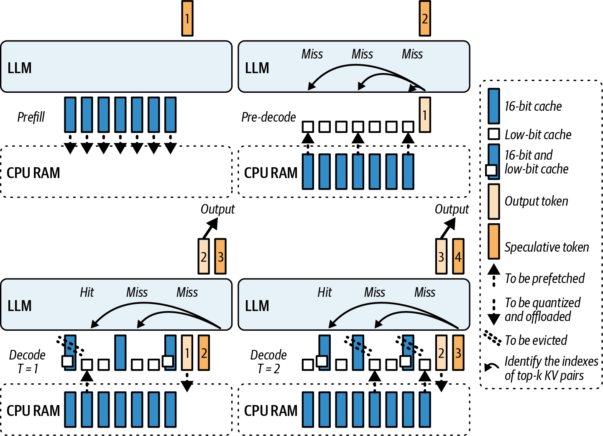

###### Figure 19-3. Speculative decoding with SpeCache (source: https://oreil.ly/b21E5)

The KV cache can be extremely large due to the number of layers in modern LLMs, the increasing size of the LLM context window (effectively limitless at this point), and the large amount of reasoning chains generated by modern “thinking” models. Modern inference systems will often swap the KV cache between GPU, CPU memory, and SSD to better manage capacity—especially for extremely long contexts, which don’t fit in GPU memory.

When a new token is being generated, a naive approach would be to fetch the KV data from wherever it resides (some on GPU, some on CPU) in synchronous fashion—and then perform the computation to decode the next token. This can add significant latency for the first token—especially if the cache has been paged out to CPU memory or NVMe storage.

KV cache prefetching helps by starting the KV data transfers ahead of time. As soon as the user’s prompt is received, the server can start copying the necessary KV pages—as well as the model weights—directly into GPU memory. By the time the model finishes computing the prompt in the prefill phase, the necessary data is in place to generate the first output token.

Specifically, this mechanism keeps only the current layer’s KV in GPU memory—and offloads the other layers’ KV to the CPU. It asynchronously prefetches the next layer’s cache into the GPU while the current layer is being computed. Additionally, it simultaneously writes the previous layer’s cache back to the CPU.

This overlap of communication and computation means the GPU rarely waits for data. The result is that using an offloaded KV cache in CPU memory has minimal impact on latency. For example, you might see ~5%–10% lower tokens/s throughput when offloading due to the extra data-transfer overhead.

Overlap can mask much of the latency of CPU-resident KV, but a throughput penalty typically remains due to CPU DRAM bandwidth and PCIe overhead. Profile with your batch and sequence lengths repeatedly.

An example of KV cache offloading[]() is in Hugging Face’s Transformers library in the form of the `OffloadedCache` mechanism. This can be enabled when calling `generate(cache_implementation="offloaded")` or `generate(cache_implementation="offloaded_static")`. This will generate tokens with the Transformer library, as shown here. This makes it a low-effort, high-impact optimization:

```python
# Dynamic, variable-length serving and sliding layers
# (recommended default)
out = model.generate(..., cache_implementation="offloaded")

# Static shapes + torch.compile and CUDA Graphs
# (highest throughput with fixed shapes, use with torch.compile)
# out = model.generate(..., cache_implementation="offloaded_static")
```

Under the hood, when generation begins, the `OffloadedCache` will ensure that layer 1’s KV is moved to the GPU. While layer 1 computes, `OffloadedCache` issues an asynchronous DMA for layer 2’s KV from the CPU to the GPU, etc. It’s always prefetching one layer ahead.

By the time the forward pass reaches layer 2, its KV is already local. This reduces the stall that would occur if we used a synchronous copy for each layer. Now that we have described KV prefetching, let’s move to speculative KV prefetching.

Speculative KV prefetching extends beyond just the one-layer lookahead of regular KV prefetching. Imagine an inference server configuration with multiple model replicas—or multiple possible paths like MoE models in which a token can be routed to one of several expert networks.

KV prefetching helps at the boundary between the phases. By the end of the prefill phase, ideally, the caches for all layers are either already in GPU memory or queued to come into GPU memory. This directly minimizes TTFT since, once generation starts, the model isn’t waiting on memory transfers.

It’s recommended to continuously monitor your TTFT using tracing tools like NVTX markers to measure the first token’s decode time. This will measure TTFT precisely. If you see excessive spikes of idle time immediately after the decode phase begins, this indicates a missed prefetch opportunity.

To implement KV prefetching in your own stack without stalling inference, you can use CUDA streams for overlap (as described in Chapter 11). This way, it runs concurrently with your main computation stream. You would then use CUDA events to synchronize the streams only when the prefetched data is needed, as shown here:

```cpp
// kv_prefetch_overlap.cu

#include <cstdio>
#include <cuda_runtime.h>

// Example sizes
static constexpr size_t KV_BYTES =
/* set to your chunk size */ 8ull<<20; // 8 MiB

__global__ void forward_kernel(/* ... */) {
// compute logits for current token ...
}

__global__ void consume_prefetched_kv(/* use prefetch_dest */) {
// consumes KV in prefetch_dest ...
}

int main() {
// Allocate destination buffer on this GPU
void* prefetch_dest = nullptr;
cudaMalloc(&prefetch_dest, KV_BYTES);

// Example: staging source on host. MUST be pinned for real overlap.
void* kv_src_host = nullptr;
cudaMallocHost(&kv_src_host, KV_BYTES); // pinned (page-locked)
// Fill kv_src_host with data for the first iteration...

cudaStream_t compute_stream, prefetch_stream;
cudaStreamCreateWithFlags(&compute_stream, cudaStreamNonBlocking);
cudaStreamCreateWithFlags(&prefetch_stream, cudaStreamNonBlocking);
cudaEvent_t kv_ready;
cudaEventCreateWithFlags(&kv_ready, cudaEventDisableTiming);

bool done = false;
while (!done) {
// 1) Launch compute for current token
forward_kernel<<< /*grid*/1, /*block*/1, 0, compute_stream>>>();

// 2) Asynchronously prefetch next KV chunk
// If your source is another GPU, use cudaMemcpyPeerAsync
// and enable peer access.
cudaMemcpyAsync(prefetch_dest, kv_src_host, KV_BYTES,
cudaMemcpyHostToDevice, prefetch_stream);
cudaEventRecord(kv_ready, prefetch_stream);

// 3) Ensure consumer on compute_stream waits just-in-time
cudaStreamWaitEvent(compute_stream, kv_ready, /*flags*/0);

// 4) Launch work that consumes the prefetched KV
consume_prefetched_kv<<< /*grid*/1, /*block*/1, 0, compute_stream>>>();

// 5) ...advance state, update kv_src_host for next iteration, set `done`
done = true; // demo
}

cudaEventDestroy(kv_ready);
cudaStreamDestroy(prefetch_stream);
cudaStreamDestroy(compute_stream);
cudaFree(prefetch_dest);
cudaFreeHost(kv_src_host);
return 0;
}
```

In this setup, `cudaMemcpyAsync` runs on `prefetch_stream` while `model.forward()` uses the `compute_stream`. This allows the CUDA driver to overlap data transfer with compute. You synchronize only when the prefetched KV data is actually needed by waiting on `kv_ready` event before continuing with the computation that consumes it. The event enforces just-in-time synchronization at the handoff point.

Make sure the host buffers are pinned (page-locked). Otherwise, `cudaMemcpyAsync` may serialize and you won’t get the desired copy/compute overlap. If the KV source is on another GPU, use `cudaMemcpyPeerAsync` and enable peer access. And if you are using Unified Memory (e.g., Grace Blackwell, Vera Rubin superchips), consider using `cudaMemPrefetchAsync` to stage pages ahead of time. You can also use CUDA Graphs to capture this sequence if the pattern is repeatable. This can further reduce kernel-launch overhead when prefetching happens frequently.

Using a separate stream ensures efficient pipelining. As one token is being generated, the next token’s KV cache is being prefetched without interrupting the compute stream. This maximizes GPU utilization by masking transfer latency and keeping the compute units continuously fed with data. Modern LLM inference engines use this automatically in the form of paged KV caching.

It’s best to consider weight and KV cache data movement as part of the overall inference pipeline. Just as you should pipeline compute operations, you should also pipeline data movement. Always have the next needed data in flight while the current computation is ongoing. KV cache compression is yet another option to improve performance at the KV cache layer. Let’s cover this next.

# Real-Time KV Cache Compression and Policy Switching

As an LLM generates more and more tokens in a session, the KV cache grows linearly. For long conversations, documents, and reasoning chains, the KV cache consumes a huge amount of GPU memory and often utilizes the most GPU memory.

KV cache is a good candidate for compression/quantization. Like any form of compression, KV cache compression reduces its memory footprint. Doing this in real time means performing compression on the fly during inference.

Policy switching means that the compression strategy can change based on the current context. The goal is to free up memory and network bandwidth when needed—without impacting model accuracy or slowing down computations that involve the KV cache data. Figure 19-4 shows a few different types of KV cache compression algorithms.

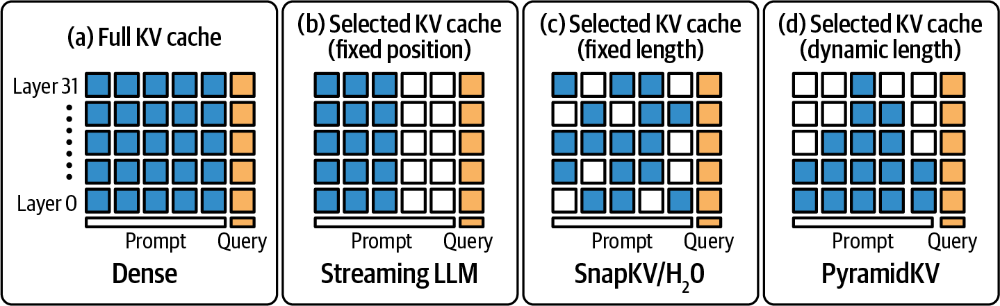

###### Figure 19-4. Different KV cache algorithms, including no caching (e.g., dense)

A straightforward and simple approach to KV compression is to just reduce its precision. Many frameworks default to FP16 or BF16 for KV cache since 16-bit is typically what the model uses for activations. However, one can often compress keys and values to 8-bit or even 4-bit with minimal impact on output quality—especially for tokens at the end of the LLM’s context.

Hugging Face’s Transformers library supports[]() a `QuantizedCache`, including INT8 and INT4 for KV memory. This feature can be enabled in one line by specifying `cache_implementation="quantized"` with a specific bit-width. The result is a massive memory savings at the cost of a tiny amount of extra compute for the quantization/dequantization operations. And the overall model quality does not suffer in most cases.

When quantization plus CPU offload is used concurrently, ensure host buffers are pinned (page-locked) to prevent serialized transfers. This will help to sustain copy bandwidth (e.g., PCIe/NVLink).

Next, let’s discuss dynamic policy switching. An example of a policy is keeping the last 128 tokens in full precision but compressing the rest of the tokens in 4-bit. This way, the most recent context—which likely has the most impact on predicting the next token—is preserved with higher precision, whereas the older history is stored in lower precision to save storage.

If the model suddenly needs to attend to older tokens, it’s usually not disastrous since many LLMs have recency bias anyway. This means that they prioritize recent context. This way, earlier parts of the input sequence may not affect the final output as much.

You might further adapt this window based on user prompt length. For example, you can use a larger full-precision window for very long prompts—or compress more aggressively if GPU memory usage is above a threshold.

Alternatively, a policy could be based on memory usage. For instance, the policy could dictate that if GPU memory usage exceeds 80%, it should compress the entire KV cache into 8-bit. This helps avoid OOM errors during long generations. The policy might include multitier compression in which the system compresses the KV cache to 8-bit under mild pressure, then changes to 4-bit compression under extreme pressure.

With true dynamic, real-time policy switching, the engine can change to a different compression during token generation. In this case, the implementation would need to maintain multiple representations of the cache simultaneously. For instance, it would initially store KV in FP16 but concurrently maintain an INT8 version of the same data.

The system would use FP16 by default, but if memory utilization crosses a certain threshold, it could start using the INT8 version—with appropriate scaling factors—and free the FP16 memory to relieve memory pressure. Future attention reads would then retrieve dequantized values from INT8 storage.

This requires careful synchronization, however, to ensure the compressed version is kept up-to-date and ready by the time it’s needed. Techniques like double buffering and background compression threads are useful in this case.

Often a CPU thread can handle the compression asynchronously using vectorized INT8 quantization operations. It can then copy the compressed block to GPU memory when ready.

Implement real-time policy swaps at safe points, such as the end of an iteration. This way, you can avoid mid-calculation switches and hide the requantization latency by doing it in a background stream.

There are other techniques, such as lossless compression, that use entropy coding and clustering to compress activations without losing information bit-for-bit. However, these implementations are complex and may be too slow to do in real time—even on a GPU.

Simpler mechanisms like chunk-wise ZFP, a type of floating-point compression, or even generic CPU-based compression should be considered. However, the simplest, most-effective, and well-supported method so far has been quantization.

As of this writing, lossless methods like ZFP are evaluated in offline and research contexts but remain uncommon in production LLM KV cache paths due to throughput constraints relative to quantized cache. As such, quantization remains the go-to approach for its balance of speed and 2–4× memory reduction.

For minimal quality impact, you can experiment with per-head and per-token scaling. Quantizing the KV cache is most effective with per-head, group-wise scaling rather than per-token scaling. The Hugging Face `QuantizedCache` Transformer implementation calibrates the range of values per attention head.

Specifically, `QuantizedCache` implements per-channel, group-wise quantization with a configurable group size and a residual window that keeps the most recent tokens in the original precision. You enable it by setting `cache_implementation="quantized"` and passing `cache_config` as a dictionary. You can compute the max absolute value in a tensor and scale the 4-bit or 8-bit quantization accordingly. This is essentially a form of min-max, or magnitude-based quantization.

A useful implementation of `QuantizedCache` is the [Half-Quadratic Quantization (HQQ)](https://oreil.ly/MhJCY) backend.[]() HQQ provides a calibration-free, on-the-fly quantizer that supports a wide range of low-bit formats, including 2-bit, 3-bit, 4-bit, and 8-bit. It uses a robust optimization to model outliers and heavy-tailed error distributions. And HQQ integrates well into the Hugging Face Transformers’ KV cache implementation. It provides both a PyTorch and custom CUDA kernel implementation for fast inference.

We can implement a dynamic policy that can switch between an 8-bit quantization and 4-bit quantization depending on memory pressure. The sharpness or distribution of values might also guide the decision. If the cached values are mostly small and have low variance, they can usually be quantized more aggressively. Switching the <span class="keep-together">compression</span> policy in real time can be integrated with the Hugging Face `Quantized​Cache` mechanism.

Unfortunately, Transformers does not support changing the bit-width of an already-initialized cache object in place. However, to implement a dynamic policy, our code can generate tokens in small chunks and, on memory pressure, start the next chunk with a new quantized cache configuration on the fly. This implementation is similar to falling back to an offloaded cache upon hitting an out-of-memory (OOM) error. Here is the code:

```python
# dynamic_quantized_cache.py
# Dynamic KV cache policy using Hugging Face Transformers' QuantizedCache (2025).
# Starts with int8 HQQ and drops to int4 when device memory is tight.
# Requires: transformers >= 4.55, hqq (for HQQ backend).
#
# This uses only public APIs:
# - cache_implementation="quantized"
# - cache_config as a dict
#
# References:
# - KV cache strategies docs (QuantizedCache, HQQ/Quanto backends)

from __future__ import annotations
from typing import Dict, Optional
import logging
import torch
from transformers import AutoModelForCausalLM, AutoTokenizer

def make_cache_config(
*,
backend: str,
nbits: int,
device: torch.device,
compute_dtype: torch.dtype = torch.float16,
q_group_size: int = 64,
residual_length: int = 128,
axis_key: int = 1,
axis_value: int = 1,
) -> Dict:
"""
Build a cache_config dictionary accepted by Transformers' quantized cache.
HQQ supports nbits in {2, 4, 8}; Quanto supports {2, 4}.
axis_key/axis_value=1 are recommended for HQQ.
"""
return {
"backend": backend, # "HQQ" or "quanto"
"nbits": int(nbits),
"axis_key": axis_key,
"axis_value": axis_value,
"q_group_size": int(q_group_size), # group size along head_dim
"residual_length": int(residual_length), # recent tokens (orig precision)
"compute_dtype": compute_dtype, # dequantization compute dtype
}

def _gpu_used_ratio() -> float:
"""
Return fraction of device memory used as 1 - free/total.
Uses CUDA driver info, which reflects true device state,
not just the PyTorch allocator's reserved bytes.
"""
free, total = torch.cuda.mem_get_info()
return 1.0 - (free / total)

@torch.no_grad()
def generate_with_dynamic_quantized_cache(
model: AutoModelForCausalLM,
tokenizer: AutoTokenizer,
prompt: str,
*,
max_new_tokens: int = 256,
chunk_tokens: int = 32,
memory_threshold: float = 0.90, # switch policy if used_ratio >= threshold
backend: str = "hqq", # "hqq" or "quanto"
start_bits: int = 8, # initial cache bit-width
fallback_bits: int = 4, # lower bit-width on pressure
residual_length: int = 128,
) -> str:
"""
Generate text in chunks while allowing mid-run policy changes.
The policy applies to each chunk by choosing cache_config for that chunk.
If memory is tight, we switch from int8 to int4 in subsequent chunks.
"""
backend = backend.lower()
assert backend in {"hqq", "quanto"}, "backend must be 'hqq' or 'quanto'"
if backend == "quanto":
assert start_bits in {2, 4} and fallback_bits in {2, 4},
"Quanto supports only 2 or 4 bits"
if backend == "hqq":
assert start_bits in {2, 4, 8} and fallback_bits in {2, 4, 8},
"HQQ supports 2, 4, or 8 bits"

device = model.device
inputs = tokenizer(prompt, return_tensors="pt").to(device)
generated_ids = inputs["input_ids"] # [batch=1, seq_len]
tokens_remaining = int(max_new_tokens)
current_bits = int(start_bits)

# Use EOS if available to terminate early.
eos_id: Optional[int] = tokenizer.eos_token_id

while tokens_remaining > 0:
# Decide policy for this chunk based on current memory pressure.
if torch.cuda.is_available():
# Smooth the signal to avoid oscillation
# when multiple processes are active.

if 'used_ratio' in locals():
used_ratio = 0.8 * used_ratio + 0.2 * _gpu_used_ratio()
else:
used_ratio = _gpu_used_ratio()
if used_ratio >= memory_threshold:
current_bits = min(current_bits, fallback_bits) # drop bits
logging.info(f"Current bits {current_bits}")

cache_cfg = make_cache_config(
backend=backend,
nbits=current_bits,
device=device,
compute_dtype=torch.bfloat16,
q_group_size=64,
residual_length=residual_length,
axis_key=1,
axis_value=1,
)

# Generate a small chunk with the chosen cache policy.
this_chunk = min(chunk_tokens, tokens_remaining)
out = model.generate(
input_ids=generated_ids,
max_new_tokens=this_chunk,
do_sample=False, # deterministic for clarity; adjust as needed
use_cache=True,
cache_implementation="quantized", # select QuantizedCache
cache_config=cache_cfg, # pass backend + settings
pad_token_id=eos_id,
return_dict_in_generate=False, # we only need the tokens here
)
# 'out' is [1, old_len + this_chunk]; slice out newly generated suffix
new_tokens = out[:, generated_ids.shape[1]:]
generated_ids = out
tokens_remaining -= new_tokens.shape[1]

# Early termination if the model emitted EOS.
if eos_id is not None and int(new_tokens[0, -1].item()) == eos_id:
break

return tokenizer.decode(generated_ids[0], skip_special_tokens=True)

if __name__ == "__main__":
# Example usage. Replace with a model that supports your hardware.
ckpt = "meta-llama/Llama-3.1-8B-Instruct"
tok = AutoTokenizer.from_pretrained(ckpt)
mdl = AutoModelForCausalLM.from_pretrained(ckpt,
torch_dtype=torch.float16).to("cuda")

text = generate_with_dynamic_quantized_cache(
mdl,
tok,
"Explain attention key-value caches in one paragraph.",
max_new_tokens=120,
chunk_tokens=32,
memory_threshold=0.90,
backend="hqq", # or "quanto" if you installed Quanto
start_bits=8,
fallback_bits=4,
residual_length=128,
)
print(text)
```

Here, we start with an INT8 HQQ cache for modest compression and switch to INT4 when actual GPU free memory drops below a threshold. This is measured with `torch.cuda.mem_get_info()`, which reflects true free versus total device memory. This provides the right signal for the policy choice.

We then generate tokens in small chunks so that we can safely switch the policy between chunks without trying to mutate an existing cache instance. This avoids reaching into private attributes or quantizing tensors manually. The cache backend does the work inside the model’s forward pass.

As shown in this example, it’s recommended to log an event or increment a counter when the policy switches. This way, you can correlate compression events with any accuracy or output anomalies.

Similarly, you can dynamically turn off compression if conditions improve. Suppose a long conversation just ended and the next question is short. The system could decide to stop compressing or even restore some caches to higher precision if it will produce better quality responses. The difference is likely small, so it might not be worth it.

It’s important to avoid rapid fluctuations in compression since toggling compression on/off too often could thrash performance. To do this, you can introduce intentional delays (aka hysteresis and cooldown) between changes. For example, if a higher-compression strategy is changed, keep it until GPU memory drops well below a given threshold. This way, you avoid oscillations and thrashing.

Having this flexibility is useful if, for instance, your service sometimes prioritizes maximum quality (no compression) for premium users versus maximum throughput (heavy compression) for free-tier users. The policy can switch based on request metadata as well, including the user’s subscription type.

No discussion on caching is complete without considering eviction strategies, such as Least Recently Used (LRU) eviction. If context length becomes too long, some model architectures—like those with recency bias or sliding-window attention—might choose to discard or downsample very old tokens entirely. Sliding-window attention is shown in Figure 19-5.

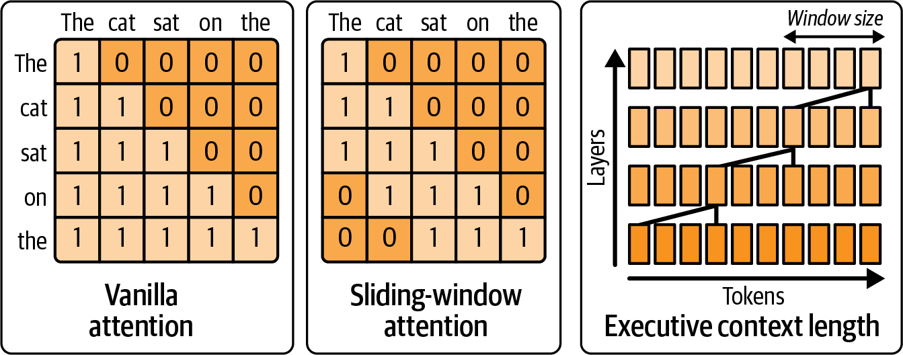

###### Figure 19-5. Sliding-window attention uses the intuition that the most useful tokens are the most recent

While LRU eviction of earlier tokens from the context is not exactly compression, it’s yet another type of policy that can be dynamically chosen at runtime. For instance, the system can decide that, beyond 2,048 tokens, the model likely won’t need the earlier tokens—based on some heuristics or a smaller LLM.

In this case, the system could start dropping those older tokens—or periodically compress them into a smaller summary. This starts getting into model and algorithmic territory—and requires more support, maintenance, and model training—but it is a form of dynamic context management that should be considered in advanced serving engines.

In short, you should consider quantized cache mechanisms provided by your inference engine, as they can handle the details of maintaining quantization-scale factors, interfacing with attention kernels, and monitoring GPU memory allocators at runtime. At a minimum, when the system sees memory utilization approaching a certain limit, log that and see if enabling a compression policy at that point would avoid OOM without hurting latency.

In practice, setting a high-watermark threshold on GPU memory (e.g., 80%) to trigger 8-bit compression has proven effective in preventing OOM crashes in production.

If it makes sense to use dynamic compression policies, you can implement the trigger. As with any quantization and compression strategy, be sure to test their impact on your model’s output specific to your domain. Many generative tasks tolerate aggressive compression, but it’s always good to verify that using 4-bit versus 8-bit doesn’t introduce errors or unexpected outputs.

# Reinforcement Learning Agents for Tuning AI Systems at Runtime

Many of the techniques we’ve discussed so far involve decisions based on the system’s current state. These decisions often require trade-offs, such as speed versus accuracy and throughput versus latency. Rather than collecting more and more heuristics to make decisions, we can tune our inference system with reinforcement learning with an RL agent, environment, policy, and reward.

This is a cutting-edge approach. You should start with simpler heuristics as your baseline. Then you can use RL as an incremental improvement once the basics are stable.

Specifically, our inference engine watches server metrics (the environment), chooses actions (the policy) to maximize throughput while keeping latency under a target, and receives feedback (the reward) that guides continual improvement. In this way, the system becomes an online optimizer—continually refining its decision making as conditions change.

For instance, one could set up an environment in which each RL “step” is an inference request. And the RL actions include things like the following:

Choose parallelism mode: single, TP, PP, and hybrid.

Choose precision: full FP8 versus mixing FP8 and FP4.

Adjust batch size or batch-waiting time.

Enable or disable cache compression.

Enable or disable speculative decoding.

Select a smaller draft model for speculative decoding.

Select a larger draft model for speculative decoding.

Enable or disable speculative KV prefetching.

…more actions…

The current RL state observed by the agent might include GPU utilization, memory utilization, average latency, queue length of requests, etc. The RL reward is then defined by capturing business objectives, such as `reward = throughput - λ * max(0, latency - SLA)`. `λ` is a tunable penalty weight in this reward function that scales how harshly you punish latency violations.

It’s recommended that you normalize the state features so that the RL agent doesn’t have to learn the scale on its own. This can speed up training convergence. For example, you can scale queue length by a max value, etc.

Here, a larger λ makes the agent prioritize staying within the SLA over squeezing out extra throughput. A smaller λ lets it risk occasional latency overshoots to achieve higher token rates overall. Essentially, this reward function penalizes latency that exceeds the SLA but otherwise tries to increase throughput.

In practice, start with λ such that λ × (typical latency overshoot) is about equal to the throughput gain that you’d trade for it. For example, if a 10 ms delay is tolerable to gain 100 tokens/sec, set λ so that 10 ms × λ ≈ 100.

Over many iterations, the RL agent can learn when it’s beneficial to compress caches—for instance, when memory is high and latency isn’t immediately impacted. Or it could learn to switch to pipeline parallel mode when GPU utilization is low but one GPU is overloaded, etc.

This helps because PP breaks the model into sequential stages across multiple devices and redistributes the heavy work away from the bottlenecked device—smoothing out utilization and avoiding single-GPU hotspots.

The agent can find nonintuitive configurations that produce better performance. For instance, it might learn that for prompts above a certain length, it should enable both PP and FP4 compression to produce the best token throughput, whereas, for shorter prompts, it learns to use just pure tensor parallel in FP8. If we tried to encode this logic as a set of static rules, we might miss complex interaction.

An RL agent can more easily discover optimal combinations by exploring the action space—and ultimately exploiting the optimal configuration until the environmental conditions change. At this point, the RL would adjust the inference system accordingly since it’s always exploring the action space and trying new configurations.

Training such an agent can be done offline using simulators and libraries such as Hugging Face’s Transformer RL (TRL) libraries. For instance, we could log a bunch of data from a running system under various conditions—and then train an RL policy in simulation to predict outcomes. At a very high level, the RL reward and update loop would look something like the following pseudocode:

```python
# Pseudo structure for an RL-driven tuner

# This loop runs in separate thread/process alongside main inference service.

# e.g., {gpu_util:0.7, mem_util:0.9, avg_latency:120ms, req_queue:5}
state = get_system_state()

# e.g., 0 -> high precision, 1 -> low precision
action = rl_agent.select_action(state)

# Map action to actual parameter changes
if action == 0:
precision_policy = "FP8"
else:
precision_policy = "FP4"

# (We could have multiple actions, but single action for illustration)
apply_precision_policy(precision_policy)

# ... After the next token or set of tokens ...
new_state = get_system_state()
reward = compute_reward(old_state, new_state)
rl_agent.update(state, action, reward, new_state)
```

Here, the loop continuously runs in the background of the inference server. The `compute_reward` function incorporates throughput (e.g., tokens per second since last step) and latency metrics. Since we are trying to balance throughput with latency, this is a multi-objective optimization problem in which we are optimizing multiple goals at once. A common approach is to use a weighted sum to combine the multiple objectives into a single objective.

For more flexibility, especially under uncertainty, you can instead model the multi-objective optimization problem—or Pareto front analysis—as a partially observable decision process. This allows the agent to learn its own trade-off strategy between objectives like throughput versus latency, etc. This is helpful if a single-weighted reward is not sufficient.

These kinds of multiparameter interactions are hard to tune with basic grid search methods. As such, RL and optimization techniques like proximal policy optimization (PPO) are best used for tuning inference workloads. PPO is known for stabler learning in continuous action spaces. It’s well-suited for continuous updating in real-time environments as it adjusts the policy gradually. This avoids extreme oscillations, which is important for inference stability. We don’t want the agent thrashing between decisions on every request.

Another technique to reduce oscillations is called damping. This requires that an action stay in effect for a minimum amount of time—or minimum number of requests. You can override damping for critical SLO violations, if needed, but this should be done sparingly.

It’s important to know that RL agents might make unsafe or suboptimal moves while learning. To mitigate that, you can constrain the action space to a reasonable set of ranges. It’s also recommended to start with a good default policy using the heuristics that we have already identified. The agent can then fine-tune around that initial default policy.

Alternatively, the agent can be trained online in shadow mode using a live system that incorporates an exploration phase. During exploration, the system occasionally tries a random or slightly modified strategy to gather new data. Otherwise, it exploits the current best policy.

Another technique is to apply reward shaping, which keeps the agent from violating critical constraints. For instance, the RL system would generate a high negative reward if latency is greater than a hard limit—or if an OOM error occurs due to a bad action.

Additionally, you can hard-code the system to avoid unsafe actions—even if the reward suggests the system do so. This puts in place extra safeguards so that the agent’s natural exploration won’t cause a catastrophic failure. This is a practical approach that combines RL with rule-based guardrails.

Designing a proper reward function is important. For instance, if we care about throughput under a latency limit, a reward would look like the code here:

```python
reward = tokens_per_second - 1000 * (1 if latency > SLA else 0)
```

Here, a large penalty is applied if the latency SLA is exceeded. Otherwise, no penalty is applied. Another option is to apply a continuous penalty that is proportional to how far the latency overshoots the target SLA. A simple continuous‐penalty reward can be written, as shown here:

```python
reward = tokens_per_second – λ * max(0.0, latency – SLA)
```

Here, λ is your penalty weight, and `max(0.0, latency – SLA)` grows linearly with how far you exceed the SLA. This way, the agent receives a smoothly increasing penalty the longer its latency overshoots the target. This will produce smoother gradients and more gradual trade-off decisions. In practice, a continuous (soft) penalty often produces a more stable policy than a binary (hard) penalty.

It’s recommended to start with a simple, static set of heuristics for tuning. Once the system is stable, you can start to introduce an RL agent to handle the more complex tuning that the heuristics can’t capture.

Logging and observability are important. You should continuously log the decisions that the RL agent makes—as well as the decision outcomes. For example, you should use structured logging—or even counters and telemetry dashboards—to track state → action → reward sequences in real time. This will help debug the agent’s behavior if it starts behaving erratically.

It’s also recommended to provide an escape hatch, or kill switch. This way, if the agent starts doing something obviously bad, like consistently making latency worse, you can have the system fall back to a safe, static configuration while you diagnose the issue and retrain a new policy offline. For example, if p95 latency increases by more than 50% after enabling the agent, the system will automatically disable the agent’s actions and send an alert to the system on call.

While not yet mainstream in modern inference serving engines as of this writing, RL-based, online inference tuning is just beginning to appear. Expect more inference platforms to include self-tuning capabilities as these techniques mature. This is important since these models and systems are becoming more complex. Manually managing all of these tuning knobs is difficult under rapidly changing conditions—it’s difficult for humans, anyway!

An intelligent agent that adapts in real time is a natural evolution of system optimization. We are starting to see self-optimizing AI inference servers that achieve expert-level performance tuning automatically. And they’re doing this just by learning from their own real-time telemetry metrics.

# Dynamic Memory-Allocation Switching (Slab Versus Caching Versus Stream-Ordered)

GPU memory fragmentation and nonoptimal memory allocation can be silent performance killers. Inference servers allocate and free thousands of tensors per second for many objects, including tokens, intermediate activations, etc. The strategy used by the memory allocator can influence fragmentation and allocation latency.

Switching the memory allocator dynamically means that the system can change how it allocates memory on the fly. For instance, the system can use a slab allocator for certain allocation sizes—or switch to use CUDA’s stream-ordered (`cudaMallocAsync`) allocator. The decision depends on the observed pattern of allocations and expected memory fragmentation.

By default, PyTorch uses a variant[]()[]() of the buddy/best-fit memory allocator called <em>best-fit with coalescing</em>, or BFC. It grabs big chunks of GPU memory and subdivides the chunks to satisfy allocation requests. This reuses free space and avoids frequent calls to the relatively slow and synchronous `cudaMalloc` and `cudaFree`.

A buddy allocator splits memory into blocks whose sizes are powers of two. A slab allocator works on top of the buddy system to efficiently manage small, fixed-size objects. It preallocates slabs, or collections of objects of a given type, and maintains a free list within each slab, as shown in Figure 19-6.

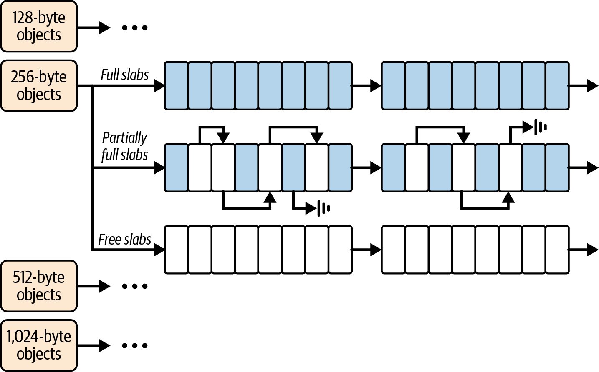

###### Figure 19-6. Slab allocator maintains a free list of memory objects within each preallocated slab

A slab allocator allows fast reuse without fragmentation. A buddy allocator handles coarse-grained page allocation, while a slab allocator optimizes fine-grained object reuse.

The default PyTorch caching allocator works well for many workloads. However, it can suffer fragmentation if the pattern of allocations varies widely due to alternating between large and small allocations. In a long-running server that handles different types of queries, fragmentation can build up.

In this case, plenty of memory is free, but the memory is not contiguous enough for large tensor allocations. This leads to OOM errors—even though memory is technically available.

Remember that PyTorch provides `torch.cuda.memory_summary()` to evaluate memory fragmentation, as well as a memory profiler built into `torch.profiler` (`profile_memory=True`). You can use these to determine which operations allocate a lot of memory. Also, NVIDIA Nsight Systems provides CUDA memory event and Unified Memory page-fault tracking on the timeline, and Nsight Compute provides memory workload analysis.

Together, these tools let you observe allocation behavior and fragmentation effects over time. And you can use these tools during development and testing to initiate your memory-allocator tuning strategy—including a dynamic tuning strategy, as discussed next.

A brute-force way to reduce memory fragmentation is to periodically reset the allocator’s state. However, a more clever way is to use CUDA’s stream-ordered caching allocator, `cudaMallocAsync`, which uses a similar concept internally by binning per allocation size up to a certain limit. But slab allocation takes it even further by never mixing sizes.

`cudaMallocAsync` behaves somewhat like a slab allocator combined with a buddy system—and it’s managed by the CUDA driver for you. This gives you most of the benefit of custom allocators with little effort—and makes it a great default memory allocator to leave on all the time, if you prefer.

Specifically, `cudaMallocAsync` uses stream-ordered pools that automatically recycle memory when references to the memory are released. It then coalesces the freed blocks behind the scenes since it knows the dependency order of the memory-frees—unlike standard allocators.

When using `cudaMallocAsync` with a PyTorch runtime, you can dynamically adjust `max_split_size_mb` by setting the `PYTORCH_ALLOC_CONF=max_split_size_mb:​<value>` environment variable. This can adjust the split size under different <span class="keep-together">conditions</span>.

For instance, a dynamic system could increase `max_split_size_mb` when large allocations are expected. This way they don’t get broken into small pieces. Conversely, the system can decrease `max_split_size_mb` when running many small requests to allow more reuse of large blocks.

Too small a split size can flood the allocator with many tiny blocks, which will increase metadata overhead and potential fragmentation. Too large a split size reduces the block count (and metadata) but may leave bigger “holes” in memory that go unused when you free only part of a block.

Consider a scenario in which your service detects fragmentation—perhaps using PyTorch’s memory snapshot functionality that shows holes caused by fragmentation. In this case, the system could dynamically switch to use `cudaMallocAsync`, which can consolidate memory usage.

You should use memory monitoring tools to track—and log—memory fragmentation. For instance, in PyTorch, you can use `torch.cuda.memory_reserved()` and `torch.cuda.memory_allocated()`. Here, the reserved memory is the total GPU memory held by the allocator. And allocated is how much of it is actually in use by tensors.

A large gap between reserved and allocated means fragmentation since a lot of memory is reserved but not used. If that gap grows over time, a dynamic policy could be to periodically purge the cache to free all the unused memory back to the GPU or even restart the worker process to fully reset the allocator. These are intrusive but effective methods that are sometimes used in production for long-running processes with heavy fragmentation.

You should use intrusive defragmentation methods like purging and restarting only during maintenance windows—or in a rolling restart manner across a fleet to avoid downtime. If you need to resort to these disruptive mechanisms, you likely have a deeper issue that needs to be addressed and optimized.

To implement dynamic allocation switching in PyTorch, for example, you can start with the PyTorch native allocator. Then, if you catch an OOM error, you can retry using the `cudaMallocAsync`-based allocator.

Unfortunately, the CUDA caching allocator is created the first time `torch` is imported or when the first CUDA context is touched. And Python’s `importlib.reload` does not unload C++ extensions or tear down the allocator. As such, changing `PYTORCH_ALLOC_CONF` (formerly `PYTORCH_CUDA_ALLOC_CONF`) on the fly and reloading the Python module will not reconfigure the allocator in-process.

However, you can spawn a fresh process in which the environment variable is set before `torch` is imported. Below is a snippet of code that catches OOM, frees memory in the parent, and then spins up a clean child process with `PYTORCH_ALLOC_CONF`. This is a bit hacky but shows how you can dynamically set the `backend:cudaMallocAsync` and rerun the same call with the different allocator backend. Next is a PyTorch example that implements this dynamic strategy when the code catches a `torch.cuda.OutOfMemoryError`:

```python
# dynamic_memory_allocator.py
# Retry generation in fresh process with cudaMallocAsync if first attempt OOMs.
# This is the only reliable way to change the CUDA allocator at runtime.

import os
import sys
import gc
import pickle
import tempfile
import subprocess
import importlib
from typing import Callable, Any

def _resolve_factory(factory_path: str) -> Callable[[], Any]:
"""
Resolves a factory string like "my_package.my_mod:build_model" to a callable.
The callable must return ready-to-use model with .generate(request) method.
"""
module_name, func_name = factory_path.split(":", 1)
module = importlib.import_module(module_name) # safe to import, no torch yet
return getattr(module, func_name)

def generate_with_allocator_retry(
model_factory_path: str,
request_object: Any,
*,
allocator_conf: str = "backend:cudaMallocAsync"
) -> Any:
"""
Attempts model.generate(request_object) in the current process.
On torch.cuda.OutOfMemoryError, retries in a fresh subprocess with
PYTORCH_ALLOC_CONF set to allocator_conf. request_object and the
returned value must be picklable.
"""
# Import torch only inside function; avoid importing at module import time.
import torch

model_factory = _resolve_factory(model_factory_path)
model = model_factory() # user-supplied function builds model, moves to GPU

try:
# First attempt uses whatever allocator current process started with.
return model.generate(request_object)

except torch.cuda.OutOfMemoryError:
# Free as much as possible in the parent before spawning the child.
# Avoids compounding pressure when two processes momentarily overlap.
try:
del model
finally:
gc.collect()
torch.cuda.empty_cache()

# Serialize request to temp file and ask fresh interpreter to do work.
with tempfile.TemporaryDirectory() as td:
req_path = os.path.join(td, "request.pkl")
out_path = os.path.join(td, "output.pkl")
with open(req_path, "wb") as f:
pickle.dump(request_object, f)

# In the child, we want torch to see allocator config at import.
env = os.environ.copy()
env["PYTORCH_ALLOC_CONF"] = allocator_conf

# Re-run this module as a helper child. The child will import torch
# only after PYTORCH_ALLOC_CONF is set in its environment.
cmd = [
sys.executable,
__file__,
"--child",
"--factory", model_factory_path,
"--request", req_path,
"--output", out_path,
]
completed = subprocess.run(cmd, env=env, capture_output=True,
text=True)

if completed.returncode != 0:
# Bubble up child stderr to aid debugging
raise RuntimeError(
f"Retry failed with exit code {completed.returncode}\n"
f"stdout:\n{completed.stdout}\n\nstderr:\n{completed.stderr}"
)

with open(out_path, "rb") as f:
return pickle.load(f)

def _child_main(factory_path: str, request_path: str, output_path: str) -> None:
"""
Child entrypoint: assumes PYTORCH_ALLOC_CONF is already present in env.
Imports torch only now, builds the model, runs generate, and pickles result.
"""
# Import torch after env var set by the parent’s subprocess.run(env=...).
import torch

model_factory = _resolve_factory(factory_path)
model = model_factory() # build the model inside the child process

with open(request_path, "rb") as f:
request_object = pickle.load(f)
if __name__ == "__main__":
import argparse
parser = argparse.ArgumentParser()
parser.add_argument("--child", action="store_true")
parser.add_argument("--factory", type=str, default="")
parser.add_argument("--request", type=str, default="")
parser.add_argument("--output", type=str, default="")
args = parser.parse_args()
if args.child:
_child_main(args.factory, args.request, args.output)
else:
print("This module is intended to be imported.")
```

Here, the model is constructed in the child using a factory so that nothing CUDA-related is imported before the `PYTORCH_ALLOC_CONF` env variable takes effect. The code empties the cache and releases unused memory to the GPU using `torch.cuda.empty_cache()`. This pattern guarantees that the allocator configuration is applied before `torch` is imported in the child. It also avoids trying to unload a native extension at runtime, which CPython does not support.

In a non-PyTorch environment, such as a C++-based LLM inference engine, you can implement a pure slab allocator that allows configuration for specific allocation sizes. This type of slab allocator prepartitions memory into fixed-size “slabs.” It’s very efficient for repeated allocations of the same size and leads to virtually zero fragmentation for that specific size allocation.

In an LLM server, one very common technique is to allocate per-token output tensors such that each time you generate a token, you allocate a `[layers, hidden_dim]` tensor for that token’s activations, for instance. If those allocations are the same size every time, such as 64 KB, a slab for that exact size is ideal.

The system detects that it’s allocating a lot of 64 KB tensors repeatedly—and creates a “slab” of dedicated 64 KB blocks. A slab allocator often does not return memory to the general pool until the entire slab is freed.

Modern LLM inference engines perform this type of buffer reuse for each generated token. This is in contrast to freeing and reallocating the memory each time, which would incur a high amount of overhead—especially at token granularity.

Allocator switching might involve completely different allocators for different parts of the system. For instance, you can use the default caching allocator with large static allocations for model weights since those are freed less often during inference. You can then use a custom allocator for ephemeral per-token allocations.

It’s recommended to architect your code to separate long-lived allocations, such as model weights, from short-lived allocations, such as token buffers. This makes it easier to direct the short-lived and long-lived allocations to different allocators and memory pools.

You should always implement a fallback strategy for OOM errors. Many production systems use multitier memory such that if the GPU experiences an OOM error, it will offload to the CPU and try again rather than failing the request. For example, you can dynamically free the cache, offload some layers to the CPU, or compress the cache.

In short, techniques like dynamic allocator management and multitiered memory make sure your system can handle long uptimes under different types of load—all without incurring memory fragmentation or allocation latency spikes. This is a behind-the-scenes optimization that users won’t directly see, but it’s essential for ultrascale robustness for long-running inference servers.

# Runtime Kernel Performance Improvements and Hot-Swappable Implementations

In the fast-evolving world of GPU hardware and algorithmic innovations, new and faster kernel implementations are constantly emerging. This includes newer variants of FlashAttention, megakernels, and hardware-specific software optimizations.

Runtime kernel patching is the ability to integrate these new implementations into a running system without requiring a full redeployment or reload of the model. Essentially, we want to hot-swap a slower kernel function for a faster one on the fly.

Consider your inference server that uses the default PyTorch scaled dot product attention (SDPA) kernel for multiheaded attention. You then discover a new kernel implementation like FlashAttention-3, which gives a 20% speed boost for long sequences in some cases.

Traditionally, you’d have to install the updated library and restart the server to use the new implementation. But with runtime patching, you can dynamically load and redirect calls to the new kernel during runtime without interrupting the server’s uptime.

This zero-downtime upgrade approach is crucial in 24/7 services in which a restart or model reload would incur too much latency or cause an outage. In Python, this can be an easy monkey patch, as shown here:

```python
import new_flash_attn_lib

# Monkey-patch the model's attention forward to use the new library
old_attn_forward = model.transformer.self_attn.forward

def new_attn_forward(self, *args, **kwargs):
return new_flash_attn_lib.forward(*args, **kwargs)

model.transformer.self_attn.forward =
new_attn_forward.__get__(
model.transformer.self_attn,
type(model.transformer.self_attn))
```

This code replaces the `forward` method of the attention module with one that calls our `new_flash_attn_lib.forward`. We bind it to the instance (`__get__`) to simulate a proper method. After this patch, subsequent calls to that attention layer will go through the new implementation. As such, we have effectively hot-swapped the <span class="keep-together">kernel</span>.

Make sure that `new_flash_attn_lib.forward()` is drop-in compatible—and that it has been thoroughly tested to produce identical outputs within acceptable numerical tolerances. This way, you avoid any model-quality regressions.

Another technique is JIT patching, which uses a just-in-time compiler like PyTorch Inductor or OpenAI Triton to generate a faster kernel at runtime—and then plugging it into the inference pipeline. As shown next, one can use PyTorch’s `torch.compile` to optimize a function and return its compiled version:

```python
compiled_forward =
torch.compile(model.transformer.self_attn.forward,
backend="inductor")

model.transformer.self_attn.forward = compiled_forward
```

Now, whenever `forward` is called, it will execute the optimized code, which will fuse multiple operations, etc. If we do this after model initialization, it’s a form of hot patching since it does not require a model reload. It simply swaps out function <span class="keep-together">pointers</span>.

On the CUDA side, runtime module loading is possible using CUDA driver APIs. For instance, you can compile a custom PTX for a new kernel—and load it into the context without resetting the device. If the function signatures match, the system would just update the function pointers. Tools like NVIDIA Runtime Compilation (NVRTC) can compile PTX from strings at runtime, enabling this workflow.

Doing this with CUDA C++ is a bit complex. Higher-level approaches like Python’s monkey-patch mechanism—or PyTorch’s extensible backends—are likely more practical and maintainable in the long term. However, your high-performance inference engine is likely not using a Python/PyTorch runtime.

When doing this type of hot swapping, it’s important to guarantee thread safety. For example, you should drain the incoming-request queue or use a barrier to make sure that no other thread is in the middle of the function you’re patching. This will avoid race conditions with running threads. This is similar to how OS kernels load modules—careful synchronization is needed, but it avoids full restarts.

Using well-defined module boundaries—like separating attention and MLP kernels—makes it easier to swap internals. This argues for writing your model code in a highly modular way so that you have these swap points. Monolithic model implementations are much harder to patch, but they can be more performant (e.g., megakernels).

Of course, one must ensure that the new kernel produces identical—or acceptably close—results to the old implementation. Typically these optimized kernels are designed to be numerically equivalent at the same precision (e.g., FP16).

Hot patching can also be used for quick fixes. Perhaps a particular sequence of operations is causing a known bug in the current kernel. Instead of waiting for a full update, you could quickly patch in a fix.

Consider deploying an FP8 kernel that starts to misbehave for certain edge inputs that you didn’t anticipate. If you have a safer but slightly slower version, you can detect the misbehaving condition and hot swap in the safe kernel in those cases. Make sure you log these events for future analysis.

Consider a phased rollout by routing a small percentage of traffic to the new kernel (shadow testing or canary). You can then use telemetry to compare the latency and throughput metrics against the old kernel. If the new kernel is performing as expected and its output matches the expected results, you can release it to all users.

To manage multiple possible implementations, an engine might maintain a registry, such as `attention_impl = "fast"` or `"safe"`—and branch accordingly. This can be implemented as a feature flag so that you can toggle implementations without code changes. This is useful for quick rollbacks simply by changing the flag (just make sure your code is actively reading the values from the feature-flag system—otherwise the flag value remains static, which defeats the purpose of a feature flag).

A well-designed inference engine should also measure runtime performance of the new kernel. If the new kernel is not faster with live production data, the inference engine can roll it back. This can be due to slightly different hardware, untested batch sizes, or untested load conditions.

This is a perfect form of autotuning, described in the previous section. If the autotuner finds a faster implementation that outperforms the current default implementation beyond some threshold, the system could trigger a “patch” to promote the faster implementation to the default going forward.

This effectively closes the loop with the autotuner. The system not only finds better kernels on the fly, but it also swaps them in. This leads to a self-optimizing kernel-selection mechanism.

You can combine this strategy with the previous RL strategy we discussed. This way, you can have multiple implementations loaded—and let the RL agent choose which one to use for each different type of request.

Be mindful of the overhead needed to maintain multiple implementations in memory. The added code size should not evict other critical code from the instruction cache—or exhaust GPU memory.

For instance, a highly optimized kernel might be best for long sequences, but a simpler kernel implementation might be fine for short sequences. A runtime system could choose between them per request. This effectively patches on a per-request basis based on the length of the input sequence.

In short, runtime kernel patching is about flexibility. It acknowledges that what is optimal today might change tomorrow and provides the means to adapt quickly. This type of agility makes sure that your serving infrastructure keeps up with the rapid advancements in model acceleration techniques. Popular inference engines like vLLM, SGLang, NVIDIA TensorRT-LLM, and NVIDIA Dynamo are well architected and provide a good amount of dynamic capabilities. For example, TensorRT-LLM allows you to load optimized kernels using runtime plugins. Use these capabilities to your advantage.

# Continuous Prewarming of CUDA Graphs and Caches Using Time-Series Prediction

In high-throughput inference situations, cold-start overheads can be a large contributor to request-response latency. CUDA Graphs, as described in Chapter 12, allow you to capture a sequence of GPU operations and replay the sequence with minimal launch overhead.

Prewarming a CUDA Graph means setting up the graph before it’s actually needed. If we can predict when a certain request type or batch size will occur, the prewarmed CUDA Graph will be ready to execute.

This technique relies on prediction accuracy. If your forecast is off, you might prewarm a graph that isn’t used. You should monitor prediction hit rates to make sure the optimization is paying off.

By prewarming, the graph can skip costly launch and initialization steps when the request actually arrives. Using time-series prediction algorithms like ARIMA and Prophet, the system anticipates future workload patterns, including traffic surges and batch size changes, to proactively prepare the graph for fast execution.

Consider an inference service that observes a daily cycle when, at 9 A.M. every day, there’s a spike in user traffic due to time zone–related traffic patterns. Knowing this, the system could prerun a few requests just before 9 A.M. to load the model into the GPU caches, JIT-compile the necessary kernels, and capture the CUDA Graphs for the expected batch sizes. At 9 A.M., when the real traffic load spikes, the incoming requests will reuse the warmed state for the expected batch size and usage pattern.

In practice, this can be orchestrated by a cron-like job or a scheduling service that triggers the prewarm routine right before the traffic spike is expected to occur. Just remember to leave enough time for the resources to provision.

In PyTorch, wrapping your model’s computation within a `torch.cuda.graph()` context allows you to capture a static computation graph that includes GPU kernel launches. When replaying the graph, PyTorch bypasses the Python-to-CUDA dispatch overhead and submits the entire workload with a single `cudaGraphLaunch`. This leads to significantly faster execution—especially for large, repetitive input batches due to the minimal CPU involvement.

The downside is that these graphs are static since they don’t easily allow variable shapes or lengths. But an inference server often deals with distinct batch sizes (1, 2, 4, 8, 16, etc.)—due to GPU memory limitations and algorithmic optimizations—which fits the graph model well.

To handle variability, you can maintain a pool of precaptured graphs for each common batch size or sequence length. You could use a continuous prewarming strategy to prepare the pool of graphs for these distinct batch sizes. For instance, a batch of 16 requests is common during peak hours. The server can capture a graph of the model’s forward pass upfront using a batch size of 16—and then store it for subsequent use.

The next time a batch of 16 requests comes in simultaneously, the inference system feeds the batched inputs into the precaptured graph. The kernels inside are already prewarmed and optimized for graph execution, so there’s no need to enqueue and launch many individual operations, as just one graph launch is all that’s needed.

Keep in mind that each captured graph stored in the pool will consume additional GPU memory for its workspace. You should monitor memory usage when storing many graphs. It might be necessary to evict less-used graphs from the pool if memory gets tight.

To avoid the extra memory of a pool, you can potentially use graph patching, discussed in Chapter 12, to adjust graph nodes for minor size differences. However, in practice, a pool is a better option for performance.

CUDA Graphs also reduce CPU overhead since it coordinates just a single graph launch versus many individual kernel launches. This lets the CPU perform other operations like data preprocessing and other types of “real” work—instead of coordinating many kernel launches.

Again, you can use time-series prediction algorithms (e.g., ARIMA and Prophet) to forecast metrics like RPS and average prompt length. If the model predicts a jump in batch size or a particular pattern of requests, such as long input sequences, the system can start preparing and prewarming the appropriate CUDA Graphs, caches, and other resources. For instance, the system can proactively increase the batch size of the continuous batching algorithm, prefetch model weights from disk to GPU memory, and allocate additional GPU instances.

It’s important to retrain and update these time-series models frequently with recent traffic data. This is because usage patterns can change over time due to new user segments coming online, etc. In addition, unanticipated “holidays” like California’s famous Ski Week can unexpectedly increase the load curve—as it did for me at Netflix when I first moved to California!

Related to caching and prewarming is anticipating the scale-out of prefill and decode workers. If we know a bunch of requests with long prompts are likely to arrive at a certain time due to a scheduled batch job or daily report scenario, the system can scale out the prefill workers and execute a representative forward pass with representative sample data to prewarm the CUDA Graphs and KV cache.

The scale-out and prewarming events should also include the decode workers and CUDA Graphs. In the decode case, the speculative decoding draft model, for instance, can be prewarmed and loaded into GPU memory—as well as the draft model’s KV cache, etc. Other decode optimizations include loop unrolling for a fixed number of tokens that will be generated—either 1 token or multiple in the case of speculative decoding.

You should also consider caching the CUDA kernels themselves. CUDA will often cache the compiled kernels (C++ code => PTX instructions => SASS assembly) to speed up execution. The first time a kernel runs, there is likely some on-the-fly JIT compilation overhead.

You should coordinate this type of warm-up with your cluster autoscaler such that when new GPU instances spin up, the autoscaler runs a quick set of inferences on them using a few warm-up API calls. Doing this will validate the inference engines, cache JIT-compilation outputs, allocate memory pools, prepare CUDA Graphs, etc. This way, the engines are production-ready before adding them to the live traffic pool.

Use your knowledge of the system to identify and invoke as many distinct paths as possible during this controlled warm-up phase. This includes every batch size, CUDA Graph variant, etc.

You should also monitor that the warm-up actually helps by comparing the latency of the first few requests during the predicted surge—both with and without warm-up. Adjust the timing and threshold as needed. And be aware that the time-series prediction can be wrong. Make sure that warm-up tasks do not impact overall inference performance if they run at the wrong time.

For instance, you should try to perform prewarming runs (with example data) when the GPUs are underutilized. CUDA allows stream priority scheduling so you can assign prewarm streams to a lower priority than your inference stream. This way, the prewarming does not compete for resources with the live, high-volume traffic requests.

Also, you should use lower-priority CUDA streams for these prewarming tasks, so they will yield to higher-priority live traffic that may arrive during prewarming. On the plus side, idle GPUs are a wasted opportunity, so doing warm-up computations on idle GPUs is essentially free—as long as it doesn’t collide with real work.

Grace Blackwell systems allow some additional tricks since the CPU and GPU share unified, coherent memory at low latency. For instance, you can have the CPU start prefilling data into unified memory that the GPU plans to use. This can avoid explicit GPU copy calls later.

Continuous prewarming—guided by time series predictions—can make latency far more predictable. It turns the inference engine into an adaptive system that learns common traffic patterns, automatically prepares the data, readies the hardware, and stays a step ahead of demand. This will reduce jitter and decrease latency spikes by smoothing out expensive operations like compilation and memory transfers at times when they can be amortized.

This is especially valuable for large models that have heavy one-time initialization costs. As models and contexts grow, such adaptive preloading will move from a nice-to-have to a necessity in production LLM systems. Paying these costs predictively is much better than having end users churn because of a poor experience.

# Adaptive Batching and Chunked Prefill Scheduling

In Chapter 16, we discussed how modern inference servers use different types of request batching (e.g., continuous batching) to maximize throughput and minimize latency across all requests. However, batching can increase latency for individual requests. The trade-offs can be dynamically addressed as conditions change throughout the day using a technique called adaptive batching.

Adaptive batching dynamically adjusts how requests are grouped into batches depending on the load—and how well the requests are progressing. This type of dynamic strategy can adjust the batch size and threshold parameters in real time as the environment changes.

For example, during peak load, the system can use a large batch size (e.g., 8 or 16) because throughput is critical. During periods of low load, the system can reduce the batch size to serve the requests sooner. This will prioritize latency over throughput.

To decide on the batch size, you can use a simple heuristic, such as, “If GPU utilization is > 80%, allow larger batches; if < 20%, use batch size 1 to minimize latency.” Or you can use a more sophisticated RL agent or predictive strategy, as discussed in the previous sections.

This difference in arithmetic intensity between the prefill and decode phases leads to mismatched durations of execution. As such, it’s best to disaggregate the stages and treat them as separate workloads that can be tuned independently using separate threads/processes for a single node or worker pools for a multinode cluster.

By disaggregating prefill and decode, we treat the two stages as separate operations. This allows them to be independently optimized for their unique compute and memory bandwidth needs. One of these optimizations is the batch sizes used for the prefill and decode phases.

In practice, vLLM and other modern inference engines do exactly this. They form separate batches to send to the prefill and decode workers. As such, a batch of prefill requests can execute independently of the batch of decode requests. For example, the decode phase can benefit from larger batches to increase arithmetic intensity since it’s a memory-bound workload.

Modern inference-serving frameworks like vLLM use adaptive scheduling loops to dynamically choose between processing a prefill or a decode batch. Specifically, vLLM supports chunked prefill and decode-maximal scheduling to interleave prefill and decode for better utilization. These techniques boost overall utilization and throughput without adding significant latency.

The mismatched system-resource characteristics of prefill and decode can impact PP as well. Consider one microbatch doing prefill on a long sequence while another microbatch is performing decode one token at a time. In this case, their durations are mismatched, and pipeline bubbles emerge.

You can interleave large prefill requests with latency-sensitive decode tasks by slicing the prefill into small chunks and piggybacking decodes between them. This keeps all pipeline stages busy and minimizes idle “bubbles” in your GPU schedule.

Chunked prefill is a well-supported pattern used by all modern LLM inference engines to reduce pipeline bubbles. It effectively time-slices a big task (prefill) to create room for small tasks (decode) to execute in the pipeline gaps created by the chunks, as shown in Figure 19-7.

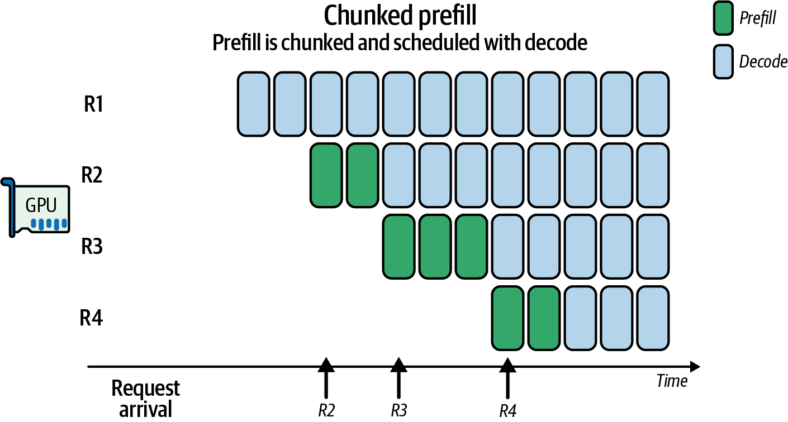

###### Figure 19-7. Benefits of chunked prefills for decode-maximal batching across four requests

The SARATHI paper demonstrated that this type of chunked prefill and piggybacking can help you find the right level of decode-maximal batching, reduce bubbles, and improve throughput by ~1.3–1.9× compared to naive scheduling. The name SARATHI is a reference to a charioteer that intelligently steers both prefill and decode tasks together. Fun!

For example, consider a 10,000-token prefill request that does not use chunking. In this case, the single prefill pass will block the entire pipeline and cause decode tasks to queue up until the prefill completes.

However, if you use chunked prefill and divide the 10,000-token prefill request into five 2,000-token chunks, you can interleave decode batches in between prefill chunks to keep the GPU busy processing both phases and moving things forward. This will squeeze out pipeline bubbles, improve throughput, and smooth out GPU utilization.

A rule of thumb is to choose a chunk size such that a prefill chunk takes ~50–100 ms. This way, you have frequent opportunities to schedule decode batches in between. This may correspond to a few thousand tokens depending on the model architecture/size and GPU hardware.

Modern inference engines like vLLM use adaptive scheduling loops to decide whether to process another prefill chunk—or perform a decode batch—based on GPU utilization and queue status. Specifically, vLLM continuously monitors token queues to make these decisions. vLLM’s scheduler explicitly supports chunked prefill and decode-maximal batching. Its executor and chunked-prefill features are designed to overlap large prefills with smaller interactive decodes.

An adaptive scheduler needs to consider GPU shared-memory limits and occupancy when choosing a chunked prefill size. A simple adaptive chunked prefill implementation is shown next. This code dynamically right-sizes the chunk size to keep SM and occupancy high on the GPU:

```python
# Example adaptive scheduler for chunked prefill/decode

import cupy as cp
import torch

# Hardware constraints
SHMEM_LIMIT = 256 * 1024
BLOCK_THREADS = 256
TARGET_UTIL = 0.85
OCC_THRESHOLD = 0.5

# Cache for occupancy results and tile lookup
_occ_cache = {}
_tile_table = {} # e.g., {L: optimal_T}

# 1) Precompute tile_table offline; here we lazy-initialize on first use
def get_optimal_tile(L):
if L in _tile_table:
return _tile_table[L]
# compute block size by querying for an occupancy-based suggestion
min_grid, max_grid, block_size = ... # left out for brevity

T = min(block_size, L)
T = max(32, (T // 32) * 32)
_tile_table[L] = T
return T

# 2) Cached occupancy query
def get_occupancy(threads, shared_bytes):
key = (threads, shared_bytes)
if key in _occ_cache:
return _occ_cache[key]
max_blocks = cp.cuda.runtime.\
cudaOccupancyMaxActiveBlocksPerMultiprocessor(
attention_kernel_ptr, threads, shared_bytes
)
props = torch.cuda.get_device_properties(0)
warps_per_block = threads // props.warp_size
max_warps = props.max_threads_per_multi_processor // props.warp_size
occ = (max_blocks * warps_per_block) / max_warps
_occ_cache[key] = occ
return occ

def scheduler_loop():
stream = cp.cuda.Stream(non_blocking=True)
while True:
pending = get_pending_requests()
util = gpu_utilization()
if util < TARGET_UTIL and any(r.phase=='prefill' for r in pending):
req = select_heaviest_prefill(pending)
L = req.remaining_length()
T = get_optimal_tile(L)
shared_bytes = 3 * T * T * 4
occ = get_occupancy(BLOCK_THREADS,
shared_bytes)
if occ < OCC_THRESHOLD:
T = max(32, T // 2)
shared_bytes = 3 * T * T * 4
chunk = req.next_prefill_chunk(T)
# Launch with CuPy RawKernel on our stream
attention_kernel((...grid...), (BLOCK_THREADS,),
(chunk, ...), shared_mem=shared_bytes,
stream=stream)
# Record an event to know when done
event = cp.cuda.Event()
event.record(stream)
elif any(r.phase=='decode' for r in pending):
batch = form_decode_batch(pending, max_batch=16)
# Trace the adaptive logic
logger.info(f"T={T}, occ={occ:.2f},
util={util:.2f}")
launch_decode_kernel(batch, stream=stream)
event = cp.cuda.Event()
event.record(stream)
else:
# Poll the last event rather than sleep
if not event.query():
cp.cuda.get_current_stream().synchronize() # or pass
continue
```

Here, the scheduler is adjusting chunk size to use as much shared memory as possible. And, importantly, it does this without sacrificing parallelism.

Specifically, the scheduler first computes a tile width `T` so that the three shared-memory buffers for queries, keys, and values—each requiring `T x T` floats—fit within the GPUs’ per-SM dynamic shared-memory limit. []()It then calls the [CuPy API](https://oreil.ly/CPzjf) (Python) to measure how many thread blocks can run concurrently on each SM with that value of `T`.

If occupancy falls below a given threshold of 50%, `T` is reduced by half. This will free up shared memory so that more blocks can co-reside, striking an optimal balance between data reuse (fewer DRAM loads) and parallelism.

When overall GPU utilization drops below 85% and prefill work is pending, the scheduler selects the largest remaining prefill request and breaks it into equal-sized chunks of `T` tokens so that each chunk can flow through the pipeline without monopolizing every stage.

And rather than fixing the chunk size, the helper function, `next_prefill_chunk`, adjusts `T` on the fly based on live metrics. It will shrink the chunk size if occupancy is low—and grow it if DRAM traffic is excessive. This makes sure that each slice maximizes GPU utilization without stalls.

Be sure to instrument the scheduler to log the chosen `T` and resulting occupancy/utilization. This way, you can analyze and verify that this adaptive approach is consistently maintaining high GPU utilization.

Between prefill chunks, the scheduler can use <em>decode-maximal batches</em> to bundle all of the ready decode requests into a single launch using `form_decode_batch`. This lets short, latency-sensitive token generations piggyback on otherwise idle pipeline gaps. This way, even users with short prompts see low latency because their decodes don’t wait for a huge prefill to finish. These decodes get scheduled in the pipeline gaps.

By continuously monitoring `gpu_utilization()`, the scheduler chooses whether to process another prefill chunk or drain the decode queue. Either way, it is always picking the action that fills SM slots and minimizes dead time. []()This is called a <em>utilization-maximization policy</em> and is similar to an OS scheduler aiming for 100% CPU utilization.

Together, these mechanisms ensure that large-context prefill jobs never starve interactive decoding. At the same time, small, latency-critical requests are served immediately. This produces optimal throughput on modern GPUs without degrading the end-user experience.

Chunked prefill aligns work with the strengths of the GPU: big prefill matrix operations are batched, while small decode operations are interleaved. This maximizes overall throughput and latency together.

As you can see, the scheduler monitors real‐time metrics and adapts on the fly. The chunked scheduling makes sure no single request can block an entire stage under varying conditions. This keeps all GPUs active and reduces the dreaded pipeline bubbles.

It’s important to treat prefill and decode as separate queues with their own SLAs. It’s usually optimal to clear out latency-sensitive decode tasks first using dedicated time slices or CUDA streams, then use the leftover cycles to process large prefill jobs. For example, you can allocate a certain time budget (e.g., 1–5 ms per decode) to decode tasks to make sure they get more immediate attention.

By prioritizing the user-facing, real-time decodes, you minimize perceived inference lag. At the same time, you are still powering through bulk context builds when the system has spare capacity.

Many high-performance inference engines use a producer-consumer model with separate threads for the separate phases. For instance, vLLM uses multithreading such that one thread prepares decode inputs while another prepares new prefills, etc., and they feed into a single execution stream in an optimized order. This is a proven pattern to overlap work efficiently.

If you have multiple nodes, you can send prefill requests to one set of nodes and decode requests to another set. In this case, the prefill and decode nodes can use different, heterogenous hardware specialized for their specific task of either prefill or decode.

For instance, the prefill compute nodes can use GPUs with high FLOPS and less memory bandwidth since the prefill phase is compute bound. And the decode nodes can potentially use GPUs with higher memory bandwidth but less FLOPS capacity.

Be aware that while a heterogeneous prefill and decode worker configuration can save cost, it can complicate—and potentially limit—dynamic load balancing. If the prefill/decode ratio shifts unexpectedly and more prefill work needs to be done on decode-optimized workers (less FLOPS), these decode workers may become a bottleneck.

Using homogeneous nodes will simplify scheduling. Hardware specialization should be used only if the workload ratio is predictable and can handle the shifts in load. However, this isn’t always possible due to capital investments, rapidly evolving GPU architectures, and cost budgets.

Regarding prefill and decode batching, it’s recommended that you batch your decode calls together whenever possible to maximize GPU throughput and minimize launch overhead. For prefill, you should avoid mixing very short and very long prompts in the same batch.

You should use length‐based bucketing so each batch has similar sequence lengths. This might mean grouping incoming requests to the nearest 512-token bucket before completing the batch. This way, you don’t waste compute on excessive padding.

In practice, most modern inference engines implement a token‐level scheduler that dynamically forms batches at each generation step. It will wait a few milliseconds to gather ready tokens, cap batch sizes to stay within memory and occupancy limits, and employ round-robin/maximum-delay rules to improve fairness between long and short prompts. (Make sure this feature is enabled in your inference engine’s configuration.)

In short, adaptive batching and prefill/decode disaggregation can maximize GPU utilization and increase throughput without sacrificing too much latency. In fact, these techniques can often improve latency in aggregate, because they keep the GPU busy—and less GPU idle time means faster task completion overall.

# Congestion-Aware and Topology-Aware Scheduling with Multiple GPUs

Modern multi-GPU and multirack systems like Grace Blackwell GB200 NVL72 systems (72 Blackwell B200 GPUs with 180 GB HBM each) and the newer Grace Blackwell Ultra GB300 NVL72 (72 B300 GPUs with 288 GB each) connect 72 GPUs in a single high-bandwidth NVLink/NVSwitch fabric. These architectures create a unified 72-GPU domain and give each GPU up to ~1.8 TB/s of aggregate bidirectional NVLink throughput. This provides over 130 TB/s of aggregate cross-sectional bandwidth across the NVSwitch network.

However, achieving peak performance for large-scale inference requires more than raw bandwidth. It needs intelligent and adaptive communication scheduling. Congestion-aware and topology-aware strategies make sure that data transfers avoid bottlenecks in real time, as shown in Figure 19-8.

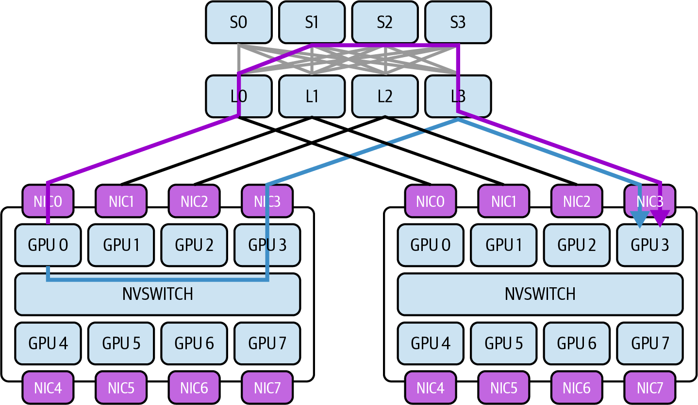

###### Figure 19-8. Topology-aware routing to avoid bottlenecks across GPUs and multinode clusters

To address these bottlenecks, let’s consider link utilization telemetry, dynamic message routing, and scheduling waves of collectives. Next are some key principles and techniques that enable efficient scheduling of inter-GPU communication while maintaining low latency and high throughput. To keep things concrete, we’ll do this in the context of an NVL72 rack environment.

## NVLink/NVSwitch Topology and Bandwidth Constraints

NVLink provides high-speed point-to-point links between GPUs—and between GPUs and the Grace CPU in Grace Blackwell Superchip modules. NVSwitch acts as an on-rack network switch connecting all GPUs into an all-to-all topology.

In an NVL72 rack system, each GPU features multiple NVLink ports (e.g., 18 NVLink links per GPU) that connect into a set of NVSwitch chips. This design gives every GPU peer-to-peer connectivity such that any GPU can reach any other in a single hop, or one traversal, through the NVSwitch fabric. This topology allows the 72 GPUs to behave like a single giant board with uniform connectivity.

Aggregate capacity still obeys per-port and per-switch limits. As such, many-to-one traffic patterns can oversubscribe ingress.

Despite their high bandwidth, the interconnects have finite capacity. Each NVLink 5 port provides 100 GB/s per direction. And each GB200/GB300 superchip exposes 18 NVLink links per GPU for up to 1.8 TB/s bidirectional throughput per GPU. And while NVSwitch provides nonblocking all-to-all connectivity under balanced loads, certain patterns like all GPUs sending to one GPU can oversubscribe links since each NVSwitch chip has a limit on total switching throughput.

Congestion will occur if too many GPUs send data simultaneously through the same switch—or into the same destination. This causes queues to build up and a drop in effective transfer throughput. For instance, a single GPU can theoretically communicate bidirectionally at 1.8 TB/s, but if multiple peers all target that same GPU simultaneously, they must share the same NVLink ingress bandwidth. Similarly, NVSwitch can be oversubscribed by certain communication patterns, like all GPUs exchanging data at the same time—even though it’s designed for full nonblocking bandwidth (under balanced loads.)

Understanding the topology—which GPUs share NVSwitch components or NVLink paths—is critical to inference performance. On a smaller scale, GPUs on the same board or tray likely have faster and slightly more direct paths compared to GPUs in different trays or across nodes.

Avoid making assumptions about the topology. Use CUDA’s topology APIs and NCCL’s topology hints to programmatically retrieve this info. You can query NVML and DCGM for per-NVLink port counters and remote endpoints and combine that with Fabric Manager or NVSwitch tooling for switch-level mapping when needed.

On a larger scale, communications that cross node/rack boundaries and leave the NVLink domain using InfiniBand/Ethernet will incur even higher latency and lower bandwidth than intra-NVL72 transfers. For example, InfiniBand NDR might add 5–10 µs of latency per hop versus less than 1 µs of latency for NVSwitch hops.

Because of the physical topology, some communication paths are cheaper than others. A congestion-aware scheduler uses this knowledge to prefer higher-bandwidth, lower-latency, less congested links to maximize performance.

## Real-Time Link Telemetry and Monitoring

To manage congestion, the system[]()[]()[]()[]()[]()[]()[]()[]() must first <em>observe</em> it. NVIDIA provides telemetry interfaces to monitor link utilization in real time. The NVIDIA Management Library (NVML) and, specifically, the `nvmlDeviceGetNvLinkUtilizationCounter`, expose per-link throughput counters and utilization statistics for NVLink.

Enabling NVLink counters will introduce overhead. Sample them at a reasonable interval to avoid impacting performance while you’re monitoring performance!

An adaptive inference serving system can query metrics, such as bytes transferred per NVLink port, error rates, and traffic load between specific GPU pairs. For instance, you can query NVML or DCGM for throughput counters, bandwidth statistics, and other telemetry (e.g., errors, etc.). Note that `nvidia-smi nvlink --status` provides link health and configuration. NVML and DCGM are the preferred mechanisms for performance counters such as throughput.

This is useful for identifying hotspot links that are saturated at close to 100% utilization while others are underused. These low-level hardware counters allow a scheduler to find exactly where bottlenecks are occurring. This includes specific NVSwitch uplinks—or the links between two specific GPUs.

In addition to NVML, higher-level profiling tools like Nsight Systems provide timeline views of GPU activity, including communication events. Nsight can display when data transfers occur on NVLink/NVSwitch—and how long they take.

By instrumenting inference runs with Nsight Systems, one can visualize if multiple transfers overlap and cause delays—or if certain stages are waiting on communication. For instance, the timeline might reveal that all pipeline stages attempt to send activations at the same moment over the same link, which will overwhelm the interconnect.

It’s recommended to integrate these metrics into your monitoring Grafana dashboards using Prometheus and DCGM exporter. This way, you can see link utilization in real time—as well as historically and over time. And when you identify hotspots, such as synchronization points, your system can insert a slight delay, reschedule tasks, or reassign GPU roles to alleviate the hotspot and smooth out traffic.

For example, the system can adjust the scheduling by inserting slight delays or overlapping differently to reduce contention. This real-time telemetry enables dynamic, adaptive, feedback-driven decisions. The scheduler can react on the fly to spikes in link utilization by rerouting traffic or rescheduling tasks to different GPUs, as described next.

## Adaptive Process-GPU Mapping

One powerful strategy is topology-aware placement of computation processes to minimize heavy communication across slow or congested links. For example, consider a multi-GPU inference pipeline in which different LLM layers (“processes”) reside on different GPUs. In this case, large intermediate tensors must be passed along the inference pipeline.

This is essentially a process-GPU placement-optimization problem, which requires mapping the graph of neural-network model layers onto GPU hardware that incurs the minimum amount of communication cost. If the original assignment of layers/processes to GPUs is naive, these tensors might travel over long, expensive, congested paths. This could include multiple NVSwitch hops—or even off the NVLink fabric entirely onto another rack or data center. This will definitely reduce throughput and overall performance.

With adaptive process-GPU mapping, the system dynamically assigns processes to GPUs such that communication is kept as local (and balanced) as possible. For instance, consider our LLM layers (processes) partitioned across many GPUs in an NVL72 rack. If layer/process 0 on GPU 0 feeds layer/process 2 on GPU 2, but their GPUs are on opposite ends of the NVSwitch network, the data has to traverse more links. In this case, moving layer/process 2 to GPU 1 is the preferred process-GPU mapping, as shown in Figure 19-9, in the context of NVIDIA’s Topology-Aware GPU Selection (NVTAGS) system.

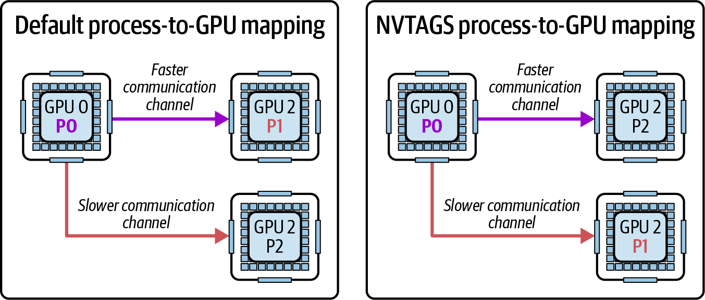

###### Figure 19-9. NVIDIA’s Topology-Aware GPU Selection (NVTAGS) process-to-GPU mapping

Here, NVTAGS automatically assigns GPU affinity to processes based on the communication patterns between the GPUs. NVTAGS is a topology-aware GPU selection framework from NVIDIA that automates process-to-GPU mapping using fabric distances and link metrics. It actively profiles the topology and reassigns processes to GPUs with the fastest mutual links.

If telemetry indicates this link is becoming saturated because the activation tensor is very large, for instance, the scheduler can remap process 2 onto another GPU that is “closer” to GPU 0—ideally one that shares a high-bandwidth connection or is in the same NVSwitch module. The adaptive process-GPU remapping will dynamically reassign which GPU holds which model layer in the LLM inference example.

As a starting point, and if you’re not using NVTAGS, you can use your system’s topology map to help identify which GPU groupings are “closer” in the context of the network topology.

This remapping is done at initialization as well as between inferences. Some systems use upfront or periodic profiling runs to decide an optimal placement. If two processes exchange tens of GB per second, they should reside on the same node, if possible. Conversely, processes that are more compute bound or have minimal data transfer between them can tolerate more distance from one another.

Remapping is adaptive when the system monitors performance and iteratively improves the mapping as conditions change. For instance, if after one pass the highest-traffic connection is between process 3 and process 4 on different nodes, the scheduler might swap one of those processes with another process on the same node to bring 3 and 4 together.

The impact of adaptive remapping is an evolving GPU assignment schedule that responds to the observed traffic pattern. This approach directly reduces cross-node traffic by keeping data exchanges confined to local domains.

For example, after remapping, what was a 50 GB/s cross-node transfer might become two 25 GB/s within-node transfers. This eliminates a network bottleneck and reduces network latency by 50% for that communication.

Remapping can be formulated as an optimization problem that uses a graph-partitioning algorithm. In this case, the graph’s edge weights are the volume of data traveling over the links. You would solve for the minimal cut.

Be aware that moving a layer/process means moving model weights. If a model layer has many GB of data, you won’t want to do this too frequently. It’s best to apply this strategy between large batches—or when the mapping will remain relatively static for a minimum period of time.

In deep learning inference, we can apply the idea of adaptive mapping to inter-GPU communications using pipeline, tensor, and expert parallel techniques. The GPUs that talk to one another the most should be assigned the strongest, least congested connections between them.

## Optimizing Collective Communication with NCCL

NVIDIA’s Collective Communications Library (NCCL) is the standard library managing these GPU collectives. It offers multiple algorithms and optimizations for multiple GPU environments.

Many inference workloads involve collective communication patterns, such as gathering outputs from multiple experts, broadcasting parameters, or performing all-reduce operations, as shown in Figure 19-10. Here, NCCL communication (stream 1) overlaps with GEMM computations (stream 0).

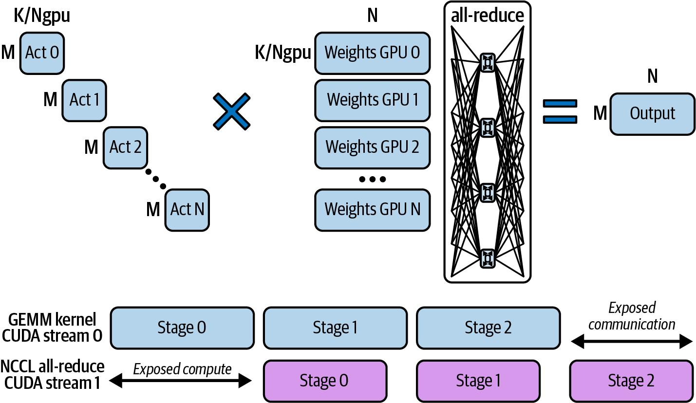

###### Figure 19-10. Distributed GEMM using multiple GPUs and all-reduce across NVLink

These NCCL optimizations can be applied dynamically by the scheduler in congestion-aware environments. By choosing the right collective algorithm and tuning it using the topology and congestion information, we can reduce communication overhead of our inference system. Next are some key considerations that the scheduler can use when tuning NCCL on the fly.

### Ring versus tree all-reduce

NCCL can perform reductions (along with other collectives) using a ring algorithm or a tree algorithm. In a ring all-reduce, each GPU passes data along a closed loop/ring so that every piece of data traverses all GPUs in sequence.

The ring approach maximizes bandwidth utilization on NVLink/NVSwitch by keeping all links busy, but it means the latency scales linearly with the number of GPUs. For instance, on a 72-GPU ring, the data makes 71 hops to complete one reduction.

A tree algorithm, in contrast, reduces or broadcasts data in a logarithmic fashion since GPUs are organized into a logical binary tree where each step halves the number of participants. However, the GPUs are physically connected linearly, link-by-link, into what can be logically considered a tree-chain. Figure 19-11 compares tree-based and ring-based communication among GPUs.

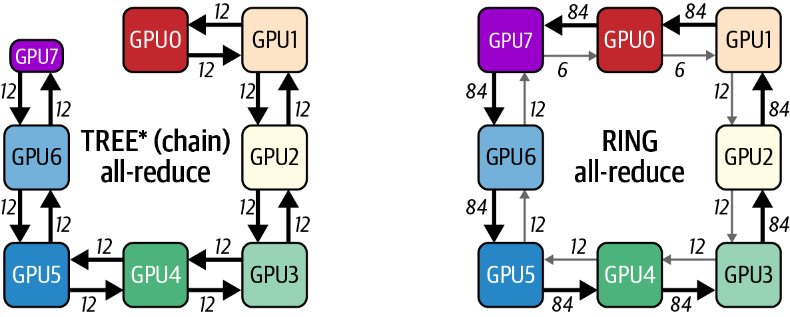

###### Figure 19-11. Tree-based (chain) versus ring-based communication

In practice, in a tree all-reduce, the GPUs first connect in a simple NVLink/NVSwitch “chain” within each node. Across nodes, they connect in a pipelined, dual-binary-tree topology. This is what allows the O(log N) latency of a tree-based algorithm.

Tree algorithms complete in fewer steps (e.g., log₂(72) in the case of a 72-GPU ring), which directly reduces latency—especially for “long haul” transfers across a large number of GPUs. Trees utilize the parallelism of NVSwitch since multiple independent reduction flows can occur simultaneously along different branches of the tree. The trade-off is that a tree may not fully saturate every link’s bandwidth at every moment, but it avoids any single link or GPU becoming a chokepoint through the long ring path.

For latency-sensitive reductions with small messages, a tree algorithm is usually superior. For extremely large messages in which bandwidth dominates, a ring algorithm is usually better—assuming the network is not congested and bandwidth dominates. Choose per message size and topology, and consider hierarchical schemes.

By default, NCCL selects ring, tree, or hierarchical variants heuristically based on message size and topology. On NVSwitch-based intranode paths, rings are often favored for bandwidth, while across nodes, hierarchical and tree variants are common. On a fully connected, single-node NVSwitch system like the NVL72, it’s usually better to force a tree for large reductions.

Forcing a tree algorithm with the `NCCL_ALGO` environment variable,[]()[]() for instance, can alleviate congestion in a single NVL72 rack by not sending all data through one long ring path across all 72 GPUs. For example, a 72-GPU tree-based all-reduce will complete much faster than a ring-based algorithm. This is because the tree algorithm performs 6 (log₂(72)) sequential steps versus the ring algorithm’s 71 (71 = 72 – 1) sequential steps.

The scheduler can explicitly choose the algorithm that best fits the current topology and message size using dynamic NCCL tuning parameters. For instance, it can favor tree all-reduce for very large GPU counts to avoid looping across the entire cluster for each update.

### Rotating ring endpoints

When a ring algorithm is chosen due to its simplicity and bandwidth efficiency, for instance, one concern is that the same links could consistently carry the heaviest load—particularly the links between certain GPU pairs where the ring wraps around.

A congestion-aware approach is to rotate the ring ordering across iterations or collective operations. By periodically shifting which GPU is the start of the ring—and therefore which pairs communicate first—the communication load is distributed more evenly over all NVLink connections.

And while NCCL’s “inside/outside” ring mechanism already alternates ring direction on successive calls, the additional shuffling of ranks between steps will help if your workload is persistently imbalanced. This makes sure that no single NVLink becomes a perpetual bottleneck.

In practice, NCCL has an alternating rings enhancement that implements this kind of rotation under the hood, but it can also be managed by the scheduler using GPU re-indexing in the communicator for different collectives. To do this, you can periodically call `ncclCommInitRank` with a permuted rank order. The effect is that, over time, no single link or GPU is always on the critical path for every collective. This smooths out utilization.

### Wave scheduling of collectives

Rather than launching one giant collective operation that uses all GPUs at once, wave scheduling breaks communications into phased waves to reduce instantaneous load. For instance, suppose an inference workload needs to perform an all-to-all exchange of embeddings among 72 GPUsa pattern common in mixtures-of-experts or certain ensemble methods.

Doing this exchange as one monolithic step would mean that each GPU sends data to 71 others simultaneously. This is 72 GPUs × 71 messages that are saturating every link and NVSwitch port at once.

With all 72 GPUs exchanging data simultaneously, this will cause a spike. Instead, you can split the exchange into 4 groups, or waves, of 18 GPUs to smooth out the traffic.

This is called wave scheduling, and it structures the exchange as a series of smaller all-to-all exchanges that use only a subset of GPUs during each wave. It can also pipeline smaller chunks such that only a fraction of the traffic is in flight at any given moment.

In NCCL terms, this might correspond to splitting a large all-reduce into multiple slices internally. NCCL actually does this automatically to pipeline data through a ring. The scheduler can also use NCCL to orchestrate a sequence of smaller collectives.

By staggering the start times of these communication waves, the network fabric has some headroom since one wave’s data is partly through the system before the next wave adds more traffic. This is called temporal multiplexing, and it avoids overwhelming the NVSwitch fabric. This technique is conceptually similar to pacing network traffic in order to avoid burstiness.

Another example is overlapping computation and communication—a pattern we have seen repeatedly throughout this book. If layer outputs are reduced in waves, the system can schedule the next layer’s computation to overlap with later waves of the reduction.

This creates a pipeline between compute and communication such that while some GPUs are finalizing a reduction, other GPUs have moved on to the next layer’s compute. And this overlap essentially time-shifts some of the communication to a time when the compute units would otherwise be idle. The result is improved utilization of NVLink bandwidth without a massive one-time spike that causes congestion.

It’s important to carefully optimize collectives, pick the right algorithm, and structure communication in balanced waves. This is essential to topology-aware scheduling—and it leads to more efficient, fair, and balanced usage of the NVLink/NVSwitch network among all GPUs.

## Multinode and Multirack Communication with GPUDirect RDMA

When scaling beyond a single node (e.g., NVL72 rack), additional challenges will start to surface since communication is traveling over relatively slow network interfaces, such as InfiniBand and Ethernet. In this case, NVLink and NVSwitch no longer directly connect all of the GPUs in the system. Instead, GPUs in different nodes exchange data using NICs and network switches.

To maintain high performance in a multinode and multirack environment, modern AI systems use GPUDirect RDMA. As covered in Chapter 4, GPUDirect RDMA allows GPUs to directly send/receive data with remote GPUs’ memory—and without host CPU involvement, as shown in Figure 19-12.

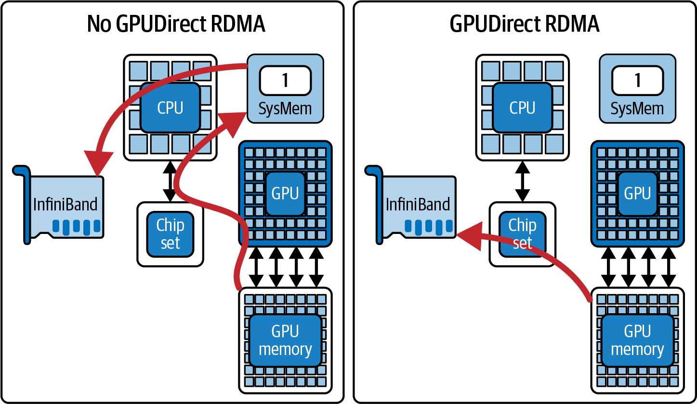

###### Figure 19-12. Direct GPU-to-GPU memory transfers with GPUDirect RDMA—and without involving the host CPU memory (source: https://oreil.ly/445a9)

Even with RDMA efficiency, however, network bandwidth is still lower and latency is still higher than intranode NVLink. As such, network congestion in the cluster fabric will become the limiting factor without a dynamic and adaptive routing schedule. A congestion-aware scheduler can intelligently route and balance internode traffic in addition to intranode traffic, as we discussed earlier.

One key technique is leveraging multiple network interfaces, called multirail. High-end GPU servers often have several NICs, including dual InfiniBand ports per node—or even one per GPU in some designs. For instance, using two NICs per node can produce nearly 2× the throughput versus using one NIC. There is a bit of overhead when using multiple NICs, but it still provides a large gain.

NCCL automatically supports using multiple NICs in parallel to increase bandwidth. In addition, it will split rings and trees across these NICs. Topology awareness is critical here. Consider if each NIC connects to a different network switch to form separate “rails” in the cluster network. In this case, using more than one NIC per collective can reduce the load on any single network path.

The NCCL environment variable `NCCL_CROSS_NIC` controls[]()[]() whether a collective operation is allowed to use different NICs on different nodes for the same ring/tree. By enabling this with a well-designed network topology, NCCL might send half the GPUs’ data out of NIC1 and the other half out of NIC2. This effectively doubles throughput and avoids bottlenecks on a single link.

If your GPU nodes have multiple NICs and your NCCL version supports `NCCL_CROSS_NIC`, enable it for large collectives to stripe traffic across rails on topologies designed for multirail.

The scheduler can detect if one NIC or path is reaching capacity. If it is reaching capacity, it can redistribute the traffic by moving some GPUs’ communications to an alternate interface or alternate network route if one is available. This can be improved using network-level adaptive routing, but your application can also pin certain GPU traffic to less-used NICs. To do this, you just need to set different NCCL channels to different NICs.

In a multinode context, rerouting can also mean cooperating with the network’s adaptive routing features. Modern InfiniBand networks have adaptive routing in which congested flows are automatically moved to less-congested paths in the fabric. While this is handled at the network level, a higher-level scheduler can influence it by changing which destination IP/route is used for a given GPU transfer, for instance. Or the scheduler can split transfers into smaller chunks so the network can balance them.

Additionally, it’s important to enforce NIC affinity by binding each GPU’s communication to the NIC closest (e.g., the NIC on the same PCIe root complex or the same NVSwitch/CPU complex). This will reduce local contention.

To enforce GPU-NIC affinity, you can use NVML or NCCL to map GPU ↔ NIC locality. You need to configure NCCL to respect this mapping by supplying it with a static topology description that associates each GPU with its specific NIC (e.g., GPUs 0–3 ↔ NIC 0, GPUs 4–7 ↔ NIC 1).

A well-designed system will align GPU-to-NIC pairings so that each GPU’s data takes the shortest path out of the node. If a particular NIC is congested due to multiple heavy GPU flows out of the same port, the scheduler can reassign one GPU’s traffic to another port on the node for the next round of communication. And while NCCL’s autotuning will do most of this for you, manual overrides may be needed to tackle specific and persistent issues.

Consider an extreme case, such as a large, heavily loaded inference cluster hosting a massive MoE LLM model. Here, the network will be a major bottleneck if the system is not tuned properly. This is because of the heavy communication between the nodes in the cluster.

In such extreme cases, the scheduler may decide to replicate certain data (e.g., experts) on multiple nodes to reduce cross-node queries. Or it can perform operations hierarchically by first aggregating results within each node, then exchanging a summary between nodes. This is in contrast to exchanging full data between all GPUs across nodes.

NVIDIA SHARP can offload certain aggregation operations to the switch hardware. In inference clusters, using SHARP and adaptive routing together helps minimize communication bottlenecks.

For multinode environments, congestion-aware scheduling is needed to avoid saturating any single network link. This type of scheduling requires careful routing/binding decisions, GPUDirect RDMA to bypass needless memory copies, and multirail NIC utilization to maximize bandwidth.

The goal is to extend topology awareness beyond NVSwitch and understand the cluster network’s full topology (e.g., fat-tree, dragonfly, etc.) and adapt communication patterns to that topology. The result is that even at scale with thousands and millions of GPU nodes, internode transfers are orchestrated in a balanced way. This will prevent one slow link from throttling the entire distributed inference system.

Treat the network as a schedulable resource just like GPUs, memory, etc. It should be planned and adaptively managed like other dynamically allocated resources.

## MoE Expert Rebalancing and Regrouping

Large-scale language models increasingly use MoE layers, which introduce unique communication patterns. In an MoE model, different subsets of the neural network, or experts, reside on different GPUs. And each input token is routed to a small number of expert networks for processing.

During inference, for instance, this produces an all-to-all traffic pattern such that tokens are sent to whichever GPU hosts the selected experts. The results are then gathered back. In a naive static assignment of experts to GPUs, certain GPUs may become communication hotspots if many tokens frequently route to experts on those specific GPUs. Additionally, if experts that often work together to process similar tokens are placed far apart in the topology (e.g., one on GPU 0 and another on GPU 71 across the fabric), the tokens will need to continuously travel long paths.

Expert rebalancing is a strategy to localize communication by periodically rearranging which GPU each expert lives on. The key idea is to take advantage of any skew or patterns in the workload. If, for example, expert 5 and expert 19 both receive segments of the same queries, it makes sense to place them on the same GPU (or same node), if possible, so that the communication doesn’t travel too far for those operations.

Likewise, if expert 7 is very popular and receives many tokens, it may incur heavy inbound traffic to its GPU. The scheduler might move that expert to a less communication-heavy GPU—or even duplicate it if the system allows—to split the load. This rebalancing can happen between inference runs or during periodic maintenance windows in a long-running service. The system collects statistics on communication frequency between experts—or between experts and the expert-gating nodes—and then remaps the experts to GPUs that minimize the highest-traffic links.

In practice, implementing MoE expert rebalancing involves a coordinated redistribution of model parameters since experts are essentially subsets of model weights. This should be done infrequently since it’s a heavy operation. But occasional rebalancing can have a big impact in reducing congested transfers.

Expert rebalancing should be done during scheduled maintenance windows since moving an expert means transferring potentially GBs of weights. The key is to use logged routing metrics to choose a better placement strategy at runtime.

After rebalancing, each GPU will ideally host a combination of experts such that most tokens’ routing stays on a single GPU or at least within the local NVLink group. Any other nonlocal communication will be spread more evenly across the NVLink/NVSwitch network—rather than repeatedly hitting the same GPU-to-GPU links.

In short, spread out the popular experts and colocate experts that frequently communicate with one another.

Another related optimization is expert bucketing or grouping. This technique arranges experts that are commonly used together and are assigned to the same group of GPUs (for example, on the same NVSwitch or same server), which reduces cross-group traffic.

The scheduler can treat expert placement as a graph partitioning problem. The experts (GPUs) are the nodes in the graph. The edge weights represent the token traffic between experts—as well as from the router to the experts. The graph is partitioned using a minimal cut through the fewest heavy edges. By doing this, MoE communication becomes topology-aware, respects the NVLink/NVSwitch boundaries, and keeps the data exchange confined within those boundaries.

MoE expert regrouping is an example of congestion-aware scheduling at the model architecture level. It rearranges the workload itself to fit the network—rather than rearranging the network to fit the workload.

## Dynamic Congestion-Aware Scheduling

While all the techniques we’ve mentioned can be configured at system startup or design time, the most robust and advanced systems use dynamic scheduling to respond to congestion as it happens. Dynamic congestion-aware scheduling means the system continuously monitors network conditions using the telemetry discussed earlier—and adjusts the scheduling of tasks or communications in real time.

Congestion-aware scheduling and routing helps reduce bottlenecks and maintains high performance under dynamic conditions. This is analogous to network-level dynamic packet routing, as shown in Figure 19-13.

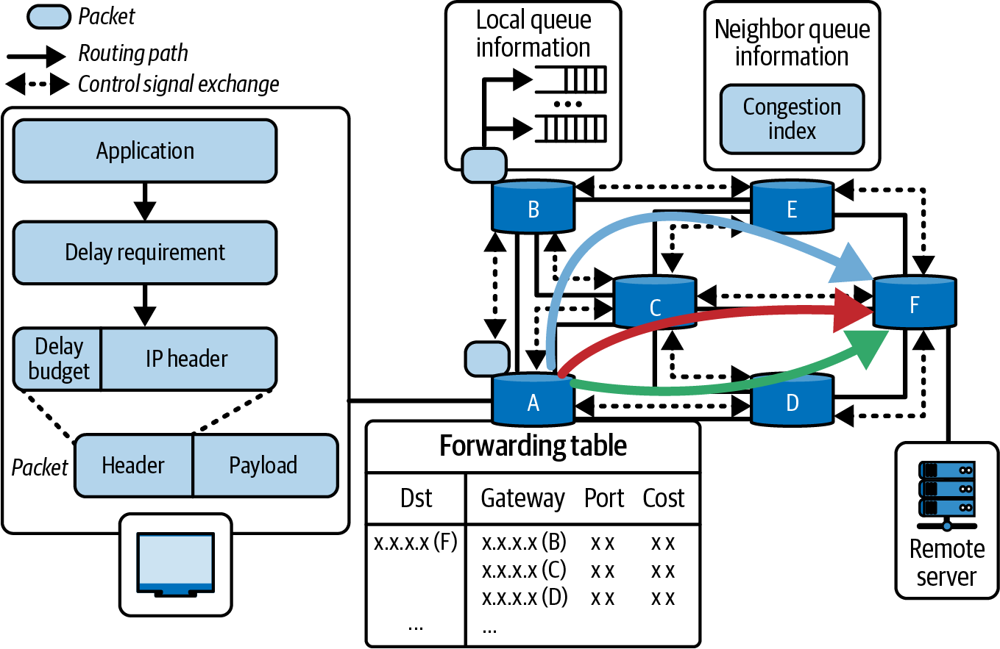

###### Figure 19-13. Network-level packet routing to avoid congestion

In a multi-GPU inference context, dynamic strategies include throttling, rerouting, or reordering operations based on congestion feedback. For instance, suppose the scheduler detects that NVLink link 0, connecting two particular GPUs, is currently maxed out because it’s transferring data for a massive tensor during a large pipeline-parallel activation transfer, for instance.

If another high-priority transfer is scheduled to use the same link, the scheduler might delay that second transfer by a few milliseconds to let the first one finish and clear out. This is called temporal load balancing, and it essentially inserts a tiny gap to prevent queue buildup. This is analogous to network-switch queue management and NIC-level backpressure. This is better to enqueue briefly than to overload and drop packets.

Conversely, if a normally large transfer is detected to be idle because its source GPU is waiting on computation, for instance, the scheduler could use that time slice to send lower-priority data over the link and fill the idle time. This utilizes available bandwidth and doesn’t interfere with a critical data transfer.

Another dynamic tactic is adaptive routing at the software level such that if one path is congested, an alternate path is chosen if available. In a network with multiple NVSwitch planes or multiple NIC rails, the adaptive runtime will choose a less busy plane for the next communication.

NCCL does some of this internally when multiple paths exist, but an advanced scheduler could maintain multiple NCCL communicators that are mapped to different path configurations. It could then select among the different paths based on congestion.

Choosing alternate paths dynamically requires the scheduler to evaluate the best path to take. This might be achieved by using different virtual channels—or adjusting which NVLink port is used for a transfer.

Modern NVSwitch systems support multiple virtual channels and hardware quality-of-service (HQOS) settings. The scheduler can use these features to direct nonurgent traffic to a lower-priority channel. This avoids contention with urgent transfers.

Load-dependent task scheduling is another feature of dynamic congestion management. If an inference server is handling many simultaneous queries that share resources, the scheduler can temporarily queue or reorder some of the queries to avoid peak overlap. This is similar to the earlier discussion on staggering large collectives so that they don’t run concurrently.

For instance, consider a situation in which the scheduler knows that query A’s next step will involve a massive all-gather across GPUs. And it sees that query B is just starting and would add another large all-gather at the same time. In this case, the scheduler might postpone launching query B’s step by a brief moment so that query A’s communication can complete without the burden of query B’s resource contention.

This kind of fine-grained scheduling optimizes the pattern of communications over time. Heavy flows are serialized or staggered rather than launched concurrently. The decision is guided by recent telemetry. If the system sees a big spike in NVSwitch utilization when it runs 8 queries in parallel, it might try running only 4 in the first wave, and then 4 immediately after. This makes the system self-tuning because it monitors real-time telemetry data and continuously searches for execution plans that avoid congestion.

Dynamic scheduling is typically implemented as a centralized scheduler that monitors all GPUs and network links. This can be combined with a distributed protocol in which GPUs signal congestion, or backpressure, to one another if the destination GPU’s NVLink buffers are full.

In this backpressure scenario, the destination GPU notifies the source GPU to pause incoming transfers. The smart scheduler can then reschedule tasks on the source GPU while it’s paused so it can perform compute tasks while it waits for the destination GPU to unpause the transfers.

NCCL will apply backpressure when receivers can’t keep up. A custom scheduler can piggyback on this functionality by noticing that send operations are blocked. It can then use that time to perform other useful work.

Over time, dynamic adjustments like these will keep communication efficient—even with varying batch sizes, input data distributions, and other dynamic workload changes. The system learns the congestion patterns and adapts quickly by modifying the scheduling based on live feedback. The system can use an RL agent (discussed in a previous section) or a set of heuristic rules. This is essential for environments with bursty and unpredictable inference requests.

## Coordinating NVSwitch Transfers with Fine-Tuned Scheduling

The core of an NVLink/NVSwitch system is the NVSwitch fabric itself. This is a centralized crossbar that handles many simultaneous GPU-to-GPU transfers. NVSwitch is extremely high-bandwidth and has its own internal scheduling algorithms, including adaptive routing across multiple switch chips and planes.

However, software can multiply its effectiveness by scheduling data transfers with application-level knowledge, such as pipeline, tensor, and expert-level parallelism strategies. The idea is to orchestrate which GPU pairs communicate—and which times they communicate—in order to maximize parallelism without oversubscribing the cluster fabric.

A proven technique is staggering communication waves. This is related to the wave scheduling strategy mentioned earlier for collectives, but it applies more broadly to any overlapping transfers.

Consider all 72 GPUs in a NVL72 rack needing to send data to a specific peer, such as a central parameter server in which GPU 0 collects all the results from all 72 GPUs. If all 71 other GPUs send their data at the exact same time, GPU 0’s 18 NVLink links—and the NVSwitch that connects them—will experience a huge burst of 71 inputs, as shown in Figure 19-14. This will exceed the amount of bandwidth that can be delivered at that moment.

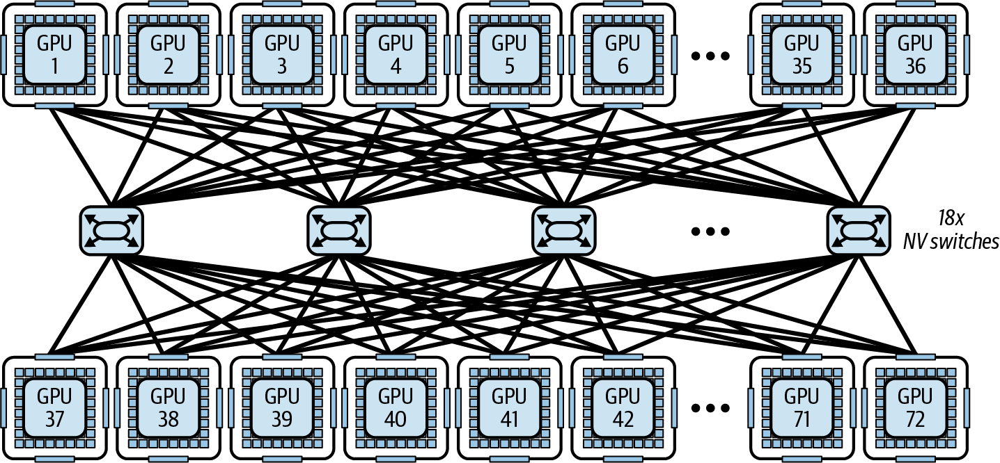

###### Figure 19-14. All 72 GPUs sending data to a centralized parameter server

In this case, NVSwitch will need to buffer and serialize many of those transfers. This leads to latency spikes. Instead, a coordinated and optimized approach is to partition the senders into four groups: group 1 (GPUs 1–18) sends first, then a few microseconds later group 2 (GPUs 19–36) sends, and so on.

From GPU 0’s perspective, it receives four smaller waves of traffic in sequence. At any given instant, roughly only 18 GPUs are actively sending to GPU 0. This perfectly fits within the GPU’s 18-port capacity. NVSwitch routes the traffic without needing to queue. By the time group 4 finishes, GPU 0 has received all of the data—and none of the NVLink links were saturated since the traffic was smoothed and balanced over time.

This wave-staggering approach generalizes to many patterns. All-to-all exchanges can be broken into pairwise exchanges that rotate in rounds. This is often called the butterfly or shuffle pattern. Shuffling schedules which GPUs talk to one another at each timestep such that each NVSwitch port stays busy, but not excessively busy.

The scheduler for NVSwitch transfers can use a time-sliced algorithm, which allocates communication slots to specific GPU pairs or GPU groups. So instead of launching one large, free-for-all bulk transfer, the scheduler can perform many small, synchronized communication steps—each allotted a specific time slot. This is similar to time-division multiplexing, described earlier, and it creates a predictable, conflict-free use of the NVSwitch crossbar.

It’s worth noting that NVSwitch hardware itself will attempt to reduce contention on the network. For instance, if multiple flows are contending for the same link, NVSwitch will interleave packets from each flow to ensure fair scheduling.

It may also adaptively choose different internal crossbar paths, if available. However, from a software perspective, we can avoid hitting these limits in the first place by applying these adaptive techniques into our network design.

Fine-tuned scheduling also includes concurrency control by limiting how many heavy transfers run in parallel during inference. For example, during a multi-GPU inference pipeline, you might avoid launching all expert-gather or broadcast operations across GPUs at the same time. By design, this trades a bit of parallelism for less contention.

Often, 2–4 simultaneous large expert-gather or broadcast transfers across GPUs during inference is the sweet spot. More than that can produce diminishing returns or congestion.

For instance, instead of triggering 12 collective transfers simultaneously—which risks saturating NVSwitch and NVLink—a scheduler can stagger them by running up to 4 high-volume transfers at a time, waiting for those to complete, and then launching the next set. Because NVSwitch is extremely fast, this serialized approach likely finishes sooner because it avoids the congestion caused by too many overlapping transfers.

Coordinating NVSwitch transfers is about treating the communication fabric as a shared resource that can be scheduled—similar to how one would schedule GPU kernels and CPU threads. By scheduling network resources, the system makes sure that high-priority traffic avoids interference. It fills idle gaps with lower-priority traffic to keep utilization high.

Techniques like staggering and grouping communications will increase effective throughput of the NVSwitch by avoiding severe contention patterns. This leads to more predictable and lower-latency communication, which is vital for inference serving where tail latency, or slow outlier responses caused by a congested network, is a concern.

In short, congestion-aware, topology-aware scheduling in multi-GPU inference systems is all about how to intelligently match the communication pattern to the given hardware layout. High-performance inference systems will monitor link usage in real time and adapt to the NVLink/NVSwitch topology. It does this through careful placement of tasks, optimized collective algorithm configurations, multinode routing tweaks, MoE expert reallocation, dynamic runtime adjustments, and fine-grained coordination of data transfers.

# Additional Adaptive and Dynamic Optimization Techniques

Next are some additional dynamic inference and runtime-adaptation techniques that complement the core tuning strategies we presented. As of this writing, these ideas are experimental and not widely available. However, they are promising and worth covering. Each technique here includes a brief description and links to further reading.

## Dynamic Early-Exit Networks

Early-exit models allow an LLM to self-truncate its generation when sufficient confidence is reached. This reduces unnecessary compute for easy inputs, for instance. Dynamic early-exit methods monitor intermediate representations and logit entropies to decide, at each layer or token, if it should stop computation and emit a final output.

These networks require special model architecture or training since they add auxiliary classifiers at intermediate layers. However, they can produce up to 30%–50% inference speedup on reasoning tasks without accuracy loss (see https://oreil.ly/dn3vl and https://oreil.ly/73AeE).

## Input-Aware Layer Skipping (DASH)

Frameworks like DASH present inference as a Markov Decision Process, which dynamically decides, per-token, whether to execute or skip each transformer layer based on input characteristics. By learning a small scoring network, DASH can skip 20%–40% of layers for many tokens.

DASH typically requires a modified model with gating at each layer. However, it can reduce inference cost significantly while maintaining performance on NLP benchmarks (https://oreil.ly/mz59T and https://oreil.ly/oL_Lr).

## Speculative MoE Expert Routing and Communication Reduction

For MoE models, speculative expert routing anticipates which experts will be activated for upcoming tokens and co-shuffles tokens and expert assignments ahead of time.

This technique involves sending tokens to predicted experts early. If prediction is wrong, some work is wasted. However, overall communication is reduced when predictions are good. This helps to reduce cross-node bandwidth use by up to 30% compared to static expert parallel (EP) + tensor parallel (TP) deployments.

## Dynamic Token Pruning with LazyLLM

LazyLLM selectively computes KV cache only for tokens deemed as important defined using a lightweight scoring function. It prunes the low-impact tokens (e.g., stopwords and filler tokens) out of both the prefill and decode. By focusing expensive attention computations on only relevant tokens, LazyLLM reports 20%–30% end-to-end latency reduction on long-context workloads.

## Edge-Oriented MoE Memory Budgeting

Dual routing and dynamic scheduling techniques introduce a potential memory issue for expert weights in constrained environments, such as edge deployments. In practice, this means maybe keeping a subset of experts active in GPU memory and swapping others from flash storage as needed. It does this based on usage frequency.

By dynamically adjusting which low-bit experts reside in memory (versus being offloaded), inference systems can maintain high expert-activation rates while maintaining lower memory usage.

## Dynamic Quantization and Activation Range Adjustment

While static PTQ and QAT are well-known techniques, an on-the-fly quantization strategy can adjust activation-quantization parameters during inference in real time. They can use sliding-window statistics to modify the observer ranges (for activation quantizers) every N tokens, for example.

This type of dynamic activation quantization will monitor activation statistics in real time and recompute observer ranges every N tokens. This way, FP16 can be allocated to “hot” layers with high variance and FP8 to “cool” layers with low-variance. Low-variance layers are constrained within a narrow dynamic range. This minimizes quantization error and maximizes throughput.

Because low-variance layers produce activations that are clustered tightly around a mean, FP8’s limited exponent and mantissa bits (e.g., E4M3 format) are sufficient enough to represent the activations’ values accurately. This produces significant compute and memory savings—and without noticeable accuracy degradation.

Consider using a hybrid FP8 strategy such as E4M3 for the forward pass (e.g., activations and weights) and E5M2 for the backward pass (e.g., gradients). It’s recommended to use a delayed scaling mechanism as shown in the following code using the Transformer Engine:

```python
from transformer_engine.common.recipe import Format, DelayedScaling
recipe = DelayedScaling(
# E4M3 fwd, E5M2 bwd
fp8_format=Format.HYBRID,
amax_history_len=1024,
# delayed scaling window
amax_compute_algo="max",
)
```

Here, we set the delayed scaling window using `amax_history_len=1024`, which is a common default. It’s recommended to keep `amax_compute_algo='max'` unless convergence analysis suggests otherwise.

Meanwhile, FP16 remains reserved for layers with larger activation swings, or “hot” layers. These layers need to use a broader dynamic range to capture the numerical fidelity required for critical computations.

This hybrid precision strategy works well for inference pipelines that don’t require offline calibration. They can dynamically modify numerical fidelity at each layer. This balances overall performance and model accuracy.

# Key Takeaways

On modern GPUs, the approaches discussed in this chapter are practical ways to squeeze every bit of performance from these multi-trillion-parameter models. In real-world deployments, these dynamic runtime adaptation techniques can make or break a high-performance inference service offering. The following are some key takeaways from this chapter:

Prefer `mode="reduce-overhead"` or autotune modes if you can afford the warmup time. This will help minimize runtime overhead for low-latency inference workloads.

Dynamically optimize GPU kernels and tile sizes. Leverage the Tensor Memory Accelerator (TMA) for asynchronous memory prefetch when possible. Use libraries and compilers that provide autotuning like CUTLASS and Triton—rather than hand-tuning them, unless absolutely necessary for performance.

Switch between 8-bit and 4-bit floating point (FP8/FP4) during inference to balance speed and accuracy. You can also mix with 16-bit precision as needed. Use the Transformer Engine for FP8 in PyTorch since `torch.autocast()` does not support FP8 directly.

Separate the prefill (prompt processing) and decode (generation) phases across resources, and context-aware request routing based on real-time factors like KV cache hits, queue depth, and load. This maintains high throughput with long prompts—without slowing down short-prompt responses.

Perform on-the-fly decisions between data-parallel, tensor-parallel, pipeline-parallel, and hybrid execution combinations depending on input/output sequence lengths and model structure—including MoE routing. These decisions include replicating or sharding the model.

Use techniques, such as speculative decoding, in-flight batch reshaping, and token-level scheduling, to improve throughput and latency. These techniques are implemented in engines like vLLM, SGLang, and NVIDIA TensorRT-LLM. This validates their effectiveness in production settings.

Utilize Grace CPU’s memory with unified addressing to offload infrequently used KV cache pages to CPU or NVMe. Using APIs like `cudaMemAdvise` and `cudaMemPrefetchAsync` for optimal placement. Make sure to use GPUDirect Storage, if available. This will directly page data from NVMe to GPU memory when <span class="keep-together">needed—</span>bypassing the CPU.

Use tools like NVML, Nsight Systems/Compute, NVTX instrumentation, and Prometheus metrics to identify bottlenecks at runtime and automatically apply graph and kernel optimizations. Analyze telemetry using AI to detect anomalies and optimization opportunities.

# Conclusion

The techniques covered in this chapter transform a static inference deployment into a self-optimizing, adaptive engine. By monitoring runtime signals (latency, utilization, memory, network throughput) and applying strategies like dynamic parallelism, precision scaling, autotuned kernels, proactive caching, RL-based control, and smart scheduling, one can push ultralarge model inference to its limits.

A successful inference service can handle massive amounts of users, large input contexts, lots of uploaded documents, extensive reasoning, and strict latency SLAs all while supporting massive model sizes. And it will do this cost-effectively since it won’t need as much hardware to achieve the same throughput.

Remember that the network fabric is part of the system codesign—and not an afterthought. The idea is to keep the NVLink and NVSwitch cluster fabric fully utilized. This can improve throughput-scaling that approaches near-linear in ideal conditions—while maintaining low latency—as models and GPU clusters continue to grow. With proper scheduling, the GPUs in an NVLink/NVSwitch fabric behave like a tightly coupled accelerator—acting almost as a single large GPU from a software perspective.

Every strategy is a tool in the AI system performance engineer’s toolkit. The most effective solutions usually combine these tools. For example, you might train an RL policy to decide when to switch parallelism modes or adjust precision—or use prewarming to keep a continuous batching scheduler primed and ready.

And remember that you don’t have to implement these all at once. Even just one or two can produce noticeable improvements. Start with what’s easiest (e.g., caching and batching improvements), then layer in the others.

The theme with these techniques is flexibility and adaptability. The inference runtime should be able to reconfigure itself in response to the current workload. This is how you can turn a massive LLM into a well-tuned, scalable production service—efficiently and cost-effectively.

---